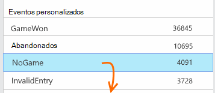

<properties
    pageTitle="Análise de uso com ideias de aplicativo"
    description="Visão geral de análise de uso com ideias de aplicativo"
    services="application-insights"
    documentationCenter=""
    authors="alancameronwills"
    manager="douge"/>

<tags
    ms.service="application-insights"
    ms.workload="tbd"
    ms.tgt_pltfrm="ibiza"
    ms.devlang="multiple"
    ms.topic="article" 
    ms.date="04/08/2016"
    ms.author="awills"/>

# Análise de uso com ideias de aplicativo

Saber como as pessoas usam seu aplicativo permite concentrar seu trabalho de desenvolvimento em cenários que são mais importantes para eles e obtenha ideias para os objetivos que eles encontraram mais fácil ou difícil conseguir.

Obtenção de informações de aplicativo pode fornecer uma visão clara de uso do aplicativo, ajudando a melhorar a experiência de seus usuários e atender às suas metas de negócios.

Obtenção de informações de aplicativo funciona para os dois aplicativos autônomos (em iOS, Android e Windows) e web Apps (hospedado no .NET ou J2EE). 

## Adicionar a obtenção de informações de aplicativo ao projeto

Para começar, obtenha uma conta gratuita da [Microsoft Azure](https://azure.com). (Após o período de avaliação, você pode continuar com a camada gratuita do serviço.)

No [portal do Azure](https://portal.azure.com), crie um recurso de obtenção de informações do aplicativo. Isso é onde você verá os dados de uso e desempenho sobre seu aplicativo.

**Se seu aplicativo é um aplicativo de dispositivo,** adicione o SDK de obtenção de informações do aplicativo ao seu projeto. O procedimento exato varia dependendo do seu [IDE e plataforma](app-insights-platforms.md). Para aplicativos do Windows, apenas clique com botão direito do projeto no Visual Studio e escolha "Adicionar ideias de aplicativo".

**Se é um aplicativo web,** abra a lâmina de início rápido e obter o trecho de código para adicionar às páginas da web. Publicá-los novamente com este trecho de código.

Você também pode adicionar ideias de aplicativo para o código do servidor [ASP.NET](app-insights-asp-net.md) ou [J2EE](app-insights-java-get-started.md) para combinar telemetria do cliente e servidor.

### Executar seu projeto e ver resultados primeiro

Executar o projeto no modo de depuração para alguns minutos e acesse o [portal do Azure](https://portal.azure.com) e procure o recurso de projeto de obtenção de informações do aplicativo.

Publica seu aplicativo para obter mais telemetria e descobrir o que os usuários estão fazendo com seu aplicativo.

## Analytics prontos para uso

Clique no bloco de modos de exibição de página para ver detalhes de uso.

Passe o mouse na parte em branco acima de um gráfico para ver as contagens em um determinado ponto. Caso contrário, os números mostram o valor agregado ao longo do período, como uma contagem de usuários distintos, um total ou uma média ao longo do período.

Em aplicativos web, os usuários são contados usando cookies. Uma pessoa que usa vários navegadores, limpa cookies ou usa o recurso de privacidade será contada várias vezes.

Uma sessão da web é contada após 30 minutos de inatividade. Uma sessão em um celular ou outro dispositivo é contada quando o aplicativo está suspenso por mais de alguns segundos.

Clique em qualquer gráfico para ver mais detalhes. Por exemplo:

(Este exemplo é de um site, mas os gráficos são semelhantes para os aplicativos que executem em dispositivos).

Compare com a semana anterior para ver se o que está sendo alterado:

Compare duas métricas, por exemplo, os usuários e novos usuários:

Dados de grupo (segmento) por uma propriedade como navegador, sistema operacional ou cidade:

## Uso de página

Clique em bloco dos modos de exibição de página para obter uma uma divisão das suas páginas mais populares:

O exemplo acima é de um site de jogos. -Nós pode ver instantaneamente:

* Uso não foi aprimorado na semana passada. Talvez nós deve pensar otimização do mecanismo de pesquisa?
* Muitas pessoas menos consulte as páginas de jogos que a Home page. Por que a nossa página inicial não atrair pessoas para jogar?
* 'Cruzadas para Tablet PC' é o jogo mais popular. Nós deve dar prioridade a novas ideias e aprimoramentos lá.

## Controle personalizado

Vamos supor que em vez de implementação de cada jogo em uma página da web separado, você decidir refatorá-las todas na mesmo página única aplicativo, com a maioria das funcionalidades codificada como Javascript na página da web. Isso permite ao usuário alternar rapidamente entre um jogo e outro, ou até mesmo ter vários jogos em uma página.

Mas você ainda assim quiser ideias de aplicativo para efetuar o número de vezes que cada jogo é aberto, exatamente da mesma forma como quando estivessem em páginas da web separadas. É fácil: basta inserir uma chamada para o módulo de telemetria em seu JavaScript onde você deseja registro que uma nova 'página' abriu:

    telemetryClient.trackPageView(game.Name);

## Eventos personalizados

Você pode usar telemetria de muitas maneiras para entender como o seu aplicativo está sendo usado. Mas você não deseja sempre confundir as mensagens com modos de exibição de página. Em vez disso, use eventos personalizados. Você pode enviar-os aplicativos de dispositivo, páginas da web ou um servidor web:

(JavaScript)

    telemetryClient.trackEvent("GameEnd");

(C#)

    var tc = new Microsoft.ApplicationInsights.TelemetryClient();
    tc.TrackEvent("GameEnd");

(VB)

    Dim tc = New Microsoft.ApplicationInsights.TelemetryClient()
    tc.TrackEvent("GameEnd")

Os eventos personalizados mais frequentes estão listados na lâmina visão geral.

Clique em cabeçalho da tabela para ver o número total de eventos. Você pode segmento gráfico por vários atributos como o nome do evento:

O recurso especialmente útil de cronogramas é que você pode correlação alterações com outras métricas e eventos. Por exemplo, às vezes quando jogos mais executados, você esperava ver um aumento no interrompidas jogos também. Mas o aumento nos jogos interrompidos desproporcional, você gostaria de saber se a carga alta está causando problemas que os usuários localizar aceitável.

## Analise eventos específicos

Para obter uma melhor compreensão de como uma sessão típica vai, talvez você queira concentrar-se em uma sessão de usuário específica que contenha um determinado tipo de evento.

Neste exemplo, podemos codificados um evento personalizado "NoGame", o que é chamado se o usuário faz check-out sem realmente iniciar um jogo. Por que um usuário pode fazer isso? Talvez se vamos analisar algumas ocorrências específicas, podemos obterá uma dica.

Os eventos personalizados recebidos do aplicativo são listados por nome na lâmina visão geral:

Clique em por meio do evento de interesse e selecione uma ocorrência específica recente:

Vamos examinar todas a telemetria para a sessão no qual ocorreu desse evento NoGame específico.

Havia sem exceções, para que o usuário não foi impedido de reprodução por alguma falha.

Nós pode filtrar todos os tipos de telemetria exceto modos de exibição de página para esta sessão:

E agora podemos ver que esse usuário conectado simplesmente a verificar as pontuações mais recentes. Talvez deve consideramos desenvolvendo uma história de usuário que torna mais fácil de fazer isso. (E podemos deve implementar um evento personalizado ao relatório quando ocorre este texto específico).

## Filtrar, pesquisar e seus dados com propriedades de segmento
Você pode anexar marcas aleatório e valores numéricos a eventos.

JavaScript no cliente

    appInsights.trackEvent("WinGame",
        // String properties:
        {Game: currentGame.name, Difficulty: currentGame.difficulty},
        // Numeric measurements:
        {Score: currentGame.score, Opponents: currentGame.opponentCount}
    );

C# no servidor

    // Set up some properties:
    var properties = new Dictionary <string, string>
        {{"game", currentGame.Name}, {"difficulty", currentGame.Difficulty}};
    var measurements = new Dictionary <string, double>
        {{"Score", currentGame.Score}, {"Opponents", currentGame.OpponentCount}};

    // Send the event:
    telemetry.TrackEvent("WinGame", properties, measurements);

VB no servidor

    ' Set up some properties:
    Dim properties = New Dictionary (Of String, String)
    properties.Add("game", currentGame.Name)
    properties.Add("difficulty", currentGame.Difficulty)

    Dim measurements = New Dictionary (Of String, Double)
    measurements.Add("Score", currentGame.Score)
    measurements.Add("Opponents", currentGame.OpponentCount)

    ' Send the event:
    telemetry.TrackEvent("WinGame", properties, measurements)

Anexe propriedades modos de exibição de página da mesma maneira:

JavaScript no cliente

    appInsights.trackPageView("Win",
        {Game: currentGame.Name},
        {Score: currentGame.Score});

Em pesquisa de diagnóstico, exiba as propriedades clicando por meio de uma ocorrência individual de um evento.

Use o campo de pesquisa para ver as ocorrências de eventos com um valor de propriedade particular.

## A | Teste B

Se você não souber qual variante de um recurso será mais bem sucedida, libere ambos, tornando cada acessíveis para diferentes usuários. Medir o sucesso de cada um e mover para uma versão unificada.

Para essa técnica, você pode anexar marcas distintas para todas a telemetria enviado por cada versão do aplicativo. Você pode fazer isso definindo propriedades na TelemetryContext ativa. Estas propriedades padrão são adicionadas a cada mensagem de telemetria que o aplicativo envia - não apenas suas mensagens personalizadas, mas também a telemetria padrão.

No portal de obtenção de informações do aplicativo, você, em seguida, será possível filtrar e agrupar (segmento) seus dados sobre as marcas, para comparar as diferentes versões.

C# no servidor

    using Microsoft.ApplicationInsights.DataContracts;

    var context = new TelemetryContext();
    context.Properties["Game"] = currentGame.Name;
    var telemetry = new TelemetryClient(context);
    // Now all telemetry will automatically be sent with the context property:
    telemetry.TrackEvent("WinGame");

VB no servidor

    Dim context = New TelemetryContext
    context.Properties("Game") = currentGame.Name
    Dim telemetry = New TelemetryClient(context)
    ' Now all telemetry will automatically be sent with the context property:
    telemetry.TrackEvent("WinGame")

Telemetria individual pode substituir os valores padrão.

Você pode configurar um inicializador universal para que todos os TelemetryClients de novo automaticamente usem seu contexto.

    // Telemetry initializer class
    public class MyTelemetryInitializer : ITelemetryInitializer
    {
        public void Initialize (ITelemetry telemetry)
        {
            telemetry.Properties["AppVersion"] = "v2.1";
        }
    }

No inicializador app como Global.asax.cs:

    protected void Application_Start()
    {
        // ...
        TelemetryConfiguration.Active.TelemetryInitializers
        .Add(new MyTelemetryInitializer());
    }

## Construir - medida - Saiba

Quando você usa a análise, ele se torne uma parte integrada de seu ciclo de desenvolvimento, não apenas algo que você acha prestes a ajudar a resolver problemas. Aqui estão algumas dicas:

* Determine a métrica principais do seu aplicativo. Deseja tantos usuários possível, ou talvez você prefira um conjunto pequeno de usuários felizes? Você deseja maximizar visitas ou vendas?
* Planeje medir cada história. Quando você faz o esboço de uma história de usuário novo ou recurso, ou plano para atualizar um existente, sempre pensar sobre como você vai medir o sucesso da alteração. Antes de codificação inicia, pergunte "o efeito que isso terá nos nossas métricas, se ele funciona? Deve podemos controlar os novos eventos?"
E é claro que, quando o recurso está ao vivo, verifique se você examine a análise e atuam nos resultados.
* Relacionar a principal métrica outras métricas. Por exemplo, se você adicionar um recurso de "Favoritos", que você gostaria de saber quantas vezes os usuários adicionar a Favoritos. Mas talvez é mais interessantes para saber quantas vezes eles volte aos seus favoritos. E, principalmente, os clientes que usam Favoritos basicamente compram mais produtos?
* Delator testes. Configure uma opção de recurso que permite que você faça um novo recurso visíveis somente para alguns usuários. Use a obtenção de informações do aplicativo para ver se o novo recurso está sendo usado da maneira que você envisaged. Fazer ajustes e solte-o para um público maior.
* Fale com seus usuários! Análise não é suficiente por conta própria, mas complementar para manter uma relação de cliente boa.

## Saiba Mais

* [Detectar, triagem e diagnosticar problemas de desempenho em seu aplicativo e travamentos](app-insights-detect-triage-diagnose.md)
* [Introdução ao aplicativo ideias em várias plataformas](app-insights-detect-triage-diagnose.md)

## Vídeo

> [AZURE.VIDEO usage-monitoring-application-insights]

 
