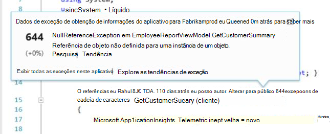
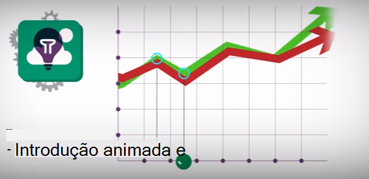

<properties 
    pageTitle="Tutorial do aplicativo de ideias | Microsoft Azure" 
    description="Controlar o uso e o desempenho do seu aplicativo web ao vivo.  Detectar, triagem e diagnosticar problemas. Monitorar e melhorar o sucesso com seus usuários continuamente." 
    services="application-insights" 
    documentationCenter=""
    authors="alancameronwills" 
    manager="douge"/>

<tags 
    ms.service="application-insights" 
    ms.workload="tbd" 
    ms.tgt_pltfrm="ibiza" 
    ms.devlang="na" 
    ms.topic="article" 
    ms.date="10/15/2016" 
    ms.author="awills"/>
 
# Obtenção de informações de aplicativo - Introdução

Ideias de aplicativo do Visual Studio é um serviço de análise extensível que monitora seu aplicativo web ao vivo. Com ele você pode detectar e diagnosticar problemas de desempenho e entender o que os usuários realmente fazem com seu aplicativo. Ele foi projetado para desenvolvedores, para ajudá-lo a melhorar continuamente o desempenho e usabilidade. Isso funciona para os aplicativos em uma ampla variedade de plataformas incluindo .NET, node e J2EE, hospedado no local ou na nuvem. 

[Dê uma olhada a animação de Introdução](https://www.youtube.com/watch?v=fX2NtGrh-Y0).

## Como ele funciona?

Você instala um pacote de instrumentação pequenas em seu aplicativo e configurar um recurso de obtenção de informações de aplicativo no portal do Microsoft Azure. A instrumentação monitora seu aplicativo e envia dados de telemetria portal. O portal mostra gráficos estatísticos e oferece ferramentas poderosas de pesquisa para ajudá-lo a diagnosticar problemas.

Obtenção de informações de aplicativo tem vários [módulos instrumentação padrão](app-insights-configuration-with-applicationinsights-config.md) que colete tipos diferentes de telemetria como tempos de resposta de solicitação, exceções e chamadas de dependência. Você também pode [escrever código para enviar telemetria personalizada](app-insights-api-custom-events-metrics.md) para o portal.

### O que é a sobrecarga?

O impacto sobre o desempenho do seu aplicativo é muito pequeno. Chamadas de acompanhamento são desbloqueado e são em lote e enviadas em um segmento separado. 

## O que ela faz?

Obtenção de informações de aplicativo destina-se a equipe de desenvolvimento, para ajudá-lo a entender como é o desempenho do seu aplicativo e como ele está sendo usado. Ele fornece:

Tipos de telemetria:

* Taxas de solicitação HTTP, tempos de resposta, taxas de sucesso.
* Dependência (HTTP & SQL) chamar taxas, tempos de resposta, taxas de sucesso.
* Rastreamentos de exceção de cliente e servidor.
* Rastreamentos de log de diagnóstico.
* Contagens de modo de exibição de página, contagens de usuário e sessão, tempos de carregamento do navegador, exceções.
* Taxas de chamada AJAX, tempos de resposta e taxas de sucesso.
* Contadores de desempenho do servidor.
* Telemetria personalizada de cliente e servidor.
* Segmentação pelo local de cliente, versão do navegador, versão do sistema operacional, instância do servidor, dimensões personalizadas e muito mais.
* Testes de disponibilidade

Ferramentas de diagnóstico e analíticas:

* Alertas de manuais e inteligentes no taxas de falha e outras métricas e de disponibilidade.
* Gráficos ao longo do tempo de métricas agregados.
* Diagnóstico de pesquisa instâncias de solicitações, exceções, eventos personalizados, rastreamentos de log, modos de exibição de página, dependência e AJAX chamadas. 
* Análises - uma linguagem de consulta avançada sobre sua Telemetria
* Painéis - Redija os gráficos que você precisa monitorar todos os componentes do aplicativo.

## Como usá-lo?

### Monitor

Instalar o aplicativo ideias em seu aplicativo web, configurar testes de web de disponibilidade, e:

* Configure um painel para sua sala de equipe ficar atento à carga, capacidade de resposta e o desempenho do seu dependências, carregamentos de página e chamadas AJAX. 
* Descubra quais são as mais lento e mais solicitações de falha.
* Assista fluxo ao vivo quando você implantar uma nova versão, conheça qualquer degradação imediatamente.

### Diagnosticar

Quando você recebe um alerta ou descobrir um problema:

* Correlação falhas com exceções, chamadas de dependência e rastreamentos.
* Examine despejos de pilha e logs de rastreamento.

### Avaliar

Medir a eficácia de cada novo recurso que você implantar.

* Planeje a avaliar como clientes usam os recursos de negócios ou UX novo.
* Escreva telemetria personalizada em seu código para efetuar uso.
* Baseie cada ciclo de desenvolvimento no disco rígida evidências de telemetria.

## Introdução

Obtenção de informações de aplicativo é um dos muitos serviços hospedados no Microsoft Azure e telemetria é enviada lá para análise e apresentação. Portanto, antes de fazer mais nada, será necessário uma assinatura do [Microsoft Azure](http://azure.com). É gratuito para se inscrever, e você pode escolher a livre [preços camada](https://azure.microsoft.com/pricing/details/application-insights/) de obtenção de informações do aplicativo. Se sua organização já tiver uma assinatura, eles podem adicionar sua conta da Microsoft a ele. 

Há várias maneiras de começar. Começar com aquele que funciona melhor para você. Você pode adicionar outras posteriormente.

* **Em tempo de execução: instrumentar seu aplicativo web no servidor.** Evita qualquer atualização ao código. Você precisa de acesso de administrador ao seu servidor.
 * [**IIS local ou em uma máquina virtual**](app-insights-monitor-performance-live-website-now.md)
 * [**Aplicativo web Azure ou máquina virtual**](app-insights-monitor-performance-live-website-now.md#if-your-app-runs-as-an-azure-web-app)
 * [**J2EE**](app-insights-java-live.md)
* **No tempo de desenvolvimento: Adicionar ideias de aplicativo ao seu código.** Permite que você escreva telemetria personalizada e instrumentos back-end e aplicativos de desktop.
 * Atualização de 2013 do [Visual Studio](app-insights-asp-net.md) 2 ou posterior.
 * Java em [Eclipse](app-insights-java-eclipse.md) ou [outras ferramentas](app-insights-java-get-started.md)
 * [Node](app-insights-nodejs.md)
 * [Outras plataformas](app-insights-platforms.md)
* **[Instrumentar suas páginas da web](app-insights-javascript.md)** para o modo de exibição de página, AJAX e outra telemetria do lado do cliente.
* **[Testes de disponibilidade](app-insights-monitor-web-app-availability.md)** - ping seu site regularmente de nossos servidores.

> [AZURE.NOTE]  Neste ponto, talvez você apenas deseja obter em e experimentar. Mas se você gostaria de ver o que pode fazer o aplicativo ideias, continue a ler...

## Explorar métricas

Execute o aplicativo - seja no modo de depuração em sua máquina de desenvolvimento, ou por implantá-lo em um servidor - e usá-lo por um tempo. Entre no [portal do Azure](https://portal.azure.com).

Navegue até blade de visão geral de obtenção de informações de aplicativo do seu aplicativo:

Visão geral do permite que você veja imediatamente como é o desempenho do seu aplicativo. Você pode comparar carga (em termos de taxa de solicitações) com o tempo de seu aplicativo muito para responder às solicitações. Se houver um aumento desproporcional no tempo de resposta quando aumenta a carga, você talvez queira alocar mais recursos para seu aplicativo. Se for exibida à direita de respostas com falha mais após você implantado uma nova compilação, em seguida, talvez você queira reverter.

#### Obter mais detalhes

Clique em qualquer gráfico para obter um conjunto mais detalhado de gráficos. Por exemplo, o gráfico de tempo de resposta do servidor leva a gráficos que mostram taxas de solicitação, tempos de resposta e tempos de resposta de dependências (ou seja, serviços que seu aplicativo chama).  

O gráfico de dependências é útil porque ele ajuda você a ver se a bancos de dados e as APIs REST que usa seu aplicativo estiver respondendo bem, ou estão causando atrasos.

#### Personalizar um gráfico

Tente editar um desses gráficos. Por exemplo, se seu aplicativo web é executado em uma coleção de instâncias do servidor, você pode comparar tempos de resposta as instâncias de servidor diferente:

1. Passe o mouse sobre o gráfico e clique em Editar.
2. Escolha uma métrica. Várias métricas podem ser exibidas em um gráfico, mas somente em determinadas combinações: talvez seja necessário desmarcar uma medida antes de selecionar o objeto desejado.
3. Use Agrupar por para segmento uma métrica por uma propriedade. Neste exemplo, podemos exibir linhas separadas os tempos de resposta diferente. 

    Observe que você precisa selecionar uma propriedade válida para a métrica ou o gráfico não mostrará todos os dados.
4. Selecione um tipo de gráfico. Gráficos de barras e de área Mostrar uma exibição empilhada adequado quando o tipo de agregação é 'Soma'.

[Saiba mais sobre métricas explorando](app-insights-metrics-explorer.md).

## Dados de instância de pesquisa

Para investigar um problema, é útil inspecionar as instâncias de evento específico.

Clique em um gráfico de métrica para pesquisar dados de instância com filtros relevantes e intervalo de tempo. Por exemplo, clique nos contagens de solicitação do servidor para ver os relatórios de solicitação individual. 

Ou pode acessar diretamente aos dados de instância da pesquisa na página Visão geral:

Use filtros para enfocar determinados tipos de eventos e nos valores de propriedade escolhida:

Clique em "..." para ver uma lista completa das propriedades ou abrir outros eventos associados a mesma solicitação. Neste exemplo, a solicitação falha tem um relatório de exceção associada:

Abrir um evento - neste exemplo, a exceção relacionada - e você pode criar um item de trabalho (se você usar os serviços de equipe do Visual Studio para controlar tarefas). 
 

## Análise

[Análise](app-insights-analytics.md) é um ainda mais poderoso recurso de pesquisa e análise, no qual você pode escrever consultas SQL seus dados de telemetria, ou procure questões específicas ou para compilar informações estatísticas.

Abra a janela tutorial para ver e executar exemplos de consultas de seus dados, ou ler mais [tutorial passo a passo](app-insights-analytics-tour.md). IntelliSense solicita com as consultas que você pode usar, e há uma [referência de linguagem completa](app-insights-analytics-reference.md). 

Consultas geralmente começam com o nome de um fluxo de telemetria como solicitações, exceções ou dependências. Pop abrir a barra de esquema da esquerda para ver uma lista dos fluxos telemetria disponíveis. A consulta é um pipeline de [operações de consulta](app-insights-analytics-reference.md#queries-and-operators) tais como `where` - um filtro booliano - ou `project` -que calcula novas propriedades. `summarize`[instâncias de agregados](app-insights-analytics-tour.md#aggregate-groups-of-rows), agrupando-os por funções definidas e, em seguida, aplicando funções de agregação sobre os dados agrupados.

Resultados podem ser [renderizados em tabelas ou vários tipos de gráfico](app-insights-analytics-tour.md#charting-the-results).

## Telemetria personalizada

A telemetria interna que você obtém apenas pela instalação de obtenção de informações de aplicativo permite analisar contagens, taxas de sucesso, e resposta vezes ambos para solicitações da web para suas chamadas de aplicativo e dependências - ou seja, de seu aplicativo para SQL, APIs REST. Você também obtêm rastreamentos de exceção e (com o Monitor de Status no seu servidor) contadores de desempenho do sistema. Se você adicionar o trecho de código do cliente para páginas da web, você obtém contagens de modo de exibição de página e tempos de carregamento, exceções de cliente e AJAX taxas de sucesso e resposta de chamadas. 

Analisar todos os este telemetria informa muito sobre o desempenho e o uso de seu aplicativo. Mas, às vezes, que não é suficiente. Talvez você queira monitorar o comprimento de uma fila de forma que você pode ajustar o desempenho; ou contar vendas e segmento-las por localização; ou, no lado do cliente, descubra como geralmente usuários clicar em um botão específico para que você pode ajustar a experiência do usuário.

A [Obtenção de informações de aplicativo API](app-insights-api-custom-events-metrics.md) fornece chamadas `TrackEvent(name)` e `TrackMetric(name, value)` para que você possa enviar suas próprias métricas e eventos personalizados. Há chamadas equivalentes do lado do cliente.

Por exemplo, se sua página da web é um aplicativo de jogo de página única, você pode inserir uma linhas nos locais apropriados para fazer logon quando o usuário wins ou perderá um jogo:

    
    appInsights.trackEvent("WinGame");
    ...
    appInsights.trackEvent("LoseGame");

Em seguida, podemos pode gráfico contagens de evento personalizado, segmentação-los por nome do evento:

### Rastreamentos de log

Para fins de diagnóstico, há um evento personalizado `TrackTrace(message)` que você pode usar para rastreamentos de execução. Nos recursos de pesquisa e análise, você pode pesquisar no conteúdo da mensagem, que pode ser mais de um nome de evento. 

Se você já usar uma estrutura de log como Log4Net, NLog, Log4J ou System.Diagnostic.Trace, em seguida, nessas chamadas de rastreamento podem ser capturadas pelo aplicativo ideias e aparecerão junto com a outra telemetria. Ferramentas do Visual Studio adicionam automaticamente o módulo SDK apropriado.

## Painéis

Muitos aplicativos consistem em vários componentes como um serviço da web e um ou mais processadores encerrar novamente. Cada componente será monitorada por um recurso de obtenção de informações de aplicativo separado. Se seu sistema é executado no Azure, você pode ser usando - e monitoramento - serviços como hubs de evento e também de aprendizado de máquina. 

Para monitorar seu sistema inteiro, você pode selecionar os gráficos mais interessantes de diferentes aplicativos e fixá-los um Azure [dashboard](app-insights-dashboards.md), permitindo que você fique atento todo o sistema continuamente. 

Na verdade, você pode criar vários painéis - por exemplo, um painel de sala de equipe para monitorar a saúde do sistema geral; um painel de design que se concentra no uso dos diferentes recursos; um painel separado para componentes em teste; e assim por diante.  

Painéis, como recursos, podem ser compartilhados entre os membros da equipe.

## Desenvolvimento no Visual Studio

Se você estiver usando o Visual Studio para desenvolver seu aplicativo, você encontrará várias ferramentas de obtenção de informações de aplicativo integradas. 

### Pesquisa de diagnóstico

A janela de pesquisa mostra eventos que fez. (Se você entrou no Azure ao configurar o aplicativo ideias, você poderá pesquisar os mesmos eventos no portal.)

A pesquisa de texto livre funciona em todos os campos nos eventos. Por exemplo, procure por parte da URL de uma página; ou o valor de uma propriedade como cidade do cliente; ou palavras específicas em um log de rastreamento.

Clique em qualquer evento para ver suas propriedades detalhadas.

Você também pode abrir a guia itens relacionados para ajudar a diagnosticar solicitações com falha ou exceções.

### Hub de diagnóstico

O Hub de diagnóstico (no Visual Studio 2015 ou posterior) mostra a telemetria de servidor de obtenção de informações do aplicativo, como ele é gerado. Isso funciona mesmo se você tiver optado somente para instalar o SDK, sem conectá-lo a um recurso no portal do Azure.

### Exceções

Se você tiver [Configurar exceção monitoramento](app-insights-asp-net-exceptions.md), relatórios de exceção mostrará na janela Pesquisar. 

Clique em uma exceção para obter um rastreamento de pilha. Se o código do aplicativo for aberto no Visual Studio, você pode clicar em por meio do rastreamento da pilha para a linha relevante do código.

Além disso, na linha Lente de código acima de cada método, você verá uma contagem das exceções conectado por aplicativo ideias o h de 24 passado.

### Monitoramento de local

(A partir do Visual Studio 2015 atualização 2) Se você ainda não configurou o SDK para enviar telemetria para o portal de obtenção de informações de aplicativo (de forma que não há nenhuma chave de instrumentação no ApplicationInsights.config) a janela de diagnóstico exibirá Telemetria da sua sessão de depuração mais recentes. 

Isso é desejável se você já tiver publicado uma versão anterior do aplicativo. Você não deseja a telemetria de sua sessões de depuração para ser misturadas com a telemetria no portal de obtenção de informações de aplicativo do aplicativo publicado.

Também é útil se você tiver alguns [telemetria personalizada](app-insights-api-custom-events-metrics.md) que você deseja depurar antes de enviar telemetria portal.

* *Primeiro, eu totalmente configurado ideias de aplicativo para enviar telemetria portal. Mas agora eu gostaria de ver a telemetria apenas no Visual Studio.*

 * Em configurações da janela de pesquisa, há uma opção para pesquisar diagnóstico local mesmo se seu aplicativo envia telemetria portal.
 * Para parar de telemetria está sendo enviada para o portal, comente a linha `<instrumentationkey>...` de ApplicationInsights.config. Quando você estiver pronto para enviar telemetria portal novamente, Tire comentários-lo.

## Tendências

Tendências é uma ferramenta no Visual Studio para visualizar como seu aplicativo se comporta ao longo do tempo. 

Escolha **Explorar tendências de telemetria** do botão da barra de ferramentas de obtenção de informações do aplicativo ou janela de pesquisa de obtenção de informações do aplicativo. Escolha um dos cinco consultas comuns para começar. Você pode analisar diferentes conjuntos de dados com base em tipos de telemetria, intervalos de tempo e outras propriedades. 

Para localizar problemas em seus dados, escolha uma das opções de detecção na lista suspensa "Tipo de modo de exibição". As opções de filtragem na parte inferior da janela facilitam focalizar nas subconjuntos específicos de sua telemetria.

## Liberar uma nova compilação

### Fluxo de métricas ao vivo

Fluxo de métricas ao vivo mostra suas métricas de aplicativos neste momento muito, com uma latência de tempo real próximo de 1 segundo. Isso é muito útil quando você estiver liberar uma nova compilação e certifique-se de que tudo está funcionando conforme esperado ou investigação de um incidente em tempo real.

Diferentemente métricas Explorer, o fluxo de métricas ao vivo exibe um conjunto fixo de métricas. Os dados persistem somente para desde que ele está no gráfico e, em seguida, é descartado. 

### Anotações

[Anotações de lançamento](app-insights-annotations.md) em gráficos de métricas mostrar onde você implantado uma nova compilação. Eles facilitam ver se suas alterações tinham nenhum efeito sobre o desempenho do aplicativo. Eles podem ser criados automaticamente pelo [sistema de compilação do Visual Studio Team Services](https://www.visualstudio.com/en-us/get-started/build/build-your-app-vs)e você também pode [criá-los do PowerShell](#create-annotations-from-powershell).

Anotações de lançamento são um recurso da compilação baseado em nuvem e solte o serviço do Visual Studio Team Services. 

## Alertas

Se algo der errado com seu aplicativo, você vai querer saber sobre ele imediatamente. 

Obtenção de informações do aplicativo oferece três tipos de alerta, que são entregues por email.

### Diagnóstico proativo 

[Diagnóstico proativo](app-insights-proactive-failure-diagnostics.md) é definido automaticamente - não é necessário configurá-lo. Desde que seu site tenha tráfego suficiente, você receberá um email se houver um aumento no solicitações com falha que é incomuns para a hora do dia ou solicitação de taxa. O alerta contém informações de diagnóstico. 

Aqui está um alerta de amostra. 

Um segundo tipo de detecção proativa descobre correlações entre falhas e fatores como local, sistema operacional cliente ou tipo de navegador.

### Alertas de métricas

Você pode configurar [alertas métricas](app-insights-alerts.md) para dizer quando qualquer métrica cruza um valor limite para alguns período - como contagens de falha, memória ou modos de exibição de página.

### Disponibilidade

[Testes de web de disponibilidade](app-insights-monitor-web-app-availability.md) enviar solicitações ao seu site de nossos servidores em vários locais em todo o mundo. Eles informam quando seu site está disponível na internet, ou está respondendo lentamente. 

## Exportar

Há várias maneiras que você pode obter seus dados de telemetria fora do portal de obtenção de informações do aplicativo:

* [Exportar contínuo](app-insights-export-telemetry.md) é ideal se você quiser manter grande parte dos seu telemetria for maior que o período de retenção padrão.
* Tabelas de [métricas](app-insights-metrics-explorer.md#export-to-excel) , resultados da pesquisa e [a análise de](app-insights-analytics.md) resultados podem ser exportados para uma planilha do Excel. 
* API de REST de acesso a dados pode ser usado para pesquisar e extrair dados, incluindo a execução de consultas de análise. A API está no modo de visualização particular. [Saiba mais sobre como ingressar em visualização](https://visualstudio.uservoice.com/forums/357324-application-insights/suggestions/4999529-make-data-accessible-via-apis-for-custom-processin).
* Você pode exportar painéis do [Power BI a análise consultas](app-insights-export-power-bi.md) e exibir os resultados em visualizações do Power BI, que podem ser atualizadas automaticamente.

 
## Gerenciamento de dados

Há limites sobre o uso de obtenção de informações do aplicativo, que dependem até certo ponto o esquema de preços que você escolher. Os limites de principais estão em:

* Taxa de telemetria por minuto
* Contagem de ponto de dados por mês
* Período de retenção de dados

[Amostragem](app-insights-sampling.md) é um mecanismo para reduzir o custo e evitando a otimização. Descarta uma proporção de seu telemetria, mantendo um exemplo representativo. Itens associados (como exceções e as solicitações que causaram-las) são mantidos ou descartados juntos. Para aplicativos ASP.NET, amostragem é automática e é aplicada no aplicativo; Caso contrário, você pode definir para ser aplicado em inclusão no portal.

## Próximas etapas

Comece a trabalhar em tempo de execução com:

* [Servidor IIS](app-insights-monitor-performance-live-website-now.md)
* [Servidor J2EE](app-insights-java-live.md)

Introdução ao tempo de desenvolvimento com:

* [ASP.NET](app-insights-asp-net.md)
* [Java](app-insights-java-get-started.md)
* [Node](app-insights-nodejs.md)

## Suporte e comentários

* Perguntas e problemas:
 * [Solução de problemas][qna]
 * [Fórum do MSDN](https://social.msdn.microsoft.com/Forums/vstudio/home?forum=ApplicationInsights)
 * [StackOverflow](http://stackoverflow.com/questions/tagged/ms-application-insights)
 * [Obtenha suporte de desenvolvedor](app-insights-get-dev-support.md)
* Suas sugestões:
 * [UserVoice](https://visualstudio.uservoice.com/forums/357324)
* Blog:
 * [Blog de obtenção de informações de aplicativo](https://azure.microsoft.com/blog/tag/application-insights)

## Vídeos

> [AZURE.VIDEO 218]

> [AZURE.VIDEO usage-monitoring-application-insights]

> [AZURE.VIDEO performance-monitoring-application-insights]

> [Animação introdutória](https://www.youtube.com/watch?v=fX2NtGrh-Y0)

<!--Link references-->

[android]: https://github.com/Microsoft/ApplicationInsights-Android
[azure]: ../insights-perf-analytics.md
[client]: app-insights-javascript.md
[desktop]: app-insights-windows-desktop.md
[detect]: app-insights-detect-triage-diagnose.md
[greenbrown]: app-insights-asp-net.md
[ios]: https://github.com/Microsoft/ApplicationInsights-iOS
[java]: app-insights-java-get-started.md
[knowUsers]: app-insights-overview-usage.md
[platforms]: app-insights-platforms.md
[portal]: http://portal.azure.com/
[qna]: app-insights-troubleshoot-faq.md
[redfield]: app-insights-monitor-performance-live-website-now.md

 