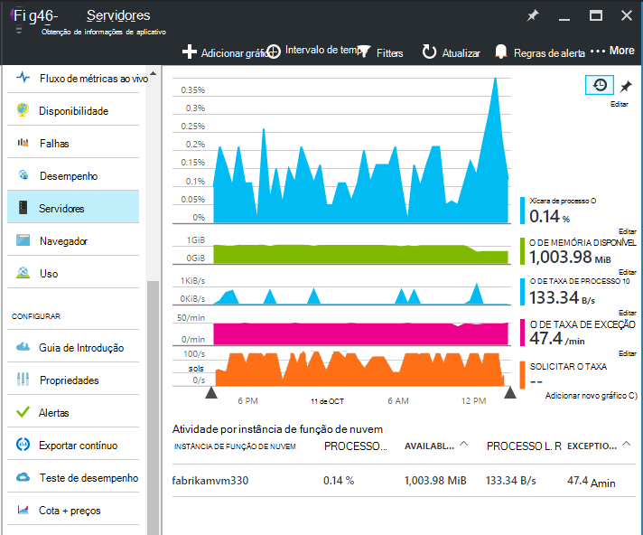
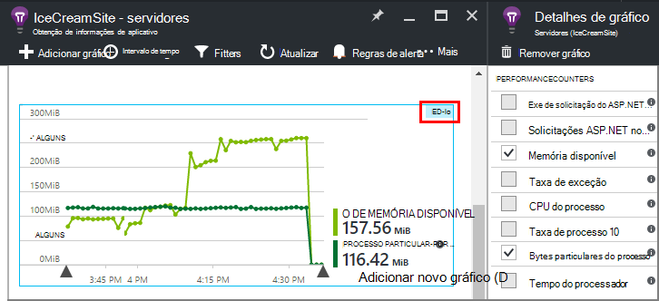
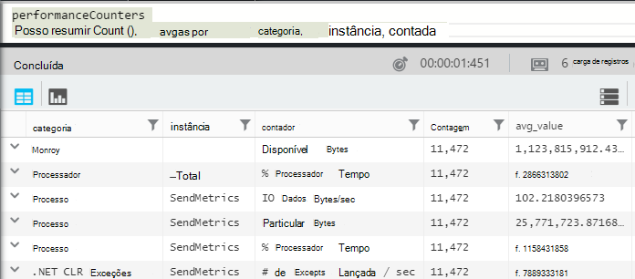
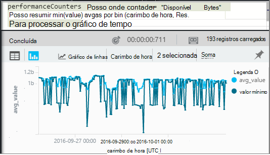
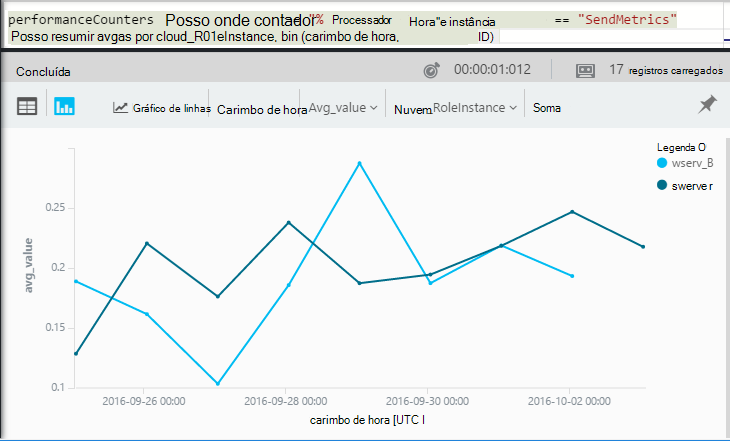

<properties 
    pageTitle="Contadores de desempenho no aplicativo ideias | Microsoft Azure" 
    description="Monitorar sistema e contadores de desempenho de .NET personalizados no aplicativo ideias." 
    services="application-insights" 
    documentationCenter=""
    authors="alancameronwills" 
    manager="douge"/>

<tags 
    ms.service="application-insights" 
    ms.workload="tbd" 
    ms.tgt_pltfrm="ibiza" 
    ms.devlang="na" 
    ms.topic="article" 
    ms.date="10/11/2016" 
    ms.author="awills"/>
 
# <a name="system-performance-counters-in-application-insights"></a>Contadores de desempenho do sistema no aplicativo ideias


O Windows fornece uma ampla variedade de [contadores de desempenho](http://www.codeproject.com/Articles/8590/An-Introduction-To-Performance-Counters) como ocupação CPU, memória, disco e uso de rede. Você também pode definir seus próprios. [Obtenção de informações de aplicativo](app-insights-overview.md) pode mostrar estes contadores se o seu aplicativo está em execução no IIS em um host local ou máquina virtual aos quais você tem acesso administrativo. Os gráficos indicam os recursos disponíveis para seu aplicativo ao vivo e podem ajudar a identificar a carga equilibrada entre instâncias do servidor.

Contadores de desempenho aparecem na lâmina servidores, que inclui uma tabela que segmentos por instância do servidor.



(Contadores de desempenho não estão disponíveis para aplicativos Web do Azure. Mas você pode [enviar o diagnóstico do Azure para obtenção de informações de aplicativo](app-insights-azure-diagnostics.md)).

## <a name="configure"></a>Configurar

Se o Monitor de Status de obtenção de informações do aplicativo ainda não estiver instalado em seus computadores de servidor, você precisa instalá-lo para ver contadores de desempenho.

Baixe e execute o [instalador do Monitor de Status](http://go.microsoft.com/fwlink/?LinkId=506648) em cada instância do servidor. Se ele já estiver instalado, você não precisa instalá-lo novamente.

* *Posso [instalar o SDK de ideias de aplicativo no meu aplicativo](app-insights-asp-net.md) durante o desenvolvimento. Ainda preciso Monitor de Status?*

    Sim, o Monitor de Status é necessária para coletar contadores de desempenho para aplicativos web do ASP.NET. Como você já deve saber, Monitor de Status também podem ser usados para [monitorar aplicativos de web que já estão live](app-insights-monitor-performance-live-website-now.md), sem instalar o SDK durante o desenvolvimento.


## <a name="view-counters"></a>Exiba contadores

A lâmina de servidores mostra um conjunto padrão de contadores de desempenho. 

Para ver outros contadores, edite os gráficos na lâmina servidores, ou abrir um novo blade [Métricas Explorer](app-insights-metrics-explorer.md) e adicionar novos gráficos. 

Os contadores disponíveis são listados como métricas quando você edita um gráfico.



Para ver todos os gráficos mais útil em um só lugar, criar um [painel](app-insights-dashboards.md) e fixá-los a ele.

## <a name="add-counters"></a>Adicionar contadores

Se o contador de desempenho desejado não for exibido na lista de métricas, é porque o SDK de obtenção de informações de aplicativo não está coletando-lo no seu servidor web. Você pode configurá-lo para fazer isso.

1. Descobrir quais contadores estão disponíveis no seu servidor usando este comando do PowerShell no servidor:

    `Get-Counter -ListSet *`

    (See [`Get-Counter`](https://technet.microsoft.com/library/hh849685.aspx).)

1. Abra ApplicationInsights.config.

 * Se você adicionou ideias de aplicativo para o seu aplicativo durante o desenvolvimento, edite ApplicationInsights.config no seu projeto e, em seguida, implantá-lo novamente para seus servidores.
 * Se você usou o Monitor de Status para instrumentar um aplicativo web em tempo de execução, encontre ApplicationInsights.config no diretório raiz do aplicativo no IIS. Atualizá-lo lá em cada instância do servidor.

2. Edite a diretiva de coletor de desempenho:

 ```XML

    <Add Type="Microsoft.ApplicationInsights.Extensibility.PerfCounterCollector.PerformanceCollectorModule, Microsoft.AI.PerfCounterCollector">
      <Counters>
        <Add PerformanceCounter="\Objects\Processes"/>
        <Add PerformanceCounter="\Sales(photo)\# Items Sold" ReportAs="Photo sales"/>
      </Counters>
    </Add>

```

Você pode capturar contadores padrão e aqueles que tiver implementado por conta própria. `\Objects\Processes`um exemplo de um contador padrão, disponível em todos os sistemas Windows. `\Sales(photo)\# Items Sold`é um exemplo de um contador personalizado que pode ser implementado em um serviço da web. 

O formato é `\Category(instance)\Counter"`, ou para categorias que não têm instâncias, apenas `\Category\Counter`.

`ReportAs`é necessário para nomes de contador que não correspondem a `[a-zA-Z()/-_ \.]+` -isto é, eles contêm caracteres que não estão em seguintes conjuntos: letras, redondo colchetes, barra, hífen, sublinhado, espaço, ponto.

Se você especificar uma instância, ele será coletado como uma dimensão "CounterInstanceName" da métrica relatada.

### <a name="collecting-performance-counters-in-code"></a>Coletar contadores de desempenho no código

Para coletar contadores de desempenho do sistema e enviá-las a obtenção de informações do aplicativo, você pode adaptar o trecho a seguir:

    var perfCollectorModule = new PerformanceCollectorModule();
    perfCollectorModule.Counters.Add(new PerformanceCounterCollectionRequest(
      @"\.NET CLR Memory([replace-with-application-process-name])\# GC Handles", "GC Handles")));
    perfCollectorModule.Initialize(TelemetryConfiguration.Active);

Ou você pode fazer a mesma coisa com métricas personalizadas que você criou:

    var perfCollectorModule = new PerformanceCollectorModule();
    perfCollectorModule.Counters.Add(new PerformanceCounterCollectionRequest(
      @"\Sales(photo)\# Items Sold", "Photo sales"));
    perfCollectorModule.Initialize(TelemetryConfiguration.Active);

## <a name="performance-counters-in-analytics"></a>Contadores de desempenho no Analytics

Você pode pesquisar e exibir relatórios de desempenho do contador na [análise](app-insights-analytics.md).


O esquema de **performanceCounters** expõe a `category`, `counter` nome, e `instance` nome de cada contador de desempenho.  A telemetria para cada aplicativo, você verá apenas os contadores para o aplicativo. Por exemplo, para ver quais contadores estão disponíveis: 



('Instância' aqui se refere à instância de contador de desempenho, não a instância de máquina servidor ou função. O nome de instância do contador de desempenho segmentos normalmente contadores como o tempo de processador pelo nome do processo ou do aplicativo.)

Para obter um gráfico de memória disponível ao longo do período recente: 




Como outra telemetria, **performanceCounters** também tem uma coluna `cloud_RoleInstance` que indica a identidade da instância do servidor de host no qual seu aplicativo está em execução. Por exemplo, para comparar o desempenho do seu aplicativo nas máquinas diferentes: 




## <a name="aspnet-and-application-insights-counts"></a>ASP.NET e contagens de obtenção de informações de aplicativo

*Qual é a diferença entre a taxa de exceção e métricas de exceções?*

* *Taxa de exceção* é um contador de desempenho do sistema. O CLR conta todas as exceções manipuladas e não tratadas que são lançadas e divide o total em um intervalo de amostragem pelo comprimento do intervalo. O SDK do aplicativo ideias coleta este resultado e envia para o portal.
* *Exceções* é uma contagem dos relatórios TrackException recebida pelo portal de no intervalo de amostragem do gráfico. Ele inclui apenas as exceções manipuladas onde você escreveu TrackException chama em seu código e não inclui todas as [exceções não tratadas](app-insights-asp-net-exceptions.md). 

## <a name="alerts"></a>Alertas

Como outras métricas, você pode [definir um alerta](app-insights-alerts.md) para avisá-lo a se um contador de desempenho vai fora de um limite especificado por você. Abra a lâmina de alertas e clique em Adicionar alerta.


## <a name="next"></a>Próximas etapas

* [Dependência de rastreamento](app-insights-asp-net-dependencies.md)
* [Acompanhamento de exceção](app-insights-asp-net-exceptions.md)