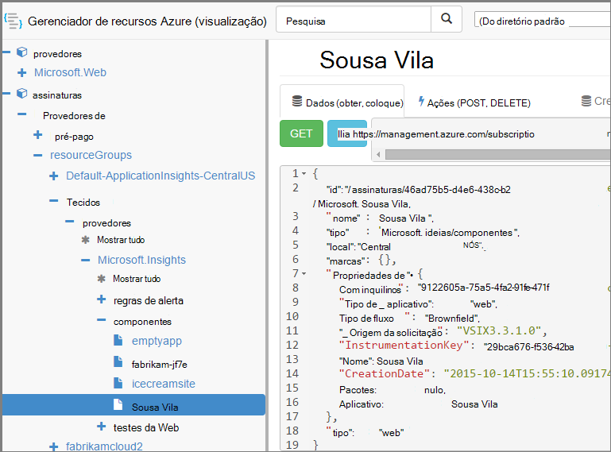

<properties 
    pageTitle="Criar recursos de obtenção de informações de aplicativo usando o PowerShell" 
    description="Crie recursos de obtenção de informações de aplicativo programaticamente como parte da sua criação." 
    services="application-insights" 
    documentationCenter=""
    authors="alancameronwills" 
    manager="douge"/>

<tags 
    ms.service="application-insights" 
    ms.workload="tbd" 
    ms.tgt_pltfrm="ibiza" 
    ms.devlang="na" 
    ms.topic="article" 
    ms.date="03/02/2016" 
    ms.author="awills"/>
 
# <a name="create-application-insights-resources-using-powershell"></a>Criar recursos de obtenção de informações de aplicativo usando o PowerShell

Este artigo mostra como criar um recurso de [Obtenção de informações de aplicativo](app-insights-overview.md) no Azure automaticamente. Por exemplo, você pode fazer isso como parte de um processo de compilação. Juntamente com o recurso de obtenção de informações do aplicativo básico, você pode criar [testes da web de disponibilidade](app-insights-monitor-web-app-availability.md), [Configure alertas](app-insights-alerts.md)e criar outros recursos Azure.

A chave para criar esses recursos é os modelos JSON para [Gerenciador de recursos do Azure](../powershell-azure-resource-manager.md). Em resumo, o procedimento é: baixar as definições de JSON dos recursos existentes; parametrizar determinados valores, como nomes; e execute o modelo sempre que desejar criar um novo recurso. Você pode criar um pacote vários recursos juntos, criá-los todos de uma vá - por exemplo, um monitor de aplicativo com testes de disponibilidade, alertas e armazenamento para exportação contínuo. Há algumas sutilezas de alguns dos parametrizações, que explicaremos aqui.

## <a name="one-time-setup"></a>Configuração única

Se você nunca usou o PowerShell com sua assinatura do Azure antes:

Instale o módulo do Powershell do Azure na máquina onde você deseja executar os scripts:

1. Instalar o [Microsoft Web Platform Installer (v5 ou superior)](http://www.microsoft.com/web/downloads/platform.aspx).
2. Usá-lo para instalar o Microsoft Azure Powershell.

## <a name="copy-the-json-for-existing-resources"></a>Copiar o JSON para recursos existentes

1. Configure o [Aplicativo ideias](app-insights-overview.md) para um projeto semelhante àquelas que você deseja gerar automaticamente. Adicione testes da web e alertas, se você deseja que eles.
2. Criar um novo arquivo de .json - digamos que `template1.json` neste exemplo. Copie esse conteúdo nele:


    ```JSON

        {
          "$schema": "https://schema.management.azure.com/schemas/2015-01-01/deploymentTemplate.json#",
          "contentVersion": "1.0.0.0",
          "parameters": {
            "appName": { "type": "string" },
            "webTestName": { "type": "string" },
            "url": { "type": "string" },
            "text": { "type" : "string" }
          },
          "variables": {
            "testName": "[concat(parameters('webTestName'), 
               '-', toLower(parameters('appName')))]"
            "alertRuleName": "[concat(parameters('webTestName'), 
               '-', toLower(parameters('appName')), 
               '-', subscription().subscriptionId)]"
          },
          "resources": [
            {
              // component JSON file contents
            },
            {
              //web test JSON file contents
            },
            {
              //alert rule JSON file contents
            }
 
            // Any other resources go here
          ]
        }
    
    ```

    Este modelo irá configurar a disponibilidade de um teste além do recurso principal.


2. Abra o [Gerenciador de recursos de Azure](https://resources.azure.com/). Navegar para baixo por `subscriptions/resourceGroups/<your resource group>/providers/Microsoft.Insights/components`, para o recurso de aplicativo. 

    

    *Componentes* são os recursos de obtenção de informações de aplicativo básicos para exibir aplicativos. Existem recursos separados para as regras de alerta associadas e testes de web de disponibilidade.

3. Copie o JSON do componente para o local apropriado no `template1.json`.
6. Exclua essas propriedades:
  * `id`
  * `InstrumentationKey`
  * `CreationDate`
4. Abra as seções webtests e alertrules e copie o JSON para itens individuais para seu modelo. (Não copiem os nós webtests ou alertrules: vá para os itens sob eles.)

    Cada teste da web tem uma regra de alerta associada, para que você precise copiar ambos.

    O teste da web deve ir antes da regra de alerta.

5. Para satisfazer o esquema, insira esta linha em cada recurso:

    `"apiVersion": "2014-04-01",`

    (O esquema também reclama sobre o uso de maiusculas dos nomes de tipo de recurso `Microsoft.Insights/*` , mas *não* alterá-las.)


## <a name="parameterize-the-template"></a>Parametrizar o modelo

Agora você precisa substituir os nomes específicos com parâmetros. Para [parametrizar um modelo](../resource-group-authoring-templates.md), você escreve expressões usando um [conjunto de funções do auxiliar](../resource-group-template-functions.md). 

Você não pode parametrizar apenas uma parte de uma cadeia de caracteres, portanto, use `concat()` criar cadeias de caracteres.

Veja alguns exemplos das substituições que você desejará fazer. Há várias ocorrências de cada substituição. Talvez precise de outras pessoas no seu modelo. Esses exemplos utilizam os parâmetros e variáveis definimos na parte superior do modelo.

localizar | Substituir por
---|---
`"hidden-link:/subscriptions/.../components/MyAppName"`| `"[concat('hidden-link:',`<br/>` resourceId('microsoft.insights/components',` <br/> ` parameters('appName')))]"`
`"/subscriptions/.../alertrules/myAlertName-myAppName-subsId",` | `"[resourceId('Microsoft.Insights/alertrules', variables('alertRuleName'))]",`
`"/subscriptions/.../webtests/myTestName-myAppName",` | `"[resourceId('Microsoft.Insights/webtests', parameters('webTestName'))]",`
`"myWebTest-myAppName"` | `"[variables(testName)]"'`
`"myTestName-myAppName-subsId"` | `"[variables('alertRuleName')]"`
`"myAppName"` | `"[parameters('appName')]"`
`"myappname"`(letras minúsculas) | `"[toLower(parameters('appName'))]"`
`"<WebTest Name=\"myWebTest\" ...`<br/>` Url=\"http://fabrikam.com/home\" ...>"`|`[concat('<WebTest Name=\"',` <br/> `parameters('webTestName'),` <br/> `'\" ... Url=\"', parameters('Url'),` <br/> `'\"...>')]" `


## <a name="set-dependencies-between-the-resources"></a>Definir dependências entre os recursos

Azure deve configurar os recursos na ordem estrito. Para certificar-se de que a instalação for concluída antes do início da próxima, adicione linhas de dependência:

* No recurso de teste da web:

    `"dependsOn": ["[resourceId('Microsoft.Insights/components', parameters('appName'))]"],`

* No alerta recurso:

    `"dependsOn": ["[resourceId('Microsoft.Insights/webtests', variables('testName'))]"],`

## <a name="create-application-insights-resources"></a>Criar recursos de obtenção de informações de aplicativo

1. No PowerShell, entrar no Azure

    `Login-AzureRmAccount`

2. Execute um comando como este:

    ```PS

        New-AzureRmResourceGroupDeployment -ResourceGroupName Fabrikam `
               -templateFile .\template1.json `
               -appName myNewApp `
               -webTestName aWebTest `
               -Url http://myapp.com `
               -text "Welcome!"
               -siteName "MyAzureSite"

    ``` 

    * -ResourceGroupName é o grupo onde você deseja criar os novos recursos.
    * -templateFile deve ocorrer antes os parâmetros personalizados.
    * -appName o nome do recurso para criar.
    * -webTestName o nome do teste da web para criar.
    * -Url a url do seu aplicativo web.
    * -cadeia de caracteres de texto A que aparece na sua página da web.
    * -siteName - usado se for um site do Azure


## <a name="define-metric-alerts"></a>Definir alertas métricas

Não há um [método de PowerShell de configuração de alertas](app-insights-alerts.md#set-alerts-by-using-powershell).


## <a name="an-example"></a>Um exemplo

Aqui está o componente concluído, o teste da web e o modelo da web teste alerta que criei:

``` JSON

{
  "$schema": "https://schema.management.azure.com/schemas/2015-01-01/deploymentTemplate.json#",
  "contentVersion": "1.0.0.0",
  "parameters": {
    "webTestName": { "type": "string" },
    "appName": { "type": "string" },
    "URL": { "type": "string" },
    "text": { "type" : "string" }
  },
  "variables": {
    "alertRuleName": "[concat(parameters('webTestName'), '-', toLower(parameters('appName')), '-', subscription().subscriptionId)]",
    "testName": "[concat(parameters('webTestName'), '-', toLower(parameters('appName')))]"
  },
  "resources": [
    {
      //"id": "[resourceId('Microsoft.Insights/components', parameters('appName'))]",
      "apiVersion": "2014-04-01",
      "kind": "web",
      "location": "Central US",
      "name": "[parameters('appName')]",
      "properties": {
        "TenantId": "9122605a-471fc50f8438",
        "Application_Type": "web",
        "Flow_Type": "Brownfield",
        "Request_Source": "VSIX3.3.1.0",
        "Name": "[parameters('appName')]",
        //"CreationDate": "2015-10-14T15:55:10.0917441+00:00",
        "PackageId": null,
        "ApplicationId": "[parameters('appName')]"
      },
      "tags": { },
      "type": "microsoft.insights/components"
    },
    {
      //"id": "[resourceId('Microsoft.Insights/webtests', variables('testName'))]",
      "name": "[variables('testName')]",
      "apiVersion": "2014-04-01",
      "type": "microsoft.insights/webtests",
      "location": "Central US",
      "tags": {
        "[concat('hidden-link:', resourceId('microsoft.insights/components', parameters('appName')))]": "Resource"
      },
      "properties": {
        "provisioningState": "Succeeded",
        "Name": "[parameters('webTestName')]",
        "Description": "",
        "Enabled": true,
        "Frequency": 900,
        "Timeout": 120,
        "Kind": "ping",
        "RetryEnabled": true,
        "Locations": [
          {
            "Id": "us-va-ash-azr"
          },
          {
            "Id": "emea-nl-ams-azr"
          },
          {
            "Id": "emea-gb-db3-azr"
          }
        ],
        "Configuration": {
          "WebTest": "[concat(
             '<WebTest   Name=\"', 
                parameters('webTestName'), 
              '\"  Id=\"32cfc791-aaad-4b50-9c8d-993c21beb218\"   Enabled=\"True\"         CssProjectStructure=\"\"    CssIteration=\"\"  Timeout=\"120\"  WorkItemIds=\"\"         xmlns=\"http://microsoft.com/schemas/VisualStudio/TeamTest/2010\"         Description=\"\"  CredentialUserName=\"\"  CredentialPassword=\"\"         PreAuthenticate=\"True\"  Proxy=\"default\"  StopOnError=\"False\"         RecordedResultFile=\"\"  ResultsLocale=\"\">  <Items>  <Request Method=\"GET\"         Guid=\"a6f2c90b-61bf-b28hh06gg969\"  Version=\"1.1\"  Url=\"', 
              parameters('Url'), 
              '\" ThinkTime=\"0\"  Timeout=\"300\" ParseDependentRequests=\"True\"         FollowRedirects=\"True\" RecordResult=\"True\" Cache=\"False\"         ResponseTimeGoal=\"0\"  Encoding=\"utf-8\"  ExpectedHttpStatusCode=\"200\"         ExpectedResponseUrl=\"\" ReportingName=\"\" IgnoreHttpStatusCode=\"False\" />        </Items>  <ValidationRules> <ValidationRule  Classname=\"Microsoft.VisualStudio.TestTools.WebTesting.Rules.ValidationRuleFindText, Microsoft.VisualStudio.QualityTools.WebTestFramework, Version=10.0.0.0, Culture=neutral, PublicKeyToken=b03f5f7f11d50a3a\" DisplayName=\"Find Text\"         Description=\"Verifies the existence of the specified text in the response.\"         Level=\"High\"  ExectuionOrder=\"BeforeDependents\">  <RuleParameters>        <RuleParameter Name=\"FindText\" Value=\"', 
              parameters('text'), 
              '\" />  <RuleParameter Name=\"IgnoreCase\" Value=\"False\" />  <RuleParameter Name=\"UseRegularExpression\" Value=\"False\" />  <RuleParameter Name=\"PassIfTextFound\" Value=\"True\" />  </RuleParameters> </ValidationRule>  </ValidationRules>  </WebTest>')]"
        },
        "SyntheticMonitorId": "[variables('testName')]"
      }
    },
    {
      //"id": "[resourceId('Microsoft.Insights/alertrules', variables('alertRuleName'))]",
      "name": "[variables('alertRuleName')]",
      "apiVersion": "2014-04-01",
      "type": "microsoft.insights/alertrules",
      "location": "East US",
      "dependsOn": [
        "[resourceId('Microsoft.Insights/components', parameters('appName'))]",
        "[resourceId('Microsoft.Insights/webtests', variables('testName'))]"
      ],
      "tags": {
        "[concat('hidden-link:', resourceId('Microsoft.Insights/components', parameters('appName')))]": "Resource",
        "[concat('hidden-link:', resourceId('Microsoft.Insights/webtests', variables('testName')))]": "Resource"
      },
      "properties": {
        "name": "[variables('alertRuleName')]",
        "description": "",
        "isEnabled": true,
        "condition": {
          "$type": "Microsoft.WindowsAzure.Management.Monitoring.Alerts.Models.LocationThresholdRuleCondition, Microsoft.WindowsAzure.Management.Mon.Client",
          "odata.type": "Microsoft.Azure.Management.Insights.Models.LocationThresholdRuleCondition",
          "dataSource": {
            "$type": "Microsoft.WindowsAzure.Management.Monitoring.Alerts.Models.RuleMetricDataSource, Microsoft.WindowsAzure.Management.Mon.Client",
            "odata.type": "Microsoft.Azure.Management.Insights.Models.RuleMetricDataSource",
            "resourceUri": "[resourceId('microsoft.insights/webtests', variables('testName'))]",
            "metricName": "GSMT_AvRaW"
          },
          "windowSize": "PT15M",
          "failedLocationCount": 2
        },
        "action": {
          "$type": "Microsoft.WindowsAzure.Management.Monitoring.Alerts.Models.RuleEmailAction, Microsoft.WindowsAzure.Management.Mon.Client",
          "odata.type": "Microsoft.Azure.Management.Insights.Models.RuleEmailAction",
          "sendToServiceOwners": true,
          "customEmails": [ ]
        },
        "provisioningState": "Succeeded",
        "actions": [ ]
      }

    }
  ]
}

```

## <a name="see-also"></a>Consulte também

Outros artigos de automação:

* [Criar um recurso de obtenção de informações de aplicativo](app-insights-powershell-script-create-resource.md) - método rápido sem usar um modelo.
* [Configurar alertas](app-insights-powershell-alerts.md)
* [Criar testes da web](https://azure.microsoft.com/blog/creating-a-web-test-alert-programmatically-with-application-insights/)
* [Enviar diagnóstico do Azure para obtenção de informações de aplicativo](app-insights-powershell-azure-diagnostics.md)
* [Criar anotações de lançamento](https://github.com/Microsoft/ApplicationInsights-Home/blob/master/API/CreateReleaseAnnotation.ps1)
