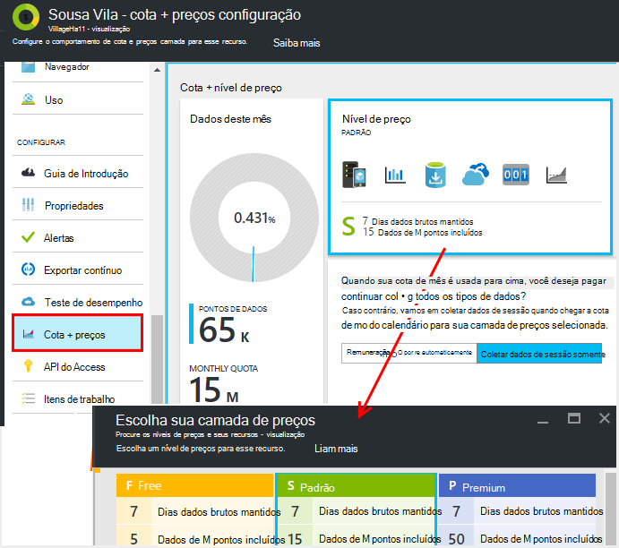
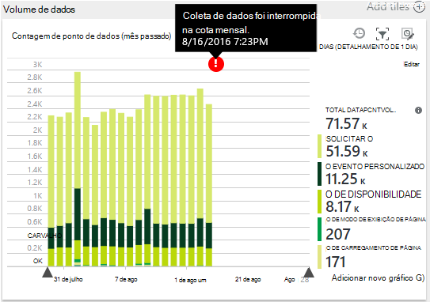
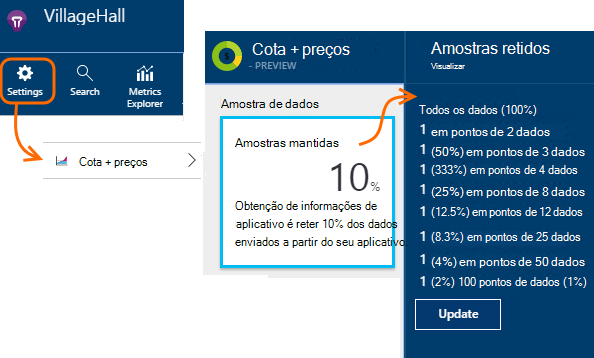
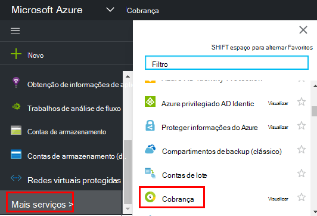

<properties 
    pageTitle="Gerenciar preços e cota de obtenção de informações de aplicativo | Microsoft Azure" 
    description="Escolher o plano de preço que você precisa, gerenciar volumes de telemetria" 
    services="application-insights" 
    documentationCenter=""
    authors="alancameronwills" 
    manager="douge"/>

<tags 
    ms.service="application-insights" 
    ms.workload="tbd" 
    ms.tgt_pltfrm="ibiza" 
    ms.devlang="na" 
    ms.topic="article" 
    ms.date="10/13/2016" 
    ms.author="awills"/>

# Gerenciar preços e cota de obtenção de informações de aplicativo

*Obtenção de informações de aplicativo está no modo de visualização.*

[Preços] [ pricing] para [Obtenção de informações do Visual Studio aplicativo] [ start] baseado em volume de dados por aplicativo. Não há um nível gratuito substancial no qual você obtém a maioria dos recursos com algumas limitações.

Cada recurso de obtenção de informações de aplicativo é cobrado como um serviço separado e contribui para a fatura por sua assinatura do Azure.

[Ver o esquema de preços][pricing].

## Plano de cotas e preço de revisão para o recurso de obtenção de informações de aplicativo

Você pode abrir a cota + preços blade das configurações do recurso de seu aplicativo.

Sua opção de esquema de preços afeta:

* [Cota mensal](#monthly-quota) - a quantidade de telemetria que você pode analisar cada mês.
* [Taxa de dados](#data-rate) - a taxa máxima na qual os dados de seu aplicativo podem ser processados.
* [Exportar contínuo](#continuous-export) - se que você pode exportar dados para outros serviços e ferramentas.

Esses limites são definidos separadamente para cada recurso de obtenção de informações do aplicativo.

### Avaliação gratuita do Premium

Quando você primeiro criar um novo recurso de obtenção de informações do aplicativo, ele começa na camada gratuita.

A qualquer momento, você pode alternar para a avaliação de Premium gratuita de 30 dias. Assim, você obtém os benefícios da camada Premium. Após 30 dias, ela será revertida automaticamente para qualquer nível estavam antes - a menos que você escolha explicitamente outra camada. Selecionar a camada que você deseja que a qualquer momento durante o período de avaliação, mas você ainda receberá a avaliação gratuita até o final do período de 30 dias.

## Cota mensal

* Em cada mês do calendário, seu aplicativo pode enviar para cima, para uma quantidade especificada de telemetria de obtenção de informações do aplicativo. Atualmente a cota para a camada de preços gratuita é 5 milhões de pontos de dados por mês e substancialmente mais para os outros esquemas; Você pode comprar mais se você alcançar a cota.  Consulte os [preços esquema] [ pricing] para os números reais. 
* A cota depende da camada de preços que você escolheu.
* A cota é contada de meia-noite UTC no primeiro dia de cada mês.
* O gráfico de pontos de dados mostra quanto da sua cota foi usado para cima deste mês.
* A cota é medida em *pontos de dados.* Um único ponto de dados é uma chamada para um dos métodos controlar, independentemente de chamada explicitamente no seu código, ou por um dos módulos telemetria padrão. Ele pode ter várias propriedades anexadas e métricas.
* Pontos de dados são gerados pelo:
 * [Módulos SDK](app-insights-configuration-with-applicationinsights-config.md) que automaticamente coletar dados, por exemplo para relatar uma solicitação ou falha ou para medir o desempenho.
 * [API](app-insights-api-custom-events-metrics.md) `Track...` chamadas que você escreveu, tais como `TrackEvent` ou `trackPageView`.
 * [Testes de web de disponibilidade](app-insights-monitor-web-app-availability.md) que você configurou.
* Durante a depuração, você pode ver os pontos de dados está sendo enviados de seu aplicativo na janela de saída do Visual Studio. Eventos do cliente podem ser vistos abrindo que a guia rede no seu navegador da depuração painel (geralmente F12).
* *Dados de sessão* não será contada na cota de. Isso inclui contagens de usuários, sessões, ambiente e dados do dispositivo.
* Se você gostaria de contar pontos de dados por inspeção, você pode encontrá-los em vários lugares:
 * Cada item que você verá na [pesquisa de diagnóstico](app-insights-diagnostic-search.md), que inclui solicitações HTTP, exceções, rastreamentos de log, modos de exibição de página, eventos de dependência e eventos personalizados.
 * Cada medida bruta de uma [métrica](app-insights-metrics-explorer.md) como um contador de desempenho. (Os pontos que você vê nos gráficos são geralmente agregados de vários pontos de dados processados.)
 * Cada ponto em um gráfico de disponibilidade do web também é uma agregação dos vários pontos de dados.
* Você também pode inspecionar pontos de dados individuais na origem durante a depuração:
 * Se você executar o aplicativo no modo de depuração no Visual Studio, os pontos de dados são registrados na janela de saída. 
 * Para ver os pontos de dados do cliente, abra o painel de depuração do seu navegador (geralmente F12) e abra a guia rede.
* A taxa de dados pode ser (por padrão) reduzida por [amostragem adaptativa](app-insights-sampling.md). Isso significa que, como o uso de seu aplicativo aumenta, a taxa de telemetria não aumenta tanto quanto você poderia esperar.

### Excedente

Se seu aplicativo envia mais do que a cota mensal, você pode:

* Paga por dados adicionais. Consulte os [preços esquema] [ pricing] para obter detalhes. Você pode escolher essa opção com antecedência. Esta opção não está disponível na livre preços camada.
* Atualize sua camada de preços.
* Não faça nada. Dados de sessão continuarão a ser gravado, mas outros dados não aparecerá na pesquisa de diagnóstico ou no Explorador de métricas.

## A quantidade de dados estou enviando?

O gráfico na parte inferior dos preços blade mostra o volume de ponto de dados do seu aplicativo, agrupados por tipo de ponto de dados. (Você também pode criar esse gráfico no Explorador de métrica.)

Clique no gráfico para obter mais detalhes, ou arraste sobre ele e clique em (+) para obter detalhes de um intervalo de tempo.

O gráfico mostra o volume de dados que chegam no serviço de obtenção de informações do aplicativo, depois de [amostragem](app-insights-sampling.md).

Se o volume de dados atinge sua cota mensal, uma anotação é exibida no gráfico.

## Taxa de dados

Além da cota mensal, há limites limitação na taxa de dados. Para o livre [preços camada] [ pricing] o limite é de 200 dados pontos/segundo média mais de 5 minutos e para o paga camadas-é 500/s média de mais de 1 minuto. 

Há três classificações que são contadas separadamente:

* [Chamadas de TrackTrace](app-insights-api-custom-events-metrics.md#track-trace) e [capturado logs](app-insights-asp-net-trace-logs.md)
* [Exceções](app-insights-api-custom-events-metrics.md#track-exception), limitado a 50 pontos/s.
* Todos os outra telemetria com (modos de exibição de página, sessões, solicitações, dependências, métricas, eventos personalizados, resultados de teste da web).

*O que acontece se meu aplicativo exceder a taxa por segundo?*

* O volume de dados que seu aplicativo envia é avaliado cada minuto. Se ele exceder a taxa por segundo média no minuto, o servidor recusa algumas solicitações. O SDK buffers os dados e, em seguida, tenta reenviar, difundir um aumento check-out por vários minutos. Se seu aplicativo consistentemente envia dados em acima da taxa de limitação, alguns dados serão ignorados. (A ASP.NET, Java e JavaScript SDKs tentarem reenviar dessa maneira; outros SDKs podem simplesmente soltar limitado dados).

Se a otimização ocorre, você verá uma notificação de aviso que isso ocorreu.

*Como posso saber quantos pontos de dados meu aplicativo está enviando?*

* Abra configurações/cota e preços para ver o gráfico de Volume de dados.
* Ou, no Explorador de métricas, adicionar um novo gráfico e selecione o **volume de ponto de dados** como sua métrica. Alterne em agrupamento e agrupar por **tipo de dados**.

## Para reduzir a taxa de dados

Se você encontrar os limites de limitação, aqui estão algumas coisas que você pode fazer:

* Use [amostragem](app-insights-sampling.md). Essa tecnologia reduz a taxa de dados sem inclinação suas métricas e sem interromper a capacidade de navegar entre itens relacionados em pesquisa.
* [Limitar o número de chamadas de Ajax que pode ser relatada](app-insights-javascript.md#detailed-configuration) em cada modo de exibição de página ou desativar relatórios de Ajax chave.
* Desative módulos conjunto que desnecessárias, [editando ApplicationInsights.config](app-insights-configuration-with-applicationinsights-config.md). Por exemplo, você pode decidir que contadores de desempenho ou dados de dependência são inessential.
* Pré-agrega métricas. Se você tiver colocar chamadas para TrackMetric em seu aplicativo, você pode reduzir o tráfego usando a sobrecarga que aceita seu cálculo da média e o desvio padrão de um lote de medidas. Ou você pode usar um [pacote previamente agregação](https://www.myget.org/gallery/applicationinsights-sdk-labs). 

## Amostragem

[Amostragem](app-insights-sampling.md) é um método de reduzir a taxa na qual telemetria é enviada para seu aplicativo, enquanto ainda mantém a capacidade de localizar eventos relacionados durante as pesquisas de diagnósticos e ainda mantém correto de contagem de evento. 

Amostragem é uma maneira eficaz de reduzir tarifas e ficar dentro sua cota mensal. O algoritmo de amostragem retém itens relacionados de telemetria, para que, por exemplo, quando você usa pesquisa, você pode localizar a solicitação relacionada a uma determinada exceção. O algoritmo também retém contagens corretas, para que você veja os valores corretos no Explorador de métrica para taxas de solicitação, taxas de exceção e outras contagens.

Há várias formas de amostragem.

* [Amostragem adaptativa](app-insights-sampling.md) é o padrão para o SDK do ASP.NET, que é automaticamente ajustado para o volume de telemetria que seu aplicativo envia. Ele funciona automaticamente no SDK em seu aplicativo web, para que o tráfego de telemetria na rede é reduzido. 
* *Amostra de inclusão* é uma alternativa que operam no ponto onde telemetria de seu aplicativo insere o serviço de obtenção de informações do aplicativo. Ele não afeta o volume de telemetria enviado a partir do seu aplicativo, mas reduz o volume mantido pelo serviço. Você pode usá-lo para reduzir a cota usada pela telemetria de navegadores e outros SDKs.

Para definir amostragem de inclusão, defina o controle nas cotas + preços blade:

> [AZURE.WARNING] O valor mostrado no bloco amostras mantidos indica somente o valor que você definiu para amostragem de inclusão. Ele não mostra a taxa de amostragem que está operando o SDK em seu aplicativo. 
> 
> Se a entrada telemetria já tem sido amostras no SDK do, amostragem de inclusão não será aplicada.
 
Para descobrir a taxa de amostragem real independentemente de onde ela foi aplicada, use uma [consulta de análise](app-insights-analytics.md) como esta:

    requests | where timestamp > ago(1d)
  	| summarize 100/avg(itemCount) by bin(timestamp, 1h) 
  	| render areachart 

Em cada mantidos registro, `itemCount` indica o número de registros originais que ele representa, igual a 1 + o número de registros descartados anterior. 

## Examine a lista de sua assinatura do Azure

Encargos de obtenção de informações do aplicativo são adicionados à sua fatura Azure. Você pode ver os detalhes do seu Azure bill na seção de cobrança do portal do Azure ou no [Portal de cobrança do Azure](https://account.windowsazure.com/Subscriptions). 

## Limites de nome

1.  Máximo 200 nomes de métrica exclusivos e 200 nomes de propriedade exclusivo para o seu aplicativo. Métricas de incluem dados enviados via TrackMetric bem como as medidas em outros tipos de dados como eventos.  [Nomes de propriedade e métricas] [ api] são globais por chave de instrumentação.
2.  [Propriedades] [ apiproperties] podem ser usados para filtrar e agrupar-por somente enquanto eles têm menos de 100 valores exclusivos para cada propriedade. Após o número de valores exclusivos exceder 100, você pode ainda pesquisar a propriedade, mas não está mais usá-lo para filtros ou agrupar por.
3.  Propriedades padrão como solicitar nome e URL da página são limitadas a 1000 valores exclusivos por semana. Depois de 1000 valores exclusivos, valores adicionais são marcados como "Outros valores". Os valores originais ainda podem ser usados para filtragem e pesquisa de texto completo.

Se você achar que seu aplicativo está ultrapassando esses limites, considere dividir os dados entre chaves de instrumentação diferentes - isto é, [criar novos recursos de obtenção de informações de aplicativo](app-insights-create-new-resource.md) e enviar alguns dos dados para as novas chaves de instrumentação. Você pode achar que o resultado é melhor estruturado. Você pode usar [painéis](app-insights-dashboards.md#dashboards) para trazer as métricas diferentes na mesma tela, para que essa abordagem não restringe sua capacidade de comparar métricas diferentes. 

## Resumo de limites

[AZURE.INCLUDE [application-insights-limits](../../includes/application-insights-limits.md)]

<!--Link references-->

[api]: app-insights-api-custom-events-metrics.md
[apiproperties]: app-insights-api-custom-events-metrics.md#properties
[start]: app-insights-overview.md
[pricing]: http://azure.microsoft.com/pricing/details/application-insights/

 