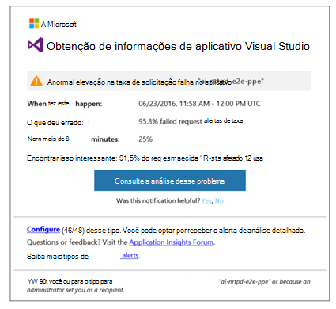
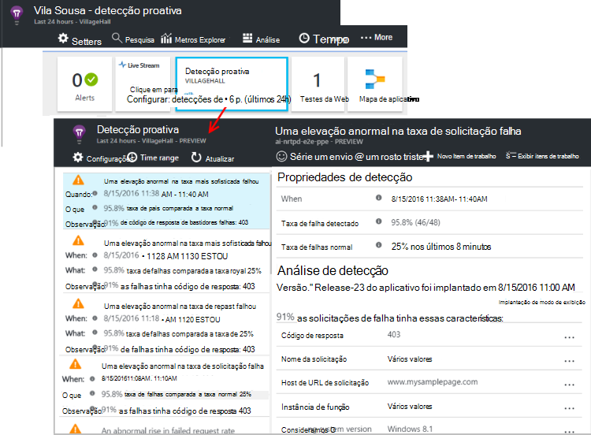

<properties 
    pageTitle="Diagnóstico proativo no aplicativo ideias | Microsoft Azure" 
    description="Obtenção de informações de aplicativo executa análise profunda automática de telemetria seu aplicativo e avisa sobre possíveis problemas." 
    services="application-insights" 
    documentationCenter="windows"
    authors="rakefetj" 
    manager="douge"/>

<tags 
    ms.service="application-insights" 
    ms.workload="tbd" 
    ms.tgt_pltfrm="ibiza" 
    ms.devlang="na" 
    ms.topic="article" 
    ms.date="08/15/2016" 
    ms.author="awills"/>

#  Diagnóstico proativo na obtenção de informações de aplicativo

 Diagnóstico proativo automaticamente avisa sobre possíveis problemas de desempenho em seu aplicativo web. Ele executa análise inteligente da telemetria que seu aplicativo envia de [Obtenção de informações do Visual Studio aplicativo](app-insights-overview.md). Se houver um aumento súbito no taxas de falha ou padrões anormais no desempenho do cliente ou do servidor, você receberá um alerta. Este recurso não precisa nenhuma configuração. Ele funciona se seu aplicativo envia suficiente telemetria.

Você pode acessar alertas de detecção proativa dos emails que você recebe, tanto da lâmina detecção proativa.

## Examine suas detecções proativas

Você pode descobrir detecções de duas maneiras:

* **Você recebe um email** de obtenção de informações do aplicativo. Aqui está um exemplo típico:

    

    Clique no botão grande para abrir mais detalhes no portal.

* **A detecção proativa lado a lado** na lâmina de visão geral do seu aplicativo mostra uma contagem de alertas recentes. Clique no bloco para ver uma lista dos alertas recentes.

Selecione um alerta para ver seus detalhes.

## Quais problemas são detectados?

Há três tipos de detecção:

* [Diagnóstico de taxa de falha proativo](app-insights-proactive-failure-diagnostics.md). Usamos para definir a taxa esperada de solicitações com falha para o aplicativo, de aprendizado de máquina correlação com carga e outros fatores. Se a taxa de falhas ficar fora do envelope esperado, enviaremos um alerta.
* [Diagnóstico de desempenho proativo](app-insights-proactive-performance-diagnostics.md). Podemos pesquisar padrões anômalos em tempos de resposta e taxas de falha diariamente. Podemos correlação esses problemas com propriedades como local, o navegador, o sistema operacional cliente, instância do servidor e hora do dia.
* [Serviços de nuvem do azure](https://azure.microsoft.com/blog/proactive-notifications-on-cloud-service-issues-with-azure-diagnostics-and-application-insights/). Você receberá alertas se seu aplicativo estiver hospedado em serviços de nuvem do Azure e uma instância da função tem falhas de inicialização, reciclagem frequente ou falhas de tempo de execução.

(Os links de Ajuda em cada notificação levam você os artigos relevantes.)

## Próximas etapas

Estas ferramentas de diagnóstico ajudarão-lo a inspecionar a telemetria de seu aplicativo:

* [Métrica explorer](app-insights-metrics-explorer.md)
* [Explorador de pesquisa](app-insights-diagnostic-search.md)
* [Análises - poderosa linguagem de consulta](app-insights-analytics-tour.md)

Diagnóstico proativo é totalmente automático. Mas talvez você gostaria de configurar alguns alertas mais?

* [Alertas de métrica configuradas manualmente](app-insights-alerts.md)
* [Testes de web de disponibilidade](app-insights-monitor-web-app-availability.md) 

