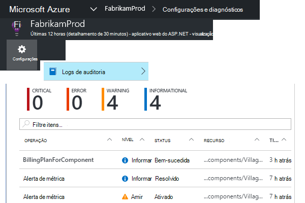

<properties 
    pageTitle="Diagnósticos de taxa proativa de falhas no aplicativo ideias | Microsoft Azure" 
    description="Alerta você sobre alterações incomuns na taxa de solicitações com Falha ao seu aplicativo web e fornece a análise de diagnóstico. Nenhuma configuração é necessária." 
    services="application-insights" 
    documentationCenter=""
    authors="yorac" 
    manager="douge"/>

<tags 
    ms.service="application-insights" 
    ms.workload="tbd" 
    ms.tgt_pltfrm="ibiza" 
    ms.devlang="na" 
    ms.topic="article" 
    ms.date="10/12/2016" 
    ms.author="awills"/>
 
# Diagnóstico de taxa proativa de falhas

[Ideias de aplicativo do Visual Studio](app-insights-overview.md) automaticamente notifica praticamente em tempo real se seu aplicativo web experiências um aumento anormal a taxa de falhas. Ele detecta uma elevação incomuns na taxa de solicitações HTTP relatada como falha. Esses geralmente são aqueles com códigos de resposta no 400 - e 500-intervalos. Para ajudá-lo a triagem e diagnosticar o problema, uma análise das características de solicitações com falha e telemetria relacionada é fornecida na notificação. Também existem links para o portal de obtenção de informações do aplicativo para diagnóstico ainda mais. O recurso não precisa nenhuma configuração ou configuração, pois ela usa algoritmos de aprendizado de máquina para prever a taxa de falhas normal.

Este recurso funciona para Java e ASP.NET web apps, hospedados na nuvem ou em seus próprios servidores. Ele também funciona para qualquer aplicativo que gera solicitação telemetria - por exemplo, se você tiver uma função de trabalho que chama [TrackRequest()](app-insights-api-custom-events-metrics.md#track-request). 

Depois de configuração de [Obtenção de informações de aplicativo para o seu projeto](app-insights-overview.md)e fornecido seu aplicativo gera um determinado mínimo de telemetria, falha proativo diagnóstico leva 24 horas para saber o comportamento normal de seu aplicativo, antes que ele está ligado e pode enviar alertas.

Aqui está um alerta de amostra. 

> [AZURE.NOTE] Por padrão, você recebe um email de formato menor que esse exemplo. Mas você pode [Alternar para este formato detalhado](#configure-alerts).

Observe que ele informa:

* A taxa de falhas em comparação com o comportamento de aplicativo normal.
* Quantos usuários são afetados – para que você saiba quanto se preocupar.
* Um padrão de característica associado as falhas. Neste exemplo, há um código de resposta específica, o nome de solicitação (operação) e a versão do aplicativo. Que informa imediatamente onde começar procurando no seu código. Outras possibilidades podem ser um sistema operacional de navegador ou cliente específico.
* A exceção, rastreamentos de log e falha de dependência (bancos de dados ou outros componentes externos) que parecem ser associadas com as solicitações de falhas caracterizadas.
* Links diretamente para pesquisas relevantes na telemetria no aplicativo ideias.

## Benefícios dos alertas proativos

Ordinário [métricas alertas](app-insights-alerts.md) informam talvez haja um problema. Mas falha proativo diagnóstico inicia o trabalho de diagnóstico para você, realizar muitas a análise caso contrário, você precisará fazer por conta própria. Você obtém os resultados claramente empacotados, ajudando você a começar rapidamente na raiz do problema.

## Como ele funciona

Próximo ao diagnóstico proativo de Tempo Real monitores a telemetria recebido de seu aplicativo e em particular a taxa de solicitação falha. Esta métrica conta o número de solicitações para o qual o `Successful request` propriedade for falsa. Por padrão, `Successful request== (resultCode < 400)` (a menos que você escreveu código personalizado para [Filtrar](app-insights-api-filtering-sampling.md#filtering) ou gerar seus próprio chamadas de [TrackRequest](app-insights-api-custom-events-metrics.md#track-request) ). 

Desempenho do seu aplicativo tem um padrão típico de comportamento. Algumas solicitações será mais sujeitas a falha que outros; e a taxa de falha geral pode subir como carga aumenta. Diagnóstico de falha proativo usa para encontrar esses problemas de aprendizado de máquina. 

Conforme telemetria entra em ideias de aplicativo de seu aplicativo web, o diagnóstico de falha proativo compara o comportamento atual com padrões de visto nos últimos alguns dias. Se um anormal elevação na taxa de falha for observada by comparison with desempenho anterior, uma análise é disparada.

Quando uma análise é disparada, o serviço realiza uma análise de cluster na solicitação falhou, para tentar identificar um padrão de valores que caracterizam as falhas. No exemplo acima, a análise descobriu que a maioria das falhas são sobre um código de resultado específico, nome da solicitação, host de URL do servidor e instância de função. Por outro lado, a análise descobriu que a propriedade de sistema operacional do cliente é distribuída ao longo de vários valores, e então ele não está listado.

Quando o seu serviço tem como instrumentos estas telemetria, o analyser localiza uma exceção e uma falha de dependência que estão associadas a solicitações no cluster identificados, juntamente com um exemplo de qualquer logs de rastreamento associados a essas solicitações.

A análise resultante é enviada a você como alerta, a menos que você o configurou para não.

Como os [alertas que você definir manualmente](app-insights-alerts.md), você pode inspecionar o estado do alerta e configure-o na lâmina alertas de seu recurso de obtenção de informações do aplicativo. Mas, ao contrário de outros alertas, você não precisa configurar ou configurar diagnósticos proativa de falhas. Se desejar, você pode desabilitá-lo ou alterar seus endereços de email de destino.

## Configurar alertas 

Você pode desabilitar o diagnóstico proativo, alterar os destinatários de email, crie uma webhook ou optar por usar em mensagens de alerta mais detalhadas.

Abra a página de alertas. Diagnóstico proativo é incluído juntamente com todos os alertas que você definiu manualmente, e você pode ver se ele ainda está no estado de alerta.

Clique no alerta para configurá-lo.

Observe que você pode desabilitar diagnóstico proativo, mas você não pode excluí-lo (ou crie outro).

#### Alertas detalhados

Se você selecionar "Receber análise detalhada" email conterá mais informações de diagnóstico. Às vezes, você poderá diagnosticar o problema apenas a partir dos dados no email. 

Há um pequeno risco que o alerta mais detalhado pode conter informações confidenciais, porque ele inclui exceção e rastreamento de mensagens. No entanto, isso só ocorrerá se seu código pode permitir que informações confidenciais para as mensagens. 

## Separação e diagnosticar um alerta

Um alerta indica que um anormal elevação na taxa de solicitação falha foi detectada. É provável que não há algum problema com o seu aplicativo ou o seu ambiente.

A porcentagem de solicitações e o número de usuários afetados, você pode decidir como urgente o problema for. No exemplo acima, a taxa de falhas de 22.5% se compara com uma taxa normal de 1%, indica que algo ruim está acontecendo. Por outro lado, somente 11 usuários foram afetados. Se fosse seu aplicativo, você poderá avaliar como graves é.

Em muitos casos, você poderá diagnosticar o problema rapidamente do nome da solicitação, exceção, dados de falha e rastreamento de dependência fornecidos. 

Há algumas outras dicas. Por exemplo, a taxa de falhas de dependência neste exemplo é a mesma que a taxa de exceção (89.3%). Isso sugere que a exceção provém diretamente a falha de dependência - dando a você uma ideia clara de onde começar procurando no seu código.

Para investigar melhor, os links em cada seção você será levado diretamente para uma [página de pesquisa](app-insights-diagnostic-search.md) filtrada à solicitações relevantes, exceção, dependência ou rastreamentos. Ou você pode abrir o [portal do Azure](https://portal.azure.com), navegue até o recurso de obtenção de informações do aplicativo para o aplicativo e abra a lâmina de falhas.

Neste exemplo, clicando no link 'Exibir detalhes de falhas de dependência' abre blade de pesquisa de obtenção de informações do aplicativo na instrução SQL com a causa: valores nulos onde fornecidos em campos obrigatórios e não passou validação durante o salvamento operação.

## Revisar alertas recentes

Para revisar alertas no portal do, abra **configurações, logs de auditoria**.

Clique em qualquer alerta para ver seus detalhes completos.

Ou clique em **detecção proativa** para ir diretamente para o alerta mais recente:

## Qual é a diferença …

Diagnóstico de taxa de falha proativo complementa outros semelhante mas distintos recursos de obtenção de informações do aplicativo. 

* [Alertas de métrica](app-insights-alerts.md) são definidas por você e pode monitorar uma ampla variedade de métricas como CPU ocupação, taxas de solicitação, tempos de carregamento de página e assim por diante. Você pode usá-los para avisá-lo, por exemplo, se você precisa adicionar mais recursos. Por outro lado, diagnóstico de falha proativo cobre uma pequena variedade de métricas críticas (atualmente apenas solicitação falha taxa), projetada para notificar você no próximo maneira de tempo real depois de falha de seu aplicativo web solicitar taxa aumenta significativamente em comparação com o comportamento normal do web app.

    Diagnóstico de taxa de falha proativo é automaticamente ajustado seu limite em resposta a condições predominante.

    Falha proativo taxa diagnósticos Iniciar trabalho de diagnóstico para você. 
* [Diagnóstico de desempenho proativo](app-insights-proactive-performance-diagnostics.md) também usa inteligência de máquina para descobrir padrões incomuns em seu métricas e é necessária nenhuma configuração por você. Mas ao contrário de diagnóstico de taxa de falha proativo, a finalidade do diagnóstico de desempenho proativo encontrar segmentos de sua coleção de uso que pode ser servida mal - por exemplo, por páginas específicas em um tipo específico de navegador. A análise é executada diariamente e se qualquer resultado for encontrado, é provável que seja muito menos urgente de um alerta. Por outro lado, a análise para diagnóstico de falha proativo é executada continuamente na entrada telemetria e você será notificado em poucos minutos se taxas de falha do servidor forem maiores do que o esperado.

## Se você receber um alerta de diagnóstico de taxa proativa de falhas

*Por que recebeu este alerta?*

*   Foi detectado uma anormal elevação na taxa de solicitações com falha em comparação com a linha de base normal do período anterior. Depois de análise das falhas e telemetria associada, consideramos que não há um problema que você deve examinar. 

*A notificação significa que definitivamente tenho um problema?*

*   Tentamos alertar em interrupção de aplicativo ou degradação, embora só você pode entender a semântica e o impacto sobre o aplicativo ou usuários.

*Portanto, vocês examinar meus dados?*

*   Não. O serviço é totalmente automático. Somente você recebe as notificações. Seus dados são [particular](app-insights-data-retention-privacy.md).

*Tenho assinar este alerta?* 

*   Não. Cada telemetria de solicitação de envio de aplicativo tem esta regra de alerta.

*É possível cancelar a assinatura ou obtenha as notificações enviadas para meus colegas em vez disso?*

*   Sim, no alerta de regras, clique em regra de diagnóstico proativo configurá-lo. Você pode desativar o alerta ou alterar destinatários para o alerta. 

*Perdi o email. Onde posso encontrar as notificações no portal?*

*   Em logs de auditoria. Clique em configurações, logs de auditoria, e em seguida todos os alertas para ver sua ocorrência, mas com o modo de exibição detalhado limitado.

*Alguns dos alertas são dos problemas conhecidos e não deseja recebê-las.*

*   Temos supressão de alerta no nosso registro posterior.

## Próximas etapas

Estas ferramentas de diagnóstico ajudarão-lo a inspecionar a telemetria de seu aplicativo:

* [Métrica explorer](app-insights-metrics-explorer.md)
* [Explorador de pesquisa](app-insights-diagnostic-search.md)
* [Análises - poderosa linguagem de consulta](app-insights-analytics-tour.md)

Detecções proativas são totalmente automáticas. Mas talvez você gostaria de configurar alguns alertas mais?

* [Alertas de métrica configuradas manualmente](app-insights-alerts.md)
* [Testes de web de disponibilidade](app-insights-monitor-web-app-availability.md) 

