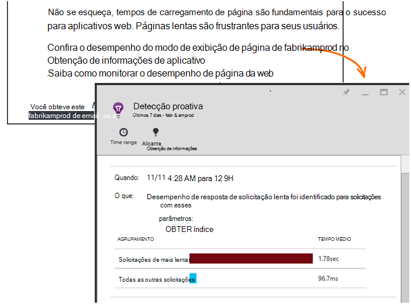

<properties 
    pageTitle="Obtenção de informações do aplicativo: Diagnóstico de desempenho proativo | Microsoft Azure" 
    description="Obtenção de informações de aplicativo executa análise profunda de telemetria seu aplicativo e avisa de possíveis problemas." 
    services="application-insights" 
    documentationCenter="windows"
    authors="antonfrMSFT" 
    manager="douge"/>

<tags 
    ms.service="application-insights" 
    ms.workload="tbd" 
    ms.tgt_pltfrm="ibiza" 
    ms.devlang="na" 
    ms.topic="article" 
    ms.date="08/31/2016" 
    ms.author="awills"/>

#  Diagnóstico de desempenho proativo

*Obtenção de informações de aplicativo está no modo de visualização.*

[Ideias de aplicativo do Visual Studio](app-insights-overview.md) executa análise profunda de telemetria seu aplicativo e pode avisar sobre possíveis problemas de desempenho. Provavelmente você está lendo este artigo porque você recebeu um dos nossas proativas alertas por email. 

Este recurso exige nenhuma configuração e está ativo automaticamente quando seu aplicativo gera suficiente telemetria.

## O que são diagnóstico de desempenho proativo?

Diagnóstico de desempenho proativo descobre padrões incomuns de desempenho em seu aplicativo, analisando a telemetria que seu aplicativo envia de obtenção de informações do aplicativo. 

Em particular, ele encontra problemas de desempenho que afetam apenas alguns dos seus usuários, ou afetam somente os usuários em alguns casos.

Por exemplo, ele pode notificá-lo se suas páginas de aplicativo muito mais lentamente carregado em um tipo de navegador que outras pessoas ou se solicitações são servidas mais lentamente de um servidor específico. Ele também pode descobrir problemas associados combinações de propriedades, como lenta página for carregada em uma área geográfica em determinado horas do dia.

Problemas como esses são muito difícil detectar apenas por meio da inspeção os dados, mas são mais comuns que você imagina. Muitas vezes eles só surgem quando reclamam de seus clientes. Nesse momento, é tarde demais: os usuários afetados já estão mudando para a concorrência!

Atualmente, nossos algoritmos examinem os tempos de carregamento de página, tempos de resposta de solicitação no servidor e tempos de resposta de dependência.  

Você não precisa definir os limites ou configurar regras. Aprendizado de máquina e algoritmos de mineração de dados são usados para detectar padrões anormais. 

Estamos muito ansiosos para ter seus comentários. Informe como ele ajuda você a, como podemos melhorá detecção proativa e quais recursos adicionais você deseja adicionar. Você pode fornecer comentários por meio de enviar um sorriso/rosto triste no portal ou envie um e-mail para AppInsightsML@microsoft.com. 

## Sobre o alerta proativo

* *Por que recebeu esse e-mail?*
 * Detecção proativa analisado a telemetria seu aplicativo enviadas para a obtenção de informações de aplicativo e detectado um problema de desempenho em seu aplicativo. 
* *A notificação significa que definitivamente tenho um problema?*
 * Não. Ele é simplesmente uma sugestão sobre algo que talvez você queira examinar mais de perto. 
* *O que devo fazer?*
 * [Examine os dados apresentados](#responding-to-an-alert). Use métricas Explorer para examinar o desempenho ao longo do tempo e detalhada para métricas adicionais. Usar a pesquisa para filtrar eventos específicos que ajudarão-lo a identificar a causa raiz. 
* *Portanto, vocês examinar meus dados?*
 * Não. O serviço é totalmente automático. Somente você recebe as notificações. Seus dados são [particular](app-insights-data-retention-privacy.md).

## O processo de detecção

* *Que tipos de problemas de desempenho são detectados?*
 * Padrões que talvez você ache-demorada verificar para si mesmo. Por exemplo, um desempenho ruim em uma combinação específica do local, hora do dia e a plataforma.
* *Você analisar todos os dados coletados pelo aplicativo ideias?*
 * Não no momento. Atualmente, podemos analisar solicitação horário de carga de tempo de resposta, tempo de resposta de dependência e página. Análise de métricas adicionais em breve. 
* *Posso criar meu próprios anomalia regras de detecção?*
 * Ainda não. Mas você pode:
 * [Configurar alertas](app-insights-alerts.md) que informa quando uma métrica exceder um limite.)
 * [Exportar telemetria](app-insights-export-telemetry.md) para um [banco de dados](app-insights-code-sample-export-sql-stream-analytics.md) ou [para PowerBI](app-insights-export-power-bi.md) ou [outras](app-insights-code-sample-export-telemetry-sql-database.md) ferramentas do onde você pode analisá-lo por conta própria.
* *Com que frequência a análise é executada?*
 * Podemos executar a análise diariamente na telemetria a partir do dia anterior.
* * Portanto isso substituir [alertas métricas](app-insights-alerts.md)?
 * Não.  Podemos não confirmar para detectar cada comportamento que você pode considerar anormal.

## Como investigar os problemas levantados

Abra o relatório de diagnóstico do email ou na lista de problemas.

* **Quando** mostra o tempo que o problema foi detectado.
* **O que** descreve
 * O problema detectado;
 * As características do conjunto de eventos que encontramos exibido o comportamento de problema.
* A tabela compara o conjunto mal desempenho com o comportamento de médio de todos os outros eventos.

Clique nos links para abrir o Explorer métrica e pesquisa em relatórios relevantes, filtrados no tempo e propriedades do conjunto de desempenho lento.

Modificar o intervalo de tempo e filtros para explorar a telemetria.

## Como melhorar o desempenho?

Respostas lentas e falhas são uma das maiores frustrações para usuários do site da web, como você sabe de sua própria experiência. Portanto é importante resolver os problemas.

### Triagem

Primeiro, importa? Se uma página sempre é lenta para carregar, mas somente 1% de usuários do site tiver consultá-lo, talvez você tenha coisas mais importantes pensar. Por outro lado, se apenas 1% dos usuários abri-lo, mas ele emite exceções sempre, que pode ser a pena investigar.

Usar a declaração de impacto no email como um guia geral, mas lembre-se de que ela não todos os detalhes. Reúna as outras evidências para confirmar.

Considere os parâmetros do problema. Se for geografia dependentes, configurar [testes de disponibilidade](app-insights-monitor-web-app-availability.md) , incluindo região: basta pode haver problemas de rede nessa área. 

### Diagnosticar carregamentos de página lenta 

Onde está o problema? É o servidor lento para responder, é a página muito longa ou o navegador possui fazer muito trabalho para exibi-lo?

Abra a lâmina métrica navegadores. Mostra a [exibição segmentada de tempo de carregamento de página do navegador](app-insights-javascript.md#explore-your-data) onde o tempo está indo. 

* Se **Enviar solicitação tempo** for alta, o servidor está respondendo lentamente ou a solicitação é uma postagem com muitos dados. Examine as [métricas de desempenho](app-insights-web-monitor-performance.md#metrics) para investigar tempos de resposta. 
* Configure o [controle de dependência](app-insights-dependencies.md) para ver se a lentidão devido a seu banco de dados ou serviços externos.
* Se **Receber resposta** for predominante, sua página e suas partes dependentes - JavaScript, CSS, imagens e assim por diante (mas não assíncrona carregados dados) forem longos. Configurar um [teste de disponibilidade](app-insights-monitor-web-app-availability.md)e certifique-se de definir a opção para carregar partes dependentes. Quando você recebe alguns resultados, abra os detalhes de um resultado e expandi-la para ver os tempos de carregamento de arquivos diferentes.
* Alto **tempo de processamento de cliente** sugere scripts estão sendo executados lentamente. Se o motivo não óbvio, considere adicionar alguns códigos de intervalo e enviar as horas em chamadas de trackMetric.

### Aprimorar páginas lentas

Não há uma web cheia de conselhos sobre como melhorar suas respostas de servidor e tempos de carregamento de página, para que não tentamos repeti-la tudo aqui. Aqui estão algumas dicas que você provavelmente já conhece, apenas para você pensando:

* Lenta Carregando devido a arquivos grandes: carregar os scripts e outras partes de forma assíncrona. Use o agrupamento de script. Quebre página principal em widgets que carregar seus dados separadamente. Não envie HTML antigo simples para tabelas longas: usar um script para solicitar os dados como JSON ou outro formato compacto, em seguida, preencher a tabela no lugar. Há excelentes estruturas para ajudá-lo com tudo isso. (Eles também envolvem scripts grandes, é claro.)
* Reduzir a dependências de servidor: considere os locais geográficos de seus componentes. Por exemplo, se você estiver usando o Azure, verifique se que o servidor da web e o banco de dados estão na mesma região. Consultas recuperar mais informações que precisam? Seria cache ou em lotes de ajuda?
* Problemas de capacidade: Examine as métricas de servidor de tempos de resposta e contagens de solicitação. Se tempos de resposta desproporcional pico com picos em contagens de solicitação, é provável que seus servidores estão alongadas. 

## E-mails de notificação

* *Tenho assinar este serviço para receberem notificações?*
 * Não. Nossa bot periodicamente pesquisas os dados de todos os usuários de obtenção de informações do aplicativo e envia notificações caso ele detecte problemas.
* *É possível cancelar a assinatura ou obtenha as notificações enviadas para meus colegas em vez disso?*
 * Clique no link Cancelar assinatura no alerta ou email. 
 
    No momento, elas são enviadas para quem tem [acesso de gravação para o recurso de obtenção de informações do aplicativo](app-insights-resources-roles-access-control.md).

    Você também pode editar a lista de destinatários configurações na lâmina detecção proativa.
* *Eu não quero ser inundados com essas mensagens.*
 * Eles são limitados a uma por dia com o problema mais relevante que nós ainda não informado sobre ainda. Você não receberá repetições de qualquer mensagem.
* *Se eu não fizer nada, posso obter um lembrete?*
 * Não, você recebe uma mensagem sobre cada problema apenas uma vez. 
* *Perdi o email. Onde posso encontrar as notificações no portal?*
 * A visão geral de obtenção de informações do aplicativo do aplicativo, clique no bloco de **Detecção proativa** . Lá você poderá encontrar todas as notificações para cima para trás de 7 dias.

## Próximas etapas

Estas ferramentas de diagnóstico ajudarão-lo a inspecionar a telemetria de seu aplicativo:

* [Métrica explorer](app-insights-metrics-explorer.md)
* [Explorador de pesquisa](app-insights-diagnostic-search.md)
* [Análises - poderosa linguagem de consulta](app-insights-analytics-tour.md)

Detecções proativas são totalmente automáticas. Mas talvez você gostaria de configurar alguns alertas mais?

* [Alertas de métrica configuradas manualmente](app-insights-alerts.md)
* [Testes de web de disponibilidade](app-insights-monitor-web-app-availability.md) 

