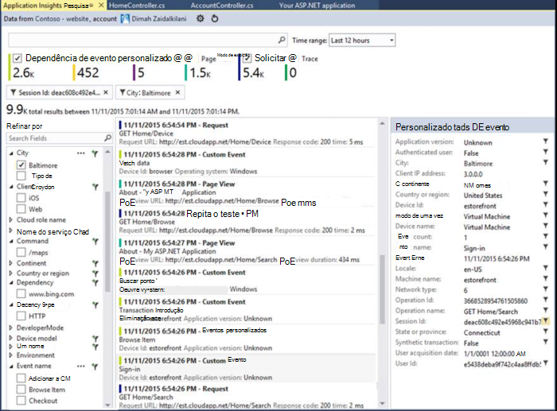

<properties
    pageTitle="Notas de versão para extensão do Visual Studio para análise de desenvolvedor"
    description="As atualizações mais recentes para ferramentas do Visual Studio para análise do desenvolvedor."
    services="application-insights"
    documentationCenter=""
    authors="acearun"
    manager="douge"/>
<tags
    ms.service="application-insights"
    ms.workload="tbd"
    ms.tgt_pltfrm="ibiza"
    ms.devlang="na"
    ms.topic="article"
    ms.date="06/09/2016"
    ms.author="acearun"/>

# Notas de versão para ferramentas de análise de desenvolvedor
O que há de novo: obtenção de informações de aplicativo e HockeyApp a análise no Visual Studio.
## Versão 7.0
### Tendências de ideias de aplicativo do Visual Studio
Ideias de aplicativo do Visual Studio é uma nova ferramenta no Visual Studio que você pode usar para ajudá-lo a analisar o funcionamento do seu aplicativo ao longo do tempo. Para começar, no botão de barra de ferramentas **Ideias de aplicativo** ou na janela de pesquisa de obtenção de informações do aplicativo, escolha **Explorar tendências de telemetria**. Ou, no menu **Exibir** , clique em **Other Windows**e clique em **Tendências de obtenção de informações do aplicativo**. Escolha um dos cinco consultas comuns para começar. Você pode analisar diferentes conjuntos de dados com base em tipos de telemetria, intervalos de tempo e outras propriedades. Para localizar problemas em seus dados, escolha uma das opções de detecção na lista suspensa **Tipo de modo de exibição** . As opções de filtragem na parte inferior da janela facilitam focalizar nas subconjuntos específicos de sua telemetria.

### Exceções em CodeLens
Telemetria de exceção agora é exibida no CodeLens. Se você conectou o seu projeto para o serviço de obtenção de informações do aplicativo, você verá o número de exceções ocorridas em cada método em produção no últimas 24 horas. De CodeLens, você pode saltar a pesquisa ou tendências investigar as exceções mais detalhadamente.

### Suporte principal do ASP.NET
Obtenção de informações de aplicativo agora dá suporte a projetos ASP.NET Core RC2 no Visual Studio. Você pode adicionar aplicativo ideias para novos projetos ASP.NET Core RC2 na caixa de diálogo **Novo projeto** , como a captura de tela a seguir. Ou, você pode adicioná-la a um projeto existente, clique com botão direito do projeto no Solution Explorer e, em seguida, clique em **Adicionar telemetria de obtenção de informações do aplicativo**.

ASP.NET 5 RC1 e projetos ASP.NET Core RC2 também têm o novo suporte na janela ferramentas de diagnóstico. Você verá os eventos de obtenção de informações de aplicativo como solicitações e exceções de seu aplicativo ASP.NET enquanto você depura localmente em seu PC. De cada evento, clique em **Pesquisar** para fazer drill down para obter mais informações.

### HockeyApp para os aplicativos do Windows Universal
Além de comentários de usuário e de distribuição beta, HockeyApp fornece symbolicated falha relatando para os aplicativos do Windows Universal. Tornamos mais fácil de adicionar o SDK HockeyApp: clique com botão direito no seu projeto Universal de Windows e clique em **Aplicativo hóquei sobreativar análise falhar**. Isso instala o SDK, configura o conjunto de falha e provisiona um recurso de HockeyApp na nuvem, tudo sem carregar seu aplicativo para o serviço de HockeyApp.

Outros novos recursos:

* Fizemos a experiência de pesquisa de ideias de aplicativo mais rápida e mais intuitiva. Agora, intervalos de tempo e filtros de detalhe são aplicados automaticamente enquanto você seleciona-los.
* Também na pesquisa de obtenção de informações do aplicativo, agora há uma opção para saltar para o código diretamente de telemetria a solicitação.
* Fizemos melhorias para a experiência de entrada HockeyApp.
* Em ferramentas de diagnóstico, informações de telemetria de produção para exceções são exibidas.

## Versão 5.2
Estamos felizes em anunciar a introdução dos cenários de HockeyApp no Visual Studio. A primeira integração é na distribuição beta de aplicativos do Windows Universal e aplicativos do Windows Forms de dentro do Visual Studio.

Com a distribuição beta, você carregar as versões anteriores de seus aplicativos HockeyApp para distribuição para um subconjunto selecionado de clientes ou testadores. Distribuição beta, combinada com HockeyApp falha usuário e conjunto de recursos de comentários, pode fornecer informações importantes sobre o aplicativo antes de fazer um amplo de lançamento. Você pode usar essas informações para solucionar problemas com seu aplicativo para que você possa evitar ou minimizar problemas futuros, como classificações de aplicativo baixa, feedback negativo e assim por diante.

Check-out como é simples carregar cria para distribuição beta de dentro do Visual Studio.
### Aplicativos do Windows universal
Menu de contexto de um nó de projeto de aplicativo Windows Universal agora inclui uma opção para carregar sua compilação HockeyApp.

Escolha o item e o HockeyApp caixa de diálogo Carregar abre. Você precisará de uma conta de HockeyApp para carregar sua compilação. Se você for um novo usuário, não se preocupe. Criar uma conta é um processo simples.

Quando você está conectado, você verá o formulário de carregamento na caixa de diálogo.

Selecione o conteúdo para carregar (um arquivo de .appxbundle ou .appx) e escolha Opções de lançamento no assistente. Opcionalmente, você pode adicionar notas na próxima página. Escolha **Concluir** para começar a carregar.

Quando o carregamento for concluído, aparece uma notificação de HockeyApp com confirmação e um link para o aplicativo no portal do HockeyApp.

Pronto! Você carregou apenas uma compilação para distribuição beta com apenas alguns cliques.

Você pode gerenciar seu aplicativo de diversas maneiras no portal do HockeyApp. Isso inclui convidando usuários, exibindo relatórios de falha e comentários, alterando detalhes e assim por diante.

Consulte o [HockeyApp Knowledge Base](http://support.hockeyapp.net/kb/app-management-2) para obter mais detalhes sobre o gerenciamento de aplicativo.

### Aplicativos de formulários do Windows
Menu de contexto de um nó de projeto de formulário do Windows agora inclui uma opção para carregar sua compilação HockeyApp.

Isso abre a caixa de diálogo de carregamento de HockeyApp, que é semelhante em um aplicativo Windows Universal.

Observação um novo campo nesse assistente, para especificar a versão do aplicativo. Para aplicativos do Windows Universal, as informações são preenchidas do manifesto. Aplicativos de formulários do Windows, infelizmente, não tem um equivalente a esse recurso. Você precisará especificá-los manualmente.

O restante do fluxo de é semelhante aos aplicativos do Windows Universal: escolha Construir e opções de lançamento, adicione lançamento anotações, carregar e gerenciar no portal do HockeyApp.

É tão simple quanto que. Experimente e fale conosco sua opinião.
## Versão 4.3
### Pesquisa de telemetria de sessões de depuração local
Com esta versão, você pode procurar telemetria de obtenção de informações de aplicativo gerada da sessão de depuração do Visual Studio. Antes, você pode usar a pesquisa somente se você registrou seu aplicativo com ideias de aplicativo. Agora, seu aplicativo só precisa ter o SDK de ideias de aplicativo instalado para pesquisar telemetria local.

Se você tiver um aplicativo ASP.NET com o SDK de obtenção de informações do aplicativo, siga estas etapas para usar a pesquisa.

1. Depure seu aplicativo.
2. Abrir pesquisa de obtenção de informações do aplicativo em uma das seguintes maneiras:
    - No menu **Exibir** , clique em **Other Windows**e clique em **Procurar de obtenção de informações de aplicativos**.
    - Clique no botão de barra de ferramentas de **Obtenção de informações do aplicativo** .
    - No Solution Explorer, expanda **ApplicationInsights.config**e clique em **telemetria de sessão de depuração de pesquisa**.
3. Se você ainda não se inscreveu com ideias de aplicativo, a janela de pesquisa será aberta no modo de telemetria de sessão de depuração.
4. Clique no ícone de **pesquisa** para ver sua telemetria local.

## Versão 4.2
Nesta versão, adicionamos recursos para facilitar a pesquisa de dados mais fácil no contexto de eventos, a capacidade para saltar para o código de mais eventos de dados e uma experiência mais fáceis para enviar seus dados de log de obtenção de informações do aplicativo. Essa extensão é atualizada mensalmente. Se você tiver comentários ou recurso solicitações, enviá-lo para aidevtools@microsoft.com.
### Experiência de não-clique em log
Se você já estiver usando NLog, log4net ou System.Diagnostics.Tracing, você não precisa se preocupar em mover todos seus rastreamentos de obtenção de informações do aplicativo. Nesta versão, nós já integrado adaptadores de log de obtenção de informações do aplicativo com a experiência de configuração normal.
Se você já tiver uma dessas estruturas de log configuradas, a seção a seguir descreve como obtê-lo.
**Se você já adicionou ideias de aplicativo:**
1. Clique com botão direito no nó do projeto e clique em **Ideias de aplicativo**e clique em **Configurar ideias de aplicativo**. Certifique-se de que você verá a opção para adicionar o adaptador correto na janela de configuração.
2. Como alternativa, quando você cria a solução, observe a janela pop-up que aparece no canto superior direito da tela e clique em **Configurar**.

Quando você tiver o adaptador de log instalado, execute o aplicativo e verifique se os dados na guia Ferramentas de diagnóstico, assim:

### Saltar para ou localizar o código onde a propriedade de evento de telemetria é emitida
Com o lançamento de novo usuário pode clicar em qualquer valor em eventos detalhes e isso irá procurar por uma cadeia de caracteres correspondente na solução aberta atual. Resultados aparecerão no Visual Studio "Find Results" lista conforme mostrado abaixo:

### Nova janela de pesquisa para quando você não estiver conectado
Nós já aprimorado a aparência da janela de pesquisa de obtenção de informações do aplicativo para ajudá-lo a pesquisar os dados enquanto o aplicativo está em produção.

### Veja todos os eventos de telemetria associados ao evento
Adicionamos uma nova guia, com consultas predefinidas para todos os dados relacionados ao evento telemetria que o usuário está visualizando, ao lado da guia para obter detalhes do evento. Por exemplo, uma solicitação tem um campo chamado **ID da operação**. Todos os eventos associados a essa solicitação tem o mesmo valor para **ID da operação**. Se uma exceção ocorrer enquanto a operação está processando a solicitação, a exceção é fornecida a mesma identificação de operação que a solicitação para facilitar a localização. Se você estiver procurando por uma solicitação, clique em **todos os telemetria para essa operação** para abrir uma nova guia que exibe os novos resultados de pesquisa.

### Encaminhar e histórico na pesquisa de volta
Agora você pode ir trocadas entre os resultados da pesquisa.

## Versão 4.1
Esta versão vem com um número de novos recursos e atualizações. Você precisa ter Update 1 instalado para instalar esta versão.

### Saltar de uma exceção para método no código-fonte
Agora, se você exibir exceções de seu aplicativo de produção na janela de pesquisa de obtenção de informações do aplicativo, você pode saltar para o método em seu código onde está ocorrendo a exceção. Você só precisa ter o projeto correto carregado e obtenção de informações de aplicativo cuida do resto! (Para saber mais sobre a janela pesquisa de obtenção de informações do aplicativo, consulte as notas de versão 4.0 nas seções a seguir.)

Como ele funciona? Você pode usar a pesquisa de ideias de aplicativos mesmo quando uma solução não estiver aberta. A área de rastreamento de pilha exibe uma mensagem e muitos dos itens no rastreamento da pilha não estão disponíveis.

Se as informações do arquivo estiverem disponíveis, alguns itens podem ser links, mas o item de informações de solução ainda estarão visível.

Se você clicar no hiperlink, você vai saltar para o local do método selecionado em seu código. Pode haver uma diferença no número da versão, mas o recurso, para saltar para a versão correta do código, se torne em versões posteriores.

### Experiência de novos pontos de entrada para a pesquisa no Explorador de solução
Agora você pode acessar pesquisa através de Solution Explorer.

### Exibe uma notificação quando publicar seja concluída
Uma caixa de diálogo pop-up aparece quando o projeto é publicado online, para que você pode exibir seus dados de obtenção de informações do aplicativo de produção.

## Versão 4.0

### Dados de obtenção de informações do aplicativo de pesquisa de dentro do Visual Studio
Como a função de pesquisa no portal de obtenção de informações do aplicativo, agora no Visual Studio você pode filtrar e tipos de eventos, valores de propriedade e texto de pesquisa e, em seguida, inspecionar eventos individuais.

### Ver os dados provenientes de seu computador local em ferramentas de diagnóstico

Você pode exibir seu telemetria, além de outros dados depuração, na página Visual Studio Tools diagnóstico. Somente ASP.NET 4,5 é suportada.

### Adicionar o SDK ao seu projeto sem entrar no Azure

Você não tem mais entrar no Azure para adicionar pacotes de obtenção de informações do aplicativo ao seu projeto, através da caixa de diálogo **Novo projeto** ou no menu de contexto do projeto. Se você entrar, o SDK será instalado e configurado para enviar telemetria portal como antes. Se você não entrar, o SDK será adicionado ao seu projeto e ele gerará telemetria para o hub de diagnóstico. Você pode configurá-lo mais tarde se desejar.

### Suporte a dispositivos

Em *Connect ();* 2015, podemos [anunciado](https://azure.microsoft.com/blog/deep-diagnostics-for-web-apps-with-application-insights/) que nossa experiência móvel do desenvolvedor para dispositivos é HockeyApp. HockeyApp ajuda você a distribuir compilações beta para seu testadores, coletar e analisar todas as falhas de seu aplicativo e coletar comentários diretamente de seus clientes.
HockeyApp é compatível com seu aplicativo em qualquer plataforma você optar por criar, seja iOS, Android, ou Windows ou uma solução entre plataformas como Xamarin, Cordova ou unidade.

Em futuras versões da extensão de obtenção de informações do aplicativo, apresentaremos uma experiência mais integrada entre HockeyApp e Visual Studio. Por agora, você pode começar com HockeyApp simplesmente adicionando a referência de NuGet. Consulte a [documentação](http://support.hockeyapp.net/kb/client-integration-windows-and-windows-phone) para obter mais informações.
