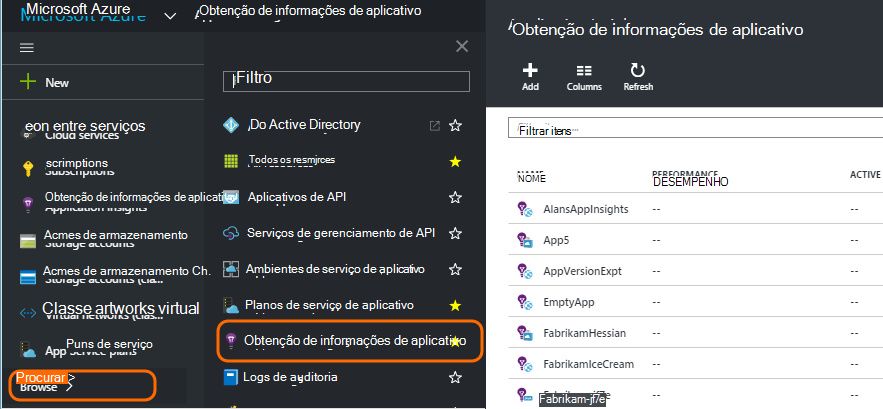
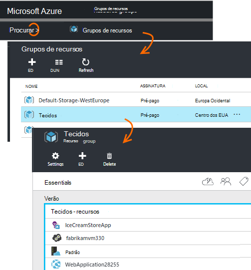
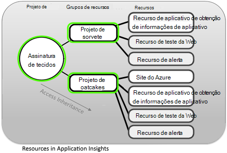
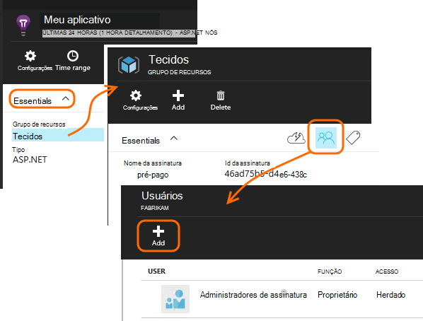
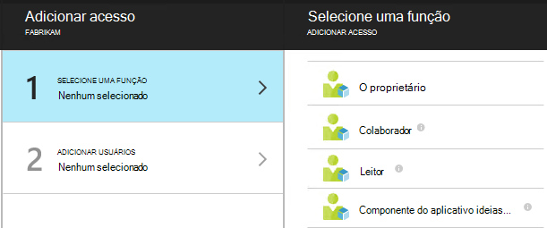
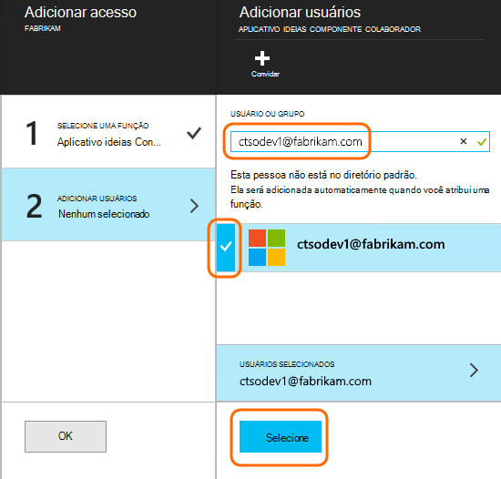

<properties
    pageTitle="Recursos, funções e controle de acesso no aplicativo ideias"
    description="Proprietários, colaboradores e os leitores de obtenção de informações da sua organização."
    services="application-insights"
    documentationCenter=""
    authors="alancameronwills"
    manager="douge"/>

<tags
    ms.service="application-insights"
    ms.workload="tbd"
    ms.tgt_pltfrm="ibiza"
    ms.devlang="na"
    ms.topic="article"
    ms.date="05/07/2016"
    ms.author="awills"/>

# Recursos, funções e controle de acesso no aplicativo ideias

Você pode controlar quem tem de leitura e atualizar o acesso a seus dados no Visual Studio [Ideias de aplicativo][start], usando o [controle de acesso baseado em função no Microsoft Azure](../active-directory/role-based-access-control-configure.md).

> [AZURE.IMPORTANT] Atribua acesso aos usuários no **grupo de recursos ou assinatura** à qual pertence o recurso de aplicativo, não no recurso propriamente dito. Atribua a função **Colaborador do componente de obtenção de informações do aplicativo** . Isso garante uniforme controle de acesso a testes da web e alertas juntamente com o recurso de aplicativo. [Saiba mais](#access).

## Recursos, grupos e assinaturas

Primeiro, algumas definições:

* **Recurso** - uma instância de um serviço do Microsoft Azure. O recurso de obtenção de informações de aplicativo coleta, analisa e exibe os dados de telemetria enviados a partir do seu aplicativo.  Outros tipos de recursos Azure incluem aplicativos web, bancos de dados e VMs.

    Para ver todos os recursos, acesse o [Portal do Azure][portal], entrar e clique em Procurar.

    

* [**Grupo de recursos** ] [ group] -cada recurso pertence a um grupo. Um grupo é uma maneira conveniente para gerenciar recursos relacionados, especialmente para controlar o acesso. Por exemplo, no grupo de um recurso, você pode colocar um aplicativo Web, um recurso de obtenção de informações do aplicativo para monitorar o aplicativo e um recurso de armazenamento para manter os dados exportados.

    

* [**Assinatura**](https://manage.windowsazure.com) - usar ideias de aplicativo ou outros recursos Azure, entrar para uma assinatura do Azure. Cada grupo de recursos pertence a uma assinatura do Azure, onde você escolha seu pacote de preço e, se for uma assinatura de organização, escolha os membros e suas permissões de acesso.
* [**Conta da Microsoft** ] [ account] -o nome de usuário e senha que você usa para entrar no Microsoft Azure assinaturas, XBox Live, Outlook.com e outros serviços da Microsoft.

## Controlar o acesso no grupo de recursos

É importante entender que além do recurso que você criou para seu aplicativo, também existem recursos ocultos separados para alertas e testes da web. Eles são anexados ao mesmo [grupo de recursos](#resource-group) como seu aplicativo. Você também pode ter colocar outros serviços do Azure lá, como sites ou armazenamento.

Para controlar o acesso a esses recursos, portanto, é recomendável:

* Controlar o acesso no nível do **grupo de recursos ou assinatura** .
* Atribua a função **Colaborador do componente de obtenção de informações do aplicativo** aos usuários. Isso permite que eles editem testes da web, alertas e recursos de obtenção de informações do aplicativo, sem fornecer acesso a quaisquer outros serviços no grupo.

## Para fornecer acesso a outro usuário

Você deve ter direitos de proprietário para a assinatura ou o grupo de recursos.

O usuário deve ter uma [Conta da Microsoft][account], ou acesso à sua [Conta organizacional da Microsoft](..\active-directory\sign-up-organization.md). Você pode fornecer acesso para indivíduos e também para grupos de usuários definidos no Active Directory do Azure.

#### Navegue até o grupo de recursos

Adicione o usuário lá.

Ou você pode subir outro nível e adicionar o usuário à assinatura.

#### Selecione uma função

Função | No grupo de recursos
---|---
Proprietário | Pode alterar qualquer item, incluindo o acesso do usuário
Colaborador | Pode editar qualquer item, incluindo todos os recursos
Colaborador de ideias componente de aplicativo | Pode editar recursos de obtenção de informações do aplicativo, testes da web e alertas
Leitor | Pode exibir, mas não alterar nada

'Edição' inclui criar, excluir e atualizando:

* Recursos
* Testes da Web
* Alertas
* Exportar contínuo

#### Selecione o usuário

Se o usuário que você deseja não estiver no diretório, você pode convidar qualquer pessoa com uma conta da Microsoft.
(Se usarem serviços como o Outlook.com, OneDrive, Windows Phone ou XBox Live, eles tem uma conta da Microsoft.)

## Usuários e funções

* [Controle de acesso no Azure baseado em função](../active-directory/role-based-access-control-configure.md)

<!--Link references-->

[account]: https://account.microsoft.com
[group]: ../resource-group-overview.md
[portal]: https://portal.azure.com/
[start]: app-insights-overview.md
