<properties 
    pageTitle="Passo a passo: Monitorar Microsoft Dynamics CRM com ideias de aplicativo" 
    description="Obtenha telemetria do Microsoft Dynamics CRM Online usando o aplicativo ideias. Explicação passo a passo da instalação, obtendo dados, visualização e exportação." 
    services="application-insights" 
    documentationCenter=""
    authors="mazharmicrosoft" 
    manager="douge"/>

<tags 
    ms.service="application-insights" 
    ms.workload="tbd" 
    ms.tgt_pltfrm="ibiza" 
    ms.devlang="na" 
    ms.topic="article" 
    ms.date="11/17/2015" 
    ms.author="awills"/>
 
# Passo a passo: Habilitando telemetria para Microsoft Dynamics CRM Online usando o aplicativo ideias

Este artigo mostra como obter dados de telemetria do [Microsoft Dynamics CRM Online](https://www.dynamics.com/) usando [Ideias de aplicativo do Visual Studio](https://azure.microsoft.com/services/application-insights/). Examinaremos o processo completo da adição de script de obtenção de informações do aplicativo para seu aplicativo, capturando dados e visualização de dados.

>[AZURE.NOTE] [Procurar a solução de exemplo](https://dynamicsandappinsights.codeplex.com/).

## Adicionar aplicativo ideias a instância CRM Online nova ou existente 

Para monitorar seu aplicativo, você pode adicionar um SDK de obtenção de informações do aplicativo para o seu aplicativo. O SDK envia telemetria no [portal de obtenção de informações do aplicativo](https://portal.azure.com), onde você pode usar nossas ferramentas de diagnósticos e análise avançada ou exportar os dados para armazenamento.

### Criar um recurso de obtenção de informações de aplicativo no Azure

1. Obter [uma conta do Microsoft Azure](http://azure.com/pricing). 
2. Entre no [portal do Azure](https://portal.azure.com) e adicione um novo recurso de obtenção de informações do aplicativo. Isso é onde seus dados serão processados e exibidos.

    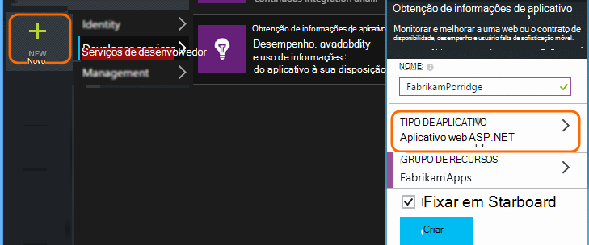

    Escolha ASP.NET como o tipo de aplicativo.

3. Abra a guia de início rápido e abra o script de código.

    

**Mantenha a página de código aberta** enquanto você fazer a próxima etapa em outra janela do navegador. Em breve, você precisará o código. 

### Criar um recurso de web JavaScript no Microsoft Dynamics CRM

1. Abra sua instância CRM Online e faça logon com privilégios de administrador.
2. Abrir o Microsoft Dynamics CRM configurações, personalizações, personalizar o sistema

    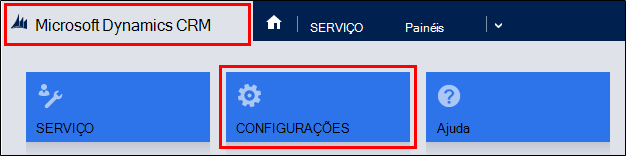
    
    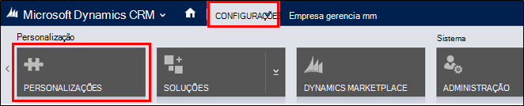

    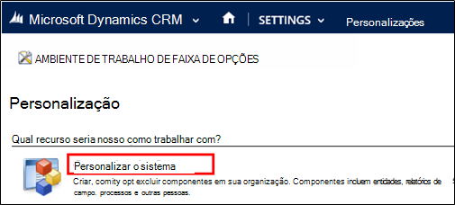

3. Crie um recurso de JavaScript.

    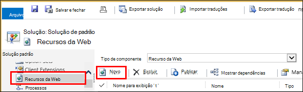

    Dê um nome, selecione **Script (JScript)** e abra o editor de texto.

    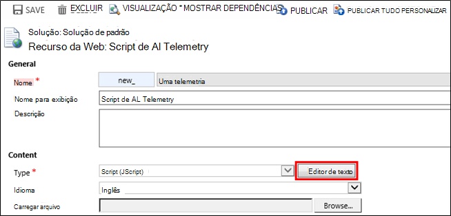
    
4. Copie o código de obtenção de informações do aplicativo. Ao copiar Certifique-se de ignorar marcas de script. Consulte abaixo de captura de tela:

    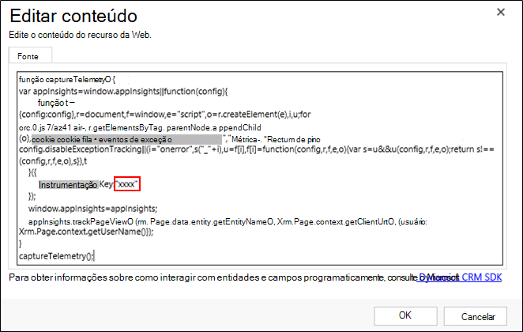

    O código inclui a chave de instrumentação que identifica o recurso de obtenção de informações do aplicativo.

5. Salvar e publicar.

    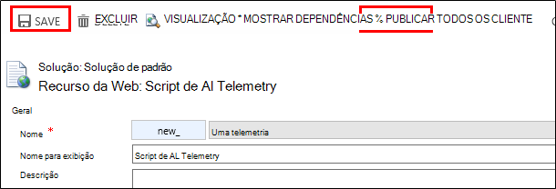

### Formulários de instrumentos

1. No Microsoft CRM Online, abra o formulário de conta

    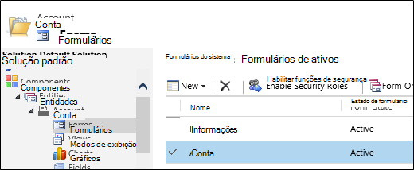

2. Abra o formulário de propriedades

    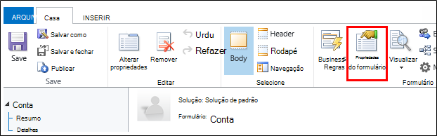

3. Adicionar o recurso da web de JavaScript que você criou

    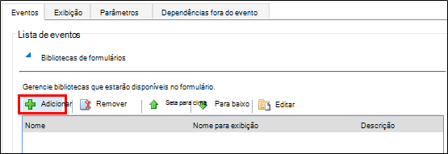

    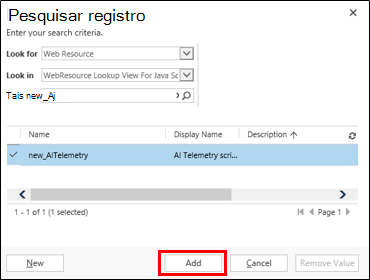

4. Salvar e publicar suas personalizações formulário.

## Métricas capturadas

Agora, você configurou a captura de telemetria do formulário. Sempre que ele é usado, dados serão enviados para o recurso de obtenção de informações do aplicativo.

Aqui estão exemplos dos dados que você verá.

#### Integridade do aplicativo

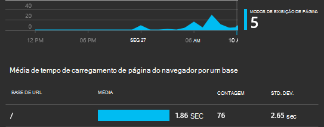

Exceções do navegador:

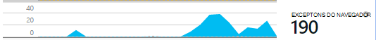

Clique no gráfico para obter mais detalhes:

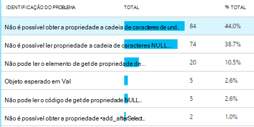

#### Uso

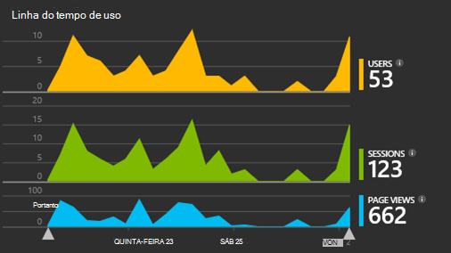

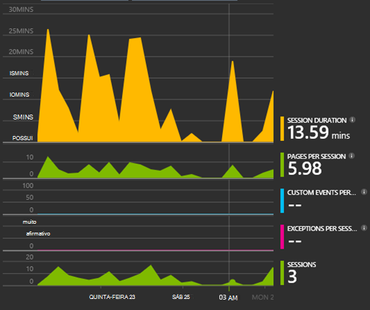

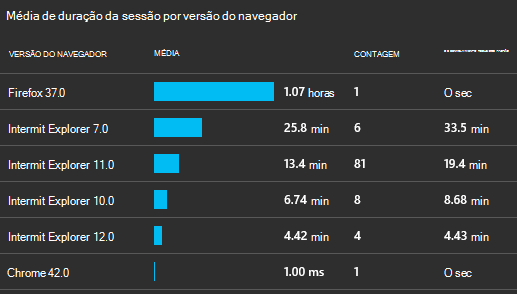

#### Navegadores

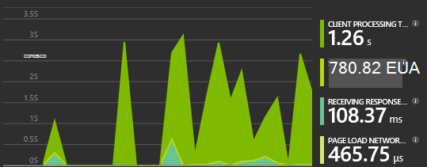

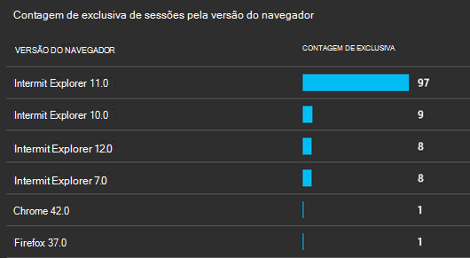

#### Localização geográfica

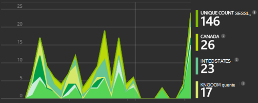

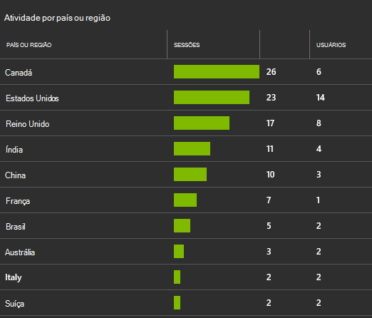

#### Solicitação de modo de exibição de página internas

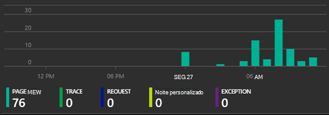

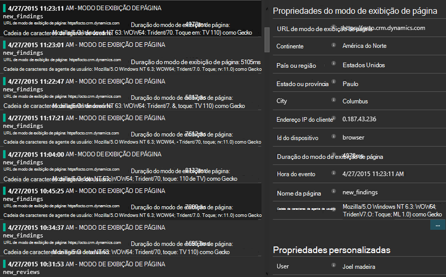

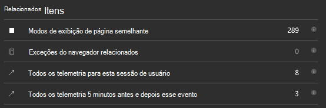

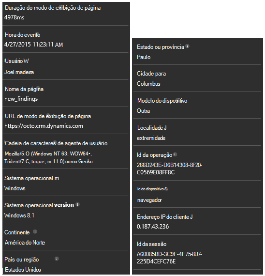

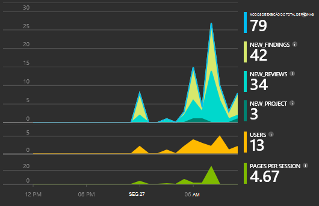

## Código de exemplo

[Procure o código de exemplo](https://dynamicsandappinsights.codeplex.com/).

## Power BI

Você pode fazer uma análise mais profunda mesmo se você [exportar os dados para o Microsoft Power BI](app-insights-export-power-bi.md).

## Solução do exemplo Microsoft Dynamics CRM

[Aqui é a solução de exemplo implementada no Microsoft Dynamics CRM] (https://dynamicsandappinsights.codeplex.com/).

## Saiba Mais

* [O que é a obtenção de informações de aplicativo?](app-insights-overview.md)
* [Obtenção de informações de aplicativo para páginas da web](app-insights-javascript.md)
* [Mais exemplos e instruções passo a passo](app-insights-code-samples.md)

 
