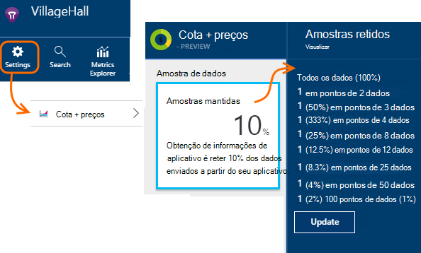

<properties 
    pageTitle="Amostra de telemetria no aplicativo ideias | Microsoft Azure" 
    description="Como manter o volume de telemetria sob controle." 
    services="application-insights" 
    documentationCenter="windows"
    authors="vgorbenko" 
    manager="douge"/>

<tags 
    ms.service="application-insights" 
    ms.workload="tbd" 
    ms.tgt_pltfrm="ibiza" 
    ms.devlang="na" 
    ms.topic="article" 
    ms.date="08/30/2016" 
    ms.author="awills"/>

#  <a name="sampling-in-application-insights"></a>Amostragem na obtenção de informações de aplicativo

*Obtenção de informações de aplicativo está no modo de visualização.*


Amostragem é que um recurso no [Ideias de aplicativo do Visual Studio](app-insights-overview.md) é a maneira recomendada para reduzir o tráfego de telemetria e armazenamento preservando uma análise estatística correta dos dados de aplicativo. O filtro seleciona itens relacionados para que você possa navegar entre os itens quando você estiver fazendo diagnósticos investigações.
Quando contagens métricas são apresentadas no portal do, eles são renormalized para levar em conta a amostragem, para minimizar qualquer efeito sobre as estatísticas.

Amostragem reduz o tráfego, ajuda a manter dentro mensal cotas de dados e ajuda a evitar a otimização.

## <a name="in-brief"></a>Em Resumo:

* Amostragem retém 1 nos registros de *n* e descarta o resto. Por exemplo, ele pode reter eventos de 1 em 5, uma taxa de amostragem de 20%. 
* Amostragem acontece automaticamente se seu aplicativo envia muitas telemetria, nos aplicativos de servidor de web do ASP.NET.
* Você também pode definir amostragem manualmente, seja no portal na página preços; ou no SDK do ASP.NET no arquivo. config, também reduzir o tráfego de rede.
* Se você fizer logon eventos personalizados e você quer certificar-se de que um conjunto de eventos é mantido ou descartado juntos, certifique-se de que eles tenham o mesmo valor de OperationId.
* O divisor de amostragem *n* é relatado em cada registro na propriedade `itemCount`, que na pesquisa aparece sob o nome amigável "contagem de solicitação" ou "contagem de eventos". Quando amostragem não está em operação, `itemCount==1`.
* Se você escrever a análise de consultas, você deve [levar em conta amostragem](app-insights-analytics-tour.md#counting-sampled-data). Em particular, em vez de simplesmente contagem de registros, você deve usar `summarize sum(itemCount)`.


## <a name="types-of-sampling"></a>Tipos de amostragem


Há três métodos de amostragem alternativo:

* **Amostragem adaptativa** ajusta automaticamente o volume de telemetria enviado a partir do SDK em seu aplicativo ASP.NET. Padrão de SDK v 2.0.0-beta3. Disponível atualmente para ASP.NET somente telemetria de servidor. 
* **Taxa de fixo amostragem** reduz o volume de telemetria enviado do seu servidor do ASP.NET e do navegadores dos usuários. Definir a taxa. O cliente e servidor sincronizará seu amostragem portanto, em pesquisa, você pode navegar entre modos de exibição de página relacionada e solicitações.
* **Amostra de inclusão** reduz o volume de telemetria mantido pelo serviço de obtenção de informações do aplicativo, a uma taxa que você definir. Ele não reduzir o tráfego de telemetria, mas ajuda você a manter dentro de sua cota mensal. 

Se adaptável ou fixo amostragem de taxa estiver em operação, amostragem de inclusão é desabilitada.

## <a name="ingestion-sampling"></a>Amostra de inclusão

Essa forma de amostragem opera no ponto onde a telemetria do seu servidor web, navegadores e dispositivos atinge o ponto de extremidade do serviço de obtenção de informações do aplicativo. Embora não reduza o tráfego de telemetria enviado a partir do seu aplicativo, ele reduza a quantidade processada e mantidos (e cobrado por) por obtenção de informações do aplicativo.

Use esse tipo de amostragem se seu aplicativo geralmente fala sobre sua cota mensal e você não tiver a opção de usar qualquer um dos tipos de amostragem baseada no SDK. 

Defina a taxa de amostragem nas cotas e preço blade:



Como outros tipos de amostragem, o algoritmo retém itens de telemetria relacionados. Por exemplo, quando você está verificando a telemetria na pesquisa, você poderá encontrar a solicitação relacionada a uma determinada exceção. Métrica conta como taxa de solicitação e taxa de exceção corretamente são mantidos.

Pontos de dados que são descartados pelo amostragem não estão disponíveis em qualquer recurso de obtenção de informações de aplicativo como [Exportar contínuo](app-insights-export-telemetry.md).

Amostra de inclusão não opera enquanto baseada no SDK adaptativa ou taxa fixa amostragem estiver em operação. Se a taxa de amostragem no SDK for menor que 100%, a taxa de amostragem de inclusão que você definir será ignorada.

> [AZURE.WARNING] O valor mostrado no bloco indica o valor que você definiu para amostragem de inclusão. Ele não representar a taxa de amostragem real se amostragem SDK está em operação.


## <a name="adaptive-sampling-at-your-web-server"></a>Amostragem adaptativa em seu servidor web

Amostragem adaptativa está disponível para o SDK de obtenção de informações de aplicativo para ASP.NET v 2.0.0-beta3 e versões posteriores e é habilitada por padrão. 


Amostragem adaptativa afeta o volume de telemetria enviado de seu aplicativo web do servidor para o serviço de obtenção de informações do aplicativo. O volume será ajustado automaticamente para manter dentro de uma taxa máxima especificada de tráfego.

Ele não operar em baixos volumes de telemetria, portanto um aplicativo na depuração ou um site com baixo uso não será afetado.

Para obter o volume de destino, alguns da telemetria gerada é descartado. Mas como outros tipos de amostragem, o algoritmo retém itens de telemetria relacionados. Por exemplo, quando você está verificando a telemetria na pesquisa, você poderá encontrar a solicitação relacionada a uma determinada exceção. 

Métrica conta como taxa de solicitação e taxa de exceção são ajustados para compensar a taxa de amostragem, para que eles mostrarem aproximadamente os valores corretos no Explorador de métrica.

Pacotes de **atualização NuGet do seu projeto** para a última versão de *pré-lançamento* do aplicativo ideias: clique com botão direito do projeto no Solution Explorer, escolha gerenciar pacotes NuGet, marque **incluir pré-lançamento** e procure Microsoft.ApplicationInsights.Web. 

[ApplicationInsights.config](app-insights-configuration-with-applicationinsights-config.md), você pode ajustar vários parâmetros no `AdaptiveSamplingTelemetryProcessor` nó. Os números mostrados são os valores padrão:

* `<MaxTelemetryItemsPerSecond>5</MaxTelemetryItemsPerSecond>`

    A taxa de destino que o algoritmo adaptativo objetiva **em cada host do servidor**. Se o seu aplicativo web é executado em hosts, reduza esse valor para permanecer dentro de sua taxa de destino de tráfego no portal ideias de aplicativo.

* `<EvaluationInterval>00:00:15</EvaluationInterval>` 

    O intervalo em que a taxa atual de telemetria é avaliada novamente. Avaliação é realizada como uma média móvel. Talvez você queira reduzir esse intervalo se seu telemetria é responsável pelo picos súbitas.

* `<SamplingPercentageDecreaseTimeout>00:02:00</SamplingPercentageDecreaseTimeout>`

    Quando as alterações de valor de porcentagem de amostragem, quanto tempo após são nós permitidos para diminuir a porcentagem de amostragem novamente para capturar menos dados.

* `<SamplingPercentageIncreaseTimeout>00:15:00</SamplingPercentageIncreaseTimeout>`

    Quando as alterações de valor de porcentagem de amostragem, quanto tempo após são nós permitidos para aumentar a porcentagem de amostragem novamente para capturar mais dados.

* `<MinSamplingPercentage>0.1</MinSamplingPercentage>`

    Como porcentagem de amostragem varia, o que é o valor mínimo que nós estão permitidos para definir.

* `<MaxSamplingPercentage>100.0</MaxSamplingPercentage>`

    Como porcentagem de amostragem varia, o que é o valor máximo que nós estão permitidos para definir.

* `<MovingAverageRatio>0.25</MovingAverageRatio>` 

    O cálculo de média móvel, o peso recebe o valor mais recente. Use um valor igual ou menor que 1. Valores menores faça o algoritmo menos reativos às súbita alterações.

* `<InitialSamplingPercentage>100</InitialSamplingPercentage>`

    O valor atribuído quando o aplicativo começou. Não reduza isso durante a depuração. 

### <a name="alternative-configure-adaptive-sampling-in-code"></a>Alternativa: configurar amostragem adaptativa no código

Em vez de ajustar amostragem no arquivo. config, você pode usar o código. Isso permite que você especifique uma função de retorno de chamada invocado sempre que a taxa de amostragem é avaliada novamente. Você pode usar isso, por exemplo, para descobrir quais taxa de amostragem está sendo usada.

Remover o `AdaptiveSamplingTelemetryProcessor` nó do arquivo. config.


*C#*

```C#

    using Microsoft.ApplicationInsights;
    using Microsoft.ApplicationInsights.Extensibility;
    using Microsoft.ApplicationInsights.WindowsServer.Channel.Implementation;
    using Microsoft.ApplicationInsights.WindowsServer.TelemetryChannel;
    ...

    var adaptiveSamplingSettings = new SamplingPercentageEstimatorSettings();

    // Optional: here you can adjust the settings from their defaults.

    var builder = TelemetryConfiguration.Active.TelemetryProcessorChainBuilder;
    
    builder.UseAdaptiveSampling(
         adaptiveSamplingSettings,

        // Callback on rate re-evaluation:
        (double afterSamplingTelemetryItemRatePerSecond,
         double currentSamplingPercentage,
         double newSamplingPercentage,
         bool isSamplingPercentageChanged,
         SamplingPercentageEstimatorSettings s
        ) =>
        {
          if (isSamplingPercentageChanged)
          {
             // Report the sampling rate.
             telemetryClient.TrackMetric("samplingPercentage", newSamplingPercentage);
          }
      });

    // If you have other telemetry processors:
    builder.Use((next) => new AnotherProcessor(next));

    builder.Build();

```

([Saiba mais sobre os processadores de telemetria](app-insights-api-filtering-sampling.md#filtering)).


<a name="other-web-pages"></a>
## <a name="sampling-for-web-pages-with-javascript"></a>Amostragem para páginas da web com JavaScript

Você pode configurar páginas da web para amostragem de taxa fixa de qualquer servidor. 

Quando você [Configurar as páginas da web para obtenção de informações do aplicativo](app-insights-javascript.md), modifique o trecho de código que você obtém a partir do portal de obtenção de informações do aplicativo. (Em aplicativos do ASP.NET, o trecho normalmente vai no cshtml.)  Inserir uma linha como `samplingPercentage: 10,` antes da tecla de instrumentação:

    <script>
    var appInsights= ... 
    }({ 


    // Value must be 100/N where N is an integer.
    // Valid examples: 50, 25, 20, 10, 5, 1, 0.1, ...
    samplingPercentage: 10, 

    instrumentationKey:...
    }); 
    
    window.appInsights=appInsights; 
    appInsights.trackPageView(); 
    </script> 

Para a porcentagem de amostragem, escolha uma porcentagem parecido com aquele 100/N onde N é um número inteiro.  Amostragem atualmente não suporta outros valores.

Se você também habilitar amostragem de taxa fixa no servidor, os clientes e servidor sincronizará para que, em pesquisa, você pode navegar entre modos de exibição de página relacionada e solicitações.


## <a name="fixed-rate-sampling-for-aspnet-web-sites"></a>Taxa fixa amostragem para sites ASP.NET

Taxa fixa amostragem reduz o tráfego enviado do seu servidor web e navegadores da web. Ao contrário de amostragem adaptativa, reduz telemetria a uma taxa fixa decidida por você. Ele também sincroniza o cliente e amostragem de servidor para que itens relacionados sejam mantidos - por exemplo, para que se você examinar um modo de exibição de página na pesquisa, você pode localizar sua solicitação relacionada.

O algoritmo de amostragem retém itens relacionados. Para cada solicitação HTTP evento, ele e seus eventos relacionados são descartados ou transmitidos. 

No Explorador de métricas, taxas como contagens de solicitação e exceção são multiplicadas por um fator para compensar a taxa de amostragem, para que elas fiquem aproximadamente corretas.

1. **Pacotes do NuGet do seu projeto de atualização** para a última versão de *pré-lançamento* de obtenção de informações do aplicativo. Clique com botão direito do projeto no Solution Explorer, escolha gerenciar pacotes NuGet, marque **incluir pré-lançamento** e procure Microsoft.ApplicationInsights.Web. 

2. **Desabilitar amostragem adaptativa**: na [ApplicationInsights.config](app-insights-configuration-with-applicationinsights-config.md), remova ou comente o `AdaptiveSamplingTelemetryProcessor` nó.

    ```xml

    <TelemetryProcessors>
    <!-- Disabled adaptive sampling:
      <Add Type="Microsoft.ApplicationInsights.WindowsServer.TelemetryChannel.AdaptiveSamplingTelemetryProcessor, Microsoft.AI.ServerTelemetryChannel">
        <MaxTelemetryItemsPerSecond>5</MaxTelemetryItemsPerSecond>
      </Add>
    -->
    

    ```

2. **Habilite o módulo de amostragem de taxa fixa.** Adicione este trecho de código a [ApplicationInsights.config](app-insights-configuration-with-applicationinsights-config.md):

    ```XML

    <TelemetryProcessors>
     <Add  Type="Microsoft.ApplicationInsights.WindowsServer.TelemetryChannel.SamplingTelemetryProcessor, Microsoft.AI.ServerTelemetryChannel">

      <!-- Set a percentage close to 100/N where N is an integer. -->
     <!-- E.g. 50 (=100/2), 33.33 (=100/3), 25 (=100/4), 20, 1 (=100/100), 0.1 (=100/1000) -->
      <SamplingPercentage>10</SamplingPercentage>
      </Add>
    </TelemetryProcessors>

    ```

> [AZURE.NOTE] Para a porcentagem de amostragem, escolha uma porcentagem parecido com aquele 100/N onde N é um número inteiro.  Amostragem atualmente não suporta outros valores.


### <a name="alternative-enable-fixed-rate-sampling-in-your-server-code"></a>Alternativa: habilitar amostragem de taxa fixa em seu código de servidor


Em vez de definir o parâmetro de amostragem no arquivo. config, você pode usar o código. 

*C#*

```C#

    using Microsoft.ApplicationInsights.Extensibility;
    using Microsoft.ApplicationInsights.WindowsServer.TelemetryChannel;
    ...

    var builder = TelemetryConfiguration.Active.GetTelemetryProcessorChainBuilder();
    builder.UseSampling(10.0); // percentage

    // If you have other telemetry processors:
    builder.Use((next) => new AnotherProcessor(next));

    builder.Build();

```

([Saiba mais sobre os processadores de telemetria](app-insights-api-filtering-sampling.md#filtering)).


## <a name="when-to-use-sampling"></a>Quando usar amostragem?

Amostragem adaptativa é ativada automaticamente se você usa o SDK do ASP.NET versão 2.0.0-beta3 ou posterior. Não importa qual versão SDK que você usa, você pode usar amostragem de inclusão (no nosso servidor).

Você não precisa amostragem para a maioria dos aplicativos de pequenas e médias. As informações de diagnósticos mais úteis e estatísticas mais precisas são obtidas por coleta de dados em todas as atividades do usuário. 

 
Principais vantagens do amostragem são:

* Aplicativo ideias serviço posicionamentos ("limitações") pontos de dados quando seu aplicativo envia uma muito alta taxa de telemetria resumindo o intervalo de tempo. 
* Para manter dentro a [cota](app-insights-pricing.md) de pontos de dados para sua camada de preços. 
* Para reduzir o tráfego de rede da coleção de telemetria. 

### <a name="which-type-of-sampling-should-i-use"></a>Que tipo de amostragem devo usar?


**Use a inclusão de amostragem se:**

* Percorrer sua cota mensal de telemetria com frequência.
* Você está usando uma versão do SDK que não dá suporte a amostragem - por exemplo, o SDK Java ou ASP.NET versões anteriores ao 2.
* Você está obtendo muitas telemetria de navegadores da web dos usuários.

**Use a taxa fixa amostragem se:**

* Você estiver usando o SDK de obtenção de informações do aplicativo para a versão de serviços web do ASP.NET 2.0.0 ou posterior, e
* Você quer amostragem sincronizados entre o cliente e servidor, para que, quando você estiver investigar eventos na [pesquisa](app-insights-diagnostic-search.md), você pode navegar entre os eventos relacionados no cliente e servidor, como modos de exibição de página e solicitações http.
* Certeza da porcentagem de amostragem apropriado para o aplicativo. Ele deve ser alto o suficiente para obter métricas precisas, mas abaixo a taxa que excede sua cota de preços e os limites de otimização. 


**Use amostragem adaptativa:**

Caso contrário, é recomendável amostragem adaptativa. Isso é ativado por padrão no servidor ASP.NET SDK, versão 2.0.0-beta3 ou posterior. Ele não reduzir o tráfego até uma determinada taxa mínima, para que ele não afeta a um site de baixo uso.


## <a name="how-do-i-know-whether-sampling-is-in-operation"></a>Como saber se amostragem está em operação?

Para descobrir a taxa de amostragem real independentemente de onde ela foi aplicada, use uma [consulta de análise](app-insights-analytics.md) como esta:

    requests | where timestamp > ago(1d)
  	| summarize 100/avg(itemCount) by bin(timestamp, 1h) 
  	| render areachart 

Em cada mantidos registro, `itemCount` indica o número de registros originais que ele representa, igual a 1 + o número de registros descartados anterior. 


## <a name="how-does-sampling-work"></a>Como funciona a amostragem?

Taxa fixa e amostragem adaptativa são um recurso do SDK em versões do ASP.NET do 2.0.0 em diante. Amostragem de inclusão é um recurso do serviço do aplicativo ideias e pode ser em operação, se o SDK não está executando amostragem. 

O algoritmo de amostragem decide quais itens de telemetria descartar e quais deseja manter (se ele está no SDK ou no serviço de obtenção de informações de aplicativo). A decisão de amostragem baseia-se em várias regras objetivo de preservar todos os pontos de dados inter-relacionados intacta, mantendo uma experiência de diagnóstico no aplicativo ideias acionáveis e confiável mesmo com um conjunto de dados reduzido. Por exemplo, se uma falha na solicitação de seu aplicativo envia itens de telemetria adicional (como exceção e rastreamentos conectados a partir dessa solicitação), amostragem não dividirá essa solicitação e outra telemetria. Ele mantém ou descarta todos juntos. Como resultado, quando você examinar os detalhes da solicitação de obtenção de informações do aplicativo, você sempre pode ver a solicitação junto com seus itens de telemetria associado. 

Para aplicativos que definem "usuário" (ou seja, aplicativos web mais típicos), a decisão de amostragem baseia-se no hash da id de usuário, o que significa que todos os telemetria para qualquer usuário específico é preservada ou descartada. Para os tipos de aplicativos que não definem usuários (como serviços web) a decisão de amostragem baseia-se na id da operação da solicitação. Por fim, para os itens de telemetria nem com identificação de usuário nem operação definida (por exemplo, itens telemetria relatados de threads assíncronas com nenhum contexto http) amostragem simplesmente captura uma porcentagem de itens de telemetria de cada tipo. 

Ao apresentar telemetria para você, o serviço de aplicativo ideias ajusta as métricas a mesma porcentagem de amostragem que foi usado no momento da coleção, para compensar os pontos de dados ausentes. Portanto, ao observar a telemetria no aplicativo ideias, os usuários estão vendo aproximações estatística corretas que estejam muito próximos números reais.

A precisão da aproximação depende na porcentagem de amostragem configurado. Além disso, a precisão aumenta para aplicativos que controlam um grande volume de geralmente semelhantes solicitações de muitos usuários. Por outro lado, para aplicativos que não funcionam com uma carga significativa, amostragem não é necessário como esses aplicativos geralmente podem enviar todas as sua telemetria enquanto continuam dentro a cota, sem causar perda de dados de otimização. 

Observe que a obtenção de informações de aplicativo não exemplos de tipos de telemetria métricas e sessões, desde para esses tipos, redução na precisão de pode ser altamente indesejável. 

### <a name="adaptive-sampling"></a>Amostragem adaptativa

Amostragem adaptativa adiciona um componente que monitora a taxa de transmissão do SDK atual e ajusta a porcentagem de amostragem para tentar ficar dentro a taxa máxima de destino. O ajuste é recalculado em intervalos regulares e baseia-se em uma média móvel da taxa de transmissão de saída.

## <a name="sampling-and-the-javascript-sdk"></a>Amostragem e o SDK do JavaScript

Lado do cliente (JavaScript) SDK participa amostragem de taxa fixa em conjunto com o SDK do lado do servidor. As páginas disponíveis somente enviará telemetria do lado do cliente dos mesmos usuários para o qual o servidor feita sua decisão de "exemplo em". Essa lógica foi projetada para manter a integridade de sessão de usuário em cliente-servidor-lados e. Como resultado, de qualquer item de telemetria específico em obtenção de informações do aplicativo, você pode encontrar todos os outros itens de telemetria para esse usuário ou sessão. 

*Meu cliente e servidor telemetria não mostram amostras coordenadas conforme descrito acima.*

* Verificar se você ativado taxa fixa amostragem tanto no cliente e servidor.
* Verifique se a versão do SDK é 2.0 ou acima.
* Verifique se você definiu a mesma porcentagem de amostragem no cliente e servidor.


## <a name="frequently-asked-questions"></a>Perguntas frequentes 

*Por que não está amostragem um simples "coletar X % de cada tipo de telemetria"?*

 *  Embora essa abordagem de amostragem poderia fornecer com uma precisão muito alta no aproximações métricas, seria interromper a capacidade de correlação diagnósticos dados por usuário, sessão e solicitação, que é essencial para diagnóstico. Portanto, a amostragem funciona melhor com "coletar todos telemetria itens para X porcentagem de usuários do aplicativo" ou "coletar todos telemetria para X % das solicitações de aplicativo" lógica. Para os itens de telemetria não associados as solicitações (como processamento assíncrono do plano de fundo), outono volta é "coletar X % de todos os itens para cada tipo de telemetria." 

*A porcentagem de amostragem pode mudar ao longo do tempo?*

 * Sim, amostragem adaptativa muda gradualmente a porcentagem de amostragem, com base no volume atualmente observado da telemetria.

 

*Se usar o amostragem de taxa fixa, como saber quais amostragem porcentagem funcionarão o melhor para o meu aplicativo?*

* Uma maneira é começar com adaptativa amostragem, descobrir quais classificar-liquida (consulte a pergunta acima) e alterne para taxa fixa amostragem usando essa taxa. 

    Caso contrário, você precisa descobrir. Analisar seu uso atual de telemetria no AI, observar qualquer limitação que está ocorrendo e estimar o volume de telemetria a coletados. Essas três entradas, junto com o seu nível de preço selecionado, sugiram quanto você talvez queira reduzir o volume de telemetria a coletados. No entanto, um aumento no número de usuários ou alguns outro shift do volume de telemetria pode invalidar sua estimativa.

*O que acontece se eu configurar porcentagem de amostragem muito baixa?*

* Porcentagem de amostragem excessiva baixa (over-aggressive amostragem) reduz a precisão do aproximações, quando o aplicativo ideias tenta compensar a visualização de dados para a redução de volume de dados. Além disso, experiência de diagnóstico pode ser negativamente afetada, como algumas das solicitações raramente falhas ou lentas podem ser reduzidas check-out.

*O que acontece se eu configurar porcentagem de amostragem muito alta?*

* Configurando a porcentagem de amostragem muito alto (não rigorosas suficiente) resulta em uma redução insuficiente do volume de telemetria a coletados. Você ainda pode enfrentar relacionada a otimização de perda de dados de telemetria e o custo do uso de obtenção de informações de aplicativo pode ser maior do que você planejado devido a encargos excedente.

*Em quais plataformas pode usar amostragem?*

* Amostra de inclusão pode ocorrer automaticamente para qualquer telemetria acima de um determinado volume, se o SDK não está executando amostragem. Isso funcionaria, por exemplo, se seu aplicativo usa um servidor Java, ou se você estiver usando uma versão mais antiga do SDK do ASP.NET.

* Se você estiver usando versões do SDK do ASP.NET 2.0.0 e acima (hospedado no Azure ou em seu próprio servidor), você recebe adaptativa amostragem por padrão, mas você pode alternar para taxa fixa, conforme descrito acima. Com amostragem de taxa fixa, o SDK do navegador sincroniza automaticamente a amostra de eventos relacionados. 

*Há determinados eventos raros sempre que desejo ver. Como posso obtê-las após o módulo de amostragem?*

 * Inicialize uma instância separada do TelemetryClient com um novo TelemetryConfiguration (não padrão ativo). Use para enviar seus eventos raros.


## <a name="next-steps"></a>Próximas etapas

* [A filtragem](app-insights-api-filtering-sampling.md) pode fornecer mais controle estrito dos quais envia o SDK.
