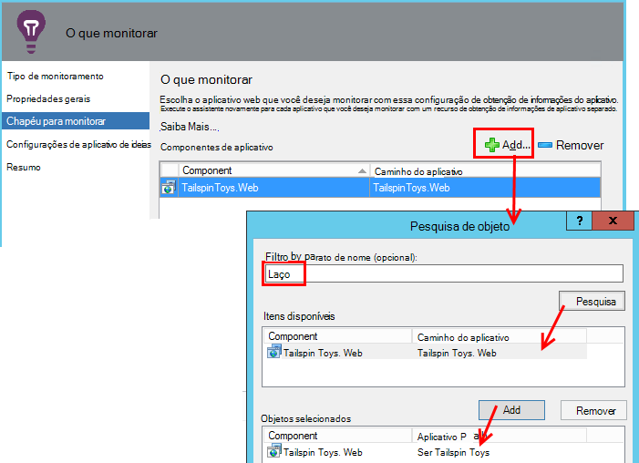

<properties 
    pageTitle="Integração do SCOM com ideias de aplicativo | Microsoft Azure" 
    description="Se você for um usuário SCOM, monitorar o desempenho e diagnosticar problemas com a obtenção de informações do aplicativo. Painéis abrangentes, alertas inteligentes, poderosas ferramentas de diagnóstico e consultas de análise." 
    services="application-insights" 
    documentationCenter=""
    authors="alancameronwills" 
    manager="douge"/>

<tags 
    ms.service="application-insights" 
    ms.workload="tbd" 
    ms.tgt_pltfrm="ibiza" 
    ms.devlang="na" 
    ms.topic="article" 
    ms.date="08/12/2016" 
    ms.author="awills"/>
 
# Monitoramento de desempenho de aplicativo usando o aplicativo ideias para SCOM

Se você usa o System Center Operations Manager (SCOM) para gerenciar seus servidores, você pode monitorar o desempenho e diagnosticar problemas de desempenho com a Ajuda de [Ideias de aplicativo do Visual Studio](app-insights-asp-net.md). Obtenção de informações de aplicativo monitora solicitações de entrada do seu aplicativo web, REST e chamadas SQL, exceções e rastreamentos de log de saída. Ele fornece painéis com métricos gráficos e alertas inteligentes, bem como eficientes de pesquisa de diagnóstico e consultas analíticas sobre este telemetria. 

Você pode alternar em monitoramento de obtenção de informações de aplicativo usando um pacote de gerenciamento do SCOM.

## Antes de começar

Vamos supor:

* Você está familiarizado com SCOM e que você usa o SCOM 2012 R2 ou 2016 para gerenciar o IIS servidores web.
* Você já tiver instalado nos seus servidores de um aplicativo web que você deseja monitorar com ideias de aplicativo.
* Versão de estrutura de aplicativo é .NET 4,5 ou posterior.
* Você tem acesso a uma assinatura do [Microsoft Azure](https://azure.com) e entrar no [portal do Azure](https://portal.azure.com). Sua organização pode ter uma assinatura e pode adicionar sua conta da Microsoft a ele.

(A equipe de desenvolvimento pode criar o [SDK de obtenção de informações do aplicativo](app-insights-asp-net.md) para o aplicativo web. Essa instrumentação de tempo de compilação dá a eles maior flexibilidade na escrita telemetria personalizada. No entanto, não importa: você pode seguir as etapas descritas aqui, com ou sem o SDK integrado.)

## (Uma vez) Instale o pacote de gerenciamento de obtenção de informações de aplicativo

No computador onde você executa Operations Manager:

2. Desinstale qualquer versão antiga do pacote de gerenciamento:
 1. No Operations Manager, abra a administração, os pacotes de gerenciamento. 
 2. Exclua a versão antiga.
1. Baixe e instale o pacote de gerenciamento do catálogo.
2. Reinicie o Operations Manager.

## Criar um pacote de gerenciamento

1. No Operations Manager, abrir **criação**, **.NET … com ideias de aplicativo**, **Adicionar Assistente de monitoramento**e escolha novamente **.NET … com ideias de aplicativo**.

    

2. Nomeie a configuração após seu aplicativo. (Você precisa instrumentar um aplicativo por vez.)
    
    

3. Na mesma página do assistente, criar um novo pacote de gerenciamento, ou selecione um pacote que você criou anteriormente para obtenção de informações do aplicativo.

     (O [pacote de gerenciamento](https://technet.microsoft.com/library/cc974491.aspx) do ideias de aplicativo é um modelo, do qual você cria uma instância. Você pode reutilizar a mesma instância posteriormente.)

    

4. Escolha um aplicativo que você deseja monitorar. O recurso de pesquisa pesquisa entre aplicativos instalados nos seus servidores.

    

    O campo de escopo de monitoramento opcional pode ser usado para especificar um subconjunto dos seus servidores, se você não quiser monitorar o aplicativo em todos os servidores.

5. Na próxima página do assistente, primeiro você deve fornecer suas credenciais para entrar no Microsoft Azure.

    Nesta página, você escolher o recurso de obtenção de informações de aplicativo onde deseja que os dados de telemetria a serem analisados e exibidos. 

 * Se o aplicativo foi configurado para obtenção de informações de aplicativo durante o desenvolvimento, selecione seu recurso existente.
 * Caso contrário, crie um novo recurso chamado para o aplicativo. Se houver outros aplicativos que são componentes do mesmo sistema, colocá-los no mesmo grupo de recursos, façam acesso a telemetria mais fácil de gerenciar.

    Você pode alterar essas configurações mais tarde.

    

6. Conclua o assistente.

    
    
Repita esse procedimento para cada aplicativo que você deseja monitorar.

Se você precisar alterar configurações mais tarde, abra novamente as propriedades do monitor da janela de criação.

## Verifique se o monitoramento

O monitor que você instalou procura seu aplicativo em cada servidor. Onde encontrar o aplicativo, ele configura o Monitor de Status de ideias de aplicativo para monitorar o aplicativo. Se necessário, ele primeiro instala o Monitor de Status no servidor.

Você pode verificar quais instâncias do aplicativo encontrado:

## Modo de exibição de telemetria em ideias de aplicativo

No [portal do Azure](https://portal.azure.com), navegue até o recurso para o aplicativo. Você [ver gráficos mostrando telemetria](app-insights-dashboards.md) de seu aplicativo. (Se ela ainda não aparecer para cima na página principal ainda, clique em fluxo de métricas ao vivo.)

## Próximas etapas

* [Configurar um painel](app-insights-dashboards.md) para reunir os gráficos mais importantes monitoramento esse e outros aplicativos.
* [Saiba mais sobre métricas](app-insights-metrics-explorer.md)
* [Configurar alertas](app-insights-alerts.md)
* [Diagnosticar problemas de desempenho](app-insights-detect-triage-diagnose.md)
* [Análise avançada de consultas](app-insights-analytics.md)
* [Testes de web de disponibilidade](app-insights-monitor-web-app-availability.md)
