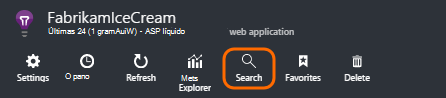
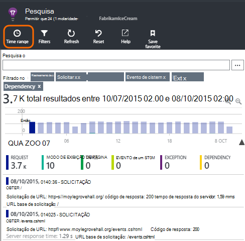
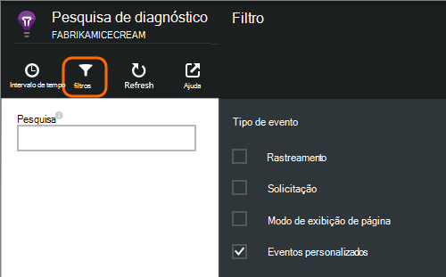
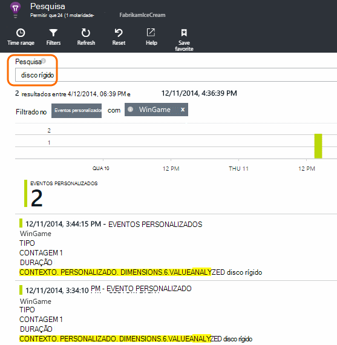
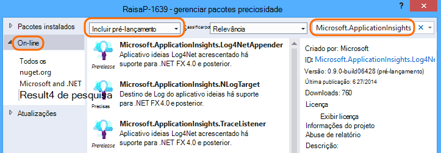
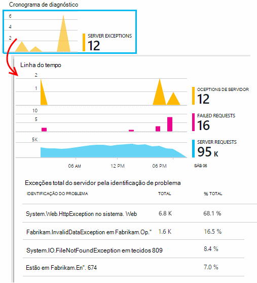
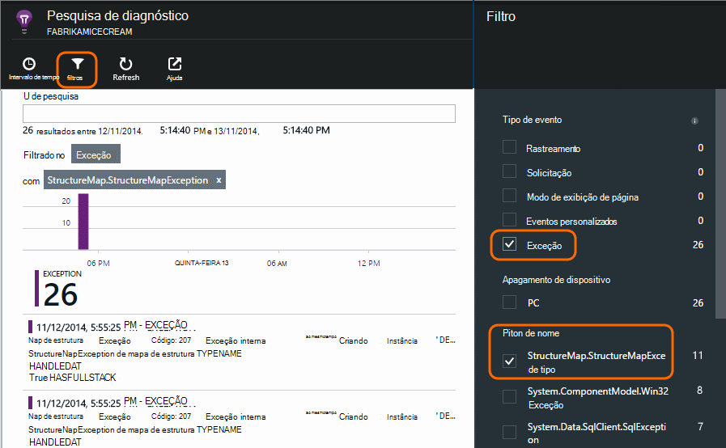

<properties 
    pageTitle="Logs, exceções e diagnósticos personalizados do ASP.NET em ideias de aplicativo" 
    description="Diagnosticar problemas nos aplicativos web do ASP.NET pesquisando solicitações, exceções e logs gerados com rastreamento, NLog ou Log4Net." 
    services="application-insights" 
    documentationCenter=""
    authors="alancameronwills" 
    manager="douge"/>

<tags 
    ms.service="application-insights" 
    ms.workload="tbd" 
    ms.tgt_pltfrm="ibiza" 
    ms.devlang="na" 
    ms.topic="article" 
    ms.date="04/08/2016" 
    ms.author="awills"/>
 
# Logs, exceções e diagnósticos personalizados do ASP.NET em ideias de aplicativo

[Obtenção de informações de aplicativo] [ start] inclui uma poderosa [Diagnóstico de pesquisa] [ diagnostic] ferramenta que permite explorar e analisar para telemetria enviada pelo SDK de obtenção de informações do aplicativo de seu aplicativo. Muitos eventos como modos de exibição de página de usuário são enviados automaticamente pelo SDK.

Você também pode escrever código para enviar eventos personalizados, relatórios de exceção e rastreamentos. E se você já usar uma estrutura de log como log4J, log4net, NLog ou System.Diagnostics.Trace, você pode capturar esses logs e incluí-los na pesquisa. Isso facilita a correlação rastreamentos de log com ações do usuário, exceções e outros eventos.

## Antes de escrever telemetria personalizada

Se você ainda não o fez [Configure a obtenção de informações de aplicativo para o seu projeto][start], faça isso agora.

Quando você executar o aplicativo, ele envia alguns telemetria que aparecerá na pesquisa de diagnóstico, incluindo solicitações recebidas pelo servidor, página exibições conectadas no cliente e não capturada exceções.

Abrir pesquisa de diagnóstico para ver a telemetria que o SDK envia automaticamente.

Variam os detalhes do tipo de um aplicativo para outro. Você pode clicar por meio de qualquer evento individual para obter mais detalhes.

## Amostragem 

Se seu aplicativo envia muitos dados e você estiver usando o SDK do aplicativo ideias para ASP.NET versão 2.0.0-beta3 ou posterior, o recurso de amostragem adaptativa pode operar e enviar apenas uma porcentagem do seu telemetria. [Saiba mais sobre amostragem.](app-insights-sampling.md)

##Eventos personalizados

Eventos personalizados aparecem ambos na [Pesquisa diagnóstico] [ diagnostic] e no [Explorador de métrica][metrics]. Você pode enviá-los de dispositivos, páginas da web e aplicativos do servidor. Eles podem ser usados para fins de diagnóstico e entender os [padrões de uso][track].

Um evento personalizado tem um nome e também pode conter propriedades que você pode filtrar, juntamente com as medidas numéricas.

JavaScript no cliente

    appInsights.trackEvent("WinGame",
         // String properties:
         {Game: currentGame.name, Difficulty: currentGame.difficulty},
         // Numeric measurements:
         {Score: currentGame.score, Opponents: currentGame.opponentCount}
         );

C# no servidor

    // Set up some properties:
    var properties = new Dictionary <string, string> 
       {{"game", currentGame.Name}, {"difficulty", currentGame.Difficulty}};
    var measurements = new Dictionary <string, double>
       {{"Score", currentGame.Score}, {"Opponents", currentGame.OpponentCount}};

    // Send the event:
    telemetry.TrackEvent("WinGame", properties, measurements);

VB no servidor

    ' Set up some properties:
    Dim properties = New Dictionary (Of String, String)
    properties.Add("game", currentGame.Name)
    properties.Add("difficulty", currentGame.Difficulty)

    Dim measurements = New Dictionary (Of String, Double)
    measurements.Add("Score", currentGame.Score)
    measurements.Add("Opponents", currentGame.OpponentCount)

    ' Send the event:
    telemetry.TrackEvent("WinGame", properties, measurements)

### Execute o aplicativo e exibir os resultados.

Abrir pesquisa de diagnóstico.

Selecione o evento personalizado e selecione um nome de evento específico.

Filtre os dados mais por meio de um termo de pesquisa em um valor de propriedade.  

Analise eventos individuais para ver suas propriedades detalhadas.

##Modos de exibição de página

Telemetria do modo de exibição de página é enviada pela chamada trackPageView() no [trecho de JavaScript que você insere em suas páginas da web][usage]. Sua finalidade principal é contribuir com as contagens de exibições de página que você vê na página Visão geral.

Geralmente ele é chamado uma vez em cada página HTML, mas você pode inserir mais chamadas - por exemplo, se você tiver um aplicativo de página única e deseja efetuar uma nova página sempre que o usuário obtém mais dados.

    appInsights.trackPageView(pageSegmentName, "http://fabrikam.com/page.htm"); 

Às vezes, é útil anexar propriedades que você pode usar como filtros na pesquisa de diagnóstico:

    appInsights.trackPageView(pageSegmentName, "http://fabrikam.com/page.htm",
     {Game: currentGame.name, Difficulty: currentGame.difficulty});

##Telemetria de rastreamento

Rastreamento telemetria é o código que você inserir especificamente para criar logs de diagnóstico. 

Por exemplo, você poderia inserir chamadas assim:

    var telemetry = new Microsoft.ApplicationInsights.TelemetryClient();
    telemetry.TrackTrace("Slow response - database01");

####  Instalar um adaptador para sua estrutura de log

Você também pode pesquisar logs gerados com uma estrutura de log - log4Net, NLog ou System.Diagnostics.Trace. 

1. Se você planeja usar log4Net ou NLog, instale-o no seu projeto. 
2. No Solution Explorer, clique com botão direito seu projeto e escolha **Gerenciar pacotes do NuGet**.
3. Selecionar Online > todas, selecione **Incluir pré-lançamento** e procure por "Microsoft.ApplicationInsights"

    

4. Selecione o pacote apropriado - um destes:
  + Microsoft.ApplicationInsights.TraceListener (para capturar System.Diagnostics.Trace chamadas)
  + Microsoft.ApplicationInsights.NLogTarget
  + Microsoft.ApplicationInsights.Log4NetAppender

O pacote NuGet instala os módulos necessários e também modifica Web. config ou App.

#### Inserir chamadas de log de diagnóstico

Se você usar System.Diagnostics.Trace, uma chamada típica seria:

    System.Diagnostics.Trace.TraceWarning("Slow response - database01");

Se você preferir log4net ou NLog:

    logger.Warn("Slow response - database01");

Execute o aplicativo no modo de depuração ou implantá-lo.

Você verá as mensagens de diagnóstico de pesquisa quando você seleciona o filtro de rastreamento.

### Exceções

Obtendo relatórios de exceção no aplicativo ideias fornece uma experiência muito poderosa, principalmente porque você pode navegar entre as solicitações de falhas e as exceções e leia a pilha de exceção.

Em alguns casos, você precisa [inserir algumas linhas de código] [ exceptions] para certificar-se de que suas exceções estão sendo capturadas automaticamente.

Você também pode escrever código explícito para enviar telemetria de exceção:

JavaScript

    try 
    { ...
    }
    catch (ex)
    {
      appInsights.TrackException(ex, "handler loc",
        {Game: currentGame.Name, 
         State: currentGame.State.ToString()});
    }

C#

    var telemetry = new TelemetryClient();
    ...
    try 
    { ...
    }
    catch (Exception ex)
    {
       // Set up some properties:
       var properties = new Dictionary <string, string> 
         {{"Game", currentGame.Name}};

       var measurements = new Dictionary <string, double>
         {{"Users", currentGame.Users.Count}};

       // Send the exception telemetry:
       telemetry.TrackException(ex, properties, measurements);
    }

VB

    Dim telemetry = New TelemetryClient
    ...
    Try
      ...
    Catch ex as Exception
      ' Set up some properties:
      Dim properties = New Dictionary (Of String, String)
      properties.Add("Game", currentGame.Name)

      Dim measurements = New Dictionary (Of String, Double)
      measurements.Add("Users", currentGame.Users.Count)
  
      ' Send the exception telemetry:
      telemetry.TrackException(ex, properties, measurements)
    End Try

Os parâmetros de propriedades e as medidas são opcionais, mas são úteis para filtragem e adicionar informações extras. Por exemplo, se você tiver um aplicativo que pode executar diversos jogos, você pode encontrar todos os relatórios de exceção relacionados a um determinado jogo. Você pode adicionar quantos itens você gostaria de cada dicionário.

#### Exibindo exceções

Você verá um resumo das exceções relatados na lâmina visão geral e poderão ser clicadas para ver mais detalhes. Por exemplo:

[]

Clique em qualquer tipo de exceção para ver ocorrências específicas:

[]

Você também pode abrir o diagnóstico de pesquisa diretamente, filtrar em exceções e escolha o tipo de exceção que você deseja ver.

### Exceções sem tratamento de relatório

Relatórios de ideias aplicativos exceções não tratadas onde ele pode, de dispositivos, [navegadores da web][usage], ou servidores web se instrumentos pelo [Status Monitor] [ redfield] ou [Aplicativo ideias SDK][greenbrown]. 

No entanto, nem sempre é possível fazer isso em alguns casos, porque o .NET framework captura as exceções.  Para garantir que você veja todas as exceções, portanto é necessário escrever um manipulador de exceção pequenas. O procedimento melhor varia com a tecnologia. Consulte [telemetria de exceção para ASP.NET] [ exceptions] para obter detalhes. 

### Correlação com uma compilação

Quando você lê os logs de diagnóstico, é provável que seu código-fonte terá sido alterado desde que o código ativo foi implantado.

Portanto, é útil colocar informações de compilação, como a URL da versão atual, em uma propriedade juntamente com cada exceção ou rastreamento. 

Em vez de adicionar a propriedade separadamente para cada chamada de exceção, você pode definir as informações no contexto padrão. 

    // Telemetry initializer class
    public class MyTelemetryInitializer : ITelemetryInitializer
    {
        public void Initialize (ITelemetry telemetry)
        {
            telemetry.Properties["AppVersion"] = "v2.1";
        }
    }

No inicializador app como Global.asax.cs:

    protected void Application_Start()
    {
        // ...
        TelemetryConfiguration.Active.TelemetryInitializers
        .Add(new MyTelemetryInitializer());
    }

###Solicitações do servidor da Web

Solicitar telemetria é enviada automaticamente quando você [instalar o Monitor de Status no seu servidor web][redfield], ou quando você [Adicionar a obtenção de informações de aplicativo ao projeto web][greenbrown]. Ele também alimenta os gráficos de tempo de solicitação e resposta no Explorador de métrica e na página Visão geral.

Se você deseja enviar eventos adicionais, você pode usar a API TrackRequest().

## P & r

### Eu recebo um erro "chave de instrumentação não pode ser vazio"

Parece que você instalou o pacote de Nuget de adaptador de registro em log sem instalar o aplicativo ideias.

No Solution Explorer, clique com botão direito `ApplicationInsights.config` e escolha a **Obtenção de informações de aplicativo de atualização**. Você receberá uma caixa de diálogo convidando para entrar no Azure e crie um recurso de obtenção de informações do aplicativo, ou reutilize um existente. Que deve corrigi-lo.

### A quantidade de dados é mantido?

Até 500 eventos por segundo de cada aplicativo. Eventos são mantidos por sete dias.

### Alguns dos Meus eventos ou rastreamentos não são exibidos

Se seu aplicativo envia muitos dados e você estiver usando o SDK do aplicativo ideias para ASP.NET versão 2.0.0-beta3 ou posterior, o recurso de amostragem adaptativa pode operar e enviar apenas uma porcentagem do seu telemetria. [Saiba mais sobre amostragem.](app-insights-sampling.md)

## Próximas etapas

* [Configurar a disponibilidade e testes de capacidade de resposta][availability]
* [Solução de problemas][qna]

<!--Link references-->

[availability]: app-insights-monitor-web-app-availability.md
[diagnostic]: app-insights-diagnostic-search.md
[exceptions]: app-insights-asp-net-exceptions.md
[greenbrown]: app-insights-asp-net.md
[metrics]: app-insights-metrics-explorer.md
[qna]: app-insights-troubleshoot-faq.md
[redfield]: app-insights-monitor-performance-live-website-now.md
[start]: app-insights-overview.md
[track]: app-insights-api-custom-events-metrics.md
[usage]: app-insights-web-track-usage.md

 
