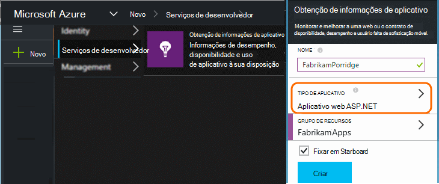
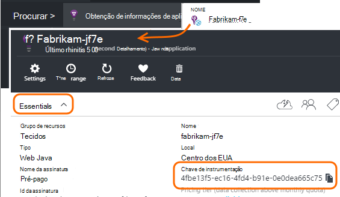

<properties 
    pageTitle="Recursos de obtenção de informações de aplicativo separados para desenvolvimento, teste e produção" 
    description="Monitorar o desempenho e o uso de seu aplicativo em diferentes estágios de desenvolvimento" 
    services="application-insights" 
    documentationCenter=""
    authors="alancameronwills" 
    manager="douge"/>

<tags 
    ms.service="application-insights" 
    ms.workload="tbd" 
    ms.tgt_pltfrm="ibiza" 
    ms.devlang="na" 
    ms.topic="article" 
    ms.date="05/04/2016" 
    ms.author="awills"/>

# Separar recursos de obtenção de informações de aplicativo

Deve a telemetria de componentes e diferentes versões do seu aplicativo ser enviada aos recursos de obtenção de informações de aplicativo diferentes ou combinada em um? Este artigo aborda na melhor práticas e as técnicas necessárias.

Primeiro, vamos entender a pergunta. Os dados recebidos do seu aplicativo são armazenados e processados pelo aplicativo ideias em um *recurso*do Microsoft Azure. Cada recurso é identificado por uma *chave de instrumentação* (iKey). Em seu aplicativo, a chave é fornecida para o SDK de obtenção de informações do aplicativo para que ele possa enviar os dados coletados para o recurso à direita. A chave pode ser fornecida em código ou em ApplicationInsights.config. Alterando a chave no SDK, você pode direcionar dados para diferentes recursos. 

Em um caso simples, quando você cria o código para um novo aplicativo, você também criar um novo recurso no aplicativo ideias. No Visual Studio, a caixa de diálogo *novo projeto* faz isso para você.

Se for um site de alto volume, ele pode ser implantado em mais de uma instância do servidor.

Em cenários mais complexos, você tem um sistema que consiste em vários componentes - por exemplo, um site da web e um processador de back-end. 

## Quando usar iKeys separada

Aqui estão algumas diretrizes gerais:

* Onde você tem uma unidade de maneira independente de implantação do aplicativo que é executado em um conjunto de servidor instâncias que podem ser dimensionados para cima/baixo independentemente dos outros componentes, e em seguida, você normalmente faria mapear que para um único recurso - ou seja, ele terá uma chave de instrumentação única (iKey).
* Por outro lado, razões para usar iKeys separadas incluem:
 - Ler facilmente métricas separadas em componentes separados.
 - Manter telemetria de volume inferior separada do grande volume, para que a otimização, cotas e amostragem em um fluxo não afetam a outra.
 - Alertas separadas, exportar e configurações de item de trabalho.
 - Afaste [limites](app-insights-pricing.md#limits-summary) como cota de telemetria, a otimização e web testar contagem.
 - Código em desenvolvimento e teste deve enviar para um iKey separado que o carimbo de produção.  

Muitas experiências de portal de obtenção de informações do aplicativo são projetados com estas diretrizes em mente. Por exemplo, os servidores exibir segmentos na instância do servidor, imaginando que telemetria sobre um componente lógico pode vir de várias instâncias de servidor.

## IKey único

Onde você envia telemetria de vários componentes para um único iKey:

* Adicione uma propriedade para todos a telemetria que permite filtrar a identidade do componente e segmento. A ID de função é adicionada automaticamente ao telemetria do instâncias de função de servidor, mas em outros casos que você pode usar um [inicializador de telemetria](app-insights-api-filtering-sampling.md#add-properties) para adicionar a propriedade.
* Atualize o SDK de obtenção de informações do aplicativo em diferentes componentes ao mesmo tempo. Telemetria para um iKey deve originar-se com a mesma versão do SDK.

## IKeys separada

Onde você tem várias iKeys para componentes de aplicativo diferente:

* Crie um [painel](app-insights-dashboards.md) para uma visualização de telemetria a chave do seu aplicativo lógico, combinado dos componentes de aplicativo diferente. Painéis podem ser compartilhados, para que um modo de exibição único sistema lógico possa ser usado por equipes diferentes.
* Organize os [grupos de recursos](app-insights-resources-roles-access-control.md) no nível de equipe. Permissões de acesso são atribuídas pelo grupo de recursos, e eles incluem permissões para configurar alertas. 
* Use [modelos do Gerenciador de recursos do Azure e Powershell](app-insights-powershell.md) para ajudar a gerenciar artefatos como regras de alerta e testes da web.

## IKeys separados para desenvolvimento/teste e produção

Para facilitar a alterar a chave automaticamente quando seu aplicativo é lançado, defina a iKey no código, em vez de no ApplicationInsights.config.

### Chave de instrumentação dinâmica

Defina a chave em um método de inicialização, como global.aspx.cs em um serviço ASP.NET:

*C#*

    protected void Application_Start()
    {
      Microsoft.ApplicationInsights.Extensibility.
        TelemetryConfiguration.Active.InstrumentationKey = 
          // - for example -
          WebConfigurationManager.AppSettings["ikey"];
      ...

Neste exemplo, os ikeys para os recursos diferentes são colocados em diferentes versões do arquivo de configuração da web. Trocar o arquivo de configuração de web - que pode ser feito como parte do script de lançamento - será Troque o recurso de destino.

### Páginas da Web

O iKey também é usado em páginas da web do seu aplicativo, no [script obtido da lâmina do início rápido](app-insights-javascript.md). Em vez de codificação-literalmente no script, gerá-lo do estado do servidor. Por exemplo, em um aplicativo do ASP.NET:

*JavaScript no Razor*

    <script type="text/javascript">
    // Standard Application Insights web page script:
    var appInsights = window.appInsights || function(config){ ...
    // Modify this part:
    }({instrumentationKey:  
      // Generate from server property:
      "@Microsoft.ApplicationInsights.Extensibility.
         TelemetryConfiguration.Active.InstrumentationKey"
    }) // ...

## Criando um recurso de obtenção de informações de aplicativo adicional
  
Se você decidir separar telemetria para componentes de aplicativo diferente ou para diferentes carimbos (teste/desenvolvimento/produção) do mesmo componente, você precisará criar um novo recurso de obtenção de informações do aplicativo.

No [portal.azure.com](https://portal.azure.com), adicione um recurso de obtenção de informações do aplicativo:

* **Tipo de aplicativo** afeta o que você vê na lâmina de visão geral e as propriedades disponíveis no [Explorador de métrica](app-insights-metrics-explorer.md). Se você não vir seu tipo de aplicativo, escolha um dos tipos de web para páginas da web.
* **Grupo de recursos** é uma conveniência para o gerenciamento de propriedades, como [controle de acesso](app-insights-resources-roles-access-control.md). Você pode usar grupos de recursos separados para desenvolvimento, teste e produção.
* **Assinatura** é a sua conta de pagamento no Azure.
* **Local** é onde podemos manter os dados. Atualmente ele não pode ser alterado. 
* **Adicionar ao painel** coloca um bloco de acesso rápido para o recurso em sua página inicial do Azure. 

Criando o recurso leva alguns segundos. Você verá um alerta quando estiver pronto.

(Você pode escrever um [script do PowerShell](app-insights-powershell-script-create-resource.md) para criar um recurso automaticamente.)

## Obtendo a chave de instrumentação

A chave de instrumentação identifica o recurso que você criou. 

Você precisa as teclas de instrumentação de todos os recursos aos quais seu aplicativo enviará dados.

 
