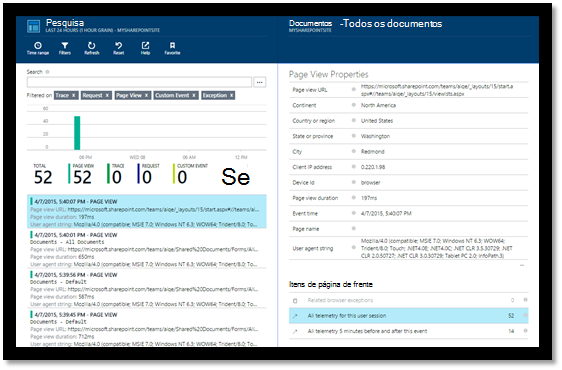

<properties 
    pageTitle="Monitorar um site do SharePoint com ideias de aplicativo" 
    description="Iniciar um novo aplicativo de monitoramento com uma nova chave de instrumentação" 
    services="application-insights" 
    documentationCenter=""
    authors="alancameronwills" 
    manager="douge"/>

<tags 
    ms.service="application-insights" 
    ms.workload="tbd" 
    ms.tgt_pltfrm="ibiza" 
    ms.devlang="na" 
    ms.topic="article" 
    ms.date="03/24/2016" 
    ms.author="awills"/>

# <a name="monitor-a-sharepoint-site-with-application-insights"></a>Monitorar um site do SharePoint com ideias de aplicativo


Obtenção de informações do Visual Studio aplicativo monitora a disponibilidade, o desempenho e o uso de seus aplicativos. Aqui você aprenderá a configurá-la para um site do SharePoint.


## <a name="create-an-application-insights-resource"></a>Criar um recurso de obtenção de informações de aplicativo


No [portal do Azure](https://portal.azure.com), crie um novo recurso de obtenção de informações do aplicativo. Escolha ASP.NET como o tipo de aplicativo.


A lâmina que abre é o lugar onde você verá dados de uso e desempenho sobre seu aplicativo. Para voltar a ele próxima vez que você fazer o login no Azure, você deve encontrar uma peça para ele na tela inicial. Como alternativa, clique em Procurar para localizá-lo.
    


## <a name="add-our-script-to-your-web-pages"></a>Adicionar nosso script para páginas da web

Início rápido, obtenha o script para páginas da web:


Insira o script logo antes do &lt;/cabeçalho&gt; marca de cada página que você deseja controlar. Se seu site tem uma página mestra, você pode colocar o script lá. Por exemplo, em um projeto do ASP.NET MVC, você deve colocar-View\Shared\_Layout.cshtml

O script contém a chave de instrumentação que direciona a telemetria do recurso de obtenção de informações do aplicativo.

### <a name="add-the-code-to-your-site-pages"></a>Adicione o código para suas páginas do site

#### <a name="on-the-master-page"></a>Na página mestra

Se você pode editar a página mestra do site, que fornecerá o monitoramento para cada página no site.

Confira a página mestra e editá-lo usando o SharePoint Designer ou qualquer outro editor.


Adicionar o código logo antes do </head> marca. 


#### <a name="or-on-individual-pages"></a>Ou em páginas individuais

Para monitorar um conjunto limitado de páginas, adicione o script separadamente para cada página. 

Inserir uma web part e o trecho de código de inserção nele.


## <a name="view-data-about-your-app"></a>Exibir dados sobre seu aplicativo

Reimplante seu aplicativo.

Retorne ao seu blade de aplicativo no [portal do Azure](https://portal.azure.com).

Os primeiros eventos aparecerão na pesquisa. 



Se você está esperando mais dados, clique em atualizar após alguns segundos.

Da lâmina visão geral, clique em **análise de uso** para ver gráficos de usuários, sessões e modos de exibição de página:


Clique em qualquer gráfico para ver mais detalhes - por exemplo modos de exibição de página:


Ou usuários:


## <a name="capturing-user-id"></a>Captura de Id de usuário


O trecho de código de página da web padrão não captura a id de usuário do SharePoint, mas isso pode ser feito com uma pequena modificação.


1. Copie chave de instrumentação do seu aplicativo dos Essentials suspenso no aplicativo ideias. 


    

2. Substitua a chave de instrumentação de 'XXXX' no trecho abaixo. 
3. Incorpore o script em seu aplicativo do SharePoint em vez do trecho de código que você obtém a partir do portal.


```


<SharePoint:ScriptLink ID="ScriptLink1" name="SP.js" runat="server" localizable="false" loadafterui="true" /> 
<SharePoint:ScriptLink ID="ScriptLink2" name="SP.UserProfiles.js" runat="server" localizable="false" loadafterui="true" /> 
  
<script type="text/javascript"> 
var personProperties; 
  
// Ensure that the SP.UserProfiles.js file is loaded before the custom code runs. 
SP.SOD.executeOrDelayUntilScriptLoaded(getUserProperties, 'SP.UserProfiles.js'); 
  
function getUserProperties() { 
    // Get the current client context and PeopleManager instance. 
    var clientContext = new SP.ClientContext.get_current(); 
    var peopleManager = new SP.UserProfiles.PeopleManager(clientContext); 
     
    // Get user properties for the target user. 
    // To get the PersonProperties object for the current user, use the 
    // getMyProperties method. 
    
    personProperties = peopleManager.getMyProperties(); 
  
    // Load the PersonProperties object and send the request. 
    clientContext.load(personProperties); 
    clientContext.executeQueryAsync(onRequestSuccess, onRequestFail); 
} 
     
// This function runs if the executeQueryAsync call succeeds. 
function onRequestSuccess() { 
var appInsights=window.appInsights||function(config){
function s(config){t[config]=function(){var i=arguments;t.queue.push(function(){t[config].apply(t,i)})}}var t={config:config},r=document,f=window,e="script",o=r.createElement(e),i,u;for(o.src=config.url||"//az416426.vo.msecnd.net/scripts/a/ai.0.js",r.getElementsByTagName(e)[0].parentNode.appendChild(o),t.cookie=r.cookie,t.queue=[],i=["Event","Exception","Metric","PageView","Trace"];i.length;)s("track"+i.pop());return config.disableExceptionTracking||(i="onerror",s("_"+i),u=f[i],f[i]=function(config,r,f,e,o){var s=u&&u(config,r,f,e,o);return s!==!0&&t["_"+i](config,r,f,e,o),s}),t
    }({
        instrumentationKey:"XXXX"
    });
    window.appInsights=appInsights;
    appInsights.trackPageView(document.title,window.location.href, {User: personProperties.get_displayName()});
} 
  
// This function runs if the executeQueryAsync call fails. 
function onRequestFail(sender, args) { 
} 
</script> 


```


## <a name="next-steps"></a>Próximas etapas

* [Testes da web](app-insights-monitor-web-app-availability.md) para monitorar a disponibilidade de seu site.

* [Obtenção de informações de aplicativo](app-insights-overview.md) para outros tipos de aplicativo.


<!--Link references-->


 