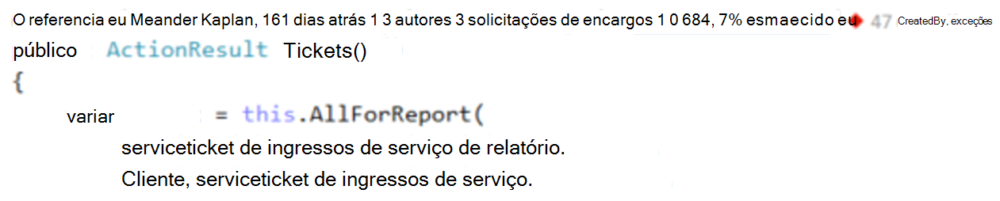
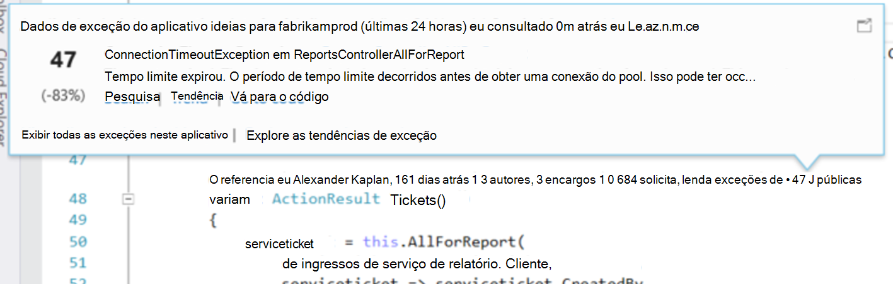
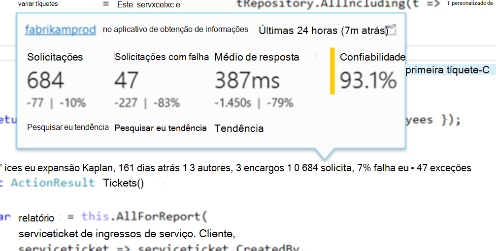
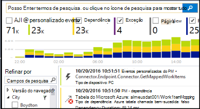

<properties 
    pageTitle="Telemetria de ideias de aplicativo no Visual Studio CodeLens | Microsoft Azure" 
    description="Acesse rapidamente telemetria de solicitação e exceção suas ideias de aplicativo com CodeLens no Visual Studio." 
    services="application-insights" 
    documentationCenter=".net"
    authors="numberbycolors" 
    manager="douge"/>

<tags 
    ms.service="application-insights" 
    ms.workload="tbd" 
    ms.tgt_pltfrm="ibiza" 
    ms.devlang="na" 
    ms.topic="get-started-article" 
    ms.date="08/30/2016" 
    ms.author="daviste"/>
    
# Telemetria de ideias de aplicativo no Visual Studio CodeLens

Métodos no código do seu aplicativo web podem ser anotados com telemetria sobre exceções de tempo de execução e solicitam tempos de resposta. Se você instalar [Ideias de aplicativo do Visual Studio](app-insights-overview.md) em seu aplicativo, a telemetria aparece no Visual Studio [CodeLens](https://msdn.microsoft.com/library/dn269218.aspx) - as anotações na parte superior de cada função onde você está acostumado a ver informações úteis, como o número de casas a função são referenciadas ou última pessoa que editado.

> [AZURE.NOTE] Obtenção de informações de aplicativo no CodeLens está disponível no Visual Studio 2015 atualização 3 e posterior ou com a versão mais recente da [extensão de ferramentas de análise do desenvolvedor](https://visualstudiogallery.msdn.microsoft.com/82367b81-3f97-4de1-bbf1-eaf52ddc635a). CodeLens está disponível nas edições Enterprise e Professional do Visual Studio.

## Onde encontrar dados de obtenção de informações de aplicativo

Procure telemetria de obtenção de informações do aplicativo nos indicadores de CodeLens dos métodos público solicitação do seu aplicativo web. Indicadores de CodeLens são mostradas acima método e outras declarações no código c# e Visual Basic. Se os dados de obtenção de informações de aplicativo estão disponíveis para um método, você verá indicadores para solicitações e exceções como "100 solicitações, falha de 1%" ou "10 exceções." Clique em um indicador de CodeLens para obter mais detalhes. 

> [AZURE.TIP] Solicitação de obtenção de informações de aplicativo e indicadores de exceção podem levar alguns segundos extras para carregar após outros indicadores de CodeLens apareçam.

## Exceções em CodeLens

O indicador de CodeLens de exceção mostra o número de exceções que ocorreram no últimas 24 horas dos 15 ocorrendo com mais frequência exceções em seu aplicativo durante esse período, ao processar a solicitação servida pelo método.

Para ver mais detalhes, clique no indicador de CodeLens de exceções:

* A alteração de percentual no número de exceções a partir das mais recentes 24 horas em relação as 24 horas anteriores
* Escolha **Ir para código** para navegar até o código-fonte da função lançar a exceção
* Escolha **pesquisa** para consultar todas as instâncias dessa exceção que ocorreram no últimas 24 horas
* Escolha **tendência** para exibir uma visualização de tendência ocorrências dessa exceção no últimas 24 horas
* Escolha **Exibir todas as exceções neste aplicativo** para consultar todas as exceções que ocorreram no últimas 24 horas
* Escolha **tendências de exceção explorar** exibir uma visualização de tendência de todas as exceções que ocorreram no últimas 24 horas. 

> [AZURE.TIP] Se você vir "0 exceções" em CodeLens, mas você sabe que deve haver exceções, verifique se que o recurso de obtenção de informações de aplicativo correto está selecionado na CodeLens. Para selecionar outro recurso, clique com botão direito no seu projeto no Solution Explorer e escolha **ideias de aplicativo > escolher a fonte de telemetria**. CodeLens só é exibido para os 15 a maioria das exceções que ocorrem com frequência em seu aplicativo em últimas 24 horas, portanto, se uma exceção é a 16 com mais frequência ou menos, você verá "0 exceções." Exceções dos modos de exibição do ASP.NET podem não aparecer nos métodos controlador que gerou esses modos de exibição.

> [AZURE.TIP] Se você vir "? exceções"em CodeLens, você precisa associar sua conta do Azure com o Visual Studio ou suas credenciais de conta do Microsoft Azure podem ter expirado. Nos dois casos, clique em "? exceções"e escolha **Adicionar uma conta …** para inserir suas credenciais.

## Solicitações no CodeLens

A solicitação CodeLens indicador mostra o número de solicitações HTTP que foram atendidas por um método no últimas 24 horas, além de porcentagem daquelas solicitações que falhou.

Para ver mais detalhes, clique nas solicitações CodeLens indicador:

* As alterações no número de solicitações, solicitações com falha e tempos de resposta médios sobre as últimas 24 horas em comparação com as 24 horas anteriores absoluto e porcentagem
* A confiabilidade do método, calculado como a porcentagem de solicitações que não falhou no últimas 24 horas
* Escolha **pesquisa** solicitações ou falha para consultar todas as solicitações (com falha) que ocorreu no últimas 24 horas
* Escolha **tendência** para exibir uma visualização de tendência para solicitações, solicitações com falha ou tempos de resposta médios em últimas 24 horas.
* Escolha o nome do recurso ideias de aplicativo no canto superior esquerdo do modo de detalhes CodeLens para alterar qual recurso é a fonte de dados de CodeLens.

## Próximas etapas

||
|---|---
|**[Trabalhando com ideias de aplicativo no Visual Studio](app-insights-visual-studio.md)** Pesquisar telemetria, consulte dados em CodeLens e configurar a obtenção de informações do aplicativo. Tudo dentro do Visual Studio. |
|**[Adicionar mais dados](app-insights-asp-net-more.md)** Monitorar uso, disponibilidade, dependências, exceções. Integre rastreamentos de estruturas de log. Escreva telemetria personalizada. | 
|**[Trabalhando com o portal de obtenção de informações de aplicativo](app-insights-dashboards.md)** Painéis, poderosas ferramentas de diagnóstico e analíticas, alertas, um mapa de dependência ao vivo de seu aplicativo e telemetria exportar. |
