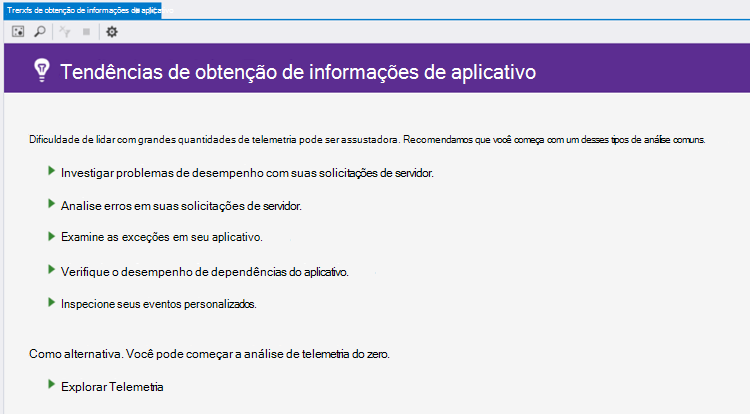
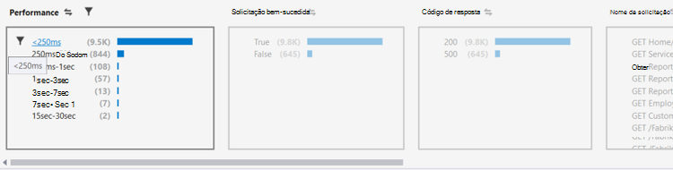
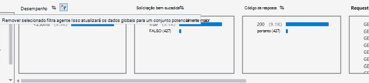
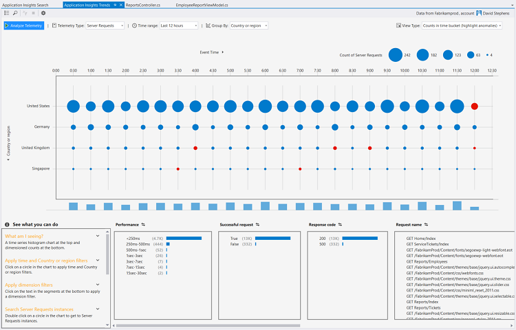
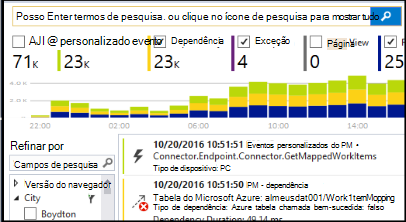

<properties 
    pageTitle="Analisar tendências no Visual Studio | Microsoft Azure" 
    description="Analisar, visualizar e explorar tendências de telemetria suas ideias de aplicativo no Visual Studio." 
    services="application-insights" 
    documentationCenter=".net"
    authors="numberbycolors" 
    manager="douge"/>

<tags 
    ms.service="application-insights" 
    ms.workload="tbd" 
    ms.tgt_pltfrm="ibiza" 
    ms.devlang="na" 
    ms.topic="get-started-article" 
    ms.date="10/25/2016" 
    ms.author="daviste"/>
    
# Analisar tendências no Visual Studio

A ferramenta de tendências de ideias de aplicativo visualiza como eventos de telemetria importantes do seu aplicativo alteram ao longo do tempo, ajudando você a identificar rapidamente problemas e problemas. Vinculando você informações de diagnóstico mais detalhadas, tendências podem ajudá-lo a melhorar o desempenho do seu aplicativo, rastrear as causas de exceções e descobrir ideias de seus eventos personalizados.

> [AZURE.NOTE] Tendências de ideias de aplicativo está disponível no Visual Studio 2015 atualização 3 e posterior ou com a versão de [extensão de ferramentas de análise de desenvolvedor](https://visualstudiogallery.msdn.microsoft.com/82367b81-3f97-4de1-bbf1-eaf52ddc635a) 5.209 e posterior.

## Tendências de ideias de aplicativo aberto

Para abrir a janela de tendências de obtenção de informações do aplicativo:

* Com o botão de barra de ferramentas de obtenção de informações do aplicativo, escolha **Explorar tendências de telemetria**, ou
* No menu de contexto do projeto, escolha **ideias de aplicativo > tendências de telemetria explorar**, ou
* Na barra de menu do Visual Studio, escolha **Exibir > Other Windows > tendências de ideias de aplicativo**.

Você verá um aviso para selecionar um recurso. Clique em **Selecionar um recurso**, entre com uma assinatura do Azure e escolha um recurso de obtenção de informações do aplicativo na lista para a qual você gostaria de analisar tendências de telemetria.

## Escolha uma análise de tendência

Comece escolhendo uma das cinco análises tendência comum, cada analisando dados de últimas 24 horas:

* **Investigar problemas de desempenho com suas solicitações de servidor** - solicitações feitas ao serviço, agrupados por tempos de resposta
* **Erros de análise em suas solicitações de servidor** - solicitações feitas ao serviço, agrupados por código de resposta HTTP
* **Examine as exceções em seu aplicativo** - exceções do seu serviço, agrupados por tipo de exceção
* **Verifique o desempenho de dependências do aplicativo** - serviços chamados pelo seu serviço, agrupados por tempos de resposta
* **Inspecionar seus eventos personalizados** - eventos personalizados que você configurou para o serviço, agrupados por tipo de evento.

Essas análises pré-criados estão disponíveis posterior do botão **Exibir tipos comuns de análise de telemetria** no canto superior esquerdo da janela de tendências.

## Visualize tendências em seu aplicativo

Tendências de ideias de aplicativo cria uma visualização de série de tempo de telemetria do seu aplicativo. Cada visualização de série de tempo exibe um tipo de telemetria, agrupado por uma propriedade de que telemetria, pelo alguns intervalo de tempo. Por exemplo, talvez você queira exibir as solicitações de servidor, agrupadas por país que eles originaram, sobre as últimas 24 horas. Neste exemplo, cada bolha na visualização seria representam uma contagem de solicitações do servidor para alguns país/região durante uma hora.

Use os controles na parte superior da janela para ajustar a quais tipos de telemetria que você vê. Primeiro, escolha os tipos de telemetria no qual você está interessado:

* **Tipo de telemetria** - solicitações de servidor, exceções, depdendencies ou eventos personalizados
* **Intervalo de tempo** - em qualquer lugar dos últimos 30 minutos para últimos 3 dias
* **Agrupar por** - exceção tipo, identificação do problema, país/região e muito mais.

Em seguida, clique em **Analisar telemetria** para executar a consulta.

Para navegar entre bolhas na visualização:

* Clique para selecionar um balão, que atualiza os filtros na parte inferior da janela, resumir apenas os eventos que ocorreram durante um período de tempo específico
* Clique duas vezes em um balão para navegar até a ferramenta de pesquisa e ver todos os eventos de telemetria individuais que ocorreram durante esse período de tempo
* Um balão de CTRL-clique para selecioná-la eliminação na visualização.

> [AZURE.TIP] As tendências e pesquisar ferramentas trabalham juntos para ajudá-lo a identificar as causas de problemas no seu serviço entre milhares de eventos de telemetria. Por exemplo, se uma tarde seus clientes observe seu aplicativo estiver sendo responde menos, começar com as tendências. Analise solicitações feitas ao seu serviço nas últimas várias horas, agrupados por tempo de resposta. Ver se há um cluster incomum grande de solicitações lentas. Em seguida, clique duas vezes nesse bolha para ir para a ferramenta de pesquisa, filtrada para os eventos de solicitação. Da pesquisa, você poderá explorar o conteúdo dessas solicitações e navegue até o código envolvido resolver o problema.

## Filtro

Descubra mais específicas tendências com os controles de filtro na parte inferior da janela. Para aplicar um filtro, clique em seu nome. Você pode alternar rapidamente entre filtros diferentes para descobrir tendências que podem ser ocultando em uma determinada dimensão da sua telemetria. Se você aplicar um filtro em uma dimensão, como o tipo de exceção, filtros em outras dimensões permanecem clicáveis, mesmo que elas apareçam acinzentada. Para desmarcar-aplicar um filtro, clique nele novamente. Clique com a tecla CTRL para selecionar vários filtros na mesma dimensão.

O que acontece se você quiser aplicar vários filtros? 

1. Aplica o primeiro filtro. 
2. Clique no botão **Aplicar filtros selecionados e consulta novamente** pelo nome da dimensão da seu primeiro filtro. Isto irá consultar novamente seu telemetria somente os eventos que correspondem o primeiro filtro. 
3. Aplica um segundo filtro. 
4. Repita o processo para localizar as tendências em subconjuntos específicos de sua telemetria. Por exemplo, solicitações de servidor chamado "GET Home/índice" _e_ que veio Alemanha _e_ que recebeu um código de 500 resposta. 

Para desmarcar-aplicar um desses filtros, clique no botão **Remover filtros selecionados e consulta novamente** para a dimensão.

## Localizar problemas

A ferramenta de tendências pode realçar bolhas de eventos anômalos comparada a outras bolhas na mesma série temporal. Na lista suspensa tipo de exibição, escolha **contagens no tempo Balde (realce anomalias)** ou **porcentagens no momento Balde (realce anomalias)**. Vermelhas bolhas são anômalos. Problemas são definidos como bolhas com contagens/porcentagens ultrapassando 2.1 vezes o desvio padrão das contagens/porcentagens que ocorreu no passado dois períodos (48 horas se você estiver exibindo as últimas 24 horas, etc.).

> [AZURE.TIP] Realce anomalias é especialmente útil para localizar destaques na série de tempo de bolhas pequenas que podem parecer caso contrário, da mesma forma dimensionada.  

## Próximas etapas

||
|---|---
|**[Trabalhando com ideias de aplicativo no Visual Studio](app-insights-visual-studio.md)** Pesquisar telemetria, consulte dados em CodeLens e configurar a obtenção de informações do aplicativo. Tudo dentro do Visual Studio. |
|**[Adicionar mais dados](app-insights-asp-net-more.md)** Monitorar uso, disponibilidade, dependências, exceções. Integre rastreamentos de estruturas de log. Escreva telemetria personalizada. | 
|**[Trabalhando com o portal de obtenção de informações de aplicativo](app-insights-dashboards.md)** Painéis, poderosas ferramentas de diagnóstico e analíticas, alertas, um mapa de dependência ao vivo de seu aplicativo e telemetria exportar. |
