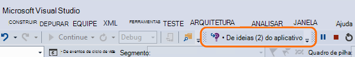
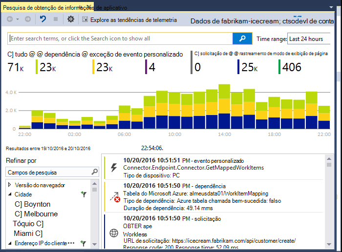
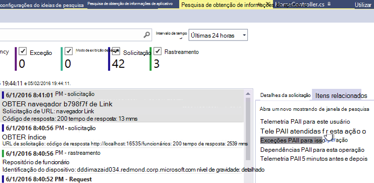
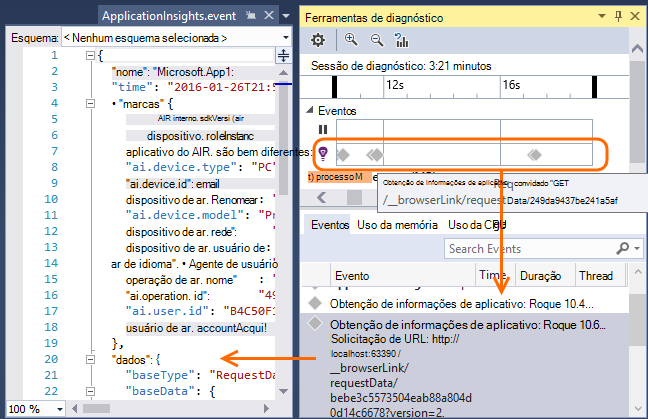
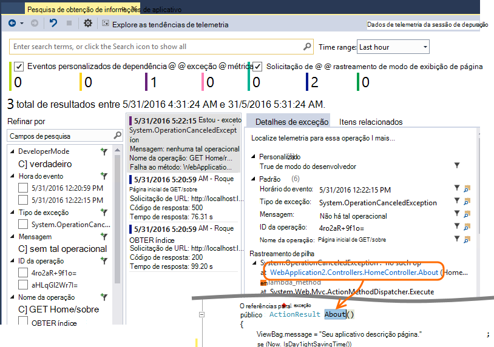
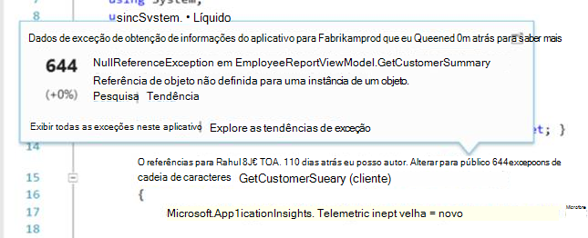
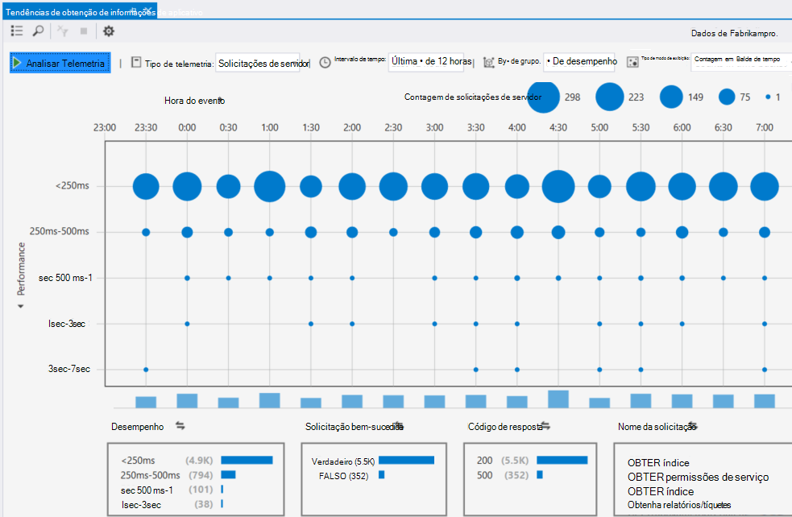
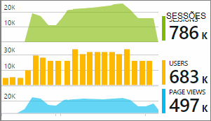

<properties 
    pageTitle="Trabalhando com ideias de aplicativo no Visual Studio" 
    description="Análise de desempenho e diagnóstico durante a depuração e em produção." 
    services="application-insights" 
    documentationCenter=".net"
    authors="alancameronwills" 
    manager="douge"/>

<tags 
    ms.service="application-insights" 
    ms.workload="tbd" 
    ms.tgt_pltfrm="ibiza" 
    ms.devlang="na" 
    ms.topic="get-started-article" 
    ms.date="06/21/2016" 
    ms.author="awills"/>

# Trabalhando com ideias de aplicativo no Visual Studio

No Visual Studio (2015 e posterior), você pode analisar o desempenho e diagnosticar problemas na depuração e em produção, usando telemetria de [Ideias de aplicativo do Visual Studio](app-insights-overview.md).

Se você ainda [Ideias de aplicativos instalados em seu aplicativo](app-insights-asp-net.md), faça isso agora.

## Depurar seu projeto

Executar o aplicativo com F5 e testá-la: abrir páginas diferentes para gerar algumas telemetria.

No Visual Studio, você verá uma contagem dos eventos que fez.

Clique neste botão para abrir a pesquisa de diagnóstico. 

## Pesquisa de diagnóstico

A janela de pesquisa mostra eventos que fez. (Se você entrou no Azure ao configurar o aplicativo ideias, você poderá pesquisar os mesmos eventos no portal.)

A pesquisa de texto livre funciona em todos os campos nos eventos. Por exemplo, procure por parte da URL de uma página; ou o valor de uma propriedade como cidade do cliente; ou palavras específicas em um log de rastreamento.

Clique em qualquer evento para ver suas propriedades detalhadas.

Você também pode abrir a guia itens relacionados para ajudar a diagnosticar solicitações com falha ou exceções.

## Hub de diagnóstico

O Hub de diagnóstico (no Visual Studio 2015 ou posterior) mostra a telemetria de servidor de obtenção de informações do aplicativo, como ele é gerado. Isso funciona mesmo se você tiver optado somente para instalar o SDK, sem conectá-lo a um recurso no portal do Azure.

## Exceções

Se você tiver [Configurar exceção monitoramento](app-insights-asp-net-exceptions.md), relatórios de exceção mostrará na janela Pesquisar. 

Clique em uma exceção para obter um rastreamento de pilha. Se o código do aplicativo for aberto no Visual Studio, você pode clicar em por meio do rastreamento da pilha para a linha relevante do código.

Além disso, na linha Lente de código acima de cada método, você verá uma contagem das exceções conectado por aplicativo ideias o h de 24 passado.

## Monitoramento de local

(A partir do Visual Studio 2015 atualização 2) Se você ainda não configurou o SDK para enviar telemetria para o portal de obtenção de informações de aplicativo (de forma que não há nenhuma chave de instrumentação no ApplicationInsights.config) a janela de diagnóstico exibirá Telemetria da sua sessão de depuração mais recentes. 

Isso é desejável se você já tiver publicado uma versão anterior do aplicativo. Você não deseja a telemetria de sua sessões de depuração para ser misturadas com a telemetria no portal de obtenção de informações de aplicativo do aplicativo publicado.

Também é útil se você tiver alguns [telemetria personalizada](app-insights-api-custom-events-metrics.md) que você deseja depurar antes de enviar telemetria portal.

* *Primeiro, eu totalmente configurado ideias de aplicativo para enviar telemetria portal. Mas agora eu gostaria de ver a telemetria apenas no Visual Studio.*

 * Em configurações da janela de pesquisa, há uma opção para pesquisar diagnóstico local mesmo se seu aplicativo envia telemetria portal.
 * Para parar de telemetria está sendo enviada para o portal, comente a linha `<instrumentationkey>...` de ApplicationInsights.config. Quando você estiver pronto para enviar telemetria portal novamente, Tire comentários-lo.

## Tendências

Tendências é uma ferramenta para visualizar como seu aplicativo se comporta ao longo do tempo. 

Escolha **Explorar tendências de telemetria** do botão da barra de ferramentas de obtenção de informações do aplicativo ou janela de pesquisa de obtenção de informações do aplicativo. Escolha um dos cinco consultas comuns para começar. Você pode analisar diferentes conjuntos de dados com base em tipos de telemetria, intervalos de tempo e outras propriedades. 

Para localizar problemas em seus dados, escolha uma das opções de detecção na lista suspensa "Tipo de modo de exibição". As opções de filtragem na parte inferior da janela facilitam focalizar nas subconjuntos específicos de sua telemetria.

[Saiba mais sobre as tendências](app-insights-visual-studio-trends.md).

## O que vem a seguir?

||
|---|---
|**[Adicionar mais dados](app-insights-asp-net-more.md)** Monitorar uso, disponibilidade, dependências, exceções. Integre rastreamentos de estruturas de log. Escreva telemetria personalizada. | 
|**[Trabalhando com o portal de obtenção de informações de aplicativo](app-insights-dashboards.md)** Painéis, poderosas ferramentas de diagnóstico e analíticas, alertas, um mapa de dependência ao vivo de seu aplicativo e telemetria exportar. |

 
