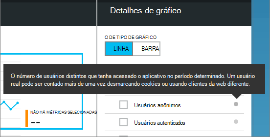

<properties 
    pageTitle="Monitorar a saúde de seu aplicativo e o uso com ideias de aplicativo" 
    description="Introdução ao aplicativo ideias. Analise uso, disponibilidade e desempenho de seu local ou aplicativos do Microsoft Azure." 
    services="application-insights" 
    documentationCenter=""
    authors="alancameronwills" 
    manager="douge"/>

<tags 
    ms.service="application-insights" 
    ms.workload="tbd" 
    ms.tgt_pltfrm="ibiza" 
    ms.devlang="na" 
    ms.topic="article" 
    ms.date="11/25/2015" 
    ms.author="awills"/>
 
# Monitorar o desempenho em aplicativos da web

*Obtenção de informações de aplicativo está no modo de visualização.*

Certificar-se de que seu aplicativo está executando bem e descobrir rapidamente sobre qualquer falhas. [Obtenção de informações de aplicativo] [ start] será informar você sobre quaisquer problemas de desempenho e exceções e ajudá-lo a encontrar e diagnosticar as causas.

Obtenção de informações de aplicativo pode monitorar serviços e aplicativos da web Java e ASP.NET, serviços WCF. Eles podem ser hospedado no local, em máquinas virtuais ou sites do Microsoft Azure. 

No lado do cliente, obtenção de informações de aplicativo pode levar telemetria de páginas da web e uma ampla variedade de dispositivos, incluindo iOS, Android e Windows Store apps.

## Configurar o monitoramento do desempenho

Se você ainda não adicionou ideias de aplicativo ao seu projeto (ou seja, se ele não tiver ApplicationInsights.config), escolha uma das seguintes maneiras para começar:

* [Aplicativos web do ASP.NET](app-insights-asp-net.md)
 * [Adicionar exceção monitoramento](app-insights-asp-net-exceptions.md)
 * [Adicionar o monitoramento de dependência](app-insights-monitor-performance-live-website-now.md)
* [J2EE web apps](app-insights-java-get-started.md)
 * [Adicionar o monitoramento de dependência](app-insights-java-agent.md)

## Explorando métricas de desempenho

No [portal do Azure](https://portal.azure.com), navegue para o recurso de obtenção de informações do aplicativo que você deseja configurar para o seu aplicativo. A lâmina de visão geral mostra dados de desempenho básico:

Clique em qualquer gráfico para ver mais detalhes e para ver os resultados por um período maior. Por exemplo, clique no bloco de solicitações e selecione um intervalo de tempo:

Clique em um gráfico para escolher quais métricas ela exibe, ou adicionar um novo gráfico e selecione seu métricas:

> [AZURE.NOTE] **Desmarque todas as métricas** para ver a seleção inteira que está disponível. As métricas recaem em grupos; Quando qualquer membro de um grupo é selecionado, aparecem apenas os outros membros do grupo.

## O que significa-todos? Blocos de desempenho e relatórios

Não há uma variedade de métricas de desempenho, que você pode obter. Vamos começar com aqueles que aparecem por padrão na lâmina aplicativo.

### Solicitações

O número de solicitações HTTP recebidas em um período especificado. Compare isso com os resultados em outros relatórios para ver como o seu aplicativo se comporta como a carga varia.

As solicitações HTTP incluem todas as solicitações GET ou POST para páginas, dados e imagens.

Clique no bloco para obter contagens de URLs específicas.

### Tempo médio de resposta

Avalia o tempo entre uma solicitação da web inserindo o seu aplicativo e a resposta sendo retornada.

Os pontos de mostram média de uma móvel. Se houver muitas solicitações, pode haver alguns que desviem da média sem um pico óbvio ou ficarem no gráfico.

Procure por picos incomuns. Em geral, espere tempo de resposta a subir com um aumento nas solicitações. Se o aumento desproporcional, seu aplicativo pode ser atingir o limite de um recurso como CPU ou a capacidade de um serviço que ele usa.

Clique no bloco para obter horas para URLs específicas.

### Solicitações de mais lentas

Mostra quais solicitações pode ser necessário o ajuste de desempenho.

### Solicitações com falha

Uma contagem de solicitações que emitiu exceções não detectadas.

Clique no bloco para ver os detalhes de falhas específicas e selecione uma solicitação individual para ver seus detalhes. 

Apenas uma amostra representante de falhas é mantida para inspeção individual.

### Outras métricas

Para ver o que definir outras métricas, você pode exibir, clique em um gráfico e, em seguida, desmarque todas as métricas para ver o total disponível. Clique (i) para ver a definição de cada métrica.

Selecionar qualquer métrica desativará a outras pessoas que não aparecem no mesmo gráfico.

## Definir alertas

Para ser notificado por email de valores incomuns de qualquer métrica, adicione um alerta. Você pode escolher enviar o email para os administradores de conta ou endereços de email específico.

Defina o recurso antes de outras propriedades. Não escolha os recursos de webtest se você quiser definir alertas em métricas de desempenho ou uso.

Tenha cuidado para observar as unidades em que você for solicitado a inserir o valor de limite.

*Não vejo o botão Adicionar alerta.* -Este é um grupo de conta à qual você tem acesso somente leitura? Verifique com o administrador da conta.

## Diagnosticar problemas

Aqui estão algumas dicas sobre como localizar e diagnosticar problemas de desempenho:

* Configurar [testes web] [ availability] para ser alertado se seu site vai para baixo ou responde incorretamente ou lentamente. 
* Compare a contagem de solicitação com outras métricas para ver se falhas ou resposta lenta está relacionada ao carregar.
* [Inserir e pesquisar instruções de rastreamento] [ diagnostic] em seu código para ajudar a identificar problemas.

## Próximas etapas

[Testes de Web] [ availability] -solicitações de web enviados para seu aplicativo em intervalos regulares de todo o mundo.

[Capture e pesquisar rastreamentos diagnósticos] [ diagnostic] - inserir chamadas de rastreamento e examinem os resultados para identificar problemas.

[Uso de rastreamento] [ usage] -descobrir como as pessoas usam seu aplicativo.

[Solução de problemas] [ qna] -P e r

## Vídeo

[AZURE.VIDEO performance-monitoring-application-insights]

<!--Link references-->

[availability]: app-insights-monitor-web-app-availability.md
[diagnostic]: app-insights-diagnostic-search.md
[greenbrown]: app-insights-asp-net.md
[qna]: app-insights-troubleshoot-faq.md
[redfield]: app-insights-monitor-performance-live-website-now.md
[start]: app-insights-overview.md
[usage]: app-insights-web-track-usage.md

 
