<properties 
    pageTitle="Análise de uso para aplicativos web com ideias de aplicativo" 
    description="Visão geral de análise de uso de aplicativos web com ideias de aplicativo" 
    services="application-insights" 
    documentationCenter=""
    authors="alancameronwills" 
    manager="douge"/>

<tags 
    ms.service="application-insights" 
    ms.workload="tbd" 
    ms.tgt_pltfrm="ibiza" 
    ms.devlang="na" 
    ms.topic="article" 
    ms.date="06/12/2016" 
    ms.author="awills"/>
 
# <a name="usage-analysis-for-web-applications-with-application-insights"></a>Análise de uso para aplicativos web com ideias de aplicativo

Saber como as pessoas usam seu aplicativo permite concentrar seu trabalho de desenvolvimento em cenários que são mais importantes para eles e obtenha ideias para os objetivos que eles encontraram mais fácil ou difícil conseguir. 

Ideias de aplicativo do Visual Studio fornece dois níveis de controle de uso:

* **Exibir os dados de usuário, sessão e página** - fornecidos prontos para uso.  
* **Telemetria personalizada** - você [escrever código] [ api] para rastrear seus usuários por meio de experiência do usuário do seu aplicativo. 

## <a name="setting-up"></a>Configurando

Abrir um recurso de obtenção de informações de aplicativo no [Portal do Azure](https://portal.azure.com), clique no gráfico de carregamentos de página vazio do navegador e siga as instruções de instalação.

[Saiba Mais](app-insights-javascript.md) 


## <a name="how-popular-is-my-web-application"></a>A popularidade é meu aplicativo web?

Entre [portal do Azure][portal], navegue até o recurso de aplicativo e clique em uso:

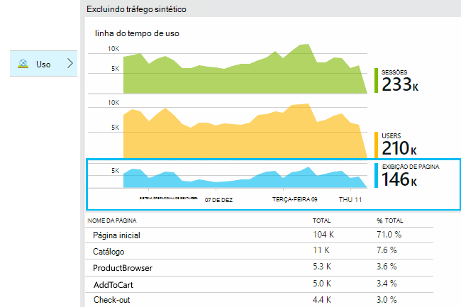

* **Usuários:** A contagem de usuários ativos distintas pelo intervalo de tempo do gráfico. 
* **Sessões:** A contagem de sessões ativas
* **Modos de exibição de página** Conta o número de chamadas para trackPageView(), normalmente chamado de uma vez em cada página da web.

Clique em qualquer um dos gráficos para ver mais detalhes. Observe que você pode alterar o intervalo de tempo dos gráficos.

### <a name="where-do-my-users-live"></a>Onde os meus usuários ao vivo?

Da lâmina do uso, clique no gráfico de usuários para ver mais detalhes:

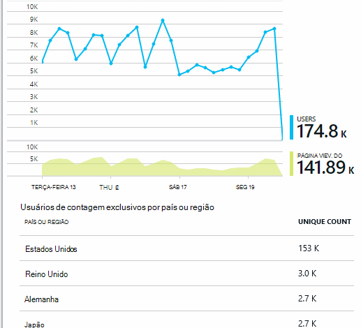
 
### <a name="what-browsers-or-operating-systems-do-they-use"></a>Quais sistemas operacionais ou navegadores que eles usa?

Dados de grupo (segmento) por uma propriedade como navegador, sistema operacional ou cidade:

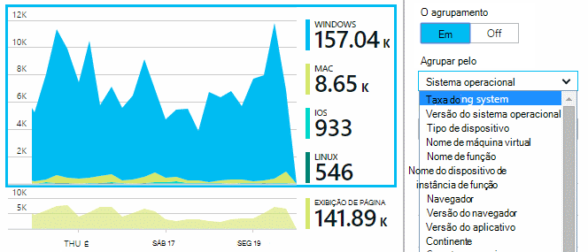


## <a name="sessions"></a>Sessões

Sessão é um conceito fundamental obtenção de informações do aplicativo, que tenta associar cada evento de telemetria - como solicitações, modos de exibição de página, exceções, ou eventos personalizados que você codificar por conta própria - uma sessão de usuário específico. 

Informações de contexto de rich são coletadas sobre cada sessão, como as características de dispositivo, localização geográfica, sistema operacional e assim por diante.

Se você instrumentar o cliente e o servidor ([ASP.NET] [ greenbrown] ou [J2EE][java]), o SDKs irá propagar a identificação da sessão entre o cliente e servidor, para que os eventos em ambos os lados podem ser correlacionados.

Quando [diagnosticar problemas][diagnostic], você pode encontrar todas a telemetria relacionada à sessão em que ocorreu um problema, incluindo todas as solicitações e quaisquer eventos, exceções ou rastreamentos que estavam conectados.

Sessões fornecem uma boa medida de popularidade de contextos como dispositivo, sistema operacional ou local. Mostrando a contagem de sessões agrupados por dispositivo, por exemplo, você obter uma contagem de mais precisa de frequência esse dispositivo é usado com seu aplicativo, que contando modos de exibição de página. Isso seria uma entrada útil para fazer a triagem de qualquer problema de dispositivo específico.


#### <a name="whats-a-session"></a>O que é uma sessão?

Uma sessão representa uma ocorrência única entre o usuário e o aplicativo. Em sua forma mais simples, a sessão é iniciada com um usuário iniciar o aplicativo e termina quando o usuário deixa o aplicativo. Para aplicativos web, por padrão, a sessão termina após 30 minutos de inatividade ou após 24 horas de atividade. 

Você pode alterar esses padrões editando o trecho de código:

    <script type="text/javascript">
        var appInsights= ... { ... }({
            instrumentationKey: "...",
            sessionRenewalMs: 3600000,
            sessionExpirationMs: 172800000
        });

* `sessionRenewalMs`: O tempo, em milissegundos, para expirar a sessão devido a inatividade do usuário. Padrão: 30 minutos.
* `sessionExpirationMs`: O comprimento máximo de sessão, em milissegundos. Se o usuário permanece ativo após esse horário, outra sessão é contada. Padrão: 24 horas.

**Duração da sessão** é uma [métrica] [ metrics] que registra o período de tempo entre os itens de telemetria primeiro e último da sessão. (Ele não incluir o período de tempo limite.)

**Contagem de sessão** em um determinado intervalo é definido como o número de sessões exclusivas com algumas atividades durante este intervalo. Quando você examinar um intervalo de tempo como contagem diária sessão da semana passada, isso é geralmente equivalente para o número total de sessões. 

No entanto, quando você explorar os intervalos de tempo menores como detalhamento por hora, uma sessão longa abrangendo várias horas será contada por cada hora em que a sessão estava ativa. 

## <a name="users-and-user-counts"></a>Usuários e contagens de usuário


Cada sessão de usuário está associado uma id de usuário exclusiva. 

Por padrão, o usuário é identificado colocando um cookie. Um usuário que usa vários navegadores ou dispositivos será contado mais de uma vez. (Mas consulte [usuários autenticados](#authenticated-users))


A métrica de **contagem de usuário** em um determinado intervalo é definida como o número de usuários exclusivos com atividade registrada durante este intervalo. Como resultado, os usuários com longas sessões podem ser considerados várias vezes, quando você definir um intervalo de tempo para que o detalhamento é menos de uma hora ou forma.

**Novos usuários** conta os usuários cujas sessões primeiro com o aplicativo ocorreram durante este intervalo. Se for usado o método padrão de contagem por usuários por cookies, em seguida, isso também incluirá os usuários que têm desmarcada seus cookies, ou quem está usando um novo dispositivo ou navegador para acessar o aplicativo pela primeira vez.
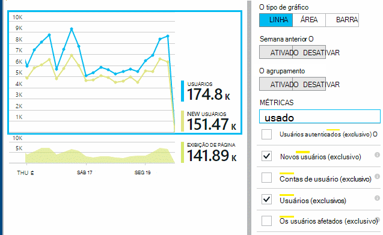

### <a name="authenticated-users"></a>Usuários autenticados

Se seu aplicativo web permite aos usuários entrar, você pode obter uma contagem mais precisa, fornecendo ideias de aplicativo com um identificador exclusivo do usuário. Ele não precisa ser o nome ou a mesma id que você usa em seu aplicativo. Assim que seu aplicativo identificou o usuário, use este código:


*JavaScript no cliente*

      appInsights.setAuthenticatedUserContext(userId);

Se seu aplicativo agrupa os usuários em contas, você também pode passar um identificador da conta. 

      appInsights.setAuthenticatedUserContext(userId, accountId);

Ids de usuário e conta não devem conter espaços ou os caracteres`,;=|`


No [Explorador de métricas](app-insights-metrics-explorer.md), você pode criar um gráfico de **contas**e **Usuários autenticados** . 

## <a name="synthetic-traffic"></a>Tráfego sintético

Tráfego sintético inclui solicitações de testes de disponibilidade e carga, rastreadores de mecanismo de pesquisa e outros agentes. 

Aplicativos tentativas de ideias tenta determinar automaticamente e classificar o tráfego sintético e marcá-la adequadamente. Na maioria dos casos, o tráfego de sintético não chamar o SDK do JavaScript, para que esta atividade é excluída do usuário e a contagem de sessão. 

No entanto, para obtenção de informações do aplicativo [web testes][availability], a id de usuário é automaticamente definida com base no local de POP e id da sessão é definida com base na id de execução de teste. Em default relatórios, tráfego sintético é filtrado por padrão, o que excluirá esses usuários e sessões. No entanto, quando o tráfego de sintético for incluído, ele pode causar um pequeno aumento em usuários gerais e contagens de sessão.
 
## <a name="page-usage"></a>Uso de página

Clique no gráfico de modos de exibição de página para obter uma versão ampliada de mais junto com uma divisão das suas páginas mais populares:


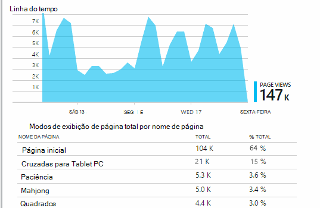
 
O exemplo acima é de um site de jogos. -Nós pode ver instantaneamente:

* Uso não foi aprimorado na semana passada. Talvez nós deve pensar otimização do mecanismo de pesquisa?
* Muitas pessoas menos consulte as páginas de jogos que a Home page. Por que a nossa página inicial não atrair pessoas para jogar?
* 'Cruzadas para Tablet PC' é o jogo mais popular. Nós deve dar prioridade a novas ideias e aprimoramentos lá.

## <a name="custom-tracking"></a>Controle personalizado

Vamos supor que em vez de implementação de cada jogo em uma página da web separado, você decidir refatorá-las todas na mesmo página única aplicativo, com a maioria das funcionalidades codificada como Javascript na página da web. Isso permite ao usuário alternar rapidamente entre um jogo e outro, ou até mesmo ter vários jogos em uma página. 

Mas você ainda assim quiser ideias de aplicativo para efetuar o número de vezes que cada jogo é aberto, exatamente da mesma forma como quando estivessem em páginas da web separadas. É fácil: basta inserir uma chamada para o módulo de telemetria em seu JavaScript onde você deseja registro que uma nova 'página' abriu:

    appInsights.trackPageView(game.Name);

## <a name="custom-events"></a>Eventos personalizados

Escreva telemetria personalizada para fazer o log de eventos específicos. Particularmente no aplicativo única página, você vai querer saber com que frequência o usuário executa ações específicas ou atinge certas metas: 

    appInsights.trackEvent("GameEnd");

Por exemplo, para fazer logon clicando em um link:

    <a href="target.htm" onclick="appInsights.trackEvent('linkClick');return true;">my link</a>


## <a name="view-counts-of-custom-events"></a>Contagens de modo de exibição de eventos personalizados

Abra o Explorador de métricas e adicionar um gráfico para mostrar eventos. Segmento por nome:

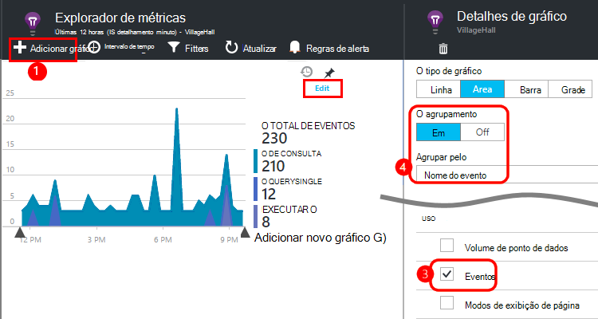


## <a name="drill-into-specific-events"></a>Analise eventos específicos

Para obter uma melhor compreensão de como uma sessão típica vai, talvez você queira concentrar-se em uma sessão de usuário específica que contenha um determinado tipo de evento. 

Neste exemplo, podemos codificados um evento personalizado "NoGame", o que é chamado se o usuário faz check-out sem realmente iniciar um jogo. Por que um usuário pode fazer isso? Talvez se vamos analisar algumas ocorrências específicas, podemos obterá uma dica. 

Os eventos personalizados recebidos do aplicativo são listados por nome na lâmina visão geral:


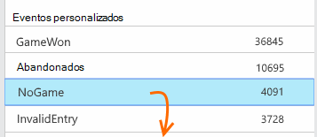
 
Clique em por meio do evento de interesse e selecione uma ocorrência específica recente:


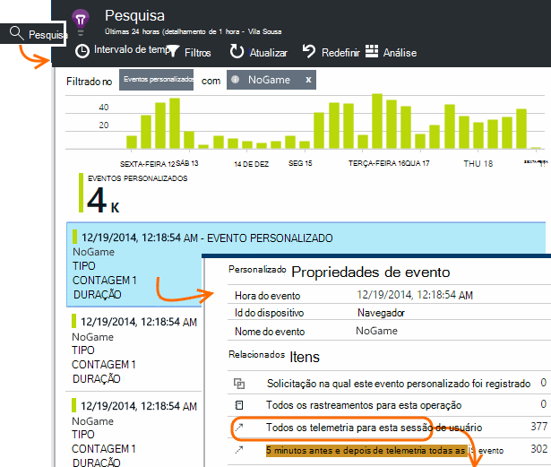
 
Vamos examinar todas a telemetria para a sessão no qual ocorreu desse evento NoGame específico. 


 
Havia sem exceções, para que o usuário não foi impedido de reprodução por alguma falha.
 
Nós pode filtrar todos os tipos de telemetria exceto modos de exibição de página para esta sessão:


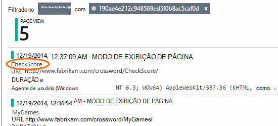
 
E agora podemos ver que esse usuário conectado simplesmente a verificar as pontuações mais recentes. Talvez deve consideramos desenvolvendo uma história de usuário que torna mais fácil de fazer isso. (E podemos deve implementar um evento personalizado ao relatório quando ocorre este texto específico).

## <a name="filter-search-and-segment-your-data-with-properties"></a>Filtrar, pesquisar e seus dados com propriedades de segmento
Você pode anexar marcas aleatório e valores numéricos a eventos.
 

*JavaScript no cliente*

```JavaScript

    appInsights.trackEvent("WinGame",
        // String properties:
        {Game: currentGame.name, Difficulty: currentGame.difficulty},
        // Numeric measurements:
        {Score: currentGame.score, Opponents: currentGame.opponentCount}
    );
```

*C# no servidor*

```C#

    // Set up some properties:
    var properties = new Dictionary <string, string> 
        {{"game", currentGame.Name}, {"difficulty", currentGame.Difficulty}};
    var measurements = new Dictionary <string, double>
        {{"Score", currentGame.Score}, {"Opponents", currentGame.OpponentCount}};

    // Send the event:
    telemetry.TrackEvent("WinGame", properties, measurements);
```

*VB no servidor*

```VB

    ' Set up some properties:
    Dim properties = New Dictionary (Of String, String)
    properties.Add("game", currentGame.Name)
    properties.Add("difficulty", currentGame.Difficulty)

    Dim measurements = New Dictionary (Of String, Double)
    measurements.Add("Score", currentGame.Score)
    measurements.Add("Opponents", currentGame.OpponentCount)

    ' Send the event:
    telemetry.TrackEvent("WinGame", properties, measurements)
```

Anexe propriedades modos de exibição de página da mesma maneira:

*JavaScript no cliente*

```JS

    appInsights.trackPageView("Win", 
        url,
        {Game: currentGame.Name}, 
        {Score: currentGame.Score});
```

Em pesquisa de diagnóstico, exiba as propriedades clicando por meio de uma ocorrência individual de um evento.


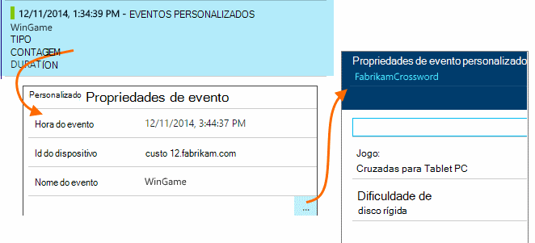
 
Use o campo de pesquisa para ver as ocorrências de eventos com um valor de propriedade particular.


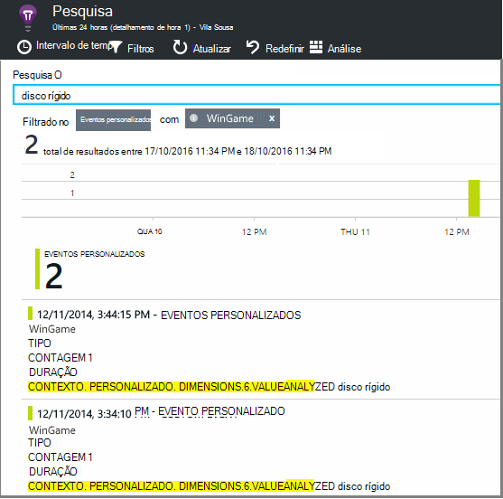


## <a name="a--b-testing"></a>A | Teste B

Se você não souber qual variante de um recurso será mais bem sucedida, libere ambos, tornando cada acessíveis para diferentes usuários. Medir o sucesso de cada um e mover para uma versão unificada.

Para essa técnica, você pode anexar marcas distintas para todas a telemetria enviado por cada versão do aplicativo. Você pode fazer isso definindo propriedades na TelemetryContext ativa. Estas propriedades padrão são adicionadas a cada mensagem de telemetria que o aplicativo envia - não apenas suas mensagens personalizadas, mas também a telemetria padrão. 

No portal de obtenção de informações do aplicativo, você, em seguida, será possível filtrar e agrupar (segmento) seus dados sobre as marcas, para comparar as diferentes versões.

*C# no servidor*

```C#

    using Microsoft.ApplicationInsights.DataContracts;

    var context = new TelemetryContext();
    context.Properties["Game"] = currentGame.Name;
    var telemetry = new TelemetryClient(context);
    // Now all telemetry will automatically be sent with the context property:
    telemetry.TrackEvent("WinGame");
```

*VB no servidor*

```VB

    Dim context = New TelemetryContext
    context.Properties("Game") = currentGame.Name
    Dim telemetry = New TelemetryClient(context)
    ' Now all telemetry will automatically be sent with the context property:
    telemetry.TrackEvent("WinGame")
```

Telemetria individual pode substituir os valores padrão.

Você pode configurar um inicializador universal para que todos os TelemetryClients de novo automaticamente usem seu contexto.

```C#


    // Telemetry initializer class
    public class MyTelemetryInitializer : ITelemetryInitializer
    {
        public void Initialize (ITelemetry telemetry)
        {
            telemetry.Properties["AppVersion"] = "v2.1";
        }
    }
```

No inicializador app como Global.asax.cs:

```C#

    protected void Application_Start()
    {
        // ...
        TelemetryConfiguration.Active.TelemetryInitializers
        .Add(new MyTelemetryInitializer());
    }
```


## <a name="build---measure---learn"></a>Construir - medida - Saiba

Quando você usa a análise, ele se torne uma parte integrada de seu ciclo de desenvolvimento, não apenas algo que você acha prestes a ajudar a resolver problemas. Aqui estão algumas dicas:

* Determine a métrica principais do seu aplicativo. Deseja tantos usuários possível, ou talvez você prefira um conjunto pequeno de usuários felizes? Você deseja maximizar visitas ou vendas?
* Planeje medir cada história. Quando você faz o esboço de uma história de usuário novo ou recurso, ou plano para atualizar um existente, sempre pensar sobre como você vai medir o sucesso da alteração. Antes de codificação inicia, pergunte "o efeito que isso terá nos nossas métricas, se ele funciona? Deve podemos controlar os novos eventos?"
E é claro que, quando o recurso está ao vivo, verifique se você examine a análise e atuam nos resultados. 
* Relacionar a principal métrica outras métricas. Por exemplo, se você adicionar um recurso de "Favoritos", que você gostaria de saber quantas vezes os usuários adicionar a Favoritos. Mas talvez é mais interessantes para saber quantas vezes eles volte aos seus favoritos. E, principalmente, os clientes que usam Favoritos basicamente compram mais produtos?
* Delator testes. Configure uma opção de recurso que permite que você faça um novo recurso visíveis somente para alguns usuários. Use a obtenção de informações do aplicativo para ver se o novo recurso está sendo usado da maneira que você envisaged. Fazer ajustes e solte-o para um público maior.
* Fale com seus usuários! Análise não é suficiente por conta própria, mas complementar para manter uma relação de cliente boa.


## <a name="references"></a>Referências

* [Usar a API - visão geral][api]
* [Referência da API do JavaScript](https://github.com/Microsoft/ApplicationInsights-JS/blob/master/API-reference.md)

## <a name="video"></a>Vídeo

> [AZURE.VIDEO usage-monitoring-application-insights]


<!--Link references-->

[api]: app-insights-api-custom-events-metrics.md
[availability]: app-insights-monitor-web-app-availability.md
[client]: app-insights-javascript.md
[diagnostic]: app-insights-diagnostic-search.md
[greenbrown]: app-insights-asp-net.md
[java]: app-insights-java-get-started.md
[metrics]: app-insights-metrics-explorer.md
[portal]: http://portal.azure.com/
[windows]: app-insights-windows-get-started.md

 
