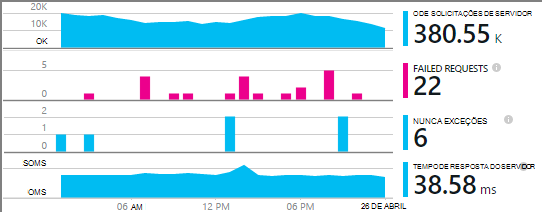
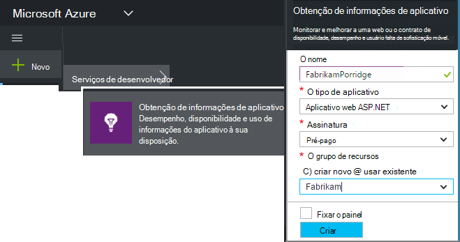
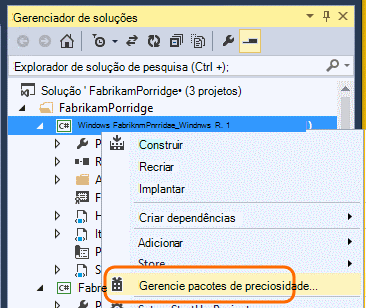
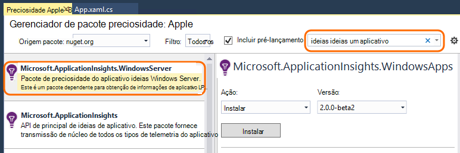
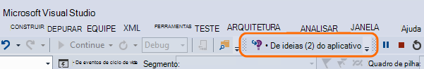
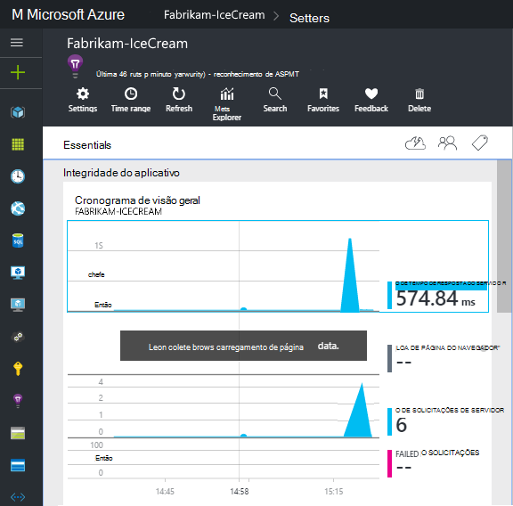
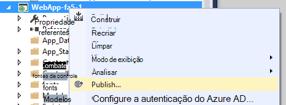

<properties
    pageTitle="Serviços de ideias para Windows do aplicativo e funções de trabalho | Microsoft Azure"
    description="Adicione manualmente o SDK de obtenção de informações do aplicativo ao seu aplicativo ASP.NET para analisar o desempenho, disponibilidade e uso."
    services="application-insights"
    documentationCenter=".net"
    authors="alancameronwills"
    manager="douge"/>

<tags
    ms.service="application-insights"
    ms.workload="tbd"
    ms.tgt_pltfrm="ibiza"
    ms.devlang="na"
    ms.topic="get-started-article"
    ms.date="08/30/2016"
    ms.author="awills"/>

# Configurar manualmente a obtenção de informações de aplicativo para aplicativos ASP.NET 4

*Obtenção de informações de aplicativo está no modo de visualização.*

[AZURE.INCLUDE [app-insights-selector-get-started](../../includes/app-insights-selector-get-started.md)]

Você pode configurar manualmente [Ideias de aplicativo do Visual Studio](app-insights-overview.md) para monitorar serviços Windows, funções de trabalho e outros aplicativos ASP.NET. Para aplicativos web, a configuração manual é uma alternativa para a [configuração automática](app-insights-asp-net.md) oferecidas pelo Visual Studio.

Obtenção de informações de aplicativo ajuda você a diagnosticar problemas e monitorar o desempenho e o uso em seu aplicativo ao vivo.

#### Antes de começar

Você precisa:

* Uma assinatura do [Microsoft Azure](http://azure.com). Se a sua equipe ou organização tiver uma assinatura do Azure, o proprietário pode adicioná-lo a ele, usando sua [conta da Microsoft](http://live.com).
* Visual Studio 2013 ou posterior.

## 1. Crie um recurso de obtenção de informações de aplicativo

Entre no [portal do Azure](https://portal.azure.com/)e criar um novo recurso de obtenção de informações do aplicativo. Escolha ASP.NET como o tipo de aplicativo.

Um [recurso](app-insights-resources-roles-access-control.md) no Azure é uma instância de um serviço. Esse recurso é onde telemetria de seu aplicativo será analisada e apresentada.

A opção do tipo de aplicativo define o conteúdo padrão das lâminas de recursos e as propriedades visível no [Explorador de métricas](app-insights-metrics-explorer.md).

#### Copiar a chave de instrumentação

A chave identifica o recurso e você vai instalá-lo em breve no SDK para direcionar dados para o recurso.

As etapas que acabou de fazer para criar um novo recurso são uma boa maneira de começar a monitorar qualquer aplicativo. Agora você pode enviar dados para ele.

## 2. instalar o SDK em seu aplicativo

Instalando e configurando o SDK de obtenção de informações do aplicativo variam dependendo da plataforma que você está trabalhando. Para aplicativos do ASP.NET, é fácil.

1. No Visual Studio, edite os pacotes NuGet do seu projeto de aplicativo web.

    

2. Instale o aplicativo ideias SDK para aplicativos Web.

    

    *Posso usar outros pacotes?*

    Sim. Escolha a API de núcleo (Microsoft.ApplicationInsights) se desejar usar a API para enviar sua própria telemetria. O pacote do Windows Server inclui automaticamente a API de núcleo mais de um número de outros pacotes como coleta contador de desempenho e dependência monitoramento. 

#### Atualizar para futuras versões SDK

Podemos lançar uma nova versão do SDK do tempo.

Para atualizar para uma [nova versão do SDK](https://github.com/Microsoft/ApplicationInsights-dotnet-server/releases/), abra o Gerenciador de pacotes do NuGet novamente e filtro em pacotes instalados. Selecione **Microsoft.ApplicationInsights.Web** e escolha **Atualizar**.

Se você fez todas as personalizações ApplicationInsights.config, salve uma cópia dele antes de atualizar e depois mesclar as alterações a nova versão.

## 3. enviar Telemetria

**Se você instalou somente o pacote de API principal:**

* Definir a chave de instrumentação no código, por exemplo, em `main()`: 

    `TelemetryConfiguration.Active.InstrumentationKey = "`*sua chave*`";` 

* [Escreva sua própria telemetria usando a API](app-insights-api-custom-events-metrics.md#ikey).

**Se você tiver instalado outros pacotes de obtenção de informações do aplicativo,** você pode, se preferir, use o arquivo. config para definir a chave de instrumentação:

* Editar ApplicationInsights.config (que foi adicionada pela instalação NuGet). Inserir isso logo antes da marca de fechamento:

    `<InstrumentationKey>`*a chave de instrumentação que você copiou*`</InstrumentationKey>`

* Certifique-se de que as propriedades de ApplicationInsights.config no Solution Explorer estão definidas para **Build Action = conteúdo, copiar para diretório de saída = copiar**.

## Executar o projeto

Use o **F5** para executar o aplicativo e testá-la: abrir páginas diferentes para gerar algumas telemetria.

No Visual Studio, você verá uma contagem dos eventos que tiverem sido enviados.

## Exibir seu Telemetria

Volte para o [portal do Azure](https://portal.azure.com/) e procure o recurso de obtenção de informações do aplicativo.

Procure dados nos gráficos de visão geral. Primeiro, você verá apenas um ou dois pontos. Por exemplo:

Clique em qualquer gráfico para ver mais detalhadas métricas. [Saiba mais sobre métricas.](app-insights-web-monitor-performance.md)

#### Nenhum dado?

* Use o aplicativo, abrindo páginas diferentes para que ele gera alguns telemetria.
* Abra o bloco de [pesquisa](app-insights-diagnostic-search.md) , para ver eventos individuais. Às vezes, leva eventos um pouco enquanto mais tempo para obter pelo pipeline de métricas.
* Aguarde alguns segundos e clique em **Atualizar**. Gráficos de atualizar próprios periodicamente, mas você pode atualizar manualmente, se você está aguardando para alguns dados apareça.
* Consulte [solução de problemas](app-insights-troubleshoot-faq.md).

## Publicar seu aplicativo

Agora implantar seu aplicativo para seu servidor ou do Azure e assista os dados são acumulados.

Quando você executa no modo de depuração, telemetria é acelerada pelo pipeline de, para que você deve ver os dados que aparecem em segundos. Quando você implanta seu aplicativo na configuração de lançamento, dados acumulam mais lentamente.

#### Nenhum dado depois de publicar seu servidor?

Abra essas portas para tráfego de saída no firewall do seu servidor:

+ `dc.services.visualstudio.com:443`
+ `f5.services.visualstudio.com:443`

#### Problemas no seu servidor de compilação?

Consulte [este item de solução de problemas](app-insights-asp-net-troubleshoot-no-data.md#NuGetBuild).

> [AZURE.NOTE]Se seu aplicativo gera muitas telemetria (e você estiver usando o SDK do ASP.NET versão 2.0.0-beta3 ou posterior), o módulo de amostragem adaptativa reduz automaticamente o volume que é enviado para o portal enviando apenas uma fração representante de eventos. No entanto, eventos relacionados à mesma solicitação vai ser selecionados ou desmarcados como um grupo, para que você possa navegar entre eventos relacionados. 
> [Saiba mais sobre amostragem](app-insights-sampling.md).

## Próximas etapas

* [Adicionar mais telemetria](app-insights-asp-net-more.md) para acessar o modo de exibição de 360 graus completo do seu aplicativo.

