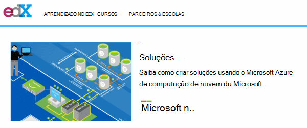
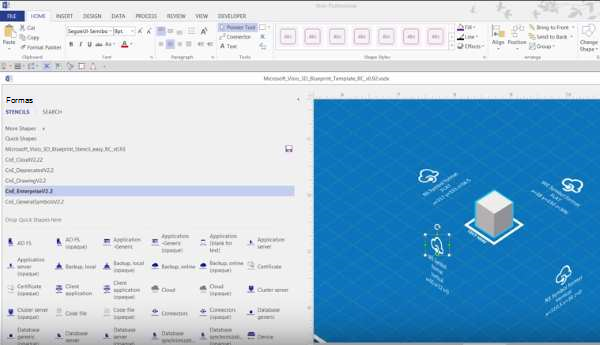

<properties 
    pageTitle="Arquitetura de aplicativos no Microsoft Azure | Microsoft Azure" 
    description="Visão geral da arquitetura que aborda os padrões de design comuns" 
    services="" 
    documentationCenter="" 
    authors="Rboucher" 
    manager="jwhit" 
    editor="mattshel"/>

<tags 
    ms.service="multiple" 
    ms.workload="na" 
    ms.tgt_pltfrm="na" 
    ms.devlang="na" 
    ms.topic="article" 
    ms.date="09/13/2016" 
    ms.author="robb"/>

#Arquitetura de aplicativos no Microsoft Azure
Recursos para a criação de aplicativos que usam o Microsoft Azure. Isso inclui ferramentas para ajudá-lo a desenhar diagramas para descrever visualmente sistemas de software. 

##Cartaz de padrões de design

Padrões de Microsoft & Practices publicou o catálogo de [Padrões de Design de nuvem](http://msdn.microsoft.com/library/dn568099.aspx) que está disponível no MSDN e no download do PDF. Também há um cartaz de grande formato disponível que lista todos os padrões. 

##Curso de certificação de arquitetura do Microsoft

A Microsoft criou um curso de arquitetura Microsoft exame de certificação 70-534 de suporte. Ela está [disponível gratuitamente no EDX.ORG](https://www.edx.org/course/architecting-microsoft-azure-solutions-microsoft-dev205x).  Ele usa o [Modelo do Visio esquema 3D](#3d-blueprint-visio-template). 

##Soluções da Microsoft

A Microsoft publica um conjunto de alto nível de [arquiteturas de solução](http://aka.ms/azblueprints) mostrando como construir tipos específicos de sistemas usando produtos da Microsoft. 

Microsoft publicado anteriormente, um conjunto de plantas mostrando arquiteturas de exemplo. Aqueles foram substituídos por arquiteturas de solução mencionadas anteriormente e o link de esquema foi redirecionado para apontar a elas. Se você precisar acessar os materiais de plantas anterior por algum motivo, envie um email [CnESymbols@microsoft.com](mailto:CnESymbols@microsoft.com) com sua solicitação.   

As plantas e diagramas de arquiteturas de solução usam partes da [nuvem e defina de símbolo de empresa](#Drawing-symbol-and-icon-sets).   

##Modelo de esquema Visio 3D

As versões 3D das agora expirado [Plantas de arquitetura Microsoft](http://aka.ms/azblueprints) inicialmente foram criadas em uma ferramenta não sejam da Microsoft. Um modelo do Visio 2013 (e posterior) enviados em 5 de agosto de 2015 como parte de um [curso de certificação de arquitetura Microsoft distribuído em EDX.ORG](#microsoft-architecture-certification-course).

O modelo também está disponível fora do curso. 

- [Exibir o vídeo de treinamento](http://aka.ms/3dBlueprintTemplateVideo) primeiro para que você saiba o que ele pode fazer   
- Baixe o [Microsoft 3d modelo do Visio de esquema](http://aka.ms/3DBlueprintTemplate)
- Baixe os [símbolos de empresa e de nuvem](#drawing-symbol-and-icon-sets) para usar com o modelo 3D. 

E-mail para [CnESymbols@microsoft.com](mailto:CnESymbols@microsoft.com) para específico perguntas não respondidas pelos materiais de treinamento ou enviar comentários. O modelo não está mais em desenvolvimento ativo, mas ele ainda é útil e relevantes porque ele pode usar qualquer PNG ou na [nuvem e símbolos de empresa](#drawing-symbol-and-icon-sets), que são atualizados.  

##Conjuntos de símbolo e ícone de desenho 

[Exibir o Visio e símbolos de vídeo de treinamento](http://aka.ms/CnESymbolsVideo) e, em seguida, [Baixe a nuvem e Enterprise símbolo definir para ajudar a criar materiais técnicas que](http://aka.ms/CnESymbols) descrevem Azure, Windows Server, SQL Server e muito mais. Você pode usar os símbolos em diagramas de arquitetura, materiais de treinamento, apresentações, folhas de dados, infographics, white papers e até mesmo 3º livros de terceiros se o livro treina as pessoas usem produtos da Microsoft. No entanto, eles não foram criados para uso em interfaces do usuário.

Os símbolos de CnE estão no formato do Visio, SVG e PNG. Instruções adicionais sobre como usar facilmente usam os símbolos no PowerPoint estão incluídos no conjunto. 

O conjunto de símbolos fornecido trimestralmente e é atualizado conforme novos serviços são lançados. 

Símbolos adicionais para Microsoft Office e tecnologias relacionadas estão disponíveis no [Estêncil do Microsoft Office Visio](http://www.microsoft.com/en-us/download/details.aspx?id=35772), embora elas não são otimizadas para diagramas de arquitetura como o conjunto de CnE.   

**Comentários:** Se você já utilizou os símbolos de CnE, preencha a 5 pergunta breve [pesquisa](http://aka.ms/azuresymbolssurveyv2) ou e-mail para [CnESymbols@microsoft.com](mailto:CnESymbols@microsoft.com) para perguntas específicas e problemas. Podemos gostaria de saber o que você pensa, incluindo feedback positivo para que sabemos para continuar a investir tempo-los. 

##Arquitetura Infographics

A Microsoft publica arquitetura várias relacionados cartazes/infographics. Eles incluem [Aplicativos de nuvem do mundo Real de construção](https://azure.microsoft.com/documentation/infographics/building-real-world-cloud-apps/) e a [escala com os serviços de nuvem](https://azure.microsoft.com/documentation/infographics/cloud-services/) . 

