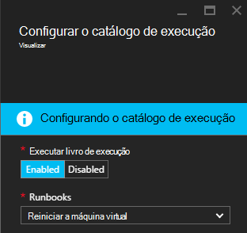

<properties
    pageTitle=" Corrigir alertas de máquina virtual Azure com automação Runbooks | Microsoft Azure"
    description="Este artigo mostra como integrar alertas de máquina Virtual de Azure com runbooks de automação do Azure e corrigir problemas"
    services="automation"
    documentationCenter=""
    authors="mgoedtel"
    manager="jwhit"
    editor="tysonn" />    
<tags
    ms.service="automation"
    ms.devlang="na"
    ms.topic="article"
    ms.tgt_pltfrm="na"
    ms.workload="infrastructure-services"
    ms.date="06/14/2016"
    ms.author="csand;magoedte" />

# <a name="azure-automation-scenario---remediate-azure-vm-alerts"></a>Cenário de automação Azure - remediar alertas de máquina virtual do Azure

Azure automação e máquinas virtuais do Azure ter lançado um novo recurso, permitindo que você configure alertas de máquina Virtual (VM) para executar runbooks de automação. Esse novo recurso permite executar automaticamente correção padrão em resposta a alertas de máquina virtual, como reiniciar ou parar a máquina virtual.

Anteriormente, durante a criação de regra de alerta de máquina virtual você conseguiu [especificar um webhook de automação](https://azure.microsoft.com/blog/using-azure-automation-to-take-actions-on-azure-alerts/) um runbook para executar runbook sempre disparou o alerta. No entanto, isso necessário fazer o trabalho da criação de runbook, criando a webhook para runbook e, em seguida, copiando e colando a webhook durante a criação de regra de alerta. Com essa nova versão, o processo é muito mais fácil porque você pode escolher diretamente um runbook em uma lista durante a criação de regra de alerta, e você pode escolher uma conta de automação que será executado runbook ou facilmente criar uma conta.

Neste artigo, mostraremos como é fácil configurar um alerta de máquina virtual do Azure e configurar um runbook de automação para executar sempre que aciona o alerta. Cenários de exemplo incluem reiniciar uma máquina virtual quando o uso da memória excede algum limite devido a um aplicativo na máquina virtual com falta de memória, ou parar uma máquina virtual quando o tempo de usuário de CPU foi abaixo 1% de última hora e não está em uso. Explicaremos também como a criação automática de um serviço principal em sua conta de automação simplifica o uso de runbooks no Azure correção alerta.

## <a name="create-an-alert-on-a-vm"></a>Criar um alerta em uma máquina virtual

Execute as seguintes etapas para configurar um alerta para iniciar uma runbook quando seu limite foi atendido.

>[AZURE.NOTE] Com esta versão, só há suporte para máquinas virtuais de V2 e suporte para clássico que VMs serão adicionadas em breve.  

1. Faça logon no portal do Azure e clique em **máquinas virtuais**.  
2. Selecione uma das suas máquinas virtuais.  A lâmina de dashboard de máquina virtual será exibido e as **configurações** à sua direita.  
3. A lâmina de **configurações** , na seção monitoramento selecione **regras de alerta**.
4. Na lâmina **regras de alerta** , clique em **Adicionar alerta**.

Isso abre a lâmina de **Adicionar uma regra de alerta** , onde você pode configurar as condições para o alerta e escolher entre uma ou todas as seguintes opções: enviar email para alguém, use um webhook para encaminhar o alerta para outro sistema e/ou executar uma runbook automação tentativa de resposta para remediar o problema.

## <a name="configure-a-runbook"></a>Configurar um runbook

Para configurar um runbook para ser executada quando o limite de alerta de máquina virtual é atendido, selecione **Runbook de automação**. Na lâmina **runbook Configure** , você pode selecionar runbook para executar e a conta de automação seja executado runbook em.


>[AZURE.NOTE] Nesta versão, você pode escolher entre três runbooks que fornece o serviço – máquina virtual reiniciar, máquina virtual parar ou máquina virtual remover (excluir).  A capacidade de selecione outros runbooks ou um dos seus próprios runbooks estará disponível em uma versão futura.


Depois de selecionar um as três runbooks disponíveis, a lista suspensa de **conta de automação** aparece e você pode selecionar uma conta de automação que runbook será executado como. Runbooks precisa executar no contexto de uma [conta de automação](automation-security-overview.md) que está em sua assinatura do Azure. Você pode selecionar uma conta de automação que você já tiver criado ou você pode ter uma nova conta de automação criada para você.

Os runbooks que são fornecidas autenticar Azure usando uma entidade de segurança do serviço. Se você optar por executar runbook em uma de suas contas de automação existentes, podemos criará automaticamente o serviço principal para você. Se você optar por criar uma nova conta de automação, em seguida, podemos criará automaticamente a conta e o capital de serviço. Em ambos os casos, dois ativos também serão criados na conta de automação – um ativo de certificado denominado **AzureRunAsCertificate** e um ativo de conexão denominada **AzureRunAsConnection**. O runbooks usará **AzureRunAsConnection** para autenticar com o Azure para executar a ação de gerenciamento em relação a máquina virtual.

>[AZURE.NOTE] O principal do serviço é criado no escopo de assinatura e é atribuído a função Colaborador. Esta função é necessária na ordem da conta ter permissão para executar a automação runbooks para gerenciar VMs do Azure.  A criação de uma conta de Automaton e/ou serviço principal é um evento único. Depois que elas forem criadas, você pode usar essa conta para executar runbooks para outras alertas de máquina virtual do Azure.

Quando você clica em **Okey** o alerta está configurado e se você selecionou a opção para criar uma nova conta de automação, ele será criado junto com o serviço principal.  Isso pode levar alguns segundos para ser concluída.  



Após a configuração é concluída você verá o nome do runbook aparecem na lâmina **Adicionar uma regra de alerta** .


Clique em **Okey** em **Adicionar uma regra de alerta** blade e a regra de alerta serão criados e ative se a máquina virtual está em um estado em execução.

### <a name="enable-or-disable-a-runbook"></a>Habilitar ou desabilitar um runbook

Se você tiver um runbook configurado para receber um alerta, você pode desabilitá-lo sem remover a configuração de runbook. Isso permite que você a manter o alerta executando e talvez testar algumas das regras de alerta e, em seguida, posteriormente reabilitar runbook.

## <a name="create-a-runbook-that-works-with-an-azure-alert"></a>Criar um runbook que funciona com um alerta Azure

Quando você escolhe um runbook como parte de uma regra de alerta Azure, runbook precisa ter lógica para gerenciar os dados de alerta que são passados para ele.  Quando um runbook é configurado em uma regra de alerta, um webhook é criado para runbook; Essa webhook é usado para iniciar runbook sempre que aciona o alerta.  A chamada real ao início runbook é uma solicitação de HTTP POST para a URL de webhook. Corpo da solicitação de POSTAGEM contém um objeto JSON formatada que contém propriedades úteis relacionadas ao alerta.  Como você pode ver abaixo, os dados de alerta contém detalhes como subscriptionID, resourceGroupName, resourceName e tipo de recurso.

### <a name="example-of-alert-data"></a>Exemplo de dados de alerta
```
{
    "WebhookName": "AzureAlertTest",
    "RequestBody": "{
    \"status\":\"Activated\",
    \"context\": {
        \"id\":\"/subscriptions/<subscriptionId>/resourceGroups/MyResourceGroup/providers/microsoft.insights/alertrules/AlertTest\",
        \"name\":\"AlertTest\",
        \"description\":\"\",
        \"condition\": {
            \"metricName\":\"CPU percentage guest OS\",
            \"metricUnit\":\"Percent\",
            \"metricValue\":\"4.26337916666667\",
            \"threshold\":\"1\",
            \"windowSize\":\"60\",
            \"timeAggregation\":\"Average\",
            \"operator\":\"GreaterThan\"},
        \"subscriptionId\":\<subscriptionID> \",
        \"resourceGroupName\":\"TestResourceGroup\",
        \"timestamp\":\"2016-04-24T23:19:50.1440170Z\",
        \"resourceName\":\"TestVM\",
        \"resourceType\":\"microsoft.compute/virtualmachines\",
        \"resourceRegion\":\"westus\",
        \"resourceId\":\"/subscriptions/<subscriptionId>/resourceGroups/TestResourceGroup/providers/Microsoft.Compute/virtualMachines/TestVM\",
        \"portalLink\":\"https://portal.azure.com/#resource/subscriptions/<subscriptionId>/resourceGroups/TestResourceGroup/providers/Microsoft.Compute/virtualMachines/TestVM\"
        },
    \"properties\":{}
    }",
    "RequestHeader": {
        "Connection": "Keep-Alive",
        "Host": "<webhookURL>"
    }
}
```

Quando o serviço de webhook de automação recebe a POSTAGEM HTTP ele extrai os dados de alerta e passa para runbook no parâmetro de entrada runbook WebhookData.  Abaixo está um exemplo de runbook que mostra como usar o parâmetro WebhookData e extrair os dados de alerta e usá-lo para gerenciar o recurso Azure que disparou o alerta.

### <a name="example-runbook"></a>Exemplo runbook

```
#  This runbook will restart an ARM (V2) VM in response to an Azure VM alert.

[OutputType("PSAzureOperationResponse")]

param ( [object] $WebhookData )

if ($WebhookData)
{
    # Get the data object from WebhookData
    $WebhookBody = (ConvertFrom-Json -InputObject $WebhookData.RequestBody)

    # Assure that the alert status is 'Activated' (alert condition went from false to true)
    # and not 'Resolved' (alert condition went from true to false)
    if ($WebhookBody.status -eq "Activated")
    {
        # Get the info needed to identify the VM
        $AlertContext = [object] $WebhookBody.context
        $ResourceName = $AlertContext.resourceName
        $ResourceType = $AlertContext.resourceType
        $ResourceGroupName = $AlertContext.resourceGroupName
        $SubId = $AlertContext.subscriptionId

        # Assure that this is the expected resource type
        Write-Verbose "ResourceType: $ResourceType"
        if ($ResourceType -eq "microsoft.compute/virtualmachines")
        {
            # This is an ARM (V2) VM

            # Authenticate to Azure with service principal and certificate
            $ConnectionAssetName = "AzureRunAsConnection"
            $Conn = Get-AutomationConnection -Name $ConnectionAssetName
            if ($Conn -eq $null) {
                throw "Could not retrieve connection asset: $ConnectionAssetName. Check that this asset exists in the Automation account."
            }
            Add-AzureRMAccount -ServicePrincipal -Tenant $Conn.TenantID -ApplicationId $Conn.ApplicationID -CertificateThumbprint $Conn.CertificateThumbprint | Write-Verbose
            Set-AzureRmContext -SubscriptionId $SubId -ErrorAction Stop | Write-Verbose

            # Restart the VM
            Restart-AzureRmVM -Name $ResourceName -ResourceGroupName $ResourceGroupName
        } else {
            Write-Error "$ResourceType is not a supported resource type for this runbook."
        }
    } else {
        # The alert status was not 'Activated' so no action taken
        Write-Verbose ("No action taken. Alert status: " + $WebhookBody.status)
    }
} else {
    Write-Error "This runbook is meant to be started from an Azure alert only."
}
```

## <a name="summary"></a>Resumo

Quando você configura um alerta em uma máquina virtual do Azure, agora você tem a capacidade de configurar facilmente uma runbook de automação para executar automaticamente a ação de correção quando dispara o alerta. Nesta versão, você pode escolher entre runbooks para reiniciar, parar ou excluir uma máquina virtual dependendo do cenário de alerta. Isso é apenas o começo da habilitação dos cenários onde você pode controlar as ações (notificação, solução de problemas, correção) que serão executadas automaticamente quando dispara um alerta.

## <a name="next-steps"></a>Próximas etapas

- Para começar a usar runbooks gráficas, consulte [Minha primeira runbook gráfica](automation-first-runbook-graphical.md)
- Para começar a usar runbooks de fluxo de trabalho do PowerShell, consulte [Minha primeira runbook de fluxo de trabalho do PowerShell](automation-first-runbook-textual.md)
- Para saber mais sobre limitações, suas vantagens e tipos de runbook, consulte [tipos de runbook de automação do Azure](automation-runbook-types.md)
