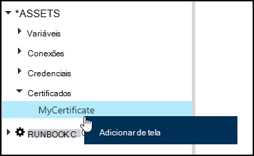
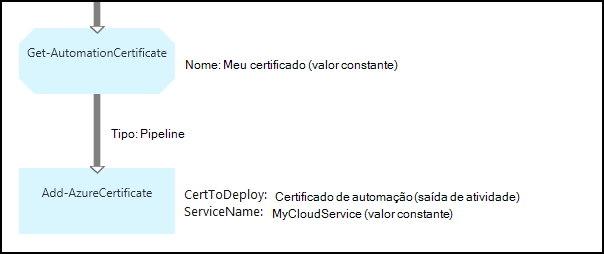

<properties 
   pageTitle="Ativos no Azure automação de certificado | Microsoft Azure"
   description="Certificados podem ser armazenados com segurança em automação do Azure para que eles podem ser acessados por runbooks ou configurações de DSC para autenticar Azure e recursos de terceiros.  Este artigo explica os detalhes de certificados e como trabalhar com eles em textuais e gráfica de criação."
   services="automation"
   documentationCenter=""
   authors="mgoedtel"
   manager="stevenka"
   editor="tysonn" />
<tags 
   ms.service="automation"
   ms.devlang="na"
   ms.topic="article"
   ms.tgt_pltfrm="na"
   ms.workload="infrastructure-services"
   ms.date="02/23/2016"
   ms.author="magoedte;bwren" />

# Ativos de certificado em automação do Azure

Certificados podem ser armazenados com segurança em automação do Azure para que eles podem ser acessados por runbooks ou configurações de DSC usando a atividade de **Get-AutomationCertificate** . Isso permite que você crie runbooks e configurações de DSC que usam certificados para autenticação ou adiciona-los para os recursos do Azure ou de terceiros.

>[AZURE.NOTE] Proteger ativos no Azure automação incluem credenciais, certificados, conexões e variáveis criptografados. Esses ativos são criptografados e armazenados na automação Azure usando uma chave exclusiva que é gerada para cada conta de automação. Esta chave é criptografada por um certificado mestre e armazenada em automação do Azure. Antes de armazenar um ativo seguro, a chave da conta de automação é descriptografada usando o certificado mestre e, em seguida, usado para criptografar o ativo.

## Cmdlets do Windows PowerShell

Os cmdlets na tabela a seguir são usados para criar e gerenciar ativos de certificado de automação com o Windows PowerShell. Eles fornecidos como parte do [módulo do PowerShell do Azure](../powershell-install-configure.md) que está disponível para uso em automação runbooks e configurações de DSC.

|Cmdlets|Descrição|
|:---|:---|
|[Get-AzureAutomationCertificate](http://msdn.microsoft.com/library/dn913765.aspx)|Recupera informações sobre um certificado. Você só pode recuperar o próprio certificado de atividade de Get-AutomationCertificate.|
|[Novo AzureAutomationCertificate](http://msdn.microsoft.com/library/dn913764.aspx)|Importa um novo certificado para a automação do Azure.|
|[Remover - AzureAutomationCertificate](http://msdn.microsoft.com/library/dn913773.aspx)|Remove um certificado de automação do Azure.|
|[Set - AzureAutomationCertificate](http://msdn.microsoft.com/library/dn913763.aspx)|Define as propriedades de um certificado existente, incluindo carregar o arquivo de certificado e definir a senha de um. pfx.|

## Atividades para acessar certificados

As atividades na tabela a seguir são usadas para acessar certificados em uma configuração de DSC ou runbook.

|Atividades|Descrição|
|:---|:---|
|Get-AutomationCertificate|Obtém um certificado para usar em uma configuração de DSC ou runbook.|

>[AZURE.NOTE] Evite usar variáveis no – nome parâmetro de Get-AutomationCertificate como isso pode complicar descobertas dependências entre runbooks ou configurações de DSC e ativos de certificado em tempo de design.

## Criando um novo certificado

Quando você cria um novo certificado, você carregar um arquivo. cer ou. pfx à automação do Azure. Se você marcar o certificado como exportável, você pode transferir-fora do repositório de certificados de automação do Azure. Se não for exportável, em seguida, pode apenas ser usado para assinar dentro do runbook ou configuração de DSC.

### Para criar um novo certificado com o Azure portal clássico

1. Na sua conta de automação, clique em **ativos** na parte superior da janela.
1. Na parte inferior da janela, clique em **Adicionar configuração**.
1. Clique em **adicionar credenciais**.
2. Na lista suspensa **Tipo de credencial** , selecione o **certificado**.
3. Digite um nome para o certificado na caixa **nome** e clique na seta à direita.
4. Navegue para um arquivo. cer ou. pfx.  Se você selecionar um arquivo. pfx, especifique uma senha e se devem ser permitido a ser exportado.
1. Clique na marca de seleção para carregar o arquivo de certificado e salvar o novo ativo de certificado.

### Para criar um novo certificado com o portal do Azure

1. De sua conta de automação, clique na parte de **ativos** para abrir a lâmina de **ativos** .
1. Clique na parte de **certificados** para abrir a lâmina de **certificados** .
1. Clique em **Adicionar um certificado** na parte superior da lâmina.
2. Digite um nome para o certificado na caixa **nome** .
2. Clique em **Selecionar um arquivo** em **carregar um arquivo de certificado** para navegar para um arquivo. cer ou. pfx.  Se você selecionar um arquivo. pfx, especifique uma senha e se devem ser permitido a ser exportado.
1. Clique em **criar** para salvar o novo ativo de certificado.

### Para criar um novo certificado com o Windows PowerShell

Os comandos de exemplo a seguir mostram como criar um novo certificado de automação e a marca exportável. Isso importa um arquivo. pfx existente.

    $certName = 'MyCertificate'
    $certPath = '.\MyCert.pfx'
    $certPwd = ConvertTo-SecureString -String 'P@$$w0rd' -AsPlainText -Force
    
    New-AzureAutomationCertificate -AutomationAccountName "MyAutomationAccount" -Name $certName -Path $certPath –Password $certPwd -Exportable

## Usando um certificado

Você deve usar a atividade de **Get-AutomationCertificate** para usar um certificado. Você não pode usar o cmdlet [Get-AzureAutomationCertificate](http://msdn.microsoft.com/library/dn913765.aspx) desde que ela retorna informações sobre o ativo de certificado, mas não o próprio certificado.

### Exemplo de runbook textuais

O código de exemplo a seguir mostra como adicionar um certificado para um serviço de nuvem em um runbook. Neste exemplo, a senha é recuperada de uma variável de automação criptografados.

    $serviceName = 'MyCloudService'
    $cert = Get-AutomationCertificate -Name 'MyCertificate'
    $certPwd = Get-AutomationVariable –Name 'MyCertPassword'
    Add-AzureCertificate -ServiceName $serviceName -CertToDeploy $cert

### Exemplo de runbook gráfica

Você adiciona um **Get-AutomationCertificate** a um gráfico runbook clicando no certificado no painel de biblioteca do editor gráfico e selecionando **Adicionar à tela**.

A imagem a seguir mostra um exemplo do uso de um certificado em um runbook gráfica.  Este é o mesmo exemplo mostrado acima para adicionar um certificado para um serviço de nuvem de um runbook textual.  

Este exemplo usa o parâmetro de **UseConnectionObject** definido para a atividade de **Envio-TwilioSMS** que usa um objeto de conexão para autenticação no serviço.  Um [link de pipeline](automation-graphical-authoring-intro.md#links-and-workflow) deve ser usado como um link de sequência retornará uma coleção contendo um único objeto que não está esperando o parâmetro de Conexão.

## Consulte também

- [Links na criação de gráficos](automation-graphical-authoring-intro.md#links-and-workflow) 
