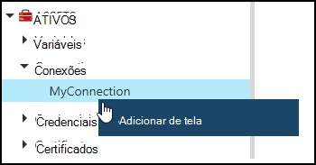
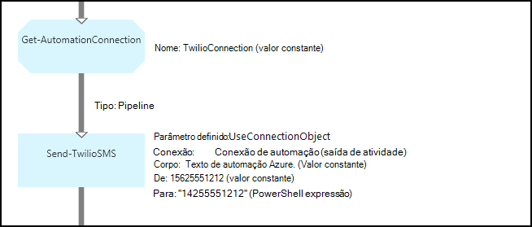
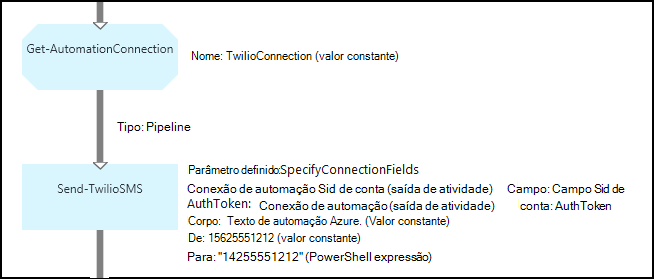

<properties 
   pageTitle="Ativos de Conexão no Azure automação | Microsoft Azure"
   description="Ativos de Conexão no Azure automação contêm as informações necessárias para conectar a um aplicativo ou serviço externo de uma configuração de DSC ou runbook. Este artigo explica os detalhes de conexões e como trabalhar com eles em textuais e gráfica de criação."
   services="automation"
   documentationCenter=""
   authors="bwren"
   manager="stevenka"
   editor="tysonn" />
<tags 
   ms.service="automation"
   ms.devlang="na"
   ms.topic="article"
   ms.tgt_pltfrm="na"
   ms.workload="infrastructure-services"
   ms.date="01/27/2016"
   ms.author="bwren" />

# Ativos de Conexão na automação do Azure

Um ativo de conexão de automação contém as informações necessárias para conectar a um aplicativo ou serviço externo de uma configuração de DSC ou runbook. Isso pode incluir as informações necessárias para autenticação, como um nome de usuário e senha além das informações de conexão como uma URL ou uma porta. O valor de uma conexão é manter todas as propriedades de conexão com um aplicativo específico em um ativo ao invés de criar diversas variáveis. O usuário pode editar os valores para uma conexão em um só lugar, e você pode passar o nome de uma conexão para uma configuração de DSC em um único parâmetro ou runbook. As propriedades de uma conexão podem ser acessadas na runbook ou configuração de DSC com a atividade de **Get-AutomationConnection** .

Quando você cria uma conexão, você deve especificar um *tipo de conexão*. O tipo de conexão é um modelo que define um conjunto de propriedades. A conexão define os valores para cada propriedade definidos no seu tipo de conexão. Tipos de Conexão são adicionados à automação do Azure em módulos de integração ou criados com a [API de automação do Azure](http://msdn.microsoft.com/library/azure/mt163818.aspx). Os tipos de conexão somente que estão disponíveis quando você cria uma conexão são aqueles instalados em sua conta de automação.

>[AZURE.NOTE] Proteger ativos no Azure automação incluem credenciais, certificados, conexões e variáveis criptografados. Esses ativos são criptografados e armazenados na automação Azure usando uma chave exclusiva que é gerada para cada conta de automação. Esta chave é criptografada por um certificado mestre e armazenada em automação do Azure. Antes de armazenar um ativo seguro, a chave da conta de automação é descriptografada usando o certificado mestre e, em seguida, usado para criptografar o ativo.

## Cmdlets do Windows PowerShell

Os cmdlets na tabela a seguir são usados para criar e gerenciar conexões de automação com o Windows PowerShell. Eles fornecidos como parte do [módulo do PowerShell do Azure](../powershell-install-configure.md) que está disponível para uso em automação runbooks e configurações de DSC.

|Cmdlet|Descrição|
|:---|:---|
|[Get-AzureAutomationConnection](http://msdn.microsoft.com/library/dn921828.aspx)|Recupera uma conexão. Inclui uma tabela de hash com os valores dos campos da conexão.|
|[Novo AzureAutomationConnection](http://msdn.microsoft.com/library/dn921825.aspx)|Cria uma nova conexão.|
|[Remover AzureAutomationConnection](http://msdn.microsoft.com/library/dn921827.aspx)|Remova uma conexão existente.|
|[Set-AzureAutomationConnectionFieldValue](http://msdn.microsoft.com/library/dn921826.aspx)|Define o valor de um campo específico de uma conexão existente.|

## Atividades

As atividades na tabela a seguir são usadas para conexões em uma configuração de DSC ou runbook de acesso.

|Atividades|Descrição|
|---|---|
|Get-AutomationConnection|Obtém uma conexão para usar. Retorna uma tabela de hash com as propriedades da conexão.|

>[AZURE.NOTE] Evite usar variáveis no – nome parâmetro de **Get-AutomationConnection** desde que isso poderá complicar descobertas dependências entre runbooks ou configurações de DSC e ativos de conexão no tempo de design.

## Criando uma nova Conexão

### Para criar uma nova conexão com o Azure portal clássico

1. Na sua conta de automação, clique em **ativos** na parte superior da janela.
1. Na parte inferior da janela, clique em **Adicionar configuração**.
1. Clique em **Adicionar Conexão**.
2. Na lista suspensa **Tipo de Conexão** , selecione o tipo de conexão que você deseja criar.  O assistente apresentará as propriedades para esse tipo específico.
1. Conclua o assistente e clique na caixa de seleção para salvar a nova conexão.

### Para criar uma nova conexão com o portal do Azure

1. De sua conta de automação, clique na parte de **ativos** para abrir a lâmina de **ativos** .
1. Clique na parte de **conexões** para abrir a lâmina de **conexões** .
1. Clique em **Adicionar uma conexão** na parte superior da lâmina.
2. Na lista suspensa **tipo** , selecione o tipo de conexão que você deseja criar. O formulário apresentará as propriedades para esse tipo específico.
1. Preencha o formulário e clique em **criar** para salvar a nova conexão.

### Para criar uma nova conexão com o Windows PowerShell

Crie uma nova conexão com o Windows PowerShell usando o cmdlet [New-AzureAutomationConnection](http://msdn.microsoft.com/library/dn921825.aspx) . Esse cmdlet tem um parâmetro chamado **ConnectionFieldValues** que espera uma [tabela de hash](http://technet.microsoft.com/library/hh847780.aspx) definir valores para cada uma das propriedades definidas pelo tipo de conexão.

Os seguintes comandos de amostra criam uma nova conexão para [Twilio](http://www.twilio.com) que é um serviço de telefonia que permite enviar e receber mensagens de texto.  Um módulo de integração de exemplo que inclui um tipo de conexão do Twilio está disponível no [Centro de Script](http://gallery.technet.microsoft.com/scriptcenter/Twilio-PowerShell-Module-8a8bfef8).  Esse tipo de conexão define propriedades para SID conta e Token de autorização, que são necessários para validar sua conta ao conectar com Twilio.  Você deve [baixar este módulo](http://gallery.technet.microsoft.com/scriptcenter/Twilio-PowerShell-Module-8a8bfef8) e instalá-lo em sua conta de automação para este código de amostra trabalhar.

    $AccountSid = "DAf5fed830c6f8fac3235c5b9d58ed7ac5"
    $AuthToken  = "17d4dadfce74153d5853725143c52fd1"
    $FieldValues = @{"AccountSid" = $AccountSid;"AuthToken"=$AuthToken}

    New-AzureAutomationConnection -AutomationAccountName "MyAutomationAccount" -Name "TwilioConnection" -ConnectionTypeName "Twilio" -ConnectionFieldValues $FieldValues

## Usando uma conexão em uma configuração de DSC ou runbook

Recuperar uma conexão em uma configuração de DSC com o cmdlet **Get-AutomationConnection** ou runbook.  Esta atividade recupera os valores dos campos diferentes na conexão e retorna-los como uma [tabela de hash](http://go.microsoft.com/fwlink/?LinkID=324844) que pode ser usado com os comandos apropriados no runbook ou configuração de DSC.

### Exemplo de runbook textuais
Os comandos de exemplo a seguir mostram como usar a conexão de Twilio no exemplo anterior para enviar uma mensagem de texto de um runbook.  A atividade de envio TwilioSMS usada aqui tem dois conjuntos de parâmetro que cada um use um método diferente para autenticar para o serviço de Twilio.  Uma usa um objeto de conexão e outra usa parâmetros individuais para o SID de conta e o Token de autorização.  Ambos os métodos são mostrados neste exemplo.

    $Con = Get-AutomationConnection -Name "TwilioConnection"
    $NumTo = "14255551212"
    $NumFrom = "15625551212"
    $Body = "Text from Azure Automation."

    #Send text with connection object.
    Send-TwilioSMS -Connection $Con -From $NumFrom -To $NumTo -Body $Body

    #Send text with connection properties.
    Send-TwilioSMS -AccountSid $Con.AccountSid -AuthToken $Con.AuthToken -From $NumFrom -To $NumTo -Body $Body

### Exemplos de runbook gráfica

Você adiciona uma atividade de **Get-AutomationConnection** a um runbook gráfica clicando na conexão no painel de biblioteca do editor gráfico e selecionando **Adicionar à tela**.

A imagem a seguir mostra um exemplo do uso de uma conexão em um runbook gráfica.  Este é o mesmo exemplo mostrado acima para enviar uma mensagem de texto usando Twilio de um runbook textual.  Este exemplo usa o parâmetro de **UseConnectionObject** definido para a atividade de **Envio-TwilioSMS** que usa um objeto de conexão para autenticação no serviço.  Um [link de pipeline](automation-graphical-authoring-intro.md#links-and-workflow) é usado aqui, pois o parâmetro de Conexão está esperando um único objeto.

O motivo que um PowerShell expressão é usada para o valor no parâmetro **para** em vez de um valor constante é que esse parâmetro espera um tipo de valor de matriz de cadeia de caracteres, para que você possa enviar para vários números.  Uma expressão de PowerShell permite que você forneça um único valor ou uma matriz.

A imagem abaixo mostra o mesmo exemplo como acima mas usa o parâmetro **SpecifyConnectionFields** definido que espera os parâmetros AccountSid e AuthToken para ser especificado individualmente em vez de usar um objeto de conexão para autenticação.  Nesse caso, os campos da conexão são especificados em vez do próprio objeto.  

## Artigos relacionados

- [Links na criação de gráficos](automation-graphical-authoring-intro.md#links-and-workflow)
 
