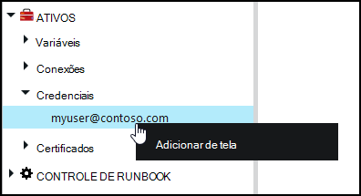
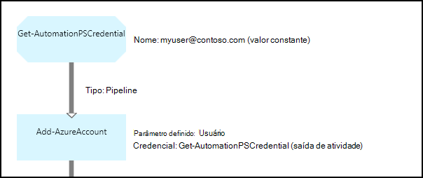

<properties 
   pageTitle="Ativos no Azure automação de credencial | Microsoft Azure"
   description="Ativos de credencial no Azure automação contêm credenciais de segurança que podem ser usadas para autenticar para recursos acessados pela runbook ou configuração de DSC. Este artigo descreve como criar ativos de credencial e usá-los em uma configuração de DSC ou runbook."
   services="automation"
   documentationCenter=""
   authors="mgoedtel"
   manager="jwhit"
   editor="tysonn" />
<tags 
   ms.service="automation"
   ms.devlang="na"
   ms.topic="article"
   ms.tgt_pltfrm="na"
   ms.workload="infrastructure-services"
   ms.date="06/09/2016"
   ms.author="bwren" />

# Ativos de credencial na automação do Azure

Um ativo de credencial de automação contém um objeto de [PSCredential](http://msdn.microsoft.com/library/system.management.automation.pscredential) que contém as credenciais de segurança como um nome de usuário e senha. Configurações runbooks e DSC podem usar cmdlets aceitar um objeto de PSCredential para autenticação, ou eles podem extrair o nome de usuário e a senha do objeto PSCredential para fornecer a algum aplicativo ou serviço que requer autenticação. As propriedades para uma credencial são armazenadas com segurança em automação do Azure e podem ser acessadas no runbook ou configuração de DSC com a atividade de [Get-AutomationPSCredential](http://msdn.microsoft.com/library/system.management.automation.pscredential.aspx) .

>[AZURE.NOTE] Proteger ativos no Azure automação incluem credenciais, certificados, conexões e variáveis criptografados. Esses ativos são criptografados e armazenados na automação Azure usando uma chave exclusiva que é gerada para cada conta de automação. Esta chave é criptografada por um certificado mestre e armazenada em automação do Azure. Antes de armazenar um ativo seguro, a chave da conta de automação é descriptografada usando o certificado mestre e, em seguida, usado para criptografar o ativo. 

## Cmdlets do Windows PowerShell

Os cmdlets na tabela a seguir são usados para criar e gerenciar ativos de credencial de automação com o Windows PowerShell.  Eles fornecidos como parte do [módulo do PowerShell do Azure](../powershell-install-configure.md) que está disponível para uso em automação runbooks e configurações de DSC.

|Cmdlets|Descrição|
|:---|:---|
|[Get-AzureAutomationCredential](http://msdn.microsoft.com/library/dn913781.aspx)|Recupera informações sobre um ativo de credencial. Você somente pode recuperar a credencial próprio de atividade de **Get-AutomationPSCredential** .|
|[Novo AzureAutomationCredential](http://msdn.microsoft.com/library/azure/jj554330.aspx)|Cria uma nova credencial de automação.|
|[Remover - AzureAutomationCredential](http://msdn.microsoft.com/library/azure/jj554330.aspx)|Remove uma credencial de automação.|
|[Set - AzureAutomationCredential](http://msdn.microsoft.com/library/azure/jj554330.aspx)|Define as propriedades para uma credencial de automação existente.|

## Atividades de runbook

As atividades na tabela a seguir são usadas para acessar as credenciais em um runbook e configurações de DSC.

|Atividades|Descrição|
|:---|:---|
|Get-AutomationPSCredential|Obtém uma credencial a ser usada em uma configuração de DSC ou runbook. Retorna um objeto de [System.Management.Automation.PSCredential](http://msdn.microsoft.com/library/system.management.automation.pscredential) .|

>[AZURE.NOTE] Evite usar variáveis no – nome parâmetro de Get-AutomationPSCredential como isso pode complicar descobertas dependências entre runbooks ou configurações de DSC e ativos de credencial no tempo de design.

## Criando um novo ativo de credencial

### Para criar um novo ativo de credencial com o Azure portal clássico

1. Na sua conta de automação, clique em **ativos** na parte superior da janela.
1. Na parte inferior da janela, clique em **Adicionar configuração**.
1. Clique em **adicionar credenciais**.
2. Na lista suspensa **Tipo de credencial** , selecione **Credencial do PowerShell**.
1. Conclua o assistente e clique na caixa de seleção para salvar a nova credencial.

### Para criar um novo ativo de credencial com o portal do Azure

1. De sua conta de automação, clique na parte de **ativos** para abrir a lâmina de **ativos** .
1. Clique na parte de **credenciais** para abrir a lâmina de **credenciais** .
1. Clique em **Adicionar uma credencial** na parte superior da lâmina.
1. Preencha o formulário e clique em **criar** para salvar a nova credencial.

### Para criar um novo ativo de credencial com o Windows PowerShell

Os comandos de exemplo a seguir mostram como criar uma nova credencial de automação. Um objeto PSCredential é criado pela primeira vez com o nome e senha e, em seguida, usado para criar o ativo de credencial. Como alternativa, você pode usar o cmdlet **Get-Credential** para ser solicitado a digitar um nome e senha.

    $user = "MyDomain\MyUser"
    $pw = ConvertTo-SecureString "PassWord!" -AsPlainText -Force
    $cred = New-Object –TypeName System.Management.Automation.PSCredential –ArgumentList $user, $pw
    New-AzureAutomationCredential -AutomationAccountName "MyAutomationAccount" -Name "MyCredential" -Value $cred

## Usando uma credencial do PowerShell

Recuperar um ativo de credencial em uma configuração de DSC com a atividade de **Get-AutomationPSCredential** ou runbook. Isso retorna um [objeto de PSCredential](http://msdn.microsoft.com/library/system.management.automation.pscredential.aspx) que você pode usar com uma atividade ou cmdlet que requer um parâmetro de PSCredential. Você também pode recuperar as propriedades do objeto de credencial para usar individualmente. O objeto tem uma propriedade para o nome de usuário e a senha de segurança, ou você pode usar o método **GetNetworkCredential** para retornar um objeto de [NetworkCredential](http://msdn.microsoft.com/library/system.net.networkcredential.aspx) que forneça uma versão desprotegida da senha.

### Exemplo de runbook textuais

Os comandos de exemplo a seguir mostram como usar uma credencial PowerShell em uma runbook. Neste exemplo, a credencial é recuperada e seu nome de usuário e senha atribuídos a variáveis.

    $myCredential = Get-AutomationPSCredential -Name 'MyCredential'
    $userName = $myCredential.UserName
    $securePassword = $myCredential.Password
    $password = $myCredential.GetNetworkCredential().Password

### Exemplo de runbook gráfica

Você adiciona uma atividade de **Get-AutomationPSCredential** a um runbook gráfica clicando na credencial no painel de biblioteca do editor gráfico e selecionando **Adicionar à tela**.

A imagem a seguir mostra um exemplo do uso de uma credencial em um runbook gráfica.  Nesse caso, ele está sendo usado para fornecer autenticação para um runbook para recursos Azure conforme descrito em [Runbooks autenticar com conta de usuário do Azure AD](automation-sec-configure-aduser-account.md).  A primeira atividade recupera a credencial que tenha acesso à assinatura Azure.  A atividade de **Adicionar AzureAccount** usa esta credencial para fornecer autenticação para todas as atividades que vêm depois dela.  Um [link de pipeline](automation-graphical-authoring-intro.md#links-and-workflow) está aqui como **Get-AutomationPSCredential** está esperando um único objeto.  

## Usando uma credencial do PowerShell no DSC
Enquanto configurações de DSC na automação do Azure podem fazer referência a ativos de credencial usando **Get-AutomationPSCredential**, ativos de credencial podem também ser passados por meio de parâmetros, se desejar. Para obter mais informações, consulte [configurações de compilação no Azure automação DSC](automation-dsc-compile.md#credential-assets).

## Próximas etapas

- Para saber mais sobre links na criação de gráficos, consulte [Links na criação de gráficos](automation-graphical-authoring-intro.md#links-and-workflow)
- Para compreender os diferentes métodos de autenticação com a automação, consulte [Segurança de automação do Azure](automation-security-overview.md)
- Para começar a usar runbooks gráficas, consulte [Minha primeira runbook gráfica](automation-first-runbook-graphical.md)
- Para começar a usar runbooks de fluxo de trabalho do PowerShell, consulte [Minha primeira runbook de fluxo de trabalho do PowerShell](automation-first-runbook-textual.md) 

 
