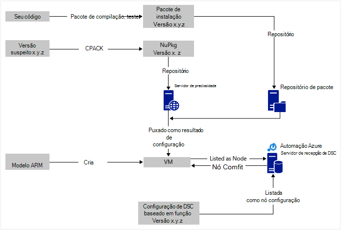
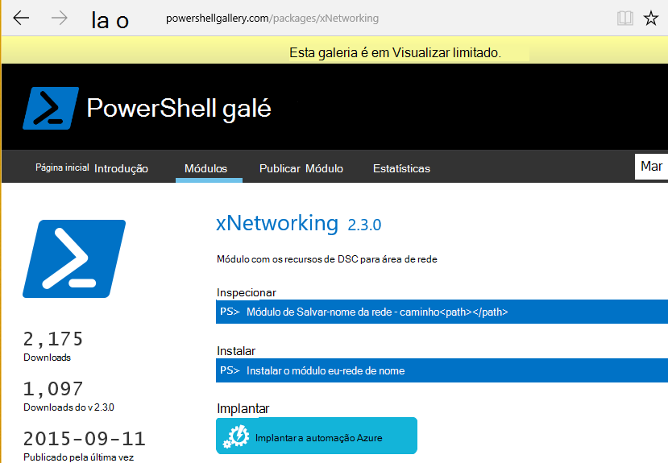

<properties
   pageTitle="Implantação contínua de automação Azure DSC com Chocolatey | Microsoft Azure"
   description="DevOps implantação contínua usando DSC de automação do Azure e Gerenciador de pacote Chocolatey.  Exemplo com o modelo de BRAÇO de JSON completo e fonte do PowerShell."
   services="automation"
   documentationCenter=""
   authors="sebastus"
   manager="stevenka"
   editor=""/>

<tags
   ms.service="automation"
   ms.devlang="na"
   ms.topic="article"
   ms.tgt_pltfrm="vm-windows"
   ms.workload="na"
   ms.date="08/08/2016"
   ms.author="golive"/>

# Exemplo de uso: Implantação contínua para máquinas virtuais usando automação DSC e Chocolatey

Em um mundo DevOps há muitas ferramentas para ajudar com vários pontos no pipeline de integração contínua.  Configuração de estado de desejado de automação do Azure (DSC) é uma nova adição bem-vindo às opções que as equipes de DevOps podem utilizar.  Este artigo demonstra configuração backup contínuo implantação (CD) para um computador Windows.  Você pode estender facilmente a técnica para incluir quantos computadores Windows conforme necessário na função (um site, por exemplo) e de lá para também funções adicionais.

## Em um alto nível

Há um pouco acontecendo aqui, mas felizmente ele pode ser dividido em dois principais processos: 

  - Escrever código testá-lo, criar e publicar pacotes de instalação para versões principais e secundárias do sistema. 
  - Criar e gerenciar VMs que irão instalar e executar o código nos pacotes.  

Depois que esses dois principais processos estiverem no lugar, ele é uma etapa curta para atualizar automaticamente o pacote executando em qualquer máquina virtual determinado conforme novas versões são criadas e implantadas.

## Visão geral do componente

Gerentes de pacote como [chance-get](https://en.wikipedia.org/wiki/Advanced_Packaging_Tool) são bastante conhecidas no mundo Linux, mas não muito no mundo do Windows.  [Chocolatey](https://chocolatey.org/) é algo e de Scott Hanselman [blog](http://www.hanselman.com/blog/IsTheWindowsUserReadyForAptget.aspx) sobre o tópico é uma excelente introdução.  Em resumo, Chocolatey permite que você instale pacotes de um repositório central de pacotes em um sistema do Windows usando a linha de comando.  Você pode criar e gerenciar seu próprio repositório e Chocolatey pode instalar pacotes de qualquer número de repositórios que você designar.

Configuração de estado desejado (DSC) ([Visão geral](https://technet.microsoft.com/library/dn249912.aspx)) é uma ferramenta do PowerShell que permite declarar a configuração que você deseja para um computador.  Por exemplo, você pode dizer, "Desejo Chocolatey instalado, eu quero que o IIS instalado, desejo porta 80 aberta, desejo versão 1.0.0 de meu site instalado."  O Gerenciador de configuração de Local (MMC) do DSC implementa essa configuração. Um servidor de retirar DSC mantém um repositório de configurações para seus computadores. O MMC em cada máquina verifica periodicamente se sua configuração corresponde à configuração armazenada. Ele pode informar o status ou tentar trazer máquina de volta para alinhamento com a configuração armazenada. Você pode editar a configuração armazenada no servidor de recepção para fazer com que um conjunto de máquinas para entrar em alinhamento com a configuração alterada ou máquina.

Automação Azure é um serviço gerenciado no Microsoft Azure que permite automatizar várias tarefas usando runbooks, nós, credenciais, recursos e ativos como agendas e variáveis globais. Azure DSC de automação estende esse recurso de automação para incluir ferramentas do PowerShell DSC.  Veja aqui uma ótima [Visão geral](automation-dsc-overview.md).

Um recurso de DSC é um módulo de código que tenha recursos específicos, como o gerenciamento de rede, Active Directory ou do SQL Server.  O recurso de DSC Chocolatey sabe como acessar um servidor do NuGet (entre outros), baixar pacotes, instalar pacotes e assim por diante.  Há muitos outros recursos de DSC na [Galeria do PowerShell](http://www.powershellgallery.com/packages?q=dsc+resources&prerelease=&sortOrder=package-title).  Esses módulos são instalados em seu servidor do Azure automação DSC retirar (por você) para que eles possam ser usados por suas configurações.

Modelos ARM fornecem uma maneira declarativa de geração de sua infraestrutura - coisas como redes, sub-redes, segurança de rede e roteamento, carregue balanceadores, NICs, VMs e assim por diante.  Aqui está um [artigo](../resource-manager-deployment-model.md) que compara o modelo de implantação de BRAÇO (declarativo) com o gerenciamento de serviço do Azure (ASM ou clássico) o modelo de implantação (fundamental).  E outro [artigo](../virtual-machines/virtual-machines-windows-compare-deployment-models.md) sobre os provedores de recursos de núcleo, a computação, o armazenamento e a rede.

Um recurso chave de um modelo de BRAÇO é sua capacidade de instalar uma extensão de máquina virtual para a máquina virtual que ele está provisionado.  Uma extensão de máquina virtual tem recursos específicos como executando um script personalizado, instalar software antivírus ou um script de configuração de DSC.  Há muitos outros tipos de extensões de máquina virtual.

## Viagem rápida em torno do diagrama

Iniciando na parte superior, você escreve seu código, criar e testar e criar um pacote de instalação.  Chocolatey pode lidar com vários tipos de pacotes de instalação, como o MSI, MSU, ZIP.  E você tem a capacidade do PowerShell para fazer a instalação real se recursos nativos do Chocolatey não bastante até ele.  Coloque o pacote a em um local acessível – em um repositório de pacote.  Este exemplo de uso usa uma pasta pública em uma conta de armazenamento de blob do Microsoft Azure, mas pode ser qualquer lugar.  Chocolatey nativamente funciona com servidores de NuGet e algumas outras para o gerenciamento de metadados de pacote.  [Este artigo](https://github.com/chocolatey/choco/wiki/How-To-Host-Feed) descreve as opções.  Este exemplo de uso usa NuGet.  Um Nuspec é metadados sobre seus pacotes.  O Nuspec é "compilado" em do NuPkg e armazenado em um servidor do NuGet.  Quando sua configuração solicita um pacote por nome e faz referência a um servidor do NuGet, o recurso de DSC Chocolatey (agora na máquina virtual) captura o pacote e instala-lo para você.  Você também pode solicitar uma versão específica de um pacote.

Na parte inferior esquerda da imagem, há um modelo do Azure Resource Manager (ARM).  Neste exemplo de uso, a extensão de máquina virtual registra a máquina virtual com o servidor do Azure automação DSC pegar (ou seja, um servidor de recepção) como um nó.  A configuração é armazenada no servidor de recebimento.  Na verdade, ele é armazenado duas vezes: uma vez como texto sem formatação e depois que compilado como um arquivo MOF (para aqueles que saber sobre coisas.)  No portal do, o MOF é uma "configuração de nó" (em vez de simplesmente "configuração").  Ele é o produto que está associada um nó para que o nó saberá sua configuração.  Detalhes abaixo mostram como atribuir a configuração de nó a nó.

Provavelmente você já estiver fazendo o bit na parte superior ou a maior parte dela.  Criando o nuspec, compilar e armazená-la em um servidor do NuGet é algo pequeno.  E você já estiver gerenciando VMs.  Próximo passo a implantação contínua requer a configuração do servidor de recepção (uma vez), registrando os nós-(uma vez) e criar e armazenar a configuração lá (inicialmente).  Como pacotes são atualizados e implantados para o repositório, atualize a configuração e a configuração de nó do servidor de recepção (repetição conforme necessário).

Se você não estiver iniciando com um modelo ARM, que também é Okey.  Há cmdlets do PowerShell projetados para ajudá-lo a registrar suas VMs com o servidor de recepção e o resto. Para obter mais detalhes, consulte este artigo: [máquinas de integração para gerenciamento do Azure automação nome da importação](automation-dsc-onboarding.md)

## Etapa 1: Configurar a conta de servidor e automação de recepção

Em uma linha de comando do PowerShell (Adicionar-AzureRmAccount) autenticada: (pode demorar alguns minutos enquanto o servidor de recebimento está configurado)

    New-AzureRmResourceGroup –Name MY-AUTOMATION-RG –Location MY-RG-LOCATION-IN-QUOTES
    New-AzureRmAutomationAccount –ResourceGroupName MY-AUTOMATION-RG –Location MY-RG-LOCATION-IN-QUOTES –Name MY-AUTOMATION-ACCOUNT 

Você pode colocar sua conta de automação em qualquer uma das seguintes regiões (também conhecidos como local): Leste dos EUA 2, Centro Sul dos EUA, Virgínia conosco Gov, Europa Ocidental, Sudeste Asiático, Japão Leste, Índia Central e Austrália sudeste.

## Etapa 2: Ajustes de extensão de máquina virtual para o modelo ARM

Detalhes do registro de máquina virtual (usando a extensão de máquina virtual do PowerShell DSC) fornecido neste [Modelo de início rápido do Azure](https://github.com/Azure/azure-quickstart-templates/tree/master/dsc-extension-azure-automation-pullserver).  Esta etapa registra sua máquina virtual novo com o servidor de recepção na lista de nós de DSC.  Parte deste registro está especificando a configuração de nó a ser aplicado ao nó.  Esta configuração de nó não tem que ainda existe no servidor recepção, portanto é Okey etapa 4 é onde isso é feito pela primeira vez.  Mas aqui na etapa 2 você precisa decidir o nome do nó e o nome da configuração.  Neste exemplo de uso, o nó é 'isvbox' e a configuração é 'ISVBoxConfig'.  Portanto, o nome de configuração de nó (a ser especificado no DeploymentTemplate.json) é 'ISVBoxConfig.isvbox'.  

## Etapa 3: Adicionar recursos de DSC necessários ao servidor recepção

A Galeria do PowerShell é instrumentos para instalar os recursos de DSC para sua conta de automação do Azure.  Navegue até o recurso desejado e clique no botão "Implantar a automação Azure".

Outra técnica adicionada recentemente para o Portal do Azure permite retirar em novos módulos ou atualizar módulos existentes. Clique em por meio do recurso de conta de automação, o bloco ativos e finalmente o bloco de módulos.  O ícone de galeria procurar permite que você pode ver a lista de módulos na galeria, fazer busca detalhada em detalhes e finalmente importar para sua conta de automação. Esta é uma ótima maneira de manter seus módulos atualizados de vez em quando. Além disso, o recurso de importação verifica dependências com outros módulos para garantir que nada ficará fora de sincronia.

Ou, não há a abordagem manual.  A estrutura da pasta de um módulo de integração do PowerShell para um computador Windows é um pouco diferente da estrutura da pasta esperada pela automação Azure.  Isso requer um pequeno ajuste de sua parte.  Mas não é difícil, e isso é feito apenas uma vez por recurso (a menos que você deseja atualizá-lo no futuro.)  Para obter mais informações sobre a criação de módulos de integração do PowerShell, consulte este artigo: [Coautoria módulos de integração para automação do Azure](https://azure.microsoft.com/blog/authoring-integration-modules-for-azure-automation/)

-   Instale o módulo que você precisa na estação de trabalho, da seguinte maneira:
    -   Instalar o [Windows Management Framework, v5](http://aka.ms/wmf5latest) (não é necessária para Windows 10)
    -   `Install-Module –Name MODULE-NAME`< — captura o módulo da Galeria do PowerShell 
-   Copie a pasta de módulo de `c:\Program Files\WindowsPowerShell\Modules\MODULE-NAME` para uma pasta temp 
-   Excluir amostras e documentação da pasta principal 
-   ZIP pasta principal, o arquivo ZIP de nomenclatura exatamente a mesma que a pasta 
-   Coloca o arquivo ZIP em um local acessível do HTTP, como o armazenamento de blob em uma conta de armazenamento do Azure.
-   Execute este PowerShell:

        New-AzureRmAutomationModule `
            -ResourceGroupName MY-AUTOMATION-RG -AutomationAccountName MY-AUTOMATION-ACCOUNT `
            -Name MODULE-NAME –ContentLink "https://STORAGE-URI/CONTAINERNAME/MODULE-NAME.zip"
        

O exemplo incluído executa estas etapas para cChoco e xNetworking. Consulte as [anotações](#notes) para tratamento especial para cChoco.

## Etapa 4: Adicionar a configuração de nó para o servidor de recepção

Não há nada de especial sobre a primeira vez que você importar a configuração para o servidor de recepção e compilação.  Todos os subsequentes importação/compila a mesma configuração exatamente a mesma aparência.  Sempre que você atualizar seu pacote e precisa enviá-lo para produção realizar esta etapa após garantindo que o arquivo de configuração está correto – incluindo a nova versão do seu pacote.  Aqui está o arquivo de configuração e o PowerShell:

ISVBoxConfig.ps1:

    Configuration ISVBoxConfig 
    { 
        Import-DscResource -ModuleName cChoco 
        Import-DscResource -ModuleName xNetworking
    
        Node "isvbox" {   
    
            cChocoInstaller installChoco 
            { 
                InstallDir = "C:\choco" 
            }
    
            WindowsFeature installIIS 
            { 
                Ensure="Present" 
                Name="Web-Server" 
            }
    
            xFirewall WebFirewallRule 
            { 
                Direction = "Inbound" 
                Name = "Web-Server-TCP-In" 
                DisplayName = "Web Server (TCP-In)" 
                Description = "IIS allow incoming web site traffic." 
                DisplayGroup = "IIS Incoming Traffic" 
                State = "Enabled" 
                Access = "Allow" 
                Protocol = "TCP" 
                LocalPort = "80" 
                Ensure = "Present" 
            }
    
            cChocoPackageInstaller trivialWeb 
            {            
                Name = "trivialweb" 
                Version = "1.0.0" 
                Source = “MY-NUGET-V2-SERVER-ADDRESS” 
                DependsOn = "[cChocoInstaller]installChoco", 
                "[WindowsFeature]installIIS" 
            } 
        }    
    }

Novo-ConfigurationScript.ps1:

    Import-AzureRmAutomationDscConfiguration ` 
        -ResourceGroupName MY-AUTOMATION-RG –AutomationAccountName MY-AUTOMATION-ACCOUNT ` 
        -SourcePath C:\temp\AzureAutomationDsc\ISVBoxConfig.ps1 ` 
        -Published –Force
    
    $jobData = Start-AzureRmAutomationDscCompilationJob ` 
        -ResourceGroupName MY-AUTOMATION-RG –AutomationAccountName MY-AUTOMATION-ACCOUNT ` 
        -ConfigurationName ISVBoxConfig 
    
    $compilationJobId = $jobData.Id
    
    Get-AzureRmAutomationDscCompilationJob ` 
        -ResourceGroupName MY-AUTOMATION-RG –AutomationAccountName MY-AUTOMATION-ACCOUNT ` 
        -Id $compilationJobId

Resultado essas etapas em uma nova configuração de nó chamado "ISVBoxConfig.isvbox" está sendo colocado no servidor de recebimento.  O nome de configuração de nó é criado como "configurationName.nodeName".

## Etapa 5: Criar e manter metadados de pacote

Para cada pacote que você coloca no repositório do pacote, você precisa de um nuspec descrevê-la.  Esse nuspec deve ser compilado e armazenado em seu servidor do NuGet. Esse processo é descrito [aqui](http://docs.nuget.org/create/creating-and-publishing-a-package).  Você pode usar MyGet.org como um servidor do NuGet.  Eles vendem este serviço, mas tem uma starter SKU que é gratuito.  Em NuGet.org, você encontrará instruções sobre como instalar seu próprio servidor NuGet para seus pacotes particulares.

## Etapa 6: Juntando as peças

Sempre que uma versão passa p & r e for aprovada para implantação, o pacote é criado, nuspec e nupkg atualizados e implantados no servidor do NuGet.  Além disso, a configuração (etapa 4 acima) deverá ser atualizada para concordar com o novo número de versão.  Deve ser enviada para o servidor de recepção e compilada.  Desse ponto em diante, ele é VMs que dependem dessa configuração retirar a atualização e instalá-lo.  Cada uma dessas atualizações são simples - apenas uma linha ou duas do PowerShell.  No caso de serviços de equipe do Visual Studio, algumas delas são encapsuladas em tarefas de compilação que podem ser encadeadas em uma compilação.  Este [artigo](https://www.visualstudio.com/en-us/docs/alm-devops-feature-index#continuous-delivery) fornece mais detalhes.  Este [repo GitHub](https://github.com/Microsoft/vso-agent-tasks) detalha as diversas tarefas de compilação disponíveis.

## Anotações

Este exemplo de uso começa com uma máquina virtual de uma imagem genérica do Windows Server 2012 R2 da Galeria Azure.  Você pode iniciar a partir de qualquer imagem armazenada e, em seguida, ajustar a partir daí com a configuração de DSC.  No entanto, a alteração da configuração que é baked em uma imagem é muito mais difícil que atualizar dinamicamente a configuração usando DSC.

Você não precisa usar um modelo ARM e a extensão de máquina virtual para usar essa técnica com suas VMs.  E suas VMs não precisam estar ligado Azure seja em gerenciamento de CD.  Tudo o que é necessário é que Chocolatey ser instalado e o MMC configurada a máquina virtual para que ele sabe onde está o servidor de recebimento.  

É claro que, quando você atualiza um pacote em uma máquina virtual que esteja em produção, você precisa tomar essa máquina virtual fora rotação enquanto a atualização está instalada.  Como fazer isso varia muito.  Por exemplo, com uma máquina virtual atrás de um balanceador de carga do Azure, você pode adicionar um teste de personalizado.  Ao atualizar a máquina virtual, ter o ponto de extremidade de teste retornar um 400.  O ajuste necessária para fazer essa alteração pode ser dentro de sua configuração, como o ajuste para ele voltar para retornar um 200 assim que a atualização é concluída.

Fonte completo para este exemplo de uso é [Este projeto do Visual Studio](https://github.com/sebastus/ARM/tree/master/CDIaaSVM) no GitHub.

##Artigos relacionados##

- [Visão geral do azure automação DSC] (automação-dsc-overview.md)
- [Azure DSC de automação cmdlets] (https://msdn.microsoft.com/library/mt244122.aspx)
- [Integração máquinas para gerenciamento de nome da importação Azure automação] (automação-dsc-onboarding.md)
