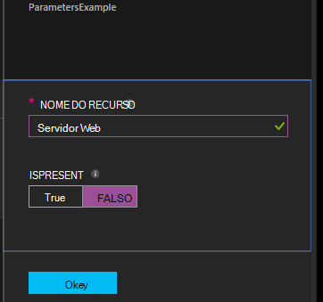

<properties 
   pageTitle="Compilar configurações no Azure automação DSC | Microsoft Azure" 
   description="Visão geral de duas maneiras de compilar configurações de configuração de estado desejado (DSC): no portal do Azure e com o Windows PowerShell. " 
   services="automation" 
   documentationCenter="na" 
   authors="coreyp-at-msft" 
   manager="stevenka" 
   editor="tysonn"/>

<tags
   ms.service="automation"
   ms.devlang="na"
   ms.topic="article"
   ms.tgt_pltfrm="powershell"
   ms.workload="na" 
   ms.date="01/25/2016"
   ms.author="coreyp"/>
   
#Compilar configurações em DSC de automação do Azure#

Você pode compilar configurações de configuração de estado desejado (DSC) de duas maneiras com a automação do Azure: no portal do Azure e com o Windows PowerShell. A tabela a seguir o ajudarão a determinar quando usar qual método com base nas características de cada: 

###Portal de visualização do Azure###
- Método mais simples com interface de usuário interativo
- Formulário para fornecer valores de parâmetro simples
- Rastrear facilmente o estado de trabalho
- Acesso autenticado com logon Azure

###Windows PowerShell###
- Chamadas da linha de comando com os cmdlets do Windows PowerShell
- Pode ser incluído na solução automatizada com várias etapas
- Forneça os valores de parâmetro simples e complexos
- Controlar o estado de trabalho
- Cliente necessário para dar suporte a cmdlets do PowerShell
- Passar ConfigurationData
- Compilar configurações que usam credenciais

Quando você tiver decidido sobre um método de compilação, você pode seguir os respectivos procedimentos abaixo para iniciar a compilação.

##Compilar uma configuração de DSC com o portal do Azure##

1.  Na sua conta de automação, clique em **configurações**.
2.  Clique em uma configuração para abrir seu blade.
3.  Clique em **Compilar**.
4.  Se a configuração não tiver parâmetros, você será solicitado a confirmar se deseja compilá-lo. Se a configuração tiver parâmetros, a **Configuração de compilação** lâmina será aberto para que você possa fornecer valores de parâmetro. Consulte a seção de <a href="#basic-parameters">**Parâmetros básicos**</a> abaixo para obter mais detalhes sobre parâmetros.
5.  A lâmina de **Trabalho de compilação** é aberta para que você pode controlar o status do trabalho de compilação e as configurações de nó (documentos de configuração de MOF) deve ser posicionado no servidor do Azure automação DSC retirar a causa.

##Compilar uma configuração de DSC com o Windows PowerShell##

Você pode usar [`Start-AzureRmAutomationDscCompilationJob`](https://msdn.microsoft.com/library/mt244118.aspx) para iniciar a compilação com o Windows PowerShell. O código de exemplo a seguir inicia a compilação de uma configuração de DSC chamada **SampleConfig**.

    Start-AzureRmAutomationDscCompilationJob -ResourceGroupName "MyResourceGroup" -AutomationAccountName "MyAutomationAccount" -ConfigurationName "SampleConfig" 
 
`Start-AzureRmAutomationDscCompilationJob`Retorna um objeto de trabalho de compilação que você pode usar para controlar seu status. Você pode usar esse objeto de trabalho de compilação com [`Get-AzureRmAutomationDscCompilationJob`](https://msdn.microsoft.com/library/mt244120.aspx) para determinar o status do trabalho compilação, e [`Get-AzureRmAutomationDscCompilationJobOutput`](https://msdn.microsoft.com/library/mt244103.aspx) para exibir seus fluxos (saída). O código de exemplo a seguir inicia a compilação da configuração do **SampleConfig** , aguarda até que ele foi concluída e exibe seus fluxos.
    
    $CompilationJob = Start-AzureRmAutomationDscCompilationJob -ResourceGroupName "MyResourceGroup" -AutomationAccountName "MyAutomationAccount" -ConfigurationName "SampleConfig"
    
    while($CompilationJob.EndTime –eq $null -and $CompilationJob.Exception –eq $null)           
    {
        $CompilationJob = $CompilationJob | Get-AzureRmAutomationDscCompilationJob
        Start-Sleep -Seconds 3
    }
    
    $CompilationJob | Get-AzureRmAutomationDscCompilationJobOutput –Stream Any 

##Parâmetros básicos##

Declaração de parâmetro em configurações de DSC, incluindo tipos de parâmetro e propriedades, funciona iguais aos runbooks de automação do Azure. Consulte [Iniciando um runbook na automação do Azure](automation-starting-a-runbook.md) para saber mais sobre runbook parâmetros.

O exemplo a seguir usa dois parâmetros chamados **nome do recurso** e **IsPresent**, para determinar os valores das propriedades na configuração nó **ParametersExample.sample** , gerado durante a compilação.

    Configuration ParametersExample
    {
        param(
            [Parameter(Mandatory=$true)]
    
            [string] $FeatureName,
    
            [Parameter(Mandatory=$true)]
            [boolean] $IsPresent
        )
    
        $EnsureString = "Present"
        if($IsPresent -eq $false)
        {
            $EnsureString = "Absent"
        }
    
        Node "sample"
        {
            WindowsFeature ($FeatureName + "Feature")
            {
                Ensure = $EnsureString
                Name = $FeatureName
            }
        }
    }

Você pode compilar configurações de DSC que usam parâmetros básicos no portal do Azure automação DSC ou com o Azure PowerShell:

###Portal###

No portal do, você pode inserir valores de parâmetro após clicar em **Compilar**.

###PowerShell###

PowerShell requer parâmetros em uma [tabela de hash](http://technet.microsoft.com/library/hh847780.aspx) onde a chave corresponde ao nome do parâmetro e o valor for igual ao valor do parâmetro.

    $Parameters = @{
            "FeatureName" = "Web-Server"
            "IsPresent" = $False
    }
    
    
    Start-AzureRmAutomationDscCompilationJob -ResourceGroupName "MyResourceGroup" -AutomationAccountName "MyAutomationAccount" -ConfigurationName "ParametersExample" -Parameters $Parameters 
    

Para obter informações sobre passando PSCredentials como parâmetros, consulte <a href="#credential-assets">**Ativos de credencial**</a> abaixo.

##ConfigurationData##

**ConfigurationData** permite separar estrutural configuração de qualquer configuração específica do ambiente durante o uso do PowerShell DSC. Consulte [separar "O que" de "Onde" no PowerShell DSC](http://blogs.msdn.com/b/powershell/archive/2014/01/09/continuous-deployment-using-dsc-with-minimal-change.aspx) para saber mais sobre **ConfigurationData**.

>[AZURE.NOTE] Você pode usar **ConfigurationData** ao compilar no DSC de automação do Azure usando o PowerShell do Azure, mas não no portal do Azure.

A configuração de DSC de exemplo a seguir usa **ConfigurationData** por meio de palavras-chave **$ConfigurationData** e **$AllNodes** . Você também terá o [módulo **xWebAdministration** ](https://www.powershellgallery.com/packages/xWebAdministration/) para este exemplo:

     Configuration ConfigurationDataSample
     {
        Import-DscResource -ModuleName xWebAdministration -Name MSFT_xWebsite
    
        Write-Verbose $ConfigurationData.NonNodeData.SomeMessage 
    
        Node $AllNodes.Where{$_.Role -eq "WebServer"}.NodeName
        {
            xWebsite Site
            {
                Name = $Node.SiteName
                PhysicalPath = $Node.SiteContents
                Ensure   = "Present"
            }
        }
    }

Você pode compilar a configuração de DSC acima com o PowerShell. O abaixo PowerShell adiciona duas configurações de nó no servidor do Azure automação DSC retirar: **ConfigurationDataSample.MyVM1** e **ConfigurationDataSample.MyVM3**:

    $ConfigData = @{
        AllNodes = @(
            @{
                NodeName = "MyVM1"
                Role = "WebServer"
            },
            @{
                NodeName = "MyVM2"
                Role = "SQLServer"
            },
            @{
                NodeName = "MyVM3"
                Role = "WebServer"
    
            }
    
        )
    
        NonNodeData = @{
            SomeMessage = "I love Azure Automation DSC!"
    
        }
    
    } 
    
    Start-AzureRmAutomationDscCompilationJob -ResourceGroupName "MyResourceGroup" -AutomationAccountName "MyAutomationAccount" -ConfigurationName "ConfigurationDataSample" -ConfigurationData $ConfigData

##Ativos##

Referências de ativos são as mesmas nas configurações de DSC de automação do Azure e runbooks. Veja a seguir para obter mais informações:

- [Certificados](automation-certificates.md)
- [Conexões](automation-connections.md)
- [Credenciais](automation-credentials.md)
- [Variáveis](automation-variables.md)

###Ativos de credencial###
Enquanto configurações de DSC na automação do Azure podem fazer referência a ativos de credencial usando **Get-AzureRmAutomationCredential**, ativos de credencial podem também ser passados por meio de parâmetros, se desejar. Se uma configuração leva um parâmetro de tipo de **PSCredential** , você precisa passar o nome de cadeia de caracteres de um ativo de credencial de automação do Azure como valores de parâmetro, em vez de um objeto de PSCredential. Nos bastidores, o ativo de credencial de automação do Azure com esse nome será recuperado e passado para a configuração.

Manter credenciais seguro em configurações de nó (documentos de configuração de MOF) exige criptografar as credenciais no arquivo de nó configuração MOF. Automação Azure leva isso um passo ainda mais e criptografa todo o arquivo MOF. No entanto, no momento você deve saber PowerShell DSC é okey credenciais ter saída em texto sem formatação durante a geração de MOF de configuração de nó, pois PowerShell DSC não sabe que a automação do Azure será criptografando todo o arquivo MOF após sua geração por meio de um trabalho de compilação.

Você pode saber PowerShell DSC que é okey credenciais ter saída em texto sem formatação na configuração nó gerado arquivo usando <a href="#configurationdata">**ConfigurationData**</a>. Você deve passar `PSDscAllowPlainTextPassword = $true` via **ConfigurationData** para nome do bloco de cada nó que aparece na configuração DSC e usa credenciais.

O exemplo a seguir mostra uma configuração de DSC que usa um ativo de credencial de automação.

    Configuration CredentialSample
    {
       $Cred = Get-AzureRmAutomationCredential -Name "SomeCredentialAsset"
    
        Node $AllNodes.NodeName
        { 
            File ExampleFile
            { 
                SourcePath = "\\Server\share\path\file.ext" 
                DestinationPath = "C:\destinationPath" 
                Credential = $Cred 
            }
        }
    }

Você pode compilar a configuração de DSC acima com o PowerShell. O abaixo PowerShell adiciona duas configurações de nó no servidor do Azure automação DSC retirar: **CredentialSample.MyVM1** e **CredentialSample.MyVM2**.

    $ConfigData = @{
        AllNodes = @(
            @{
                NodeName = "*"
                PSDscAllowPlainTextPassword = $True
            },
            @{
                NodeName = "MyVM1"
            },
            @{
                NodeName = "MyVM2"
            }
        )
    }
    
    Start-AzureRmAutomationDscCompilationJob -ResourceGroupName "MyResourceGroup" -AutomationAccountName "MyAutomationAccount" -ConfigurationName "CredentialSample" -ConfigurationData $ConfigData
