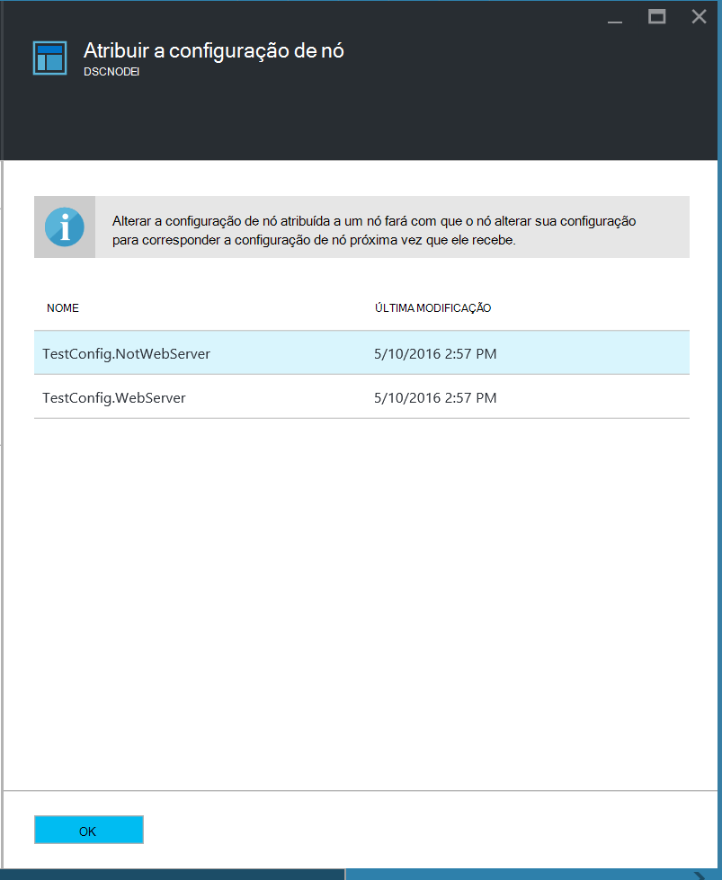

<properties
   pageTitle="Introdução ao DSC de automação do Azure"
   description="Explicações e exemplos das tarefas mais comuns no Azure automação desejado estado configuração (DSC)"
   services="automation" 
   documentationCenter="na" 
   authors="eslesar" 
   manager="dongill" 
   editor="tysonn"/>

<tags
   ms.service="automation"
   ms.devlang="na"
   ms.topic="article"
   ms.tgt_pltfrm="powershell"
   ms.workload="na" 
   ms.date="06/06/2016"
   ms.author="magoedte;eslesar"/>
   

# <a name="getting-started-with-azure-automation-dsc"></a>Introdução ao DSC de automação do Azure

Este tópico explica como executar as tarefas mais comuns com Azure automação desejado estado configuração (DSC), como criar, importar e compilar configurações, máquinas de integração de gerenciar e exibindo relatórios. Para obter uma visão geral do que existe DSC de automação do Azure, consulte [Visão geral de DSC de automação do Azure](automation-dsc-overview.md). Para documentação de DSC, consulte [Windows PowerShell desejado estado visão geral da configuração](https://msdn.microsoft.com/PowerShell/dsc/overview).

Este tópico fornece um guia passo a passo para usar DSC de automação do Azure. Se você quiser um ambiente de exemplo que já está configurado sem seguir as etapas descritas neste tópico, você pode usar [o modelo de BRAÇO a seguir](https://github.com/azureautomation/automation-packs/tree/master/102-sample-automation-setup). Este modelo configura em um ambiente de DSC de automação do Azure concluído, incluindo uma máquina virtual do Azure que é gerenciado pelo DSC de automação do Azure.
 
## <a name="prerequisites"></a>Pré-requisitos

Para concluir os exemplos deste tópico, é necessário o seguinte:

- Uma conta de automação do Azure. Para obter instruções sobre como criar uma conta do Azure os automação executar como, consulte [Executar como conta do Azure](automation-sec-configure-azure-runas-account.md).
- Um gerente de recursos VM Azure (não clássico) executando o Windows Server 2008 R2 ou posterior. Para obter instruções sobre como criar uma máquina virtual, consulte [criar sua primeira máquina virtual Windows no portal do Azure](../virtual-machines/virtual-machines-windows-hero-tutorial.md)

## <a name="creating-a-dsc-configuration"></a>Criando uma configuração de DSC

Vamos criar uma [configuração de DSC](https://msdn.microsoft.com/powershell/dsc/configurations) simples que garante a presença ou ausência do **Servidor Web** Windows recurso (IIS), dependendo de como você atribuir nós.

1. Inicie o Windows PowerShell ISE (ou qualquer editor de texto).

2. Digite o texto a seguir:

    ```powershell
    configuration TestConfig
    {
        Node WebServer
        {
            WindowsFeature IIS
            {
                Ensure               = 'Present'
                Name                 = 'Web-Server'
                IncludeAllSubFeature = $true

            }
        }

        Node NotWebServer
        {
            WindowsFeature IIS
            {
                Ensure               = 'Absent'
                Name                 = 'Web-Server'

            }
        }
        }
    ```
3. Salve o arquivo como `TestConfig.ps1`.

Essa configuração chamadas de um recurso em cada bloco de nó, o [recurso de WindowsFeature](https://msdn.microsoft.com/powershell/dsc/windowsfeatureresource), que garante a presença ou ausência do recurso de **Servidor Web** .

## <a name="importing-a-configuration-into-azure-automation"></a>Importar uma configuração para automação do Azure

Em seguida, podemos vai importar a configuração para a conta de automação.

1. Entrar no [portal do Azure](https://portal.azure.com).

2. No menu Hub, clique em **todos os recursos** e, em seguida, o nome da sua conta de automação.

3. Na lâmina **conta de automação** , clique em **Configurações de DSC**.

4. Na lâmina **DSC configurações** , clique em **Adicionar uma configuração**.

5. Na lâmina **Configuração de importação** , navegue até o `TestConfig.ps1` arquivo em seu computador.
    
    
    

6. Clique em **Okey**.

## <a name="viewing-a-configuration-in-azure-automation"></a>Exibindo uma configuração na automação do Azure

Depois que você importou uma configuração, você pode exibi-la no portal do Azure.

1. Entrar no [portal do Azure](https://portal.azure.com).

2. No menu Hub, clique em **todos os recursos** e, em seguida, o nome da sua conta de automação.

3. Na lâmina **conta de automação** , clique em **Configurações de DSC**

4. Na lâmina **DSC configurações** , clique em **TestConfig** (Este é o nome da configuração que você importou no procedimento anterior).

5. Na lâmina **TestConfig configuração** , clique em **fonte de configuração de exibição**.

    
    
    Um blade **fonte TestConfig configuração** é aberta, exibindo o código do PowerShell para a configuração.
    
## <a name="compiling-a-configuration-in-azure-automation"></a>Compilar uma configuração na automação do Azure

Antes de aplicar um estado desejado para um nó, uma configuração de DSC definindo estado deve ser compilada em uma ou mais configurações de nó (documento MOF) e colocada no servidor de recebimento de automação DSC. Para obter uma descrição mais detalhada de compilação de configurações no Azure automação DSC, consulte [Compilar configurações em DSC de automação do Azure](automation-dsc-compile.md). Para obter mais informações sobre configurações de compilar, consulte [Configurações de DSC](https://msdn.microsoft.com/PowerShell/DSC/configurations).

1. Entrar no [portal do Azure](https://portal.azure.com).

2. No menu Hub, clique em **todos os recursos** e, em seguida, o nome da sua conta de automação.

3. Na lâmina **conta de automação** , clique em **Configurações de DSC**

4. Na lâmina **DSC configurações** , clique em **TestConfig** (o nome da configuração importado anteriormente).

5. Na lâmina **TestConfig configuração** , clique em **Compilar**e, em seguida, clique em **Sim**. Isso inicia um trabalho de compilação.
    
    
    
> [AZURE.NOTE] Quando você compila uma configuração na automação do Azure, implanta automaticamente qualquer arquivo de configuração do nó criado no servidor de recebimento.

## <a name="viewing-a-compilation-job"></a>Exibindo um trabalho de compilação

Depois de iniciar uma compilação, você pode exibi-la no bloco **trabalhos de compilação** na lâmina **configuração** . O bloco de **trabalhos de compilação** mostra em execução, concluído e falha trabalhos. Quando você abre um blade de trabalho de compilação, ele mostra informações sobre esse trabalho incluindo erros ou avisos encontrados, parâmetros de entrada usado na configuração e compilação logs.

1. Entrar no [portal do Azure](https://portal.azure.com).

2. No menu Hub, clique em **todos os recursos** e, em seguida, o nome da sua conta de automação.

3. Na lâmina **conta de automação** , clique em **Configurações de DSC**.

4. Na lâmina **DSC configurações** , clique em **TestConfig** (o nome da configuração importado anteriormente).

5. No bloco **trabalhos de compilação** do blade **TestConfig configuração** , clique em qualquer um dos trabalhos listados. Uma lâmina de **Trabalho de compilação** é aberta, rotulada com a data em que o trabalho de compilação iniciado.

    
  
6. Clique em qualquer bloco na lâmina **Trabalho de compilação** para ver mais detalhes sobre o trabalho.

## <a name="viewing-node-configurations"></a>Configurações de nós de visualização

Conclusão bem-sucedida de um trabalho de compilação cria uma ou mais novas configurações de nó. A configuração de um nó é um documento MOF que é implantado no servidor de recebimento e pronto para ser recebido e aplicado por um ou mais nós. Você pode exibir as configurações de nó em sua conta de automação na lâmina **DSC nó configurações** . Uma configuração de nó tem um nome com o formulário *ConfigurationName*. *NodeName*.

1. Entrar no [portal do Azure](https://portal.azure.com).

2. No menu Hub, clique em **todos os recursos** e, em seguida, o nome da sua conta de automação.

3. Na lâmina **conta de automação** , clique em **Configurações de nós DSC**.

    
    
## <a name="onboarding-an-azure-vm-for-management-with-azure-automation-dsc"></a>Integração um Azure máquina virtual gerenciamento com DSC de automação do Azure

Você pode usar DSC de automação do Azure para gerenciar VMs Azure (clássico e Gerenciador de recursos), locais VMs, máquinas Linux, AWS VMs e máquinas físicas local. Neste tópico, cobriremos como integrado VMs somente de Gerenciador de recursos do Azure. Para obter informações sobre integração outros tipos de máquinas, consulte [máquinas de integração para gerenciamento do Azure automação nome da importação](automation-dsc-onboarding.md).

### <a name="to-onboard-an-azure-resource-manager-vm-for-management-by-azure-automation-dsc"></a>Integrado para um gerente de recursos VM Azure para gerenciamento do Azure automação nome da importação

1. Entrar no [portal do Azure](https://portal.azure.com).

2. No menu Hub, clique em **todos os recursos** e, em seguida, o nome da sua conta de automação.

3. Na lâmina **conta de automação** , clique em **Nós DSC**.

4. Na lâmina **DSC nós** , clique em **Adicionar máquina virtual do Azure**.

    

5. Na lâmina **Adicionar VMs do Azure** , clique em **Selecionar máquinas virtuais integrado**.

6. Na lâmina **Selecione VMs** , selecione a máquina virtual que você deseja integrado e clique em **Okey**.

    >[AZURE.IMPORTANT] Este valor deve ser um gerente de recursos VM Azure executando o Windows Server 2008 R2 ou posterior.
    
7. Na lâmina **Adicionar VMs do Azure** , clique em **Configurar dados de registro**.

8. Na lâmina **registro** , digite o nome da configuração do nó que você deseja aplicar para a máquina virtual na caixa **Nome de configuração de nó** . Isso deve corresponder exatamente ao nome de uma configuração de nós na conta de automação. Fornecer um nome nesse momento é opcional. Você pode alterar a configuração de nó atribuído após o nó de integração.
Verificar o **Nó reinicializar se necessário**e clique em **Okey**.
    
    
    
    A configuração de nó especificada será aplicada para a máquina virtual em intervalos especificados pela **Frequência de modo de configuração**e a máquina virtual será verificar se há atualizações para a configuração de nó em intervalos especificados pela **Frequência de atualização**. Para obter mais informações sobre como esses valores são usados, consulte [Configurar o Gerenciador de configuração de Local](https://msdn.microsoft.com/PowerShell/DSC/metaConfig).
    
9. Na lâmina **Adicionar VMs do Azure** , clique em **criar**.

Azure iniciará o processo de integração a máquina virtual. Quando ela for concluída, a máquina virtual aparecerá na lâmina **DSC nós** na conta de automação.

## <a name="viewing-the-list-of-dsc-nodes"></a>Exibindo a lista de nós DSC

Você pode exibir a lista de todos os computadores que foram onboarded para gerenciamento em sua conta de automação na lâmina **DSC nós** .

1. Entrar no [portal do Azure](https://portal.azure.com).

2. No menu Hub, clique em **todos os recursos** e, em seguida, o nome da sua conta de automação.

3. Na lâmina **conta de automação** , clique em **Nós DSC**.

## <a name="viewing-reports-for-dsc-nodes"></a>Exibindo relatórios para nós DSC

Toda vez que DSC de automação do Azure executa uma verificação de consistência em um nó gerenciado, o nó envia um relatório de status para o servidor de recebimento. Você pode visualizar esses relatórios no blade para esse nó.

1. Entrar no [portal do Azure](https://portal.azure.com).

2. No menu Hub, clique em **todos os recursos** e, em seguida, o nome da sua conta de automação.

3. Na lâmina **conta de automação** , clique em **Nós DSC**.

4. No bloco **relatórios** , clique em qualquer um dos relatórios na lista.

    

Na lâmina para um relatório individual, você pode ver as seguintes informações de status para a verificação de consistência correspondentes:

- O status de relatório — se o nó é "Compatível com", a configuração "Falhou", ou "o nó não é compatível com" (quando o nó está no modo de **applyandmonitor** e o computador não estiver em estado desejado).
- A hora de início para a verificação de consistência.
- O tempo de execução total para a verificação de consistência.
- O tipo de verificação de consistência.
- Todos os erros, incluindo o código de erro e mensagem de erro. 
- Os recursos de DSC usados na configuração e o estado de cada recurso (se o nó é no estado desejado para o recurso) — você pode clicar em cada recurso para obter informações mais detalhadas para o recurso.
- O nome, o endereço IP e o modo de configuração do nó.

Você também pode clicar em **Exibir relatório bruto** para ver os dados reais que o nó envia para o servidor. Para obter mais informações sobre como usar esses dados, consulte [usando um servidor de relatório DSC](https://msdn.microsoft.com/powershell/dsc/reportserver).

Pode levar algum tempo depois de um nó é onboarded antes do primeiro relatório está disponível. Talvez seja necessário aguardar até 30 minutos para o primeiro relatório após você integrado um nó.

## <a name="reassigning-a-node-to-a-different-node-configuration"></a>Reatribuição de um nó para a configuração de um nó diferente

Você pode atribuir um nó para usar a configuração de um nó diferente daquela que inicialmente atribuída a você.

1. Entrar no [portal do Azure](https://portal.azure.com).

2. No menu Hub, clique em **todos os recursos** e, em seguida, o nome da sua conta de automação.

3. Na lâmina **conta de automação** , clique em **Nós DSC**.

4. Na lâmina **Nós DSC** , clique no nome do nó que você deseja reatribuir.

5. Na lâmina para esse nó, clique em **atribuir nó**.

    

6. Na lâmina **Atribuir a configuração de nós** , selecione a configuração de nós ao qual você deseja atribuir o nó e clique em **Okey**.

    
    
## <a name="unregistering-a-node"></a>Cancelando o registro de um nó

Se você não quiser mais um nó a ser gerenciado pelo DSC de automação do Azure, você pode cancelar o registro-lo.

1. Entrar no [portal do Azure](https://portal.azure.com).

2. No menu Hub, clique em **todos os recursos** e, em seguida, o nome da sua conta de automação.

3. Na lâmina **conta de automação** , clique em **Nós DSC**.

4. Na lâmina **Nós DSC** , clique no nome do nó que você deseja cancelar o registro.

5. Na lâmina para esse nó, clique em **Cancelar registro**.

    

## <a name="related-articles"></a>Artigos relacionados
* [Visão geral de automação DSC Azure](automation-dsc-overview.md)
* [Integração máquinas para gerenciamento do Azure automação nome da importação](automation-dsc-onboarding.md)
* [Visão geral da configuração de estado de desejado do Windows PowerShell](https://msdn.microsoft.com/powershell/dsc/overview)
* [Cmdlets de automação DSC Azure](https://msdn.microsoft.com/library/mt244122.aspx)
* [Preços do Azure DSC de automação](https://azure.microsoft.com/pricing/details/automation/)

