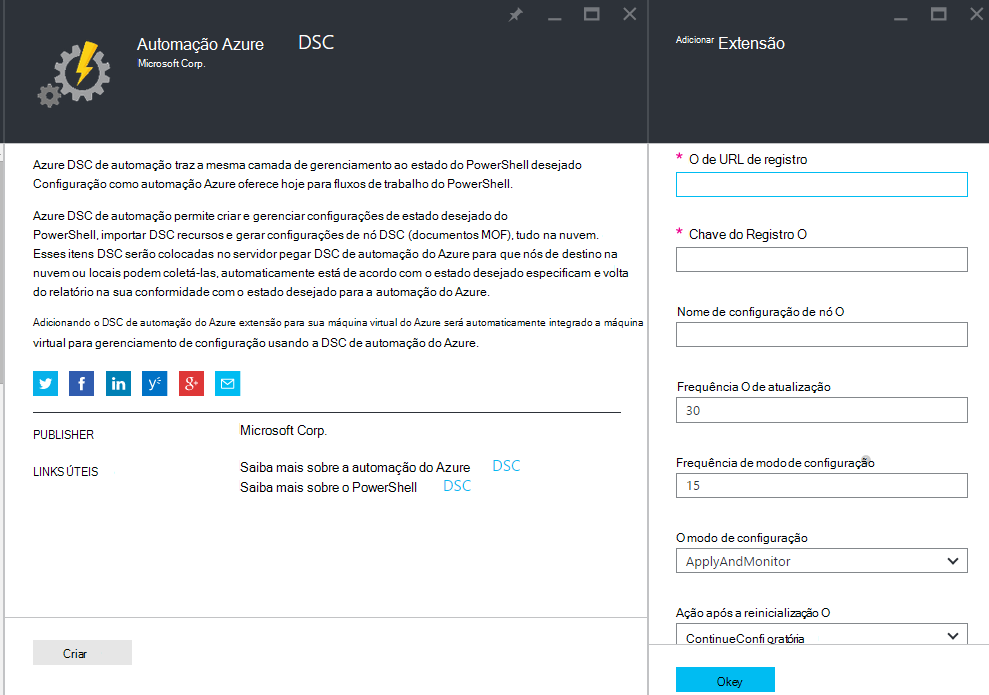
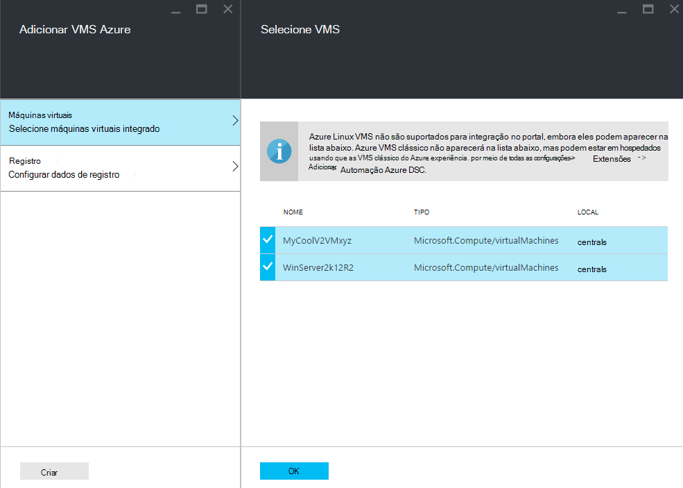
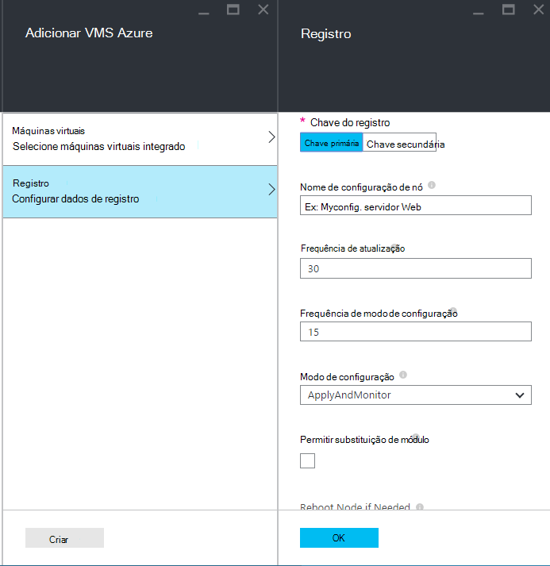
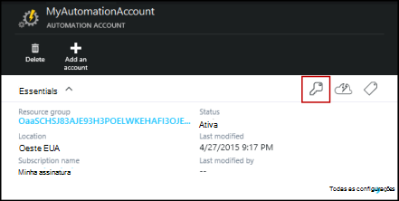
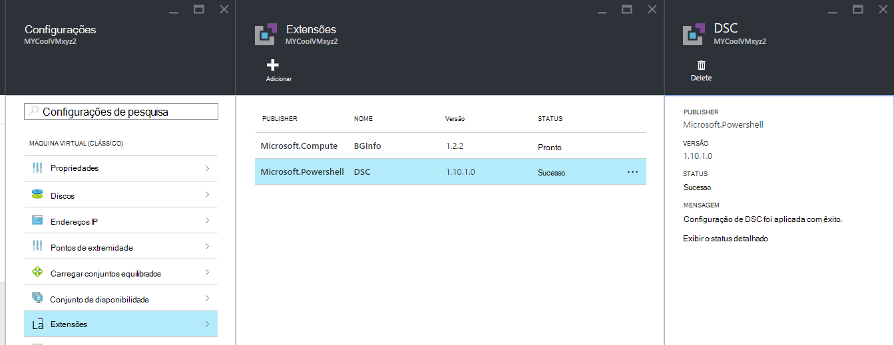

<properties 
   pageTitle="Máquinas de integração físicas e virtuais para gerenciamento de nome da importação automação Azure | Microsoft Azure" 
   description="Como configurar máquinas para gerenciamento com DSC de automação do Azure" 
   services="automation" 
   documentationCenter="dev-center-name" 
   authors="coreyp-at-msft" 
   manager="stevenka" 
   editor="tysonn"/>

<tags
   ms.service="automation"
   ms.devlang="NA"
   ms.topic="article"
   ms.tgt_pltfrm="powershell"
   ms.workload="TBD" 
   ms.date="04/22/2016"
   ms.author="coreyp"/>

# Integração máquinas para gerenciamento do Azure automação nome da importação

## Por que gerenciar máquinas com DSC de automação do Azure?

Como [Configuração de estado desejado do PowerShell](https://technet.microsoft.com/library/dn249912.aspx), a configuração de estado desejado do Azure automação é um serviço de gerenciamento de configuração simples, mas poderosa, para nós de DSC (máquinas físicas e virtuais) em qualquer data center nuvem ou local. Ele permite escalabilidade entre milhares de máquinas rapidamente e facilmente de um local central e seguro. Você pode facilmente integradas máquinas, atribua-los configurações declarativas e exibir relatórios mostrando cada máquina da conformidade com o estado desejado especificado. A camada de gerenciamento do Azure automação DSC é DSC o que é a camada de gerenciamento de automação do Azure para scripts do PowerShell. Em outras palavras, da mesma forma que a automação do Azure ajuda você a gerenciar scripts do PowerShell, ele também ajuda a gerenciar configurações de DSC. Para saber mais sobre os benefícios de usar DSC de automação do Azure, consulte [Visão geral do Azure automação DSC](automation-dsc-overview.md). 

Azure DSC de automação pode ser usado para gerenciar uma variedade de máquinas:

*    Azure máquinas virtuais (clássico)
*    Azure máquinas virtuais
*    Máquinas virtuais de Amazon Web Services (AWS)
*    Windows físicos/virtuais máquinas no local, ou em uma nuvem diferente do Azure/AWS
*    Linux físicos/virtuais máquinas no local, no Azure ou em uma nuvem diferente do Azure

Além disso, se você não estiver pronto para gerenciar a configuração de máquina da nuvem, DSC de automação do Azure também pode ser usado como um ponto de extremidade somente de relatório. Isso permite que você defina a configuração desejada (push) por meio de DSC local e exibir detalhes de relatórios avançadas em conformidade de nó com o estado desejado na automação do Azure.

As seções a seguir descrevem como você pode integrado cada tipo de máquina DSC de automação do Azure.

## Azure máquinas virtuais (clássico)

Com o Azure automação DSC, você pode facilmente integradas máquinas virtuais Azure (clássico) para gerenciamento de configuração usando o portal do Azure, ou PowerShell. Nos bastidores e sem um administrador precisar remoto para a máquina virtual, a extensão de configuração de estado desejado do Azure máquina virtual registra a máquina virtual com DSC de automação do Azure. Como a extensão de configuração de estado desejado do Azure máquina virtual assíncrona, executa as etapas para acompanhar seu progresso ou solucionar-são fornecidas na seção [**integração de máquina virtual do Azure para solução de problemas**](#troubleshooting-azure-virtual-machine-onboarding) abaixo.

### Portal do Azure

No [portal do Azure](http://portal.azure.com/), clique em **Procurar** -> **máquinas virtuais (clássico)**. Selecione a máquina de virtual do Windows que você deseja integrado. Na lâmina de painel da máquina virtual, clique em **todas as configurações** -> **extensões** -> **Adicionar** -> **DSC de automação do Azure** -> **criar**. Insira os [valores do Gerenciador de configuração do PowerShell DSC Local](https://msdn.microsoft.com/powershell/dsc/metaconfig4) necessários para o caso de uso, chave do registro da sua conta de automação e URL de registro e, opcionalmente, uma configuração de nó atribuir para a máquina virtual.

Para localizar o registro URL e chave para a automação de conta para integrados a máquina para, consulte a seção abaixo [**proteger o registro**](#secure-registration) .

### PowerShell

    # log in to both Azure Service Management and Azure Resource Manager
    Add-AzureAccount
    Add-AzureRmAccount
    
    # fill in correct values for your VM/Automation account here
    $VMName = ""
    $ServiceName = ""
    $AutomationAccountName = ""
    $AutomationAccountResourceGroup = ""

    # fill in the name of a Node Configuration in Azure Automation DSC, for this VM to conform to
    $NodeConfigName = ""

    # get Azure Automation DSC registration info
    $Account = Get-AzureRmAutomationAccount -ResourceGroupName $AutomationAccountResourceGroup -Name $AutomationAccountName
    $RegistrationInfo = $Account | Get-AzureRmAutomationRegistrationInfo

    # use the DSC extension to onboard the VM for management with Azure Automation DSC
    $VM = Get-AzureVM -Name $VMName -ServiceName $ServiceName
    
    $PublicConfiguration = ConvertTo-Json -Depth 8 @{
      SasToken = ""
      ModulesUrl = "https://eus2oaasibizamarketprod1.blob.core.windows.net/automationdscpreview/RegistrationMetaConfigV2.zip"
      ConfigurationFunction = "RegistrationMetaConfigV2.ps1\RegistrationMetaConfigV2"

    # update these PowerShell DSC Local Configuration Manager defaults if they do not match your use case.
    # See https://technet.microsoft.com/library/dn249922.aspx?f=255&MSPPError=-2147217396 for more details
     Properties = @{
        RegistrationKey = @{
          UserName = 'notused'
          Password = 'PrivateSettingsRef:RegistrationKey'
        }
        RegistrationUrl = $RegistrationInfo.Endpoint
        NodeConfigurationName = $NodeConfigName
        ConfigurationMode = "ApplyAndMonitor"
        ConfigurationModeFrequencyMins = 15
        RefreshFrequencyMins = 30
        RebootNodeIfNeeded = $False
        ActionAfterReboot = "ContinueConfiguration"
        AllowModuleOverwrite = $False
      }
    }

    $PrivateConfiguration = ConvertTo-Json -Depth 8 @{
      Items = @{
         RegistrationKey = $RegistrationInfo.PrimaryKey
      }
    }
    
    $VM = Set-AzureVMExtension `
     -VM $vm `
     -Publisher Microsoft.Powershell `
     -ExtensionName DSC `
     -Version 2.19 `
     -PublicConfiguration $PublicConfiguration `
     -PrivateConfiguration $PrivateConfiguration `
     -ForceUpdate

    $VM | Update-AzureVM

## Azure máquinas virtuais

Azure DSC de automação permite que você facilmente integradas máquinas virtuais Azure para gerenciamento de configuração, usando o portal do Azure, modelos do Gerenciador de recursos do Azure ou PowerShell. Nos bastidores e sem um administrador precisar remoto para a máquina virtual, a extensão de configuração de estado desejado do Azure máquina virtual registra a máquina virtual com DSC de automação do Azure. Como a extensão de configuração de estado desejado do Azure máquina virtual assíncrona, executa as etapas para acompanhar seu progresso ou solucionar-são fornecidas na seção [**integração de máquina virtual do Azure para solução de problemas**](#troubleshooting-azure-virtual-machine-onboarding) abaixo.

### Portal do Azure

No [portal do Azure](https://portal.azure.com/), navegue até a conta de automação do Azure onde você deseja integradas máquinas virtuais. No painel de conta automação, clique em **DSC nós** -> **Adicionar máquina virtual do Azure**.

Em **Selecionar máquinas virtuais integrado**, selecione um ou mais Azure máquinas virtuais integrado.

Em **Configurar dados de registro**, digite os [valores do Gerenciador de configuração do PowerShell DSC Local](https://msdn.microsoft.com/powershell/dsc/metaconfig4) necessários para o caso de uso e, opcionalmente, uma configuração de nó atribuir para a máquina virtual.

 
### Modelos do Azure Gerenciador de recursos

Azure máquinas virtuais pode ser implantadas e onboarded ao Azure automação DSC por meio de modelos do Gerenciador de recursos do Azure. Consulte [Configurar uma máquina virtual por meio de extensão DSC e DSC de automação do Azure](https://azure.microsoft.com/documentation/templates/dsc-extension-azure-automation-pullserver/) para um modelo de exemplo que onboards uma máquina virtual existente para DSC de automação do Azure. Para localizar a chave do registro e a URL de registro interpretada como entrada neste modelo, consulte a seção de [**proteger o registro**](#secure-registration) abaixo.

### PowerShell

O cmdlet [AzureRmAutomationDscNode de registro](https://msdn.microsoft.com/library/mt603833.aspx) pode ser usados para máquinas virtuais integradas no portal do Azure por meio do PowerShell.

## Máquinas virtuais de Amazon Web Services (AWS)

Você pode facilmente integradas máquinas virtuais de Amazon Web Services para gerenciamento de configuração do Azure automação nome da importação usando o Kit de ferramentas de DSC AWS. Você pode saber mais sobre o Kit de ferramentas [aqui](https://blogs.msdn.microsoft.com/powershell/2016/04/20/aws-dsc-toolkit/).

## Windows físicos/virtuais máquinas no local, ou em uma nuvem diferente do Azure/AWS

Máquinas do Windows local e máquinas em nuvens não Azure (como Amazon Web Services) também podem ser onboarded para DSC de automação do Azure, desde que eles têm acesso de saída na Internet, por meio de algumas etapas simples:

1. Verifique se que a versão mais recente do [WMF 5](http://aka.ms/wmf5latest) é instalada nas máquinas que você deseja integrado ao DSC de automação do Azure.
2. Siga as instruções na seção [**Gerando DSC metaconfigurations**](#generating-dsc-metaconfigurations) abaixo para gerar uma pasta que contém o metaconfigurations DSC necessários.
3. Aplica remotamente a metaconfiguration PowerShell DSC para as máquinas que você deseja integrado. **A máquina que este comando é executado no deve ter a versão mais recente do [WMF 5](http://aka.ms/wmf5latest) instalado**:

    `Set-DscLocalConfigurationManager -Path C:\Users\joe\Desktop\DscMetaConfigs -ComputerName MyServer1, MyServer2`

4. Se você não pode aplicar o metaconfigurations PowerShell DSC remotamente, copie a pasta de metaconfigurations da etapa 2 para cada máquina para integrado. Ligue para **Set-DscLocalConfigurationManager** localmente em cada máquina para integrado.
5. Usando o portal do Azure ou os cmdlets, verifique se as máquinas a integrado agora aparecem como nós DSC registrados em sua conta de automação do Azure.

## Linux físicos/virtuais máquinas no local, no Azure ou em uma nuvem diferente do Azure

Local Linux máquinas, máquinas Linux no Azure e máquinas Linux em nuvens não Azure também podem ser onboarded para DSC de automação do Azure, desde que eles têm acesso de saída na Internet, por meio de algumas etapas simples:

1. Verifique se que a versão mais recente do [agente de DSC Linux](http://www.microsoft.com/download/details.aspx?id=49150) é instalada nas máquinas que você deseja integrado ao DSC de automação do Azure.

2. Se os [padrões de Gerenciador de configuração do PowerShell DSC Local](https://msdn.microsoft.com/powershell/dsc/metaconfig4) corresponder ao seu caso de uso, e você desejar para integrado máquinas tal que eles **Extrair da tanto relatório a DSC de automação do Azure** :

    *    Em cada máquina Linux para integrado ao Azure automação DSC, use Register.py para integrado usando os padrões do Gerenciador de configuração do PowerShell DSC Local:

        `/opt/microsoft/dsc/Scripts/Register.py <Automation account registration key> <Automation account registration URL>`

    *    Para localizar a chave do registro e a URL de registro para sua conta de automação, consulte a seção de [**proteger o registro**](#secure-registration) abaixo.

    Se o Gerenciador de configuração do PowerShell DSC Local padrões **faça** **não** coincidir seu caso de uso, ou quando quiser máquinas integradas, de forma que eles relatório apenas a DSC de automação do Azure, mas siga não configuração de recepção ou módulos do PowerShell dele, siga as etapas 3 a 6. Caso contrário, vá diretamente para a etapa 6.

3.  Siga as instruções na seção [**Gerando DSC metaconfigurations**](#generating-dsc-metaconfigurations) abaixo para gerar uma pasta que contém o metaconfigurations DSC necessários.
4.  Aplica remotamente a metaconfiguration PowerShell DSC as máquinas que você deseja integrado:
        
        $SecurePass = ConvertTo-SecureString -String "<root password>" -AsPlainText -Force
        $Cred = New-Object System.Management.Automation.PSCredential "root", $SecurePass
        $Opt = New-CimSessionOption -UseSsl -SkipCACheck -SkipCNCheck -SkipRevocationCheck

        # need a CimSession for each Linux machine to onboard
        
        $Session = New-CimSession -Credential $Cred -ComputerName <your Linux machine> -Port 5986 -Authentication basic -SessionOption $Opt
        
        Set-DscLocalConfigurationManager -CimSession $Session –Path C:\Users\joe\Desktop\DscMetaConfigs
    
A esse comando é executado a partir de máquina deve ter a versão mais recente do [WMF 5](http://aka.ms/wmf5latest) instalado.

5.  Se você não pode aplicar o metaconfigurations PowerShell DSC remotamente, para cada máquina Linux integrado, copie o metaconfiguration correspondente a máquina da pasta na etapa 5 na máquina Linux. Em seguida, chame `SetDscLocalConfigurationManager.py` localmente em cada computador Linux desejada para integrado ao Azure automação DSC:

    `/opt/microsoft/dsc/Scripts/SetDscLocalConfigurationManager.py –configurationmof <path to metaconfiguration file>`

6.  Usando o portal do Azure ou os cmdlets, verifique se as máquinas a integrado agora aparecem como nós DSC registrados em sua conta de automação do Azure.

##Gerando DSC metaconfigurations
A forma genérica integrado qualquer máquina DSC de automação do Azure, um metaconfiguration DSC pode ser gerado que, quando aplicado, informa o agente de DSC na máquina para extrair da e/ou relatório a DSC de automação do Azure. Metaconfigurations DSC do Azure automação DSC pode ser gerado usando uma configuração de PowerShell DSC ou os cmdlets do PowerShell de automação do Azure.

**Observação:** Metaconfigurations DSC contêm as senhas necessário integrado uma máquina para uma automação conta para gerenciamento. Certifique-se de proteger corretamente qualquer metaconfigurations DSC que criar ou excluí-las após o uso.

###Usando uma configuração de DSC
1.  Abra o PowerShell ISE como administrador em um computador no seu ambiente local. A máquina deve ter a versão mais recente do [WMF 5](http://aka.ms/wmf5latest) instalado.

2.  Copie o seguinte script localmente. Este script contém uma configuração de DSC do PowerShell para criação de metaconfigurations e um comando para iniciar a criação de metaconfiguration.
    
        # The DSC configuration that will generate metaconfigurations
        [DscLocalConfigurationManager()]
        Configuration DscMetaConfigs 
        { 
            param 
            ( 
                [Parameter(Mandatory=$True)] 
                [String]$RegistrationUrl,
         
                [Parameter(Mandatory=$True)] 
                [String]$RegistrationKey,

                [Parameter(Mandatory=$True)] 
                [String[]]$ComputerName,

                [Int]$RefreshFrequencyMins = 30, 
            
                [Int]$ConfigurationModeFrequencyMins = 15, 
            
                [String]$ConfigurationMode = "ApplyAndMonitor", 
            
                [String]$NodeConfigurationName,

                [Boolean]$RebootNodeIfNeeded= $False,

                [String]$ActionAfterReboot = "ContinueConfiguration",

                [Boolean]$AllowModuleOverwrite = $False,

                [Boolean]$ReportOnly
            )

    
            if(!$NodeConfigurationName -or $NodeConfigurationName -eq "") 
            { 
                $ConfigurationNames = $null 
            } 
            else 
            { 
                $ConfigurationNames = @($NodeConfigurationName) 
            }

            if($ReportOnly)
            {
               $RefreshMode = "PUSH"
            }
            else
            {
               $RefreshMode = "PULL"
            }

            Node $ComputerName
            {

                Settings 
                { 
                    RefreshFrequencyMins = $RefreshFrequencyMins 
                    RefreshMode = $RefreshMode 
                    ConfigurationMode = $ConfigurationMode 
                    AllowModuleOverwrite = $AllowModuleOverwrite 
                    RebootNodeIfNeeded = $RebootNodeIfNeeded 
                    ActionAfterReboot = $ActionAfterReboot 
                    ConfigurationModeFrequencyMins = $ConfigurationModeFrequencyMins 
                }

                if(!$ReportOnly)
                {
                   ConfigurationRepositoryWeb AzureAutomationDSC 
                    { 
                        ServerUrl = $RegistrationUrl 
                        RegistrationKey = $RegistrationKey 
                        ConfigurationNames = $ConfigurationNames 
                    }

                    ResourceRepositoryWeb AzureAutomationDSC 
                    { 
                       ServerUrl = $RegistrationUrl 
                       RegistrationKey = $RegistrationKey 
                    }
                }

                ReportServerWeb AzureAutomationDSC 
                { 
                    ServerUrl = $RegistrationUrl 
                    RegistrationKey = $RegistrationKey 
                }
            } 
        }
        
        # Create the metaconfigurations
        # TODO: edit the below as needed for your use case
        $Params = @{
             RegistrationUrl = '<fill me in>';
             RegistrationKey = '<fill me in>';
             ComputerName = @('<some VM to onboard>', '<some other VM to onboard>');
             NodeConfigurationName = 'SimpleConfig.webserver';
             RefreshFrequencyMins = 30;
             ConfigurationModeFrequencyMins = 15;
             RebootNodeIfNeeded = $False;
             AllowModuleOverwrite = $False;
             ConfigurationMode = 'ApplyAndMonitor';
             ActionAfterReboot = 'ContinueConfiguration';
             ReportOnly = $False;  # Set to $True to have machines only report to AA DSC but not pull from it
        }
        
        # Use PowerShell splatting to pass parameters to the DSC configuration being invoked
        # For more info about splatting, run: Get-Help -Name about_Splatting
        DscMetaConfigs @Params

3.  Preencha a chave do registro e a URL para sua conta de automação, bem como os nomes das máquinas para integrado. Todos os outros parâmetros são opcionais. Para localizar a chave do registro e a URL de registro para sua conta de automação, consulte a seção de [**proteger o registro**](#secure-registration) abaixo.

4.  Se desejar que as máquinas relatar informações de status de DSC ao Azure automação DSC, mas não puxe configuração ou módulos do PowerShell, defina o parâmetro **ReportOnly** como true.

5.  Execute o script. Agora você deve ter uma pasta chamada **DscMetaConfigs** no diretório de trabalho, que contém o metaconfigurations PowerShell DSC para as máquinas para integrado.

###Usando os cmdlets de automação do Azure
Se os padrões de Gerenciador de configuração do PowerShell DSC Local corresponder ao seu caso de uso e deseja máquinas integradas, para que eles extrair da tanto relatório a DSC de automação do Azure, os cmdlets de automação do Azure fornecem um método simplificado de gerar o metaconfigurations DSC necessário:

1.  Abra o console do PowerShell ou PowerShell ISE como administrador em uma máquina no seu ambiente local.

2.  Conectar-se ao Azure Gerenciador de recursos usando **Adicionar AzureRmAccount**

3.  Baixe o metaconfigurations PowerShell DSC para as máquinas que você deseja para integrado da conta de automação à qual você deseja nós integrado:

        # Define the parameters for Get-AzureRmAutomationDscOnboardingMetaconfig using PowerShell Splatting
        $Params = @{
            ResourceGroupName = 'ContosoResources'; # The name of the ARM Resource Group that contains your Azure Automation Account
            AutomationAccountName = 'ContosoAutomation'; # The name of the Azure Automation Account where you want a node on-boarded to
            ComputerName = @('web01', 'web02', 'sql01'); # The names of the computers that the meta configuration will be generated for
            OutputFolder = "$env:UserProfile\Desktop\";
        }
        
        # Use PowerShell splatting to pass parameters to the Azure Automation cmdlet being invoked
        # For more info about splatting, run: Get-Help -Name about_Splatting
        Get-AzureRmAutomationDscOnboardingMetaconfig @Params

Agora você deve ter uma pasta chamada ***DscMetaConfigs***, que contém o metaconfigurations PowerShell DSC para as máquinas para integrado.

##Proteger o registro

Máquinas com segurança integrada podem a uma conta de automação do Azure através do protocolo de registro WMF 5 DSC, que permite que um nó DSC autenticar em um servidor do PowerShell DSC V2 retirar ou de relatórios (incluindo Azure automação DSC). O nó registra ao servidor em uma **URL de registro**, autenticar usando uma **chave do registro**. Durante o registro, o nó de DSC e o servidor de DSC pegar/relatórios negociem um certificado exclusivo para este nó usar autenticação para o registro de POST do servidor. Esse processo impede que nós onboarded representando uma que outra, por exemplo, se um nó for comprometida e comportamento mal-intencionado. Depois do registro, a chave do registro não é usada para autenticação novamente e é excluída do nó.

Você pode obter as informações necessárias para o protocolo de registro de DSC da lâmina do **Gerenciamento de chaves** no portal do Azure preview. Abra este blade clicando no ícone de chave no painel **Essentials** para a conta de automação.

*    URL do registro é o campo de URL na lâmina gerenciamento de chaves.
*    Chave do registro é a chave primária de acesso ou tecla de acesso secundário na lâmina gerenciamento de chaves. Qualquer chave pode ser usada.

Para maior segurança, as teclas de acesso primário e secundário de uma conta de automação podem ser gerado novamente a qualquer momento (na lâmina **Gerenciamento de chaves** ) para impedir que os registros de nó futuro usando chaves anteriores.

##Integração do Azure máquina virtual de solução de problemas

Azure DSC de automação permite que você facilmente integrado VMs do Windows Azure para gerenciamento de configuração. Nos bastidores, a extensão de configuração de estado desejado do Azure máquina virtual é usada para registrar a máquina virtual com DSC de automação do Azure. Como a extensão de configuração de estado desejado do Azure máquina virtual executa assíncrona, acompanhar o seu progresso e sua execução de solução de problemas podem ser importantes. 

>[AZURE.NOTE] Qualquer método de integração uma VM do Windows Azure para DSC de automação do Azure que usa a extensão de configuração de estado desejado do Azure máquina virtual pode levar uma hora para o nó mostrar até, conforme registrado na automação do Azure. Isso é devido a instalação do Windows Management Framework 5.0 na VM pela extensão DSC de máquina virtual do Azure, que é necessária para integrado na máquina virtual para DSC de automação do Azure.

Para solucionar problemas ou exibir o status da extensão de configuração de estado desejado do Azure máquina virtual, no Azure portal navegar para a máquina virtual sendo onboarded, em seguida, clique -> **todas as configurações** -> **extensões** -> **DSC**. Para obter mais detalhes, você pode clicar em **Exibir status detalhadas**.

## Uso e expiração de certificado

Depois de registrar uma máquina como um nó DSC no Azure automação DSC, há vários motivos por que talvez você precise registrar nó no futuro:

* Depois de registrar, cada nó negocia automaticamente um certificado exclusivo para autenticação que expira depois de um ano. Atualmente, o protocolo de registro do PowerShell DSC não é possível renovar automaticamente certificados quando eles estão prestes a expirar, então você precisa registrar novamente os nós após o horário de um ano. Antes de registrando novamente, certifique-se de que cada nó está executando o Windows Management Framework 5.0 RTM. Se o certificado de autenticação de um nó expira, e o nó não está registrado, o nó será capaz de se comunicar com a automação do Azure e será marcado como 'Unresponsive'. Novo registro executada 90 dias ou menos o tempo de expiração de certificado da qualquer momento após o horário de validade do certificado, resultará em um novo certificado sendo gerado e usado.

* Para alterar todos os [valores do Gerenciador de configuração do PowerShell DSC Local](https://msdn.microsoft.com/powershell/dsc/metaconfig4) que foram definidas durante o registro inicial do nó, como ConfigurationMode. Atualmente, esses valores de agente DSC só podem ser alterados por meio do novo registro. A única exceção é a configuração de nós atribuído ao nó – isso pode ser alterado no Azure automação DSC diretamente.

Novo registro pode ser executado da mesma maneira que você registrou o nó inicialmente, usando qualquer um dos métodos integração descritos neste documento. Você não precisa cancelar o registro de um nó do Azure automação DSC antes registrando-lo novamente.

## Artigos relacionados
* [Visão geral de automação DSC Azure](automation-dsc-overview.md)
* [Cmdlets de automação DSC Azure](https://msdn.microsoft.com/library/mt244122.aspx)
* [Preços do Azure DSC de automação](https://azure.microsoft.com/pricing/details/automation/)

