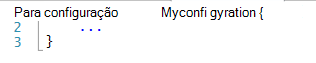
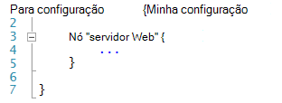
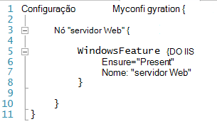
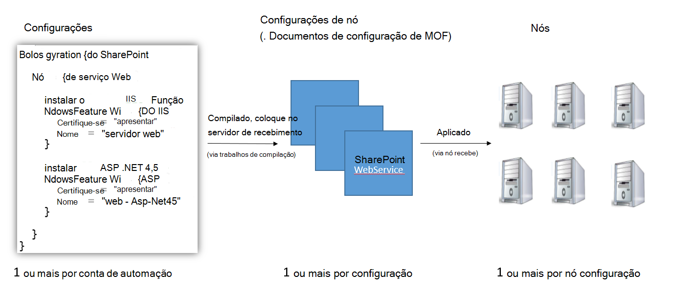
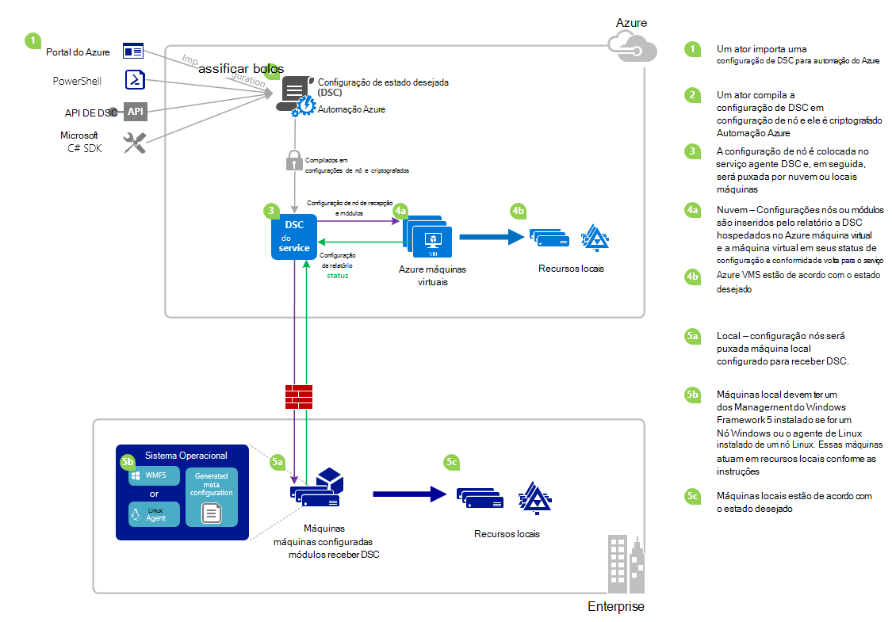

<properties 
   pageTitle="Visão geral do Azure automação DSC | Microsoft Azure" 
   description="Uma visão geral do Azure automação desejado estado configuração (DSC), seu termos e problemas conhecidos" 
   services="automation" 
   documentationCenter="dev-center-name" 
   authors="coreyp-at-msft" 
   manager="stevenka" 
   editor="tysonn"
   keywords="PowerShell dsc, configuração de estado desejado, azure do powershell dsc"/>

<tags
   ms.service="automation"
   ms.devlang="NA"
   ms.topic="article"
   ms.tgt_pltfrm="powershell"
   ms.workload="TBD" 
   ms.date="05/10/2016"
   ms.author="magoedte;coreyp"/>

# Visão geral do Azure automação DSC #

##O que é Azure automação DSC?##
Implantando e mantendo o estado desejado de seus servidores e recursos de aplicativo podem ser entediantes e sujeito a erros. Com o Azure automação desejado estado configuração (DSC), você pode implantar consistentemente, confiavelmente monitorar e atualizar automaticamente o estado desejado de todos os seus recursos de TI, em escala da nuvem. Criado no PowerShell DSC, automação DSC pode alinhar configuração de máquina com um estado específico em máquinas físicas e virtuais (VMs), usando o Windows ou Linux e na nuvem ou local. Você pode habilitar contínuo fornecimento de serviços de TI com controle consistente e gerenciar mudanças rápidas em seu ambiente de TI de híbrido heterogêneo com facilidade.

Azure DSC de automação baseia-se sobre os fundamentos introduzidos em DSC do PowerShell para fornecer uma experiência de gerenciamento de configuração ainda mais fácil. Azure DSC de automação traz a mesma camada de gerenciamento para [Configuração de estado desejado do PowerShell](https://msdn.microsoft.com/powershell/dsc/overview) como automação Azure oferece para PowerShell script hoje.

Azure DSC de automação permite que você [criar e gerenciar configurações de estado desejado do PowerShell](https://technet.microsoft.com/library/dn249918.aspx), importar [DSC recursos](https://technet.microsoft.com/library/dn282125.aspx)e gerar configurações de nós DSC (documentos MOF), tudo na nuvem. Esses itens DSC serão colocadas sobre a automação do Azure [DSC puxe o servidor](https://technet.microsoft.com/library/dn249913.aspx) para que nós de destino (como máquinas físicas e virtuais) na nuvem ou locais podem coletá-las, automaticamente está de acordo com o estado desejado especificam e volta do relatório na sua conformidade com o estado desejado para a automação do Azure.

Prefere assistindo a leitura? Examinar o abaixo de vídeo de maio de 2015, quando DSC de automação do Azure primeiro foi lançado. **Observação:** Enquanto o ciclo de vida abordados neste vídeo e conceitos estiverem corretas, DSC de automação do Azure avançou muito desde que este vídeo foi registrado. Ele agora está disponível em geral, possui uma interface de usuário muito mais abrangente no portal do Azure e dá suporte a muitos recursos adicionais.

> [AZURE.VIDEO microsoft-ignite-2015-heterogeneous-configuration-management-using-microsoft-azure-automation]

## Termos de automação Azure DSC ##
### Configuração ###
PowerShell DSC introduziu um novo conceito chamado configurações. Configurações permitem que você defina, por meio de sintaxe do PowerShell, o estado desejado de seu ambiente. Para usar DSC para configurar seu ambiente, primeiro definir um bloco de script do Windows PowerShell usando a palavra-chave de configuração, em seguida, siga-la com um identificador, em seguida, com chaves ({}) para delimitar o bloco.

Dentro do bloco de configuração, você pode definir blocos de configuração de nó que especifique as configurações desejadas para um conjunto de nós (computadores) em seu ambiente que devem ser configurados exatamente o mesmo. Dessa forma, a configuração de um nó representa uma "função" para um ou mais nós assuma. Um bloco de configuração de nó começa com a palavra-chave nó. Siga esta palavra-chave com o nome da função, que pode ser uma variável ou expressão. Após o nome de função, use chaves {} para delimitar o bloco de configuração de nó.

 
Dentro do bloco de configuração de nó, você pode definir blocos de recursos para configurar os recursos específicos do DSC. Um bloco de recurso começa com o nome do recurso, seguido do identificador que você deseja especificar para esse bloco, em seguida, chaves {} para delimitar o bloco.

Para obter mais informações sobre a palavra-chave de configuração, consulte: [Noções básicas sobre configuração de palavra-chave na configuração de estado desejado](http://blogs.msdn.com/b/powershell/archive/2013/11/05/understanding-configuration-keyword-in-desired-state-configuration.aspx "Noções básicas sobre configuração de palavra-chave na configuração de estado desejado")

Executando (compilação) uma configuração de DSC produzirão um ou mais DSC configurações nós (documentos MOF), que são quais nós DSC se aplicam a cumprir estado desejado.

Azure DSC de automação permite que você importe, autor, e configurações de DSC de compilação na automação do Azure, semelhante a como runbooks pode ser importado, autor e iniciado no Azure automação.

>[AZURE.IMPORTANT] Uma configuração deve conter apenas um bloco de configuração, com o mesmo nome da configuração, no Azure automação DSC. 

###Configuração de nó###

Quando uma configuração de DSC é compilada, uma ou mais configurações de nó são produzidas dependendo os blocos de nó na configuração. Uma configuração de nó é a mesma como "MOF" ou "documento configuração" (se você estiver familiarizado com esses termos DSC PS) e representa uma "função", como servidor Web ou trabalhador, que desejar estado um ou mais nós devem supor ou verificar conformidade em relação. Nomes de configurações de nó no Azure automação DSC assumem a forma de "Configuração Name.NodeConfigurationBlockName".

PS DSC nós se tornam cientes de que eles devem ativar por meio de envio de DSC, ou métodos de recepção de configurações de nós. Azure DSC de automação depende do método pull DSC, onde eles se aplicar a partir do DSC de automação do Azure de configurações do nó de solicitação de nós retirar servidor. Porque os nós fazer a solicitação DSC de automação do Azure, nós podem ser atrás de firewalls, tenham entrada portas fechadas, etc. Precisam apenas de acesso de saída à Internet (diretamente ou por meio de um proxy).

###Nó###

Um nó DSC é qualquer computador que tenha sua configuração gerenciada nome da importação. Isso pode ser um Windows ou Linux Azure VM, máquina virtual local / física host ou máquina na nuvem pública outra. Nós ativar configurações de nós para se tornar e manter a conformidade com o estado desejado que eles definem e também podem relatório volta para um servidor de relatórios sobre o status de configuração e conformidade versus o estado desejado.

Azure DSC de automação facilita a integração de nós para o gerenciamento pelo DSC de automação do Azure e permite a alteração da configuração do nó atribuída a cada nó servidor, para que a próxima vez que um nó verifica o servidor para obter instruções sobre ele presumem uma função diferente e alterar como ela está configurada e o status de conformidade-reporte contra para corresponder ao.

###Recurso###
Recursos de DSC são blocos de construção que você pode usar para definir uma configuração de configuração de estado desejado (DSC) do Windows PowerShell. DSC vem com um conjunto de recursos internos como aqueles para arquivos e pastas, recursos de servidor e funções, configurações do registro, variáveis de ambiente e serviços e processos. Para saber mais sobre a lista completa de recursos de DSC internos e como usá-las, consulte [Internos Windows PowerShell desejado estado configuração recursos](https://technet.microsoft.com/library/dn249921.aspx).

Recursos de DSC também podem ser importados como parte do módulos do PowerShell para estender o conjunto de recursos internos do DSC. Recursos padrão não serão transferidos para baixo por nós DSC do servidor pegar DSC, se uma configuração de nós que o nó destina-se apliquem contiver referências a esses recursos. Para saber como criar recursos personalizados, consulte [Criar Windows PowerShell desejado estado configuração recursos personalizados](https://technet.microsoft.com/library/dn249927.aspx).

Azure DSC de automação acompanha internos todos os mesmos recursos de DSC como faz PS DSC. Recursos adicionais podem ser adicionados ao Azure automação DSC importando módulos do PowerShell contendo os recursos de automação do Azure.

###Trabalho de compilação###
Um trabalho de compilação em DSC de automação do Azure é uma instância de compilação de uma configuração, crie uma ou mais configurações de nó. Eles são semelhantes aos trabalhos de runbook de automação do Azure, exceto que eles realmente não realizar qualquer tarefa exceto to criar configurações de nó. Quaisquer configurações de nó criadas por um trabalho de compilação são colocadas automaticamente no servidor de recepção de DSC de automação do Azure e sobrescrever versões anteriores de configurações de nós, se eram para esta configuração. O nome de uma configuração de nós produzidos por um trabalho de compilação assume a forma de "ConfigurationName.NodeConfigurationBlockName". Por exemplo, compilar o abaixo configuração produza uma configuração de único nó chamada "MyConfiguration.webserver"

>[AZURE.NOTE] Assim como runbooks, configurações podem ser publicadas. Isso não está relacionado ao colocar itens de DSC logon no servidor de recepção DSC de automação do Azure. Trabalhos de compilação provocar DSC itens ser colocado no servidor de recepção de DSC de automação do Azure. Para obter mais informações sobre "publicação" no Azure automação, consulte [Publicando um Runbook](https://msdn.microsoft.com/library/dn903765.aspx).

##Ciclo de vida do Azure automação DSC##
Ir de uma conta de automação vazia para um conjunto gerenciado de nós configurado corretamente envolve um conjunto de processos para a definição de configurações, desativando essas configurações em configurações de nó e integração nós DSC de automação do Azure e essas configurações de nós. O diagrama a seguir ilustra o ciclo de vida do Azure automação DSC:

A imagem a seguir ilustra o processo passo a passo detalhado no ciclo de vida de DSC. Ele inclui uma configuração importada e aplicada a nós no Azure automação, componentes necessários para um computador local dar suporte DSC e interações entre diferentes componentes de maneiras diferentes. 

     

##Truques / problemas conhecidos:##

- Ao atualizar para WMF 5 RTM, se o computador já está registrado como um nó no Azure automação DSC, verifique cancelar o registro do DSC de automação do Azure e registrar a novamente após a atualização do RTM de 5 WMF.

- Azure DSC de automação não dá suporte parciais ou compostas configurações de DSC neste momento. No entanto, recursos compostos DSC podem ser importados e usados em configurações de DSC de automação do Azure exatamente como no local PowerShell, permitindo a reutilização de configuração.

- Versão mais recente do WMF 5 deve ser instalada para o agente do PowerShell DSC para Windows sejam capazes de se comunicar com a automação do Azure. A versão mais recente do agente do PowerShell DSC para Linux deve ser instalada para Linux sejam capazes de se comunicar com a automação do Azure.

- O servidor de recepção PowerShell DSC tradicional espera módulo zips para ser colocado no servidor de recepção no formato **ModuleName_Version.zip "**. Automação Azure espera módulos do PowerShell a ser importado com nomes na forma de **ModuleName.zip**. Consulte [esta postagem de blog](https://azure.microsoft.com/blog/2014/12/15/authoring-integration-modules-for-azure-automation/) para obter mais informações sobre o formato de módulo de integração necessário para importar o módulo Azure automação. 

- Módulos do PowerShell importados para o Azure automação não podem conter arquivos. doc ou. docx. Alguns módulos do PowerShell contendo recursos DSC contêm esses arquivos, para fins de Ajuda. Esses arquivos devem ser removidos do módulos, anteriores para importar para automação do Azure.

- Quando um nó primeiro registrado com uma conta de automação do Azure, ou o nó é alterado para ser mapeado para um nó diferente configuração servidor, seu status será 'Compatível com', mesmo se o status do nó não é realmente compatível com a configuração de nós para que agora está mapeado. Depois que o nó executa sua primeira pegar e envia seu primeiro relatório, após o registro ou uma alteração de mapeamento de configuração de nó, o status do nó pode ser confiável.

- Quando integração uma VM do Windows Azure para gerenciamento de nome da importação automação Azure usando qualquer um dos nossos métodos de integração direta, ele pode levar uma hora para a máquina virtual apareça como um nó DSC na automação do Azure. Isso é devido a instalação do Windows Management Framework 5.0 na VM pela extensão DSC de máquina virtual do Azure, que é necessária para integrado na máquina virtual para DSC de automação do Azure.

- Depois de registrar, cada nó negocia automaticamente um certificado exclusivo para autenticação que expira depois de um ano. No momento, o protocolo de registro do PowerShell DSC não é possível renovar automaticamente certificados quando eles estão prestes a expirar, então você precisa registrar novamente os nós após o horário de um ano. Antes de registrando novamente, certifique-se de que cada nó está executando o Windows Management Framework 5.0 RTM. Se o certificado de autenticação de um nó expira, e o nó não está registrado, o nó será capaz de se comunicar com a automação do Azure e será marcado como 'Unresponsive'. Novo registro é executado da mesma maneira que você registrou o nó inicialmente. Novo registro executada 90 dias ou menos o tempo de expiração de certificado da qualquer momento após o horário de validade do certificado, resultará em um novo certificado sendo gerado e usado.

- Ao atualizar para WMF 5 RTM, se o computador já está registrado como um nó no Azure automação DSC, verifique cancelar o registro do DSC de automação do Azure e registrar a novamente após a atualização do RTM de 5 WMF. Antes de registrando novamente, exclua o arquivo $env:windir\system32\configuration\DSCEngineCache.mof.

- Cmdlets do PowerShell DSC podem não funcionar se WMF 5 RTM está instalado na parte superior da visualização de produção WMF 5. Para corrigir isso, execute o seguinte comando em uma sessão do PowerShell elevada (Executar como administrador):`mofcomp $env:windir\system32\wbem\DscCoreConfProv.mof`
 

##Artigos relacionados##

- [Integração máquinas para gerenciamento de nome da importação Azure automação] (.. /Automation/Automation-DSC-onboarding.MD)
- [Compilar configurações no Azure automação DSC] (.. /Automation/Automation-DSC-Compile.MD)
- [Azure DSC de automação cmdlets] (https://msdn.microsoft.com/library/mt244122.aspx)
- [Azure DSC de automação preços] (https://azure.microsoft.com/pricing/details/automation/)
- [Implantação contínua em VMs IaaS usando automação Azure DSC e Chocolatey] (automação-dsc-cd-chocolatey.md)
