<properties
    pageTitle="Minha primeira runbook gráfica no Azure automação | Microsoft Azure"
    description="Tutorial que o orientará durante a criação, teste e a publicação de uma simple runbook gráfica."
    services="automation"
    documentationCenter=""
    authors="mgoedtel"
    manager="jwhit"
    editor=""
    keywords="runbook, modelo de runbook, runbook automação, runbook azure"/>
<tags
    ms.service="automation"
    ms.workload="tbd"
    ms.tgt_pltfrm="na"
    ms.devlang="na"
    ms.topic="get-started-article"
    ms.date="07/06/2016"
    ms.author="magoedte;bwren"/>

# <a name="my-first-graphical-runbook"></a>Minha primeira runbook gráfica

> [AZURE.SELECTOR] - [Gráfica](automation-first-runbook-graphical.md) - [PowerShell](automation-first-runbook-textual-PowerShell.md) - [Fluxo de trabalho do PowerShell](automation-first-runbook-textual.md)

Este tutorial orienta a criação de um [gráfico runbook](automation-runbook-types.md#graphical-runbooks) no Azure automação.  Vamos começar com um simple runbook que vamos testar e publicar enquanto podemos explicam como acompanhar o status do trabalho runbook.  Podemos vai modificar runbook para gerenciar recursos do Azure, nesse caso, iniciando uma máquina virtual Azure.  Podemos então fará runbook mais robusto adicionando runbook parâmetros e links condicional.

## <a name="prerequisites"></a>Pré-requisitos

Para concluir este tutorial, você precisará do seguinte.

-   Assinatura do Azure.  Se você ainda não tenha um, você pode [ativar os benefícios do assinante MSDN](https://azure.microsoft.com/pricing/member-offers/msdn-benefits-details/) ou <a href="/pricing/free-account/" target="_blank"> [inscrever para uma conta gratuita](https://azure.microsoft.com/free/).
-   [Executar como conta do azure](automation-sec-configure-azure-runas-account.md) para mantenha runbook e autenticar para recursos Azure.  Essa conta deve ter permissão para iniciar e parar a máquina virtual.
-   Uma máquina virtual Azure.  Abordaremos parar e iniciar este máquina para que ela não deve ser produção.


## <a name="step-1---create-new-runbook"></a>Etapa 1 - Criar novo runbook

Vamos começar criando um runbook simple que gera o texto *Hello World*.

1.  No Portal do Azure, abra sua conta de automação.  
    A página de conta de automação oferece uma exibição rápida dos recursos nessa conta.  Você já deve ter alguns ativos.  A maioria delas são os módulos que são incluídos automaticamente em uma nova conta de automação.  Você também deve ter o ativo de credencial mencionada nos [pré-requisitos](#prerequisites).
2.  Clique no bloco **Runbooks** para abrir a lista de runbooks.<br> 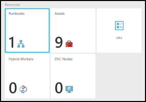
3.  Crie um novo runbook clicando no botão **Adicionar um runbook** e, em seguida, **criar um novo runbook**.
4.  Nomeie runbook a *MyFirstRunbook gráficas*.
5.  Nesse caso, vamos criar um [gráfico runbook](automation-graphical-authoring-intro.md) portanto, selecione **Graphical** para **tipo de Runbook**.<br> 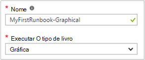<br>
6.  Clique em **criar** para criar runbook e abrir o editor gráfico.

## <a name="step-2---add-activities-to-the-runbook"></a>Etapa 2 - adicionar atividades a runbook

O controle de biblioteca no lado esquerdo do editor permite que você selecione atividades para adicionar à sua runbook.  Vamos adicionar um cmdlet **Write-Output** para texto de runbook de saída.

1.  No controle de biblioteca, clique na caixa de texto Pesquisar e digite **Write-Output**.  Resultados da pesquisa serão exibidos abaixo. <br> 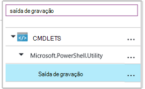
2.  Role para baixo da lista.  Você pode tanto **Write-Output** clique com botão direito e selecione **Adicionar à tela** ou clique em elipse ao lado do cmdlet e selecione **Adicionar à tela**.
3.  Clique na atividade **Write-Output** na tela.  Isso abre a lâmina de controle de configuração que permite que você configure a atividade.
4.  O **rótulo** padrão é o nome do cmdlet, mas é possível alterá-lo para algo mais amigável. Altere-a para *Escrever Olá, mundo de saída*.
5.  Clique em **parâmetros** para fornecer valores para os parâmetros do cmdlet.  
    Alguns cmdlets ter vários conjuntos de parâmetros, e você precisa selecionar que você usará. Nesse caso, **Write-Output** tem apenas um conjunto de parâmetro, então você não precisa selecionar um. <br> 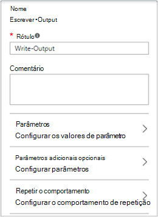
6.  Selecione o parâmetro **InputObject** .  Este é o parâmetro onde estamos será especificar o texto para enviar para o fluxo de saída.
7.  Na lista suspensa de **fonte de dados** , selecione **expressão do PowerShell**.  Na lista suspensa de **fonte de dados** fornece diferentes fontes que você usa para preencher um valor de parâmetro.  
    Você pode usar a saída de tais fontes como outra atividade, um ativo de automação ou uma expressão de PowerShell.  Nesse caso, basta queremos saída do texto *Hello World*. Podemos usar uma expressão de PowerShell e especifique uma cadeia de caracteres.
8.  Na caixa **expressão** , digite *"Olá, mundo"* e clique em **Okey** duas vezes para retornar à tela.<br> 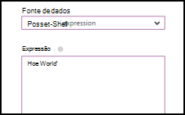
9.  Salve runbook clicando em **Salvar**.<br> 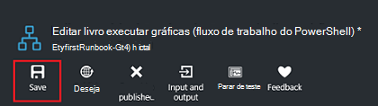

## <a name="step-3---test-the-runbook"></a>Etapa 3 - testar runbook

Antes de nós publicar runbook para disponibilizá-lo em produção, queremos testá-lo para garantir que ele funcione corretamente.  Quando você testa um runbook, execute a sua versão de **rascunho** e exibir sua saída interativamente.

1.  Clique em **Painel de teste** para abrir a lâmina de teste.<br> 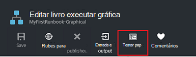
2.  Clique em **Iniciar** para iniciar o teste.  Isso deve ser a única opção ativada.
3.  Um [trabalho de runbook](automation-runbook-execution.md) é criado e seu status é exibido no painel.  
    O status do trabalho será iniciado como *enfileirados* indicando que ele está aguardando um trabalhador runbook na nuvem fique disponível.  Ele será movido para *Iniciar* quando um trabalhador declarações o trabalho e, em seguida, *em execução* quando runbook realmente começa a ser executado.  
4.  Quando o trabalho de runbook for concluído, a saída é exibida. Em nosso caso, estamos deverá ver *Hello World*.<br> 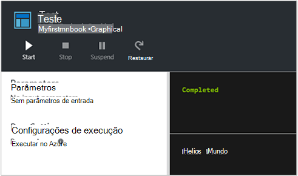
5.  Feche a lâmina de teste para retornar à tela.

## <a name="step-4---publish-and-start-the-runbook"></a>Etapa 4 - publicar e iniciar runbook

Runbook que acabou de criar ainda está em modo de rascunho. Precisamos publicá-lo antes de nós pode executá-lo em produção.  Quando você publica uma runbook, você substituir a versão publicada existente com a versão de rascunho.  Em nosso caso, nós ainda não tem uma versão publicada porque podemos runbook recém-criado.

1.  Clique em **Publicar** para publicar runbook e clique em seguida **Sim** quando solicitado.<br> 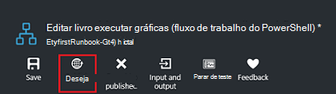
2.  Se você rolar esquerda para exibir runbook na lâmina **Runbooks** , ele mostrará um **Status de criação** de **publicado**.
3.  Role de volta para a direita para exibir a lâmina para **MyFirstRunbook**.  
    As opções na parte superior nos permitem iniciar runbook, agende-a para iniciar em algum momento no futuro ou crie um [webhook](automation-webhooks.md) para que ele pode ser iniciado por meio de uma chamada de HTTP.
4.  Queremos apenas iniciar runbook então clique em **Iniciar** e em seguida **Sim** quando solicitado.<br> 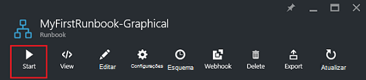
5.  Uma lâmina de trabalho é aberta para o trabalho de runbook que acabou de criar.  Podemos fechar este blade, mas nesse caso podemos deixá-lo aberto para que possamos ver o andamento do trabalho.
6.  O status do trabalho é mostrado no **Resumo de trabalho** e coincide os status visto quando testamos runbook.<br> 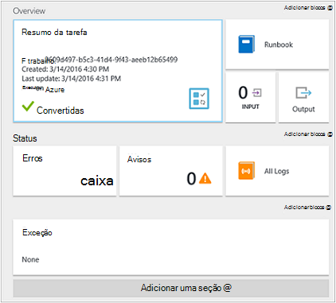
7.  Depois que o status de runbook mostra *concluído*, clique em **saída**. A lâmina de **saída** é aberta e podemos ver nosso *Olá, mundo* no painel.<br> 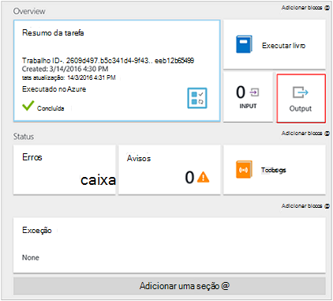  
8.  Feche a lâmina de saída.
9.  Clique em **Todos os Logs** para abrir a lâmina fluxos para o trabalho de runbook.  Devemos ver somente *Olá, mundo* no fluxo de saída, mas isso pode mostrar outros fluxos para um trabalho runbook como detalhado e erro se runbook grava a eles.<br> 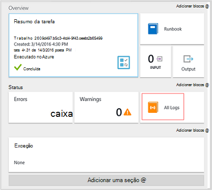
10. Feche a lâmina de todos os Logs e o blade de trabalho para retornar para a lâmina MyFirstRunbook.
11. Clique em **trabalhos** para abrir a lâmina de trabalhos para este runbook.  Lista todos os trabalhos criados por este runbook de. Um trabalho listado como podemos executados apenas o trabalho uma vez só deverá ser exibida.<br> 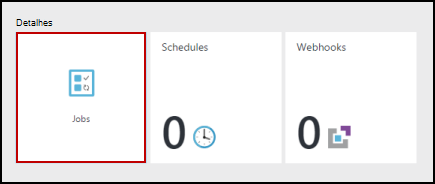
12. Você pode clicar neste trabalho para abrir o painel de trabalho mesmo que estamos exibidos quando podemos iniciado runbook.  Isso permite que você voltar no tempo e exibir os detalhes de qualquer trabalho que foi criado para uma determinada runbook.

## <a name="step-5---create-variable-assets"></a>Etapa 5 - criar ativos variáveis

Testamos e publicado nosso runbook, mas até o momento não faz nada útil. Queremos tê-la a gerenciar recursos do Azure.  Antes de nós configurar runbook para autenticar, criamos uma variável para conter a ID da assinatura e fazer referência a ela depois podemos configurar a atividade para autenticar na etapa 6 abaixo.  Incluindo uma referência para o contexto de assinatura permite trabalhar facilmente entre várias assinaturas.  Antes de prosseguir, copie seu ID da assinatura da opção de assinaturas do painel de navegação.  

1. Na lâmina contas de automação, clique no bloco **ativos** e a lâmina de **ativos** é aberta.
2. Na lâmina ativos, clique no bloco **variáveis** .
3. Na lâmina variáveis, clique em **Adicionar uma variável**.<br>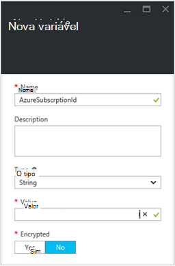
4. Na nova variável lâmina, na caixa **nome** , digite **AzureSubscriptionId** e na caixa **valor** , digite seu ID da assinatura.  Manter a *cadeia de caracteres* para o **tipo** e o valor padrão para **criptografia**.  
5. Clique em **criar** para criar a variável.  


## <a name="step-6---add-authentication-to-manage-azure-resources"></a>Etapa 6 - adicionar autenticação para gerenciar recursos do Azure

Agora que temos uma variável para manter nosso ID da assinatura, podemos configurar nossa runbook para autenticar com as credenciais executar como citadas nos [pré-requisitos](#prerequisites).  Podemos fazer isso adicionando o Azure executar como conexão **ativo** e **Adicionar-AzureRMAccount** cmdlet à tela.  

1.  Abra o editor gráfico clicando em **Editar** na lâmina MyFirstRunbook.<br> 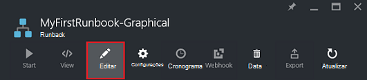
2.  Não precisamos **Escrever Olá, mundo de saída** mais, portanto direito do mouse nele e selecione **Excluir**.
3.  No controle de biblioteca, expanda **conexões** e adicionar **AzureRunAsConnection** à tela selecionando **Adicionar à tela**.
4.  Na tela, selecione **AzureRunAsConnection** e no painel de controle de configuração, digite **Obter executar como Conexão** na caixa **rótulo** de texto.  Esta é a conexão 
5.  No controle de biblioteca, digite **AzureRmAccount adicionar** na caixa de texto Pesquisar.
6.  Adicione **AzureRmAccount adicionar** à tela.<br> 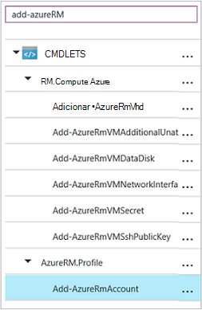
7.  Focalize **Obter executar como Conexão** até que um círculo exibido na parte inferior da forma. Clique no círculo e arraste a seta para **Adicionar AzureRmAccount**.  A seta que você acabou de criar é um *link*.  Runbook será iniciado com **Obter executar como Conexão** e execute **AzureRmAccount de adicionar**.<br> 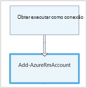
8.  Na tela, selecione **Adicionar AzureRmAccount** e na configuração Painel tipo **Fazer Login no Azure** na caixa de texto **rótulo** de controle.
9.  Clique em **parâmetros** e a configuração de parâmetro de atividade blade é exibida. 
10.  **Adicionar AzureRmAccount** tem vários conjuntos de parâmetros, portanto, precisamos selecionar um antes de podemos fornecer valores de parâmetro.  Clique em **Definir parâmetros** e selecione o conjunto de parâmetro **ServicePrincipalCertificate** . 
11.  Depois de selecionar o parâmetro definido, os parâmetros são exibidos na lâmina configuração de parâmetro de atividades.  Clique em **APPLICATIONID**.<br> 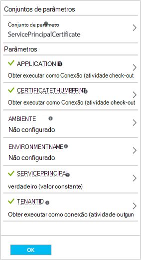
12.  Na lâmina valor do parâmetro, selecione **saída de atividade** para a **fonte de dados** e selecione **Obter executar como Conexão** na lista, na caixa de texto **caminho de campo** , digite **ApplicationId**e clique em **Okey**.  Nós está especificando o nome da propriedade para o caminho de campo, porque a atividade produz um objeto com várias propriedades.
13.  Clique em **CERTIFICATETHUMBPRINT**e na lâmina valor do parâmetro, selecione **saída de atividade** para a **fonte de dados**.  Selecione **Obter executar como Conexão** na lista, na caixa de texto **caminho de campo** , digite **CertificateThumbprint**e clique em **Okey**. 
14.  Clique **SERVICEPRINCIPAL**e na lâmina valor do parâmetro, selecione **ConstantValue** para a **fonte de dados**, clique na opção **True**e clique em **Okey**.
15.  Clique em **TENANTID**e na lâmina valor do parâmetro, selecione **saída de atividade** para a **fonte de dados**.  Selecione **Obter executar como Conexão** na lista, na caixa de texto **caminho de campo** , digite **TenantId**e clique duas vezes em **Okey** .  
16.  No controle de biblioteca, digite **Set-AzureRmContext** na caixa de texto Pesquisar.
17.  Adicione **Conjunto AzureRmContext** à tela.
18.  Na tela, selecione **Set-AzureRmContext** e na configuração do tipo de painel **Especificar Id da assinatura** na caixa de texto **rótulo** de controle.
19.  Clique em **parâmetros** e a configuração de parâmetro de atividade blade é exibida. 
20. **Definir AzureRmContext** tem vários conjuntos de parâmetros, portanto, precisamos selecionar um antes de podemos fornecer valores de parâmetro.  Clique em **Definir parâmetros** e selecione o conjunto de parâmetro **SubscriptionId** .  
21.  Depois de selecionar o parâmetro definido, os parâmetros são exibidos na lâmina configuração de parâmetro de atividades.  Clique em **SubscriptionID**
22.  Na lâmina valor do parâmetro, selecione **Ativo variáveis** para a **fonte de dados** e selecione **AzureSubscriptionId** na lista e, em seguida, clique duas vezes em **Okey** .   
23.  Focalize o **Login no Azure** até que um círculo exibido na parte inferior da forma. Clique no círculo e arraste a seta para **Especificar Id da assinatura**.


Seu runbook neste ponto deve parecer com o seguinte: <br>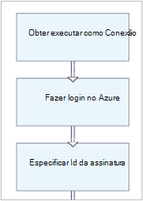

## <a name="step-7---add-activity-to-start-a-virtual-machine"></a>Etapa 7 - Adicionar atividade para iniciar uma máquina virtual

Agora, adicionaremos uma atividade de **AzureRmVM iniciar** para iniciar uma máquina virtual.  Você pode escolher qualquer máquina virtual em sua assinatura do Azure e agora podemos estará codificar esse nome para o cmdlet.

1. No controle de biblioteca, digite **AzureRm iniciar** na caixa de texto Pesquisar.
2. Adicionar **Iniciar AzureRmVM** à tela e, em seguida, clique e arraste-o abaixo **Especificar Id da assinatura**.
3. Focalize **Especificar Id da assinatura** até que um círculo exibido na parte inferior da forma.  Clique no círculo e arraste a seta para **Iniciar AzureRmVM**. 
4.  Selecione **Iniciar AzureRmVM**.  Clique em **parâmetros** e, em seguida, **Parâmetro definido** para visualizar os conjuntos de **AzureRmVM de início**.  Selecione o conjunto de parâmetro **ResourceGroupNameParameterSetName** . Observe que **ResourceGroupName** e **nome** tem pontos de exclamação próximo-los.  Isso indica que eles são parâmetros necessários.  Observe também que ambos esperam valores de cadeia de caracteres.
5.  Selecione o **nome**.  Selecione **expressão do PowerShell** para a **fonte de dados** e digite o nome da máquina virtual entre aspas duplas que começaremos com este runbook.  Clique em **Okey**.<br>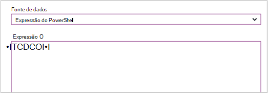
6.  Selecione **ResourceGroupName**. Use **expressões do PowerShell** para a **fonte de dados** e digite o nome do grupo de recursos entre aspas duplas.  Clique em **Okey**.<br> 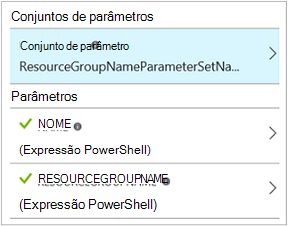
8.  Clique em Painel de teste para que podemos testar runbook.
9.  Clique em **Iniciar** para iniciar o teste.  Quando ela for concluída, verifique se a máquina virtual foi iniciada.

Seu runbook neste ponto deve parecer com o seguinte: <br>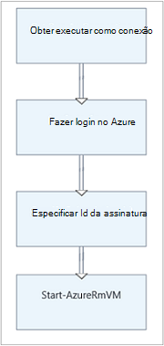

## <a name="step-8---add-additional-input-parameters-to-the-runbook"></a>Etapa 8 - adicionar parâmetros de entrada adicionais ao runbook

Nossa runbook atualmente inicia a máquina virtual no grupo de recursos que estamos especificados no cmdlet **Start-AzureRmVM** , mas nossa runbook seria mais útil se nós poderia especificar ambos quando runbook é iniciado.  Agora, adicionaremos parâmetros de entrada para runbook fornecer essa funcionalidade.

1. Abra o editor gráfico clicando em **Editar** no painel **MyFirstRunbook** .
2. Clique em **entrada e saída** e, em seguida, **Adicionar entrada para abrir o painel de parâmetro de entrada do Runbook.**<br> 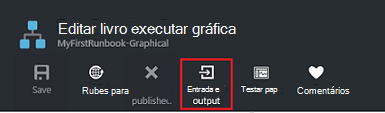
3. Especifique *VMName* para o **nome**.  Manter a *cadeia de caracteres* para o **tipo**, mas altere **obrigatório** para *Sim*.  Clique em **Okey**.
4. Criar um segundo parâmetro de entrada obrigatório chamado *ResourceGroupName* e clique em **Okey** para fechar o painel de **entrada e saída** .<br> 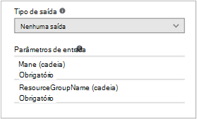
5. Selecione a atividade de **AzureRmVM de início** e clique em **parâmetros**.
6. Alterar a **fonte de dados** de **nome** para **entrada de Runbook** e selecione **VMName**.<br>
7. Alterar a **fonte de dados** para **ResourceGroupName** para **entrada de Runbook** e selecione **ResourceGroupName**.<br> 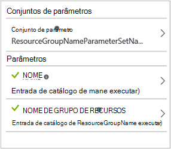
8. Salve runbook e abrir o painel de teste.  Observe que você agora pode fornecer valores para as duas variáveis de entrada que serão usadas no teste.
9. Feche o painel de teste.
10. Clique em **Publicar** para publicar a nova versão do runbook.
11. Pare a máquina virtual que você iniciou na etapa anterior.
12. Clique em **Iniciar** para iniciar o runbook.  Digite a **VMName** e **ResourceGroupName** para a máquina virtual que você vai iniciar.<br> 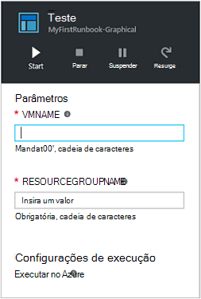
13. Quando runbook for concluído, verifique se a máquina virtual foi iniciada.

## <a name="step-9---create-a-conditional-link"></a>Etapa 9 - criar um link condicional

Agora vamos modificar runbook para que ele só tentará iniciar a máquina virtual se ela já não é iniciada.  Faremos isso adicionando um cmdlet **Get-AzureRmVM** ao runbook que receberá o status de nível de instância da máquina virtual. Em seguida, adicionaremos um módulo de código do fluxo de trabalho do PowerShell chamado **Get Status** com um trecho de código do PowerShell para determinar se o estado da máquina virtual está em execução ou parado.  Um link condicional do módulo **Get Status** só será executada **Início-AzureRmVM** se o estado de execução atual for interrompido.  Por fim, podemos produzirá uma mensagem para informar se a máquina virtual foi iniciada com êxito ou não usando o cmdlet do PowerShell Write-Output.

1. Abra **MyFirstRunbook** no editor gráfico.
2. Remova o vínculo entre **Especificar Id da assinatura** e **Início-AzureRmVM** clicando nele e pressionando a tecla *Delete* .
3. No controle de biblioteca, digite **Get-AzureRm** na caixa de texto Pesquisar.
4. Adicione **Get-AzureRmVM** à tela.
5. Selecione **Get-AzureRmVM** e **Parâmetro definido** para exibir os conjuntos de **Get-AzureRmVM**.  Selecione o conjunto de parâmetro **GetVirtualMachineInResourceGroupNameParamSet** .  Observe que **ResourceGroupName** e **nome** tem pontos de exclamação próximo-los.  Isso indica que eles são parâmetros necessários.  Observe também que ambos esperam valores de cadeia de caracteres.
6. Em **fonte de dados** de **nome**, selecione a **entrada de Runbook** e selecione **VMName**.  Clique em **Okey**.
7. Em **fonte de dados** para **ResourceGroupName**, selecione a **entrada de Runbook** e selecione **ResourceGroupName**.  Clique em **Okey**.
8. Em **fonte de dados** de **status**, selecione o **valor da constante** e clique em **True**.  Clique em **Okey**.  
9. Crie um link de **Especificar Id da assinatura** para **Get-AzureRmVM**.
10. No controle de biblioteca, expanda **Runbook controle** e adicionar **código** à tela.  
11. Crie um link de **Get-AzureRmVM** ao **código**.  
12. Clique em **código** e no painel de configuração, altere o rótulo para **Obter Status**.
13. Parâmetro de **código de** seleção e o blade do **Editor de código** é exibida.  
14. No editor de código, cole o trecho de código a seguir:

     ```
     $StatusesJson = $ActivityOutput['Get-AzureRmVM'].StatusesText 
     $Statuses = ConvertFrom-Json $StatusesJson 
     $StatusOut ="" 
     foreach ($Status in $Statuses){ 
     if($Status.Code -eq "Powerstate/running"){$StatusOut = "running"} 
     elseif ($Status.Code -eq "Powerstate/deallocated") {$StatusOut = "stopped"} 
     } 
     $StatusOut 
     ```

15. Crie um link do **Status de obter** para **Iniciar AzureRmVM**.<br> 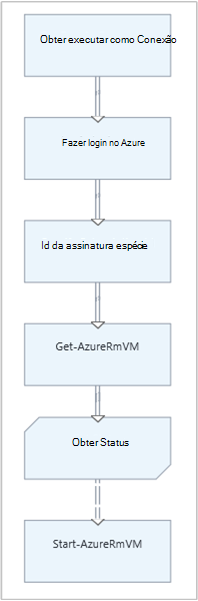  
16. Selecione o link e no painel de configuração, altere **Aplicar condição** para **Sim**.   Observe o link se transforma em uma linha tracejada indicando que a atividade de destino só será executada se a condição resolve para true.  
17. A **expressão condição**, digite *$ActivityOutput [' obter Status'] - eq "Parado"*.  **Iniciar AzureRmVM** agora serão executadas somente se a máquina virtual for interrompida.
18. No controle de biblioteca, expanda **Cmdlets** e **Microsoft.PowerShell.Utility**.
19. Adicione **Write-Output** à tela duas vezes.<br> 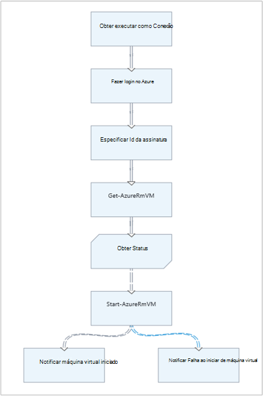
20. No primeiro controle **Write-Output** , clique em **parâmetros** e altere o valor de **rótulo** para *Notificar iniciado de máquina virtual*.
21. Para **InputObject**, altere **fonte de dados** para **PowerShell expressão** e digite a expressão *"$VMName iniciado com êxito."*.
22. No segundo controle **Write-Output** , clique em **parâmetros** e altere o valor de **rótulo** *Notificar máquina virtual iniciar* falha
23. Para **InputObject**, altere **fonte de dados** para **PowerShell expressão** e digite a expressão *"$VMName não pôde iniciar."*.
24. Crie um link de **Início-AzureRmVM** para **Notificar máquina virtual iniciado** e **Notificar máquina virtual Iniciar falha**.
25. Selecione o link para **Notificar máquina virtual iniciado** e altere **Aplicar condição** para **True**.
26. A **expressão condição**, digite *$ActivityOutput ['Início-AzureRmVM']. IsSuccessStatusCode - eq $true*.  Este controle de Write-Output agora serão executadas somente se a máquina virtual é iniciada com êxito.
27. Selecione o link para **Notificar máquina virtual Iniciar falha** e altere **Aplicar condição** para **True**.
28. A **expressão condição**, digite *$ActivityOutput ['Início-AzureRmVM']. IsSuccessStatusCode - ne $true*.  Este controle de Write-Output agora serão executadas somente se a máquina virtual não é iniciada com êxito.
29. Salve runbook e abrir o painel de teste.
30. Comece runbook com a máquina virtual parada e ele deve ser iniciado.

## <a name="next-steps"></a>Próximas etapas

-   Para saber mais sobre a criação de gráficos, consulte [Graphical authoring na automação do Azure](automation-graphical-authoring-intro.md)
-   Para começar a usar o PowerShell runbooks, consulte [Minha primeira runbook PowerShell](automation-first-runbook-textual-powershell.md)
-   Para começar a usar runbooks de fluxo de trabalho do PowerShell, consulte [Minha primeira runbook de fluxo de trabalho do PowerShell](automation-first-runbook-textual.md)
