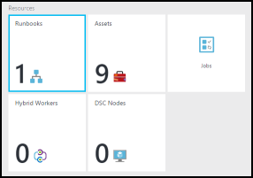
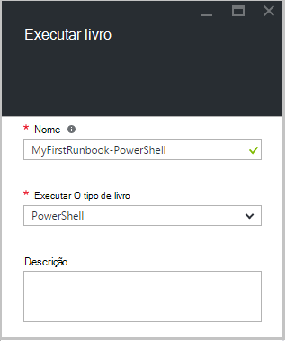
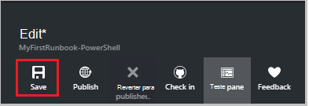
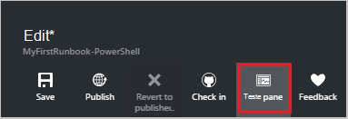
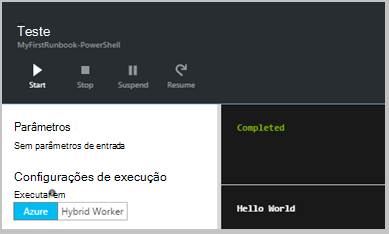
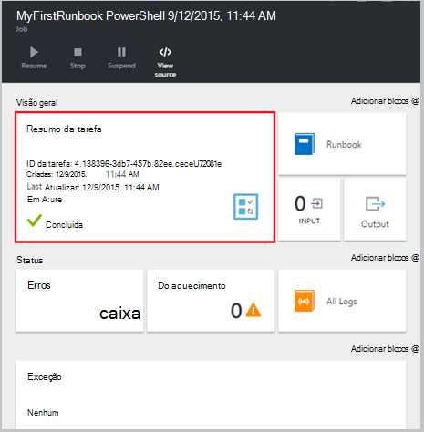
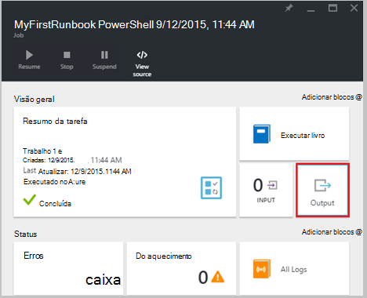
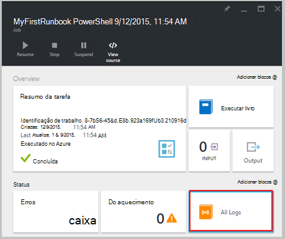
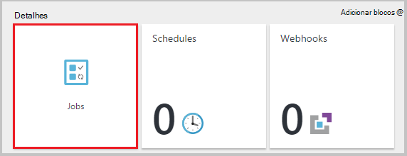
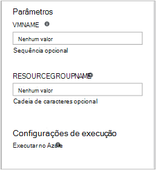

<properties
    pageTitle="Minha primeira runbook PowerShell na automação do Azure | Microsoft Azure"
    description="Tutorial que o orientará durante a criação, teste e a publicação de uma simple runbook PowerShell."
    services="automation"
    documentationCenter=""
    authors="mgoedtel"
    manager="jwhit"
    editor=""
    keywords="powershell Azure, tutorial de script do powershell, powershell automação"/>
<tags
    ms.service="automation"
    ms.workload="tbd"
    ms.tgt_pltfrm="na"
    ms.devlang="na"
    ms.topic="get-started-article"
    ms.date="07/19/2016"
    ms.author="magoedte;sngun"/>

# <a name="my-first-powershell-runbook"></a>Minha primeira runbook PowerShell

> [AZURE.SELECTOR] - [Gráfica](automation-first-runbook-graphical.md) - [PowerShell](automation-first-runbook-textual-PowerShell.md) - [Fluxo de trabalho do PowerShell](automation-first-runbook-textual.md)  

Este tutorial orienta a criação de um [PowerShell runbook](automation-runbook-types.md#powershell-runbooks) no Azure automação. Vamos começar com um simple runbook que vamos testar e publicar enquanto podemos explicam como acompanhar o status do trabalho runbook. Podemos vai modificar runbook para gerenciar recursos do Azure, nesse caso, iniciando uma máquina virtual Azure. Nós será faça runbook mais robusto, adicionando runbook parâmetros.

## <a name="prerequisites"></a>Pré-requisitos

Para concluir este tutorial, você precisará do seguinte.

-   Assinatura do Azure. Se você ainda não tenha um, você pode [ativar os benefícios do assinante MSDN](https://azure.microsoft.com/pricing/member-offers/msdn-benefits-details/) ou <a href="/pricing/free-account/" target="_blank"> [inscrever para uma conta gratuita](https://azure.microsoft.com/free/).
-   [Conta de automação](automation-security-overview.md) mantenha runbook e autenticar para recursos Azure.  Essa conta deve ter permissão para iniciar e parar a máquina virtual.
-   Uma máquina virtual Azure. Abordaremos parar e iniciar este máquina para que ela não deve ser produção.

## <a name="step-1---create-new-runbook"></a>Etapa 1 - Criar novo runbook

Vamos começar criando um runbook simple que gera o texto *Hello World*.

1.  No Portal do Azure, abra sua conta de automação.  
    A página de conta de automação oferece uma exibição rápida dos recursos nessa conta. Você já deve ter alguns ativos. A maioria delas são os módulos que são incluídos automaticamente em uma nova conta de automação. Você também deve ter o ativo de credencial mencionada nos [pré-requisitos](#prerequisites).
2.  Clique no bloco **Runbooks** para abrir a lista de runbooks.  
      
3.  Crie um novo runbook clicando no botão **Adicionar um runbook** e, em seguida, **criar um novo runbook**.
4.  Nomeie runbook o *PowerShell MyFirstRunbook*.
5.  Nesse caso, vamos criar um [PowerShell runbook](automation-runbook-types.md#powershell-runbooks) portanto, selecione **o Powershell** para **tipo de Runbook**.  
      
6.  Clique em **criar** para criar runbook e abra o editor de texto.

## <a name="step-2---add-code-to-the-runbook"></a>Etapa 2 - adicionar código a runbook

Você pode o código de tipo diretamente em runbook, ou você pode selecionar cmdlets, runbooks e ativos do controle de biblioteca e tê-los adicionado ao runbook com qualquer parâmetros relacionados. Para esta explicação, podemos digitará diretamente em runbook.

1.  Nossa runbook está vazia, digite *Write-Output "Olá".*.  
      
2.  Salve runbook clicando em **Salvar**.  
      

## <a name="step-3---test-the-runbook"></a>Etapa 3 - testar runbook

Antes de nós publicar runbook para disponibilizá-lo em produção, queremos testá-lo para garantir que ele funcione corretamente. Quando você testa um runbook, execute a sua versão de **rascunho** e exibir sua saída interativamente.

1.  Clique em **Painel de teste** para abrir o painel de teste.  
      
2.  Clique em **Iniciar** para iniciar o teste. Isso deve ser a única opção ativada.
3.  Um [trabalho de runbook](automation-runbook-execution.md) é criado e seu status exibido.  
    O status do trabalho será iniciado como *enfileirados* indicando que ele está aguardando um trabalhador runbook na nuvem disponíveis. Ele será movido para *Iniciar* quando um trabalhador declarações o trabalho e, em seguida, *em execução* quando runbook realmente começa a ser executado.  
4.  Quando o trabalho de runbook for concluído, a saída é exibida. Em nosso caso, deve vemos *Olá, mundo*  
      
5.  Feche o painel de teste para retornar à tela.

## <a name="step-4---publish-and-start-the-runbook"></a>Etapa 4 - publicar e iniciar runbook

Runbook que acabou de criar ainda está em modo de rascunho. Precisamos publicá-lo antes de nós pode executá-lo em produção. Quando você publica uma runbook, você substituir a versão publicada existente com a versão de rascunho. Em nosso caso, nós ainda não tem uma versão publicada porque podemos runbook recém-criado.

1.  Clique em **Publicar** para publicar runbook e clique em seguida **Sim** quando solicitado.  
      
2.  Se você rolar esquerda para exibir runbook no painel **Runbooks** agora, ele mostrará um **Status de criação** de **publicado**.
3.  Role de volta para a direita para exibir o painel para **MyFirstRunbook PowerShell**.  
    As opções na parte superior nos permitem iniciar runbook, exibir runbook, agende-a para iniciar em algum momento no futuro, ou crie um [webhook](automation-webhooks.md) para que ele pode ser iniciado através de uma chamada HTTP.
4.  Queremos apenas iniciar runbook então clique em **Iniciar** e clique em **Okey** quando abre o blade Runbook iniciar.  
      
5.  Um painel de trabalho é aberto para o trabalho de runbook que acabou de criar. Podemos fechar esse painel, mas nesse caso podemos deixá-lo aberto para que possamos ver o andamento do trabalho.
6.  O status do trabalho é mostrado no **Resumo de trabalho** e coincide os status visto quando testamos runbook.  
      
7.  Depois que o status de runbook mostra *concluído*, clique em **saída**. O painel de saída é aberto e podemos ver nosso *Hello World*.  
    
8.  Feche o painel de saída.
9.  Clique em **Todos os Logs** para abrir o painel de fluxos de trabalho runbook. Devemos ver somente *Olá, mundo* no fluxo de saída, mas isso pode mostrar outros fluxos para um trabalho runbook como detalhado e erro se runbook grava a eles.  
      
10. Feche o painel de fluxos e o painel de trabalho para retornar ao painel de MyFirstRunbook PowerShell.
11. Clique em **trabalhos** para abrir o painel de tarefas para este runbook. Lista todos os trabalhos criados por este runbook de. Um trabalho listado como podemos executados apenas o trabalho uma vez só deverá ser exibida.  
      
12. Você pode clicar neste trabalho para abrir o painel de trabalho mesmo que estamos exibidos quando podemos iniciado runbook. Isso permite que você voltar no tempo e exibir os detalhes de qualquer trabalho que foi criado para uma determinada runbook.

## <a name="step-5---add-authentication-to-manage-azure-resources"></a>Etapa 5 - adicionar autenticação para gerenciar recursos do Azure

Testamos e publicado nosso runbook, mas até o momento não faz nada útil. Queremos tê-la a gerenciar recursos do Azure. Ele não será capaz de fazer isso, embora a menos que temos ele autenticar usando as credenciais citadas nos [pré-requisitos](#prerequisites). Podemos fazer isso com o cmdlet **Add-AzureRmAccount** .

1.  Abra o editor textual clicando em **Editar** no painel MyFirstRunbook PowerShell.  
      
2.  Não precisamos a linha de **Write-Output** mais, continue e excluí-la.
3.  Digite ou copie e cole o seguinte código que irá manipular a autenticação com sua conta de automação executar como:

    ```
     $Conn = Get-AutomationConnection -Name AzureRunAsConnection 
     Add-AzureRMAccount -ServicePrincipal -Tenant $Conn.TenantID `
     -ApplicationId $Conn.ApplicationID -CertificateThumbprint $Conn.CertificateThumbprint
    ``` 
<br>
4.  Clique em **Testar painel** para que podemos testar runbook.
5.  Clique em **Iniciar** para iniciar o teste. Quando ela for concluída, você deve receber saída semelhante à seguintes, exibindo informações básicas de sua conta. Isso confirma que a credencial é válida. <br> 

## <a name="step-6---add-code-to-start-a-virtual-machine"></a>Etapa 6: adicionar código para iniciar uma máquina virtual

Agora que nosso runbook é autenticar à nossa assinatura Azure, podemos gerenciar recursos. Vamos adicionar um comando para iniciar uma máquina virtual. Você pode escolher qualquer máquina virtual em sua assinatura do Azure e agora podemos estará codificar esse nome para o cmdlet.

1.  Após *Adicionar AzureRmAccount*, digite *AzureRmVM início-nome 'VMName' - ResourceGroupName 'NameofResourceGroup'* fornecendo o nome e o nome do grupo de recursos da máquina virtual para iniciar.  
    
    ```
     $Conn = Get-AutomationConnection -Name AzureRunAsConnection 
     Add-AzureRMAccount -ServicePrincipal -Tenant $Conn.TenantID `
     -ApplicationID $Conn.ApplicationID -CertificateThumbprint $Conn.CertificateThumbprint 
     Start-AzureRmVM -Name 'VMName' -ResourceGroupName 'ResourceGroupName'
     ```
<br>
2.  Salvar runbook e clique em **Testar painel** para que estamos pode testá-lo.
3.  Clique em **Iniciar** para iniciar o teste. Quando ela for concluída, verifique se a máquina virtual foi iniciada.

## <a name="step-7---add-an-input-parameter-to-the-runbook"></a>Etapa 7: adicionar um parâmetro de entrada para runbook

Nossa runbook atualmente inicia o virtual da máquina que codificado no runbook, mas seria mais útil se nós poderia especificar a máquina virtual quando runbook é iniciado. Agora, adicionaremos parâmetros de entrada para runbook fornecer essa funcionalidade.

1.  Adicionar parâmetros para *VMName* e *ResourceGroupName* a runbook e usar essas variáveis com o cmdlet **Start-AzureRmVM** como no exemplo abaixo.  
    
    ```
    Param(
       [string]$VMName,
       [string]$ResourceGroupName
    )
     $Conn = Get-AutomationConnection -Name AzureRunAsConnection 
     Add-AzureRMAccount -ServicePrincipal -Tenant $Conn.TenantID `
     -ApplicationID $Conn.ApplicationID -CertificateThumbprint $Conn.CertificateThumbprint 
     Start-AzureRmVM -Name $VMName -ResourceGroupName $ResourceGroupName
     ```
<br> 
2.  Salve runbook e abrir o painel de teste. Observe que você agora pode fornecer valores para as duas variáveis de entrada que serão usadas no teste.
3.  Feche o painel de teste.
4.  Clique em **Publicar** para publicar a nova versão do runbook.
5.  Pare a máquina virtual que você iniciou na etapa anterior.
6.  Clique em **Iniciar** para iniciar o runbook. Digite a **VMName** e **ResourceGroupName** para a máquina virtual que você vai iniciar.  
      
7.  Quando runbook for concluído, verifique se a máquina virtual foi iniciada.

## <a name="differences-from-powershell-workflow"></a>Diferenças do fluxo de trabalho do PowerShell

PowerShell runbooks ter os mesmos ciclo de vida, recursos e gerenciamento como runbooks de fluxo de trabalho do PowerShell, mas há algumas diferenças e limitações:

1.  Executar o PowerShell runbooks fast em comparação com o fluxo de trabalho do PowerShell runbooks que eles não têm etapa de compilação.
2.  Fluxo de trabalho do PowerShell runbooks suporte verificação, usando pontos de verificação, runbooks de fluxo de trabalho do PowerShell pode continuar de qualquer ponto no runbook enquanto o PowerShell runbooks só pode continuar desde o começo.
3.  Fluxo de trabalho do PowerShell runbooks suporte execução paralela e serial enquanto o PowerShell runbooks somente pode executar comandos em série.
4.  Em um fluxo de trabalho do PowerShell runbook, uma atividade, um comando ou um bloco de script pode ter seu próprio espaço de execução enquanto em um runbook do PowerShell, tudo em um script é executado em um único espaço de execução. Também existem algumas [diferenças sintáticas](https://technet.microsoft.com/magazine/dn151046.aspx) entre um runbook nativo do PowerShell e runbook um fluxo de trabalho do PowerShell.

## <a name="next-steps"></a>Próximas etapas

-   Para começar a usar runbooks gráficas, consulte [Minha primeira runbook gráfica](automation-first-runbook-graphical.md)
-   Para começar a usar runbooks de fluxo de trabalho do PowerShell, consulte [Minha primeira runbook de fluxo de trabalho do PowerShell](automation-first-runbook-textual.md)
-   Para saber mais sobre limitações, suas vantagens e tipos de runbook, consulte [tipos de runbook de automação do Azure](automation-runbook-types.md)
-   Para obter mais informações sobre script do PowerShell suporta o recurso, consulte [suporte no Azure automação de script do PowerShell nativo](https://azure.microsoft.com/blog/announcing-powershell-script-support-azure-automation-2/)
