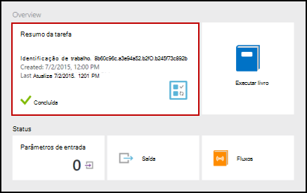

<properties
    pageTitle="Minha primeira runbook de fluxo de trabalho do PowerShell no Azure automação | Microsoft Azure"
    description="Tutorial que o orientará durante a criação, teste e a publicação de um runbook de texto simples usando o fluxo de trabalho do PowerShell."
    services="automation"
    documentationCenter=""
    authors="mgoedtel"
    manager="jwhit"
    editor=""
    keywords="PowerShell fluxo de trabalho, exemplos de fluxo de trabalho do powershell, powershell de fluxo de trabalho"/>
<tags
    ms.service="automation"
    ms.workload="tbd"
    ms.tgt_pltfrm="na"
    ms.devlang="na"
    ms.topic="get-started-article"
    ms.date="07/19/2016"
    ms.author="magoedte;bwren"/>

# <a name="my-first-powershell-workflow-runbook"></a>Minha primeira runbook de fluxo de trabalho do PowerShell

> [AZURE.SELECTOR] - [Gráfica](automation-first-runbook-graphical.md) - [PowerShell](automation-first-runbook-textual-PowerShell.md) - [Fluxo de trabalho do PowerShell](automation-first-runbook-textual.md)

Este tutorial orienta a criação de um [fluxo de trabalho do PowerShell runbook](automation-runbook-types.md#powerShell-workflow-runbooks) no Azure automação. Vamos começar com um simple runbook que vamos testar e publicar enquanto podemos explicam como acompanhar o status do trabalho runbook. Podemos vai modificar runbook para gerenciar recursos do Azure, nesse caso, iniciando uma máquina virtual Azure. Nós será faça runbook mais robusto, adicionando runbook parâmetros.

## <a name="prerequisites"></a>Pré-requisitos

Para concluir este tutorial, você precisará do seguinte.

-   Assinatura do Azure. Se você ainda não tenha um, você pode [ativar os benefícios do assinante MSDN](https://azure.microsoft.com/pricing/member-offers/msdn-benefits-details/) ou <a href="/pricing/free-account/" target="_blank"> [inscrever para uma conta gratuita](https://azure.microsoft.com/free/).
-   [Conta de automação](automation-security-overview.md) mantenha runbook e autenticar para recursos Azure.  Essa conta deve ter permissão para iniciar e parar a máquina virtual.
-   Uma máquina virtual Azure. Abordaremos parar e iniciar este máquina para que ela não deve ser produção.

## <a name="step-1---create-new-runbook"></a>Etapa 1 - Criar novo runbook

Vamos começar criando um runbook simple que gera o texto *Hello World*.

1.  No Portal do Azure, abra sua conta de automação.  
    A página de conta de automação oferece uma exibição rápida dos recursos nessa conta. Você já deve ter alguns ativos. A maioria delas são os módulos que são incluídos automaticamente em uma nova conta de automação. Você também deve ter o ativo de credencial mencionada nos [pré-requisitos](#prerequisites).
2.  Clique no bloco **Runbooks** para abrir a lista de runbooks.<br> 
3.  Crie um novo runbook clicando no botão **Adicionar um runbook** e, em seguida, **criar um novo runbook**.
4.  Nomeie runbook o *Fluxo de trabalho de MyFirstRunbook*.
5.  Nesse caso, vamos criar um [fluxo de trabalho do PowerShell runbook](automation-runbook-types.md#powerShell-workflow-runbooks) portanto, selecione **Fluxo de trabalho do Powershell** para **tipo de Runbook**.<br> 
6.  Clique em **criar** para criar runbook e abra o editor de texto.

## <a name="step-2---add-code-to-the-runbook"></a>Etapa 2 - adicionar código a runbook

Você pode o código de tipo diretamente em runbook, ou você pode selecionar cmdlets, runbooks e ativos do controle de biblioteca e tê-los adicionado ao runbook com qualquer parâmetros relacionados. Para esta explicação, podemos digitará diretamente em runbook.

1.  Nossa runbook está vazia com apenas a palavra-chave necessários *fluxo de trabalho* , o nome da nossa runbook e as chaves que serão encase o fluxo de trabalho inteiro. 

    ```
    Workflow MyFirstRunbook-Workflow
    {
    }
    ```

2.  Tipo de *Write-Output "Olá mundo."* entre as chaves. 
   
    ```
    Workflow MyFirstRunbook-Workflow
    {
      Write-Output "Hello World"
    }
    ```

3.  Salve runbook clicando em **Salvar**.<br> 

## <a name="step-3---test-the-runbook"></a>Etapa 3 - testar runbook

Antes de nós publicar runbook para disponibilizá-lo em produção, queremos testá-lo para garantir que ele funcione corretamente. Quando você testa um runbook, execute a sua versão de **rascunho** e exibir sua saída interativamente.

1.  Clique em **Painel de teste** para abrir o painel de teste.<br> 
2.  Clique em **Iniciar** para iniciar o teste. Isso deve ser a única opção ativada.
3.  Um [trabalho de runbook](automation-runbook-execution.md) é criado e seu status exibido.  
    O status do trabalho será iniciado como *enfileirados* indicando que ele está aguardando um trabalhador runbook na nuvem disponíveis. Ele será movido para *Iniciar* quando um trabalhador declarações o trabalho e, em seguida, *em execução* quando runbook realmente começa a ser executado.  
4.  Quando o trabalho de runbook for concluído, a saída é exibida. Em nosso caso, estamos deverá ver *Hello World*.<br> 
5.  Feche o painel de teste para retornar à tela.

## <a name="step-4---publish-and-start-the-runbook"></a>Etapa 4 - publicar e iniciar runbook

Runbook que acabou de criar ainda está em modo de rascunho. Precisamos publicá-lo antes de nós pode executá-lo em produção. Quando você publica uma runbook, você substituir a versão publicada existente com a versão de rascunho. Em nosso caso, nós ainda não tem uma versão publicada porque podemos runbook recém-criado.

1.  Clique em **Publicar** para publicar runbook e clique em seguida **Sim** quando solicitado.<br> 
2.  Se você rolar esquerda para exibir runbook no painel **Runbooks** agora, ele mostrará um **Status de criação** de **publicado**.
3.  Role de volta para a direita para exibir o painel de **MyFirstRunbook fluxo de trabalho**.  
    As opções na parte superior nos permitem iniciar runbook, agende-a para iniciar em algum momento no futuro ou crie um [webhook](automation-webhooks.md) para que ele pode ser iniciado por meio de uma chamada de HTTP.
4.  Queremos apenas iniciar runbook então clique em **Iniciar** e em seguida **Sim** quando solicitado.<br> 
5.  Um painel de trabalho é aberto para o trabalho de runbook que acabou de criar. Podemos fechar esse painel, mas nesse caso podemos deixá-lo aberto para que possamos ver o andamento do trabalho.
6.  O status do trabalho é mostrado no **Resumo de trabalho** e coincide os status visto quando testamos runbook.<br> 
7.  Depois que o status de runbook mostra *concluído*, clique em **saída**. O painel de saída é aberto e podemos ver nosso *Hello World*.<br>   
8.  Feche o painel de saída.
9.  Clique em **fluxos** para abrir o painel de fluxos de trabalho runbook. Devemos ver somente *Olá, mundo* no fluxo de saída, mas isso pode mostrar outros fluxos para um trabalho runbook como detalhado e erro se runbook grava a eles.<br> 
10. Feche o painel de fluxos e o painel de trabalho para retornar ao painel de MyFirstRunbook.
11. Clique em **trabalhos** para abrir o painel de tarefas para este runbook. Lista todos os trabalhos criados por este runbook de. Um trabalho listado como podemos executados apenas o trabalho uma vez só deverá ser exibida.<br> 
12. Você pode clicar neste trabalho para abrir o painel de trabalho mesmo que estamos exibidos quando podemos iniciado runbook. Isso permite que você voltar no tempo e exibir os detalhes de qualquer trabalho que foi criado para uma determinada runbook.

## <a name="step-5---add-authentication-to-manage-azure-resources"></a>Etapa 5 - adicionar autenticação para gerenciar recursos do Azure

Testamos e publicado nosso runbook, mas até o momento não faz nada útil. Queremos tê-la a gerenciar recursos do Azure. Ele não será capaz de fazer isso, embora a menos que temos ele autenticar usando as credenciais citadas nos [pré-requisitos](#prerequisites). Podemos fazer isso com o cmdlet **Add-AzureRMAccount** .

1.  Abra o editor textual clicando em **Editar** no painel MyFirstRunbook fluxo de trabalho.<br> 
2.  Não precisamos a linha de **Write-Output** mais, continue e excluí-la.
3.  Posicione o cursor em uma linha em branco entre as chaves.
4.  Digite ou copie e cole o seguinte código que irá manipular a autenticação com sua conta de automação executar como:

    ```
    $Conn = Get-AutomationConnection -Name AzureRunAsConnection 
    Add-AzureRMAccount -ServicePrincipal -Tenant $Conn.TenantID `
    -ApplicationId $Conn.ApplicationID -CertificateThumbprint $Conn.CertificateThumbprint
    ```

5.  Clique em **Testar painel** para que podemos testar runbook.
6.  Clique em **Iniciar** para iniciar o teste. Quando ela for concluída, você deve receber saída semelhante à seguintes, exibindo informações básicas de sua conta. Isso confirma que a credencial é válida.<br> 

## <a name="step-6---add-code-to-start-a-virtual-machine"></a>Etapa 6: adicionar código para iniciar uma máquina virtual

Agora que nosso runbook é autenticar à nossa assinatura Azure, podemos gerenciar recursos. Vamos adicionar um comando para iniciar uma máquina virtual. Você pode escolher qualquer máquina virtual em sua assinatura do Azure e agora podemos estará codificar esse nome para o cmdlet.

1.  Após *Adicionar AzureRmAccount*, digite *AzureRmVM início-nome 'VMName' - ResourceGroupName 'NameofResourceGroup'* fornecendo o nome e o nome do grupo de recursos da máquina virtual para iniciar.  

    ```
    workflow MyFirstRunbook-Workflow
    {
      $Conn = Get-AutomationConnection -Name AzureRunAsConnection
      Add-AzureRMAccount -ServicePrincipal -Tenant $Conn.TenantID -ApplicationId $Conn.ApplicationID -CertificateThumbprint $Conn.CertificateThumbprint
      Start-AzureRmVM -Name 'VMName' -ResourceGroupName 'ResourceGroupName'
    }
    ``` 

2.  Salvar runbook e clique em **Testar painel** para que estamos pode testá-lo.
3.  Clique em **Iniciar** para iniciar o teste. Quando ela for concluída, verifique se a máquina virtual foi iniciada.

## <a name="step-7---add-an-input-parameter-to-the-runbook"></a>Etapa 7: adicionar um parâmetro de entrada para runbook

Nossa runbook atualmente inicia o virtual da máquina que codificado no runbook, mas seria mais útil se nós poderia especificar a máquina virtual quando runbook é iniciado. Agora, adicionaremos parâmetros de entrada para runbook fornecer essa funcionalidade.

1.  Adicionar parâmetros para *VMName* e *ResourceGroupName* a runbook e usar essas variáveis com o cmdlet **Start-AzureRmVM** como no exemplo abaixo. 

    ```
    workflow MyFirstRunbook-Workflow
    {
       Param(
        [string]$VMName,
        [string]$ResourceGroupName
       )  
     $Conn = Get-AutomationConnection -Name AzureRunAsConnection 
     Add-AzureRMAccount -ServicePrincipal -Tenant $Conn.TenantID -ApplicationId $Conn.ApplicationID -CertificateThumbprint $Conn.CertificateThumbprint
     Start-AzureRmVM -Name $VMName -ResourceGroupName $ResourceGroupName
    }
    ```

2.  Salve runbook e abrir o painel de teste. Observe que você agora pode fornecer valores para as duas variáveis de entrada que serão usadas no teste.
3.  Feche o painel de teste.
4.  Clique em **Publicar** para publicar a nova versão do runbook.
5.  Pare a máquina virtual que você iniciou na etapa anterior.
6.  Clique em **Iniciar** para iniciar o runbook. Digite a **VMName** e **ResourceGroupName** para a máquina virtual que você vai iniciar.<br> 

7.  Quando runbook for concluído, verifique se a máquina virtual foi iniciada.

## <a name="next-steps"></a>Próximas etapas

-  Para começar a usar runbooks gráficas, consulte [Minha primeira runbook gráfica](automation-first-runbook-graphical.md)
-  Para começar a usar o PowerShell runbooks, consulte [Minha primeira runbook PowerShell](automation-first-runbook-textual-powershell.md)
-  Para saber mais sobre limitações, suas vantagens e tipos de runbook, consulte [tipos de runbook de automação do Azure](automation-runbook-types.md)
-  Para obter mais informações sobre script do PowerShell suporta o recurso, consulte [suporte no Azure automação de script do PowerShell nativo](https://azure.microsoft.com/blog/announcing-powershell-script-support-azure-automation-2/)