<properties 
    pageTitle="Criação de gráficos na automação Azure | Microsoft Azure"
    description="Criação de gráficos permite que você criar runbooks para automação do Azure sem trabalhando com código. Este artigo fornece uma introdução à criação de gráficos e todos os detalhes necessários para começar a criar um gráfico runbook."
    services="automation"   
    documentationCenter=""
    authors="mgoedtel"
    manager="jwhit"
    editor="tysonn" />
<tags 
    ms.service="automation"
    ms.devlang="na"
    ms.topic="article"
    ms.tgt_pltfrm="na"
    ms.workload="infrastructure-services"
    ms.date="06/03/2016"
    ms.author="magoedte;bwren" />

# Gráfica de coautoria na automação do Azure

## Introdução

Criação de gráfica permite que você criar runbooks para automação do Azure sem as complexidades do código do Windows PowerShell ou fluxo de trabalho do PowerShell subjacente. Adicione atividades à tela de uma biblioteca de cmdlets do e runbooks, vinculá-las e configurar para formar um fluxo de trabalho.  Se você nunca tiver trabalhado com System Center Orchestrator ou automação de gerenciamento de serviço (SMA), isso deve parecer familiar para você.   

Este artigo fornece uma introdução à criação de gráficos e os conceitos que você precisa para começar na criação de um runbook gráfica.

## Runbooks gráfica

Todos os runbooks na automação do Azure são fluxos de trabalho do Windows PowerShell.  Runbooks Graphical e gráficas fluxo de trabalho do PowerShell gerar código do PowerShell que é executado pelos trabalhadores automação, mas não é possível exibi-lo ou modificá-lo diretamente.  Um runbook gráfica pode ser convertido em um runbook gráficas fluxo de trabalho do PowerShell e vice-versa, mas eles não podem ser convertidos em um runbook textual. Um runbook textual existente não pode ser importado editor gráfico.  

## Visão geral do editor gráfico

Você pode abrir o editor de gráfico no portal do Azure, criando ou editando uma runbook gráfica.

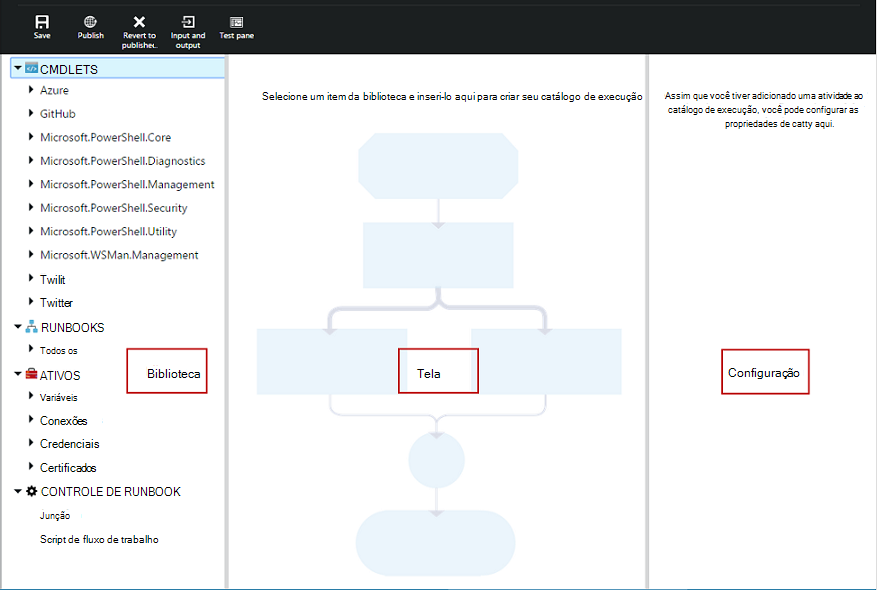

As seções a seguir descrevem os controles no editor gráfico.

### Tela
A tela é onde você projeta sua runbook.  Adicione as atividades de nós no controle de biblioteca para runbook e conectá-las com links para definir a lógica do runbook.

Você pode usar os controles na parte inferior da tela para ampliar e reduzir.

### Controle de biblioteca

O controle de biblioteca é onde você pode selecionar [as atividades](#activities) para adicionar à sua runbook.  Você pode adicioná-los à tela onde você conectá-las a outras atividades.  Ele inclui quatro seções descritas na tabela a seguir.

| Seção | Descrição |
|:---|:---|
| Cmdlets | Inclui todos os cmdlets que pode ser usados em seu runbook.  Cmdlets são organizadas por módulo.  Todos os módulos que você instalou em sua conta de automação estarão disponíveis.  |
| Runbooks |  Inclui o runbooks em sua conta de automação. Esses runbooks podem ser adicionados à tela a ser usado como filho runbooks. Somente runbooks do mesmo tipo core como runbook sendo editado são mostradas; para Graphical runbooks somente baseada em PowerShell runbooks são mostradas, enquanto gráficas fluxo de trabalho do PowerShell runbooks somente PowerShell fluxo de trabalho baseados em runbooks são mostradas.
| Ativos | Inclui os [ativos de automação](http://msdn.microsoft.com/library/dn939988.aspx) em sua conta de automação que pode ser usada em seu runbook.  Quando você adiciona um ativo para um runbook, ele irá adicionar uma atividade de fluxo de trabalho que obtém o ativo selecionado.  No caso de ativos de variável, você pode selecionar se deseja adicionar uma atividade para obter a variável ou definir a variável.
| Controle de runbook | Inclui as atividades de controle de runbook que podem ser usadas em seu runbook atual. Uma *junção* leva várias entradas e aguarda até que todos tenham concluído antes de continuar o fluxo de trabalho. Uma atividade de *código* executa uma ou mais linhas de código do PowerShell ou fluxo de trabalho do PowerShell dependendo do tipo de runbook gráficas.  Você pode usar essa atividade para código personalizado ou funcionalidade que é difícil atingir com outras atividades.|

### Controle de configuração

O controle de configuração é onde você fornecer detalhes para um objeto selecionado na tela. As propriedades disponíveis neste controle dependerá do tipo de objeto selecionado.  Quando você selecionar uma opção no controle de configuração, ele será aberto lâminas adicionais para fornecer informações adicionais.

### Controle de teste

O controle de teste não é exibido quando o editor gráfico é iniciado pela primeira vez. Ele é aberto quando você interativamente [testar uma runbook gráfica](#graphical-runbook-procedures).  

## Procedimentos de runbook gráfica 

### Exportando e importando um runbook gráfica

Você só pode exportar a versão publicada do runbook gráfico.  Se runbook ainda não foi publicado, em seguida, no botão **Exportar publicado** será desabilitado.  Quando você clica no botão **Exportar publicados** , runbook é baixada para seu computador local.  O nome do arquivo corresponde ao nome do runbook com uma extensão de *graphrunbook* .

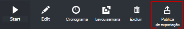

Você pode importar um arquivo de runbook Graphical ou gráficas fluxo de trabalho do PowerShell, selecionando a opção **Importar** ao adicionar um runbook.   Quando você selecionar o arquivo a importar, você pode manter o mesmo **nome** ou fornecer um novo.  O campo tipo de Runbook exibirá o tipo de runbook após ele avalia o arquivo selecionado e se você tentar selecionar um tipo diferente que não estiver correto, uma mensagem será apresentada observando existem possíveis conflitos e durante a conversão, pode haver erros de sintaxe.  

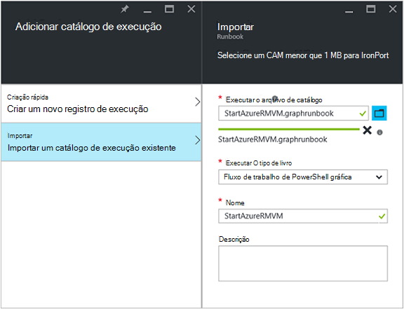

### Teste um runbook gráfica

Você pode testar a versão de rascunho de uma runbook no portal do Azure enquanto deixando a versão publicada do runbook inalterada, ou você pode testar uma nova runbook antes que ele foi publicado. Isso permite que você verificar que runbook está funcionando corretamente antes de substituir a versão publicada. Quando você testa um runbook, runbook rascunho é executado e as ações que ele executa são concluídas. Nenhum histórico de trabalho é criado, mas saída é exibida no painel de saída de teste. 

Abra o controle de teste para um runbook abrindo runbook para editar e, em seguida, clique no botão **Painel de teste** .

O controle de teste solicitará os parâmetros de entrada, e você pode começar runbook clicando no botão **Iniciar** .

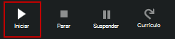

### Publicando um runbook gráfica

Cada runbook no Azure automação tem um rascunho e uma versão publicada. Somente a versão publicada está disponível para ser executado, e somente a versão de rascunho pode ser editada. A versão publicada não é afetada por quaisquer alterações para a versão de rascunho. Quando a versão de rascunho estiver pronta esteja disponível, em seguida, publicá-la que substitui a versão publicada com a versão de rascunho.

Você pode publicar um runbook gráfica abrindo runbook para edição e, em seguida, clicando no botão **Publicar** .

Quando um runbook ainda não foi publicado, ele tem um status de **novo**.  Quando ele é publicado, ele tem um status de **publicado**.  Se você editar runbook depois que ele foi publicado, e as versões de rascunho e publicado são diferentes, runbook tem um status **em Editar**.

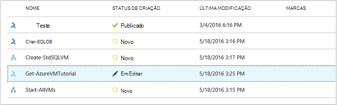 

Você também tem a opção para reverter para a versão publicada de um runbook.  Isso joga fora as alterações feitas desde runbook foi publicado pela última vez e substitui a versão de rascunho do runbook com a versão publicada.

## Atividades

Atividades são os blocos de construção de uma runbook.  Uma atividade pode ser um cmdlet do PowerShell, um runbook filho ou uma atividade de fluxo de trabalho.  Adicione uma atividade para runbook direita clicando no controle de biblioteca e selecionando **Adicionar à tela**.  Você pode clique e arraste a atividade para colocá-lo em qualquer lugar na tela de desenho que você goste.  O local do da atividade na tela não afeta a operação do runbook de nenhuma forma.  Você pode layout seu runbook, porém encontrá-lo mais adequado para visualizar sua operação. 

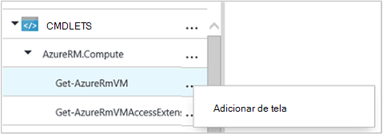

Selecione a atividade na tela para configurar suas propriedades e parâmetros na lâmina configuração.  Você pode alterar o **rótulo** da atividade para algo que descreva a você.  O cmdlet original ainda está sendo executado, você está alterando simplesmente seu nome de exibição que será usada no editor gráfico.  O rótulo deve ser exclusivo runbook. 

### Conjuntos de parâmetros

Um conjunto de parâmetro define os parâmetros obrigatórios e opcionais que aceitarão valores para um determinado cmdlet.  Todos os cmdlets ter pelo menos um parâmetro definido e algumas têm várias.  Se um cmdlet tem vários conjuntos de parâmetros, você deve selecionar qual deles você usará antes de configurar parâmetros.  Os parâmetros que você pode configurar dependerá o conjunto de parâmetro que você escolher.  Você pode alterar o conjunto de parâmetro usado por uma atividade selecionando **Parâmetro definido** e selecionando outro conjunto.  Nesse caso, quaisquer valores de parâmetro que você configurou são perdidos.

No exemplo a seguir, o cmdlet Get-AzureRmVM tem três conjuntos de parâmetro.  Você não pode configurar valores de parâmetro até selecionar um dos conjuntos de parâmetro.  O conjunto de parâmetro ListVirtualMachineInResourceGroupParamSet é para retornar todas as máquinas virtuais em um grupo de recursos e tem um único parâmetro opcional.  O GetVirtualMachineInResourceGroupParamSet é para especificar a máquina virtual que você deseja retornar e tem duas obrigatório e um parâmetro opcional.

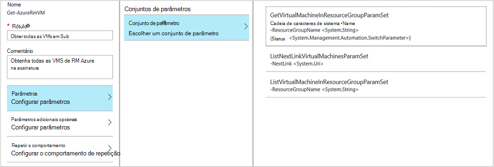

#### Valores de parâmetro

Quando você especificar um valor para um parâmetro, você selecionar uma fonte de dados para determinar como o valor será especificado.  As fontes de dados que estão disponíveis para um determinado parâmetro dependerá os valores válidos para esse parâmetro.  Por exemplo, Null não será uma opção disponível para um parâmetro que não permitem valores nulos.

| Fonte de dados | Descrição |
|:---|:---|
|Valor da constante|Digite um valor para o parâmetro.  Isso só está disponível para os seguintes tipos de dados: Int32, Int64, cadeia de caracteres, booliano, DateTime, alternar. |
|Saída de atividade|Saída de uma atividade que precede a atividade atual no fluxo de trabalho.  Todas as atividades válidas serão listadas.  Selecione apenas a atividade para usar sua saída para o valor do parâmetro.  Se a atividade produz um objeto com várias propriedades, em seguida, você pode digitar na caixa Nome da propriedade depois de selecionar a atividade.|
|Entrada de runbook |Selecione um parâmetro de entrada do runbook como entrada para o parâmetro da atividade.|  
|Variável ativo|Selecione uma variável de automação como entrada.|  
|Ativos de credencial|Selecione uma credencial de automação como entrada.|  
|Ativos de certificado|Selecione um certificado de automação como entrada.|  
|Ativos de Conexão|Selecione uma Conexão de automação como entrada.| 
|Expressão do PowerShell|Especifica simples [PowerShell expressão](#powershell-expressions).  A expressão será avaliada antes da atividade e o resultado usado para o valor de parâmetro.  Você pode usar variáveis para se referir a saída de uma atividade ou um parâmetro de entrada do runbook.|
|Não configurado|Limpa qualquer valor que foi configurado anteriormente.|

#### Parâmetros adicionais opcionais

Todos os cmdlets terá a opção de fornecer parâmetros adicionais.  Esses são os parâmetros comuns do PowerShell ou outros parâmetros personalizados.  São apresentadas com uma caixa de texto onde você pode fornecer parâmetros usando a sintaxe do PowerShell.  Por exemplo, para usar o parâmetro comum **detalhado** , você deve especificar **"-detalhado: $True"**.

### Repetir atividade

**Comportamento de repetir** permite que uma atividade ser executado várias vezes até que uma determinada condição seja atendida, assim como um loop.  Você pode usar esse recurso para atividades que deve executar várias vezes, estão sujeitos a erros e pode ser necessário mais de uma tentativa para o sucesso ou testar as informações de saída da atividade para dados válidos.    

Quando você habilita Repetir para uma atividade, você pode definir um atraso e uma condição.  O atraso é o tempo (medido em segundos ou minutos) que runbook esperará antes de executar a atividade novamente.  Se nenhum atraso for especificado, então a atividade será executado novamente imediatamente após a sua conclusão. 

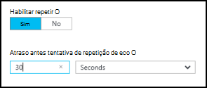

A condição de repetição é uma expressão de PowerShell que é avaliada cada vez que a atividade é executada.  Se a expressão é resolvida como True, a atividade executará novamente.  Se a expressão é resolvida como falsa a atividade não execute novamente e runbook move para a próxima atividade. 

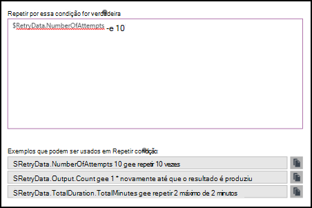

A condição de repetição pode usar uma variável chamada $RetryData que fornece acesso a informações sobre as tentativas de atividade.  Essa variável possui as propriedades da tabela a seguir.

| Propriedade | Descrição |
|:--|:--|
| NumberOfAttempts | Número de vezes que a atividade foi executada.              |
| Saída           | Saída da última execução da atividade.                    |
| TotalDuration    | Tempo decorrido desde a atividade foi iniciada pela primeira vez. |
| StartedAt        | Hora no formato UTC que a atividade foi iniciado pela primeira vez.           |

A seguir é exemplos de atividade Repetir condições.

    # Run the activity exactly 10 times.
    $RetryData.NumberOfAttempts -ge 10 

    # Run the activity repeatedly until it produces any output.
    $RetryData.Output.Count -ge 1 

    # Run the activity repeatedly until 2 minutes has elapsed. 
    $RetryData.TotalDuration.TotalMinutes -ge 2

Depois de configurar uma condição de repetição de uma atividade, a atividade inclui dois visuais para lembrá-lo.  Um é apresentado a atividade e a outra é ao revisar a configuração da atividade.

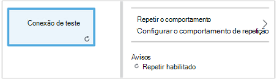

### Controle de Script do fluxo de trabalho

Um controle de código é uma atividade especial que aceita script PowerShell ou fluxo de trabalho do PowerShell, dependendo do tipo de runbook gráfica sendo criado para fornecer funcionalidade que caso contrário, não estejam disponível.  Ele não pode aceitar parâmetros, mas ele pode usar variáveis atividade runbook e saída para parâmetros de entrada.  Qualquer saída da atividade é adicionada ao databus menos que ele tenha nenhuma saída vincular caso em que ele é adicionado à saída do runbook.

Por exemplo, o código a seguir executa cálculos de data usando uma variável de entrada runbook chamada $NumberOfDays.  Envia uma data e hora calculadas como saída para ser usado por atividades subsequentes do runbook.

    $DateTimeNow = (Get-Date).ToUniversalTime()
    $DateTimeStart = ($DateTimeNow).AddDays(-$NumberOfDays)}
    $DateTimeStart

## Links e fluxo de trabalho

Um **link** em um gráfico runbook conecta duas atividades.  Ele é exibido na tela como uma seta apontando da atividade de origem para a atividade de destino.  Execute as atividades na direção da seta com a atividade de destino iniciando após concluir a atividade de origem.  

### Criar um link

Crie um vínculo entre duas atividades selecionando a atividade de origem e clicando no círculo na parte inferior da forma.  Arraste a seta para a atividade de destino e a versão.

Selecione o link para configurar suas propriedades na lâmina configuração.  Isso inclui o tipo de link que é descrito na tabela a seguir.

| Tipo de vínculo | Descrição |
|:---|:---|
| Pipeline | A atividade de destino é executada uma vez para cada saída do objeto da atividade de origem.  A atividade de destino não é executado se a atividade de origem resulta em nenhuma saída.  Saída da atividade de origem está disponível como um objeto.  |
| Sequência | A atividade de destino é executado apenas uma vez.  Ele recebe uma matriz de objetos da atividade de origem.  Saída da atividade de origem está disponível como uma matriz de objetos. |

### Iniciando atividade

Um runbook gráfica será iniciado com todas as atividades que não têm um link de entrada.  Este será apenas uma atividade que faria atuar como a atividade de partida de runbook com frequência.  Se várias atividades não tiver um link de entrada, runbook iniciará executando-los em paralelo.  Em seguida, ele seguirá os links para executar outras atividades cada conclusão.

### Condições

Quando você especifica uma condição em um link, a atividade de destino é executada somente se a condição resolve para true.  Você geralmente usará uma variável $ActivityOutput em uma condição para recuperar a saída da atividade de origem.  

Para um link de pipeline, você especifica uma condição para um único objeto e a condição é avaliada para cada saída de objeto com a atividade de origem.  A atividade de destino é executada, em seguida, para cada objeto que satisfaça a condição.  Por exemplo, com uma atividade de origem de Get-AzureRmVm, a seguinte sintaxe poderia ser usada para um link de pipeline condicional para recuperar somente máquinas virtuais no grupo de recursos denominado *Grupo1*.  

    $ActivityOutput['Get Azure VMs'].Name -match "Group1"

Para um link de sequência, a condição é apenas avaliada uma vez desde que um único array é retornado contendo todas as saídas de objetos da atividade de origem.  Por isso, um link de sequência não pode ser usado para filtragem como um link de pipeline mas simplesmente determinará estando ou não a próxima atividade é executada. Veja por exemplo o seguinte conjunto de atividades no nosso runbook máquina virtual iniciar.  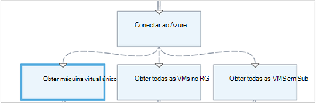 
Há três links de sequência diferente que estiver verificando valores foram fornecidas dois parâmetros de entrada runbook que representa o nome de máquina virtual e o nome do grupo de recursos para determinar qual é a ação apropriada para tirar - iniciar uma única VM, inicie todas VMs no grupo de recurso ou todas as VMs em uma assinatura.  Para o link de sequência entre conectar ao Azure e obter única VM, aqui está a lógica de condição:

    <# 
    Both VMName and ResourceGroupName runbook input parameters have values 
    #>
    (
    (($VMName -ne $null) -and ($VMName.Length -gt 0))
    ) -and (
    (($ResourceGroupName -ne $null) -and ($ResourceGroupName.Length -gt 0))
    )

Quando você usa um link condicional, os dados disponíveis da atividade de origem para outras atividades ramificação serão filtrados pela condição.  Se uma atividade é a fonte para vários vínculos, os dados disponíveis para atividades em cada ramificação dependerá a condição no link conectando ao ramificação.

Por exemplo, a atividade de **Início-AzureRmVm** em runbook abaixo inicia todas as máquinas virtuais.  Ela tem dois links condicionais.  O primeiro link condicional usa a expressão *$ActivityOutput ['Início-AzureRmVM']. IsSuccessStatusCode - eq $true* para filtrar se a atividade de início-AzureRmVm foi concluída com êxito.  O segundo usa a expressão *$ActivityOutput ['Início-AzureRmVM']. IsSuccessStatusCode - ne $true* para filtrar se a atividade de início-AzureRmVm Falha ao iniciar a máquina virtual.  

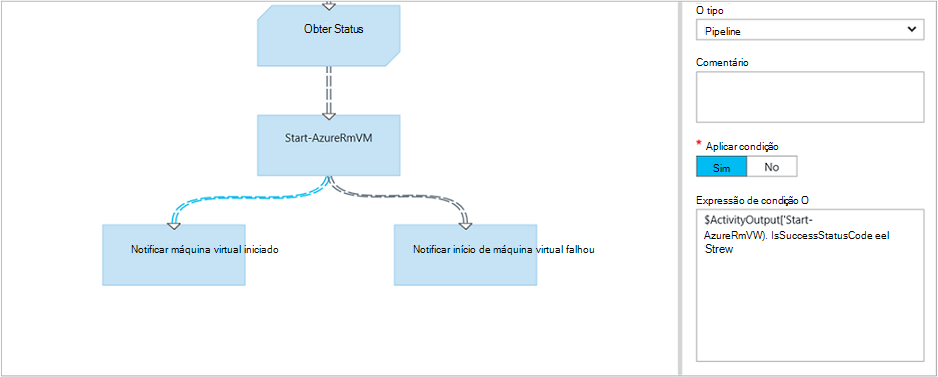

Qualquer atividade que segue o primeiro link e usa a saída de atividade do Get-AzureVM obterá somente as máquinas virtuais que foram iniciadas no momento em que Get-AzureVM foi executado.  Qualquer atividade que segue o segundo link só terão a máquinas virtuais que foram interrompidas no momento em que Get-AzureVM foi executado.  Qualquer atividade seguindo o terceiro link obterá todas as máquinas virtuais, independentemente de seu estado em execução.

### Junções

Uma junção é uma atividade especial que irá esperar concluíram todas as ramificações de entrada.  Isso permite executar várias atividades em paralelo e certifique-se de que todos tenham concluídas antes de passar.

Embora uma junção pode ter um número ilimitado de links recebidos, não mais de um desses vínculos pode ser um pipeline.  O número de links de sequência de entrada não é restringido.  Você poderá criar a junção com vários vínculos de pipeline de entrada e salvar runbook, mas ele falhará quando ele é executado.

O exemplo a seguir faz parte de um runbook que inicia um conjunto de máquinas virtuais ao fazer o download de patches para serem aplicados a essas máquinas simultaneamente.  Uma junção é usada para garantir que os dois processos estão concluídos antes runbook continua.

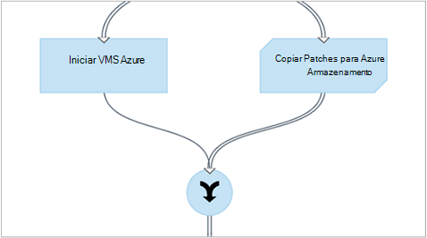

### Ciclos

Um ciclo é quando uma links de atividade de destino retornar ao sua atividade de origem ou outra atividade que eventualmente vincula de volta à sua fonte.  Atualmente, ciclos não são permitidos na criação de gráficos.  Se seu runbook tem um ciclo, ele salvará corretamente, mas receberá um erro quando ele é executado.

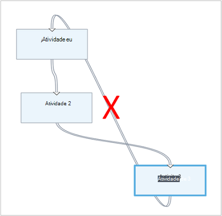

### Compartilhando dados entre atividades

Todos os dados que é de saída por uma atividade com um link de saída são gravados a *databus* para runbook.  Atividade de runbook pode usar dados sobre o databus para preencher os valores de parâmetro ou incluir no código de script.  Uma atividade pode acessar a saída de qualquer atividade anterior no fluxo de trabalho.     

Como os dados são gravados para o databus dependem do tipo de vínculo na atividade.  Para um **pipeline**, os dados são saída como objetos de múltiplos.  Para um link de **sequência** , os dados são saída como uma matriz.  Se houver apenas um único valor, ele será saída como uma matriz de elemento único.

Você pode acessar dados a databus usando um dos dois métodos.  Primeiro está usando uma fonte de dados de **Saída de atividade** para preencher um parâmetro de outra atividade.  Se a saída é um objeto, você pode especificar uma única propriedade.

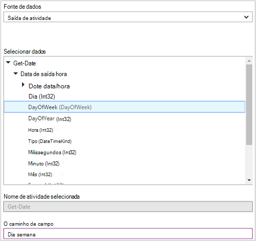

Você também pode recuperar a saída de uma atividade de uma fonte de dados do **PowerShell expressão** ou de uma atividade de **Script de fluxo de trabalho** com uma variável de ActivityOutput.  Se a saída é um objeto, você pode especificar uma única propriedade.  Variáveis de ActivityOutput usam a seguinte sintaxe.

    $ActivityOutput['Activity Label']
    $ActivityOutput['Activity Label'].PropertyName 

### Pontos de verificação

Você pode definir [pontos de verificação](automation-powershell-workflow.md#checkpoints) em um fluxo de trabalho de PowerShell gráficas runbook selecionando *runbook de ponto de verificação* em qualquer atividade.  Isso faz com que um ponto de verificação a ser definida após a execução de atividade.

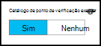

Pontos de verificação só estão habilitados no runbooks gráficas fluxo de trabalho do PowerShell, ele não está disponível no runbooks gráficas.  Se runbook usa cmdlets do Azure, você deve seguir qualquer atividade marcada com um AzureRMAccount adicionar caso runbook está suspenso e reinicia de neste ponto de verificação em um trabalhador diferente. 

## Autenticação de recursos do Azure

Runbooks na automação do Azure que gerenciar recursos Azure exigirá autenticação no Azure.  O novo recurso de [Executar como conta](automation-sec-configure-azure-runas-account.md) (também conhecido como um serviço principal) é o método padrão para acessar os recursos do Gerenciador de recursos do Azure em sua assinatura com runbooks de automação.  Você pode adicionar essa funcionalidade para um runbook gráfica adicionando o ativo de Conexão **AzureRunAsConnection** , que está usando o cmdlet do PowerShell [Get-AutomationConnection](https://technet.microsoft.com/library/dn919922%28v=sc.16%29.aspx) e [Adicionar-AzureRmAccount](https://msdn.microsoft.com/library/mt619267.aspx) cmdlet à tela. Isso é ilustrado no exemplo a seguir. 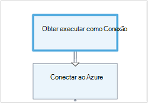 
A atividade de obter executar como Conexão (isto é, Get-AutomationConnection), está configurado com uma fonte de dados de valor constante denominada AzureRunAsConnection. 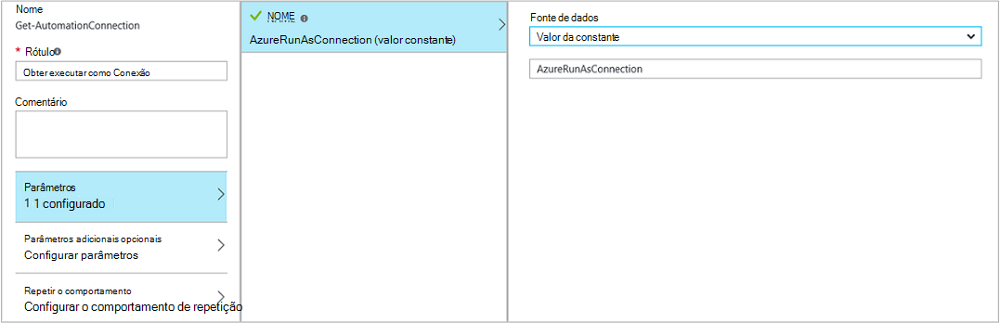 
A próxima atividade, adicionar-AzureRmAccount, adiciona a conta de executar como autenticada para uso em runbook. 
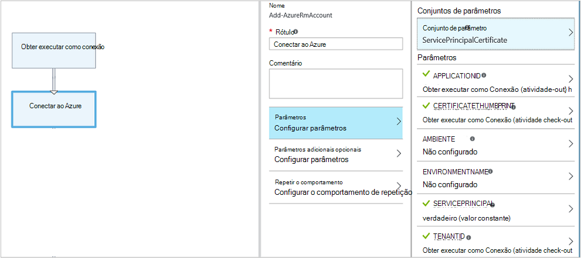 
Para os parâmetros **APPLICATIONID**, **CERTIFICATETHUMBPRINT**e **TENANTID** , você precisará especificar o nome da propriedade para o caminho de campo, porque a atividade produz um objeto com várias propriedades.  Caso contrário, quando você executar runbook, ele falhará tentando autenticar.  Este é o que você precisa no mínimo autenticar seu runbook com a conta executar como.

Para manter compatibilidade com versões anteriores para os assinantes que tem criado uma conta de automação usando uma [conta de usuário do Azure AD](automation-sec-configure-aduser-account.md) para gerenciar recursos de gerenciamento de serviço do Azure (ASM) ou o Gerenciador de recursos do Azure, o método para autenticar é o cmdlet Add-AzureAccount com um [ativo de credencial](http://msdn.microsoft.com/library/dn940015.aspx) que representa um usuário do Active Directory com acesso à conta do Azure.

Você pode adicionar essa funcionalidade para um runbook gráfica adicionando um ativo de credencial para a tela seguida por uma atividade de AzureAccount de adicionar.  AzureAccount adicionar usa a atividade de credencial para sua entrada.  Isso é ilustrado no exemplo a seguir.

Você precisa autenticar no início do runbook e depois de cada ponto de verificação.  Isso significa que adicionando uma atividade de adição Add-AzureAccount após qualquer atividade de fluxo de trabalho de ponto de verificação. Você não precisa de uma atividade de credencial adição desde que você pode usar o mesmo 

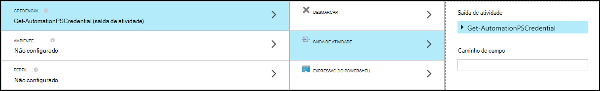

## Runbook de entrada e saída

### Entrada de runbook

Um runbook pode exigir a entrada de um usuário quando eles iniciam runbook por meio do portal Azure ou de outro runbook se atual é usado como um filho.
Por exemplo, se você tiver um runbook que cria uma máquina virtual, você precisará fornecer informações como o nome da máquina virtual e outras propriedades toda vez que você inicia runbook.  

Aceitar a entrada para uma runbook definindo um ou mais parâmetros de entrada.  Forneça os valores para esses parâmetros sempre que runbook é iniciado.  Quando você inicia um runbook com o portal do Azure, ele solicitará que você forneça valores para a cada um dos parâmetros de entrada do runbook.

Você pode acessar parâmetros de entrada para uma runbook clicando no botão de **entrada e saída** na barra de ferramentas runbook.  

 

Isso abre o controle de **entrada e saída** , onde você pode editar um parâmetro de entrada existente ou criar um novo clicando em **Adicionar entrada**. 

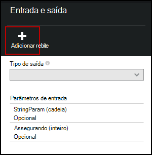

Cada parâmetro de entrada é definido pelas propriedades da tabela a seguir.

|Propriedade|Descrição|
|:---|:---|
| Nome | O nome exclusivo do parâmetro.  Isso só pode conter caracteres numéricos alfa e não pode conter um espaço. |
| Descrição | Uma descrição opcional para o parâmetro de entrada.  |
| Tipo | Tipo de dados esperado para o valor do parâmetro.  O portal do Azure fornecerá um controle apropriado para o tipo de dados para cada parâmetro quando solicitando entrada. |
| Obrigatório | Especifica se deve ser fornecido um valor para o parâmetro.  Runbook não pode ser iniciado se você não fornecer um valor para cada parâmetro obrigatório que não tem um valor padrão definido. |
| Valor padrão | Especifica o valor que é usado para o parâmetro se não for fornecido.  Isso pode ser Null ou um valor específico. |

### Saída do runbook

Dados criados por qualquer atividade que não tem um link de saída serão adicionados à [saída do runbook](http://msdn.microsoft.com/library/azure/dn879148.aspx).  A saída é salvo com o trabalho de runbook e está disponível para um runbook pai quando runbook é usado como um filho.  

## Expressões do PowerShell

Uma das vantagens de criação de gráficos está fornecendo a capacidade de criar um runbook com o mínimo de conhecimento do PowerShell.  Atualmente, é necessário saber um pouco do PowerShell, embora para preencher determinados [valores de parâmetro](#activities) e [condições de link](#links-and-workflow)de configuração.  Esta seção fornece uma rápida introdução às expressões do PowerShell para os usuários que podem não estar familiarizados com ele.  Detalhes completos do PowerShell estão disponíveis no [script com o Windows PowerShell](http://technet.microsoft.com/library/bb978526.aspx). 

### Fonte de dados de expressão do PowerShell

Você pode usar uma expressão de PowerShell como uma fonte de dados para preencher o valor de um [parâmetro de atividade](#activities) com os resultados de algum código do PowerShell.  Isso pode ser uma única linha de código que executa alguns função simples ou várias linhas que executam alguma lógica complexa.  Qualquer saída de um comando que não está atribuído a uma variável é saída para o valor do parâmetro. 

Por exemplo, o comando a seguir seria saída a data atual. 

    Get-Date

Os seguintes comandos construir uma cadeia de caracteres a partir da data atual e atribuí-la a uma variável.  O conteúdo da variável é enviado para a saída 

    $string = "The current date is " + (Get-Date)
    $string

Os seguintes comandos avaliar a data atual e retornam uma cadeia de caracteres que indica se o dia atual é um fim de semana ou dia da semana. 

    $date = Get-Date
    if (($date.DayOfWeek = "Saturday") -or ($date.DayOfWeek = "Sunday")) { "Weekend" }
    else { "Weekday" }
    
 
### Saída de atividade

Para usar a saída de uma atividade anterior em runbook, use a variável $ActivityOutput com a seguinte sintaxe.

    $ActivityOutput['Activity Label'].PropertyName

Por exemplo, você pode ter uma atividade com uma propriedade que requer o nome de uma máquina virtual caso em que você pode usar a expressão a seguir.

    $ActivityOutput['Get-AzureVm'].Name

Se a propriedade que necessários na máquina virtual objeto em vez de apenas uma propriedade, você poderia retornar todo o objeto usando a seguinte sintaxe.

    $ActivityOutput['Get-AzureVm']

Você também pode usar a saída de uma atividade em uma expressão mais complexa, como as seguintes que concatena texto para o nome da máquina virtual.

    "The computer name is " + $ActivityOutput['Get-AzureVm'].Name

### Condições

Use [operadores de comparação](https://technet.microsoft.com/library/hh847759.aspx) para comparar valores ou determinar se um valor corresponde a um padrão especificado.  Uma comparação retorna um valor de $true ou $false.

Por exemplo, a seguinte condição determina se da máquina virtual de uma atividade denominada *Get-AzureVM* está atualmente *parado*. 

    $ActivityOutput["Get-AzureVM"].PowerState –eq "Stopped"

A seguinte condição verifica se a mesma máquina virtual é em qualquer estado diferente de *parou*.

    $ActivityOutput["Get-AzureVM"].PowerState –ne "Stopped"

Você pode ingressar em várias condições usando um [operador lógico](https://technet.microsoft.com/library/hh847789.aspx) como **- e** ou **- ou**.  Por exemplo, a seguinte condição verifica se a mesma máquina virtual no exemplo anterior está em um estado de *parado* ou *Parar*.

    ($ActivityOutput["Get-AzureVM"].PowerState –eq "Stopped") -or ($ActivityOutput["Get-AzureVM"].PowerState –eq "Stopping") 

### Tabelas de hash

[Tabelas de hash](http://technet.microsoft.com/library/hh847780.aspx) são pares de nome/valor que são úteis para retornar um conjunto de valores.  Propriedades de certas atividades podem esperar uma tabela de hash em vez de um valor simples.  Você também pode ver como tabela de hash conhecida como um dicionário. 

Você pode criar uma tabela de hash com a seguinte sintaxe.  Uma tabela de hash pode conter qualquer número de entradas, mas cada é definida por um nome e um valor.

    @{ <name> = <value>; [<name> = <value> ] ...}

Por exemplo, a expressão a seguir cria uma tabela de hash a ser usado na fonte de dados para um parâmetro de atividade que esperado de uma tabela de hash com valores para uma pesquisa na internet.

    $query = "Azure Automation"
    $count = 10
    $h = @{'q'=$query; 'lr'='lang_ja';  'count'=$Count}
    $h

O exemplo a seguir usa a saída de uma atividade chamada *Obter Conexão Twitter* para preencher uma tabela de hash.

    @{'ApiKey'=$ActivityOutput['Get Twitter Connection'].ConsumerAPIKey;
      'ApiSecret'=$ActivityOutput['Get Twitter Connection'].ConsumerAPISecret;
      'AccessToken'=$ActivityOutput['Get Twitter Connection'].AccessToken;
      'AccessTokenSecret'=$ActivityOutput['Get Twitter Connection'].AccessTokenSecret}

## Próximas etapas

- Para começar a usar runbooks de fluxo de trabalho do PowerShell, consulte [Minha primeira runbook de fluxo de trabalho do PowerShell](automation-first-runbook-textual.md) 
- Para começar a usar runbooks gráficas, consulte [Minha primeira runbook gráfica](automation-first-runbook-graphical.md)
- Para saber mais sobre limitações, suas vantagens e tipos de runbook, consulte [tipos de runbook de automação do Azure](automation-runbook-types.md)
- Para compreender como autenticar usando a conta de automação executar como, consulte [Configurar executar como conta do Azure](automation-sec-configure-azure-runas-account.md)
 
