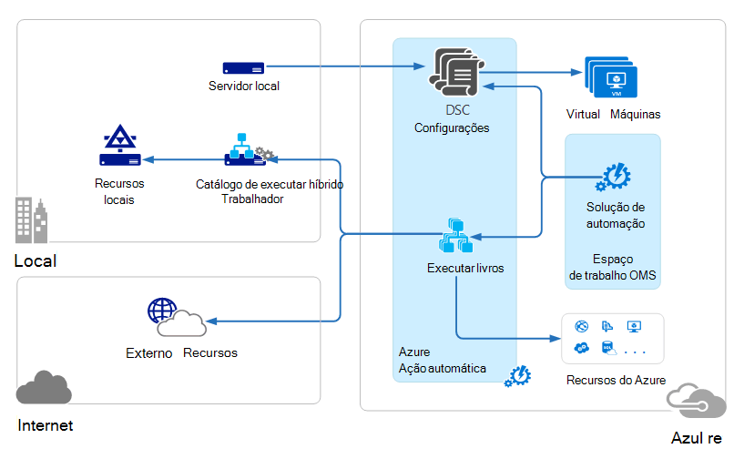
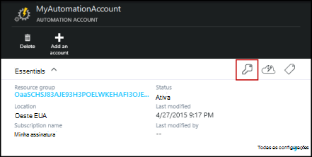
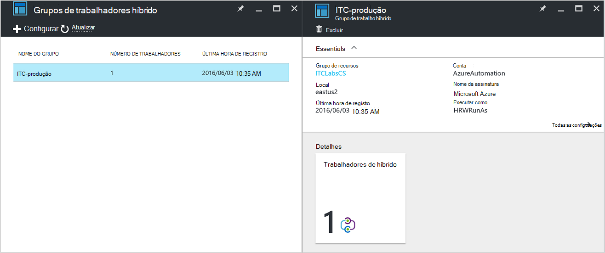
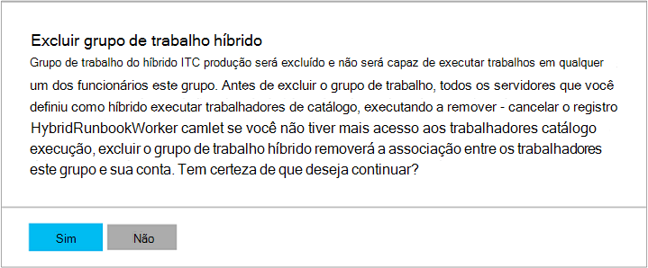

<properties
   pageTitle="Automação Azure híbrido Runbook trabalhadores | Microsoft Azure"
   description="Este artigo fornece informações sobre como instalar e usar híbrido Runbook trabalhador que é um recurso de automação do Azure que permite executar runbooks em máquinas no seu centro de dados local."
   services="automation"
   documentationCenter=""
   authors="mgoedtel"
   manager="jwhit"
   editor="tysonn" />
<tags
   ms.service="automation"
   ms.devlang="na"
   ms.topic="article"
   ms.tgt_pltfrm="na"
   ms.workload="infrastructure-services"
   ms.date="10/14/2016"
   ms.author="bwren" />

# Automação Azure híbrido Runbook trabalhadores

Runbooks na automação do Azure não podem acessar recursos no seu centro de dados locais como eles são executados na nuvem Azure.  O recurso híbrido Runbook trabalhador do Azure automação permite executar runbooks em máquinas localizadas no seu centro de dados para gerenciar recursos locais. As runbooks são armazenados e gerenciados no Azure automação e, em seguida, entregue para uma ou mais máquinas locais.  

Esta funcionalidade está ilustrada na imagem a seguir.   

Você pode designar um ou mais computadores em seu data center para agir como um operador de Runbook híbrido e executar runbooks de automação do Azure.  Cada trabalhador requer o agente de gerenciamento da Microsoft com uma conexão para o pacote de gerenciamento de operações do Microsoft e o ambiente de runbook de automação do Azure.  Pacote de gerenciamento de operações só é usado para instalar e manter o agente de gerenciamento e para monitorar a funcionalidade do trabalhador.  A entrega de runbooks e as instruções para executá-las são executadas pela automação do Azure.

Não há nenhum requisito de entrada de firewall para dar suporte a híbrido Runbook trabalhadores. O agente no computador local inicia todas as comunicações com a automação do Azure na nuvem. Quando um runbook é iniciado, o Azure automação cria uma instrução que é recuperada pelo agente. O agente então extrai os pressionada runbook e todos os parâmetros antes de serem executados.  Ele também irá recuperar qualquer [ativos](http://msdn.microsoft.com/library/dn939988.aspx) que são usadas pelo runbook de automação do Azure.

>[AZURE.NOTE] Trabalhadores de Runbook híbrido atualmente não suportam [Configurações de DSC](automation-dsc-overview.md).

## Grupos de trabalho de Runbook híbrido

Cada trabalhador de Runbook híbrida é um membro de um grupo de híbrido Runbook trabalhador que você especificar quando você instala o agente.  Um grupo pode incluir um único agente, mas você pode instalar vários agentes em um grupo para alta disponibilidade.

Quando você inicia um runbook em um operador de Runbook híbridos, você pode especificar o grupo que será executado em.  Os membros do grupo irá determinar quais trabalhador atenderá a solicitação.  Você não pode especificar um operador específico.

## Requisitos de Runbook trabalhador híbrido

Você deve designar pelo menos um computador local para executar trabalhos de runbook híbrido.  Este computador deve ter o seguinte:

- Windows Server 2012 ou posterior
- Windows PowerShell 4.0 ou posterior
- Mínimo de duas cores e 4 GB de RAM

Considere as seguintes recomendações para trabalhadores híbrido: 

- Designe vários trabalhadores híbrido em cada grupo de alta disponibilidade.  
- Trabalhadores de híbrido podem coexistência com servidores de runbook de automação do gerenciamento de serviço ou System Center Orchestrator.
- Considere usar um computador física localizado em ou próximo a região da sua conta de automação desde que os dados de trabalho são enviados à automação do Azure ao concluir um trabalho.

>[AZURE.NOTE] Híbrido Runbook trabalhador versão 7.2.11136.0 suportamos comunicar-se através de um servidor de proxy apenas com scripts do PowerShell.  Suporte para scripts de fluxo de trabalho do PowerShell estará disponível em uma versão futura.  

### Definir configurações de proxy e firewall

Para o local híbrido Runbook trabalhador conectem e registrar com o serviço do pacote de gerenciamento de operações da Microsoft (OMS), ele deve ter acesso para o número da porta e as URLs descritas a seguir.  Este é além das [portas e URLs necessários para o agente de monitoramento da Microsoft](../log-analytics/log-analytics-proxy-firewall.md#configure-proxy-and-firewall-settings-with-the-microsoft-monitoring-agent) para se conectar ao OMS. Se você usar um servidor proxy para comunicação entre o agente e o serviço OMS, você precisará garantir que os recursos apropriados estejam acessíveis. Se você usar um firewall para restringir o acesso à Internet, você precisa configurar seu firewall para permitir o acesso. 

As informações a seguir listam a porta e as URLs que são necessários para o trabalhador de Runbook híbrido para se comunicar com a automação.

- Porta: Apenas TCP 443 é necessária para saída acesso à Internet
- URL global: *.azure-automation.net

Se você tiver uma conta de automação definida para uma região específica e você deseja restringir a comunicação com esse comerciais, a tabela a seguir fornece o registro DNS para cada região.

|**Região**|**Registro de DNS**|
|--------------|--------------|
|Centro Sul dos EUA|scus-jobruntimedata-produção-su1.azure-automation.net|
|Leste dos EUA 2|eus2-jobruntimedata-produção-su1.azure-automation.net|
|Europa Ocidental|nós-jobruntimedata-produção-su1.azure-automation.net|
|Norte da Europa|ne-jobruntimedata-produção-su1.azure-automation.net|
|Canadá Central|Cc-jobruntimedata-produção-su1.azure-automation.net|
|Sudeste da Ásia|Mar-jobruntimedata-produção-su1.azure-automation.net|
|Índia central|CID-jobruntimedata-produção-su1.azure-automation.net|
|Japão Leste|jpe-jobruntimedata-produção-su1.azure-automation.net|
|Austrália Sul-Leste|ASE-jobruntimedata-produção-su1.azure-automation.net|

## Instalando híbrido Runbook trabalhador

O procedimento a seguir descreve como instalar e configurar híbrido Runbook trabalhador.  Executar as duas primeiras etapas de uma vez para seu ambiente de automação e repita as etapas restantes para cada computador de trabalho.

### 1. criar o espaço de trabalho do pacote de gerenciamento de operações

Se você não tiver um espaço de trabalho do pacote de gerenciamento de operações, em seguida, crie um usando instruções ao [Configurar o seu espaço de trabalho](https://technet.microsoft.com/library/mt484119.aspx). Você pode usar um espaço de trabalho existente se você já tiver um.

### 2. Adicionar solução de automação para espaço de trabalho do pacote de gerenciamento de operações

Soluções adicionam funcionalidade no pacote de gerenciamento de operações.  A solução de automação adiciona funcionalidade de automação de Azure, incluindo o suporte para híbrido Runbook trabalhador.  Quando você adiciona a solução para seu espaço de trabalho, ela automaticamente enviará componentes de trabalho ao computador agente que serão instalados na próxima etapa.

Siga as instruções [para adicionar uma solução usando a Galeria de soluções](../log-analytics/log-analytics-add-solutions.md) para adicionar a solução de **automação** ao seu espaço de trabalho do pacote de gerenciamento de operações.

### 3. instalar o Microsoft Agent de monitoramento

O agente de monitoramento Microsoft conecta computadores no pacote de gerenciamento de operações.  Quando você instala o agente em seu computador local e conecte-o ao seu espaço de trabalho, ela será baixar automaticamente os componentes necessários para híbrido Runbook trabalhador.

Siga as instruções em [computadores com Windows conectar-se para a análise de Log](../log-analytics/log-analytics-windows-agents.md) para instalar o agente no computador local.  Você pode repetir esse processo para vários computadores adicionar vários trabalhadores ao seu ambiente.

Quando o agente tem conectado com êxito no pacote de gerenciamento de operações, ele será listado na guia **Fontes conectadas** do painel de **configurações** do pacote de gerenciamento de operações.  Você pode confirmar que o agente corretamente baixou a solução de automação quando tem uma pasta chamada **AzureAutomationFiles** em C:\Program Files\Microsoft monitoramento Agent\Agent.  Para confirmar a versão do trabalhador Runbook híbridos, você pode navegar para C:\Program Files\Microsoft monitoramento Agent\Agent\AzureAutomation\ e observe o \\ *versão* subpasta.   

### 4. Instale o ambiente runbook e conecte-se à automação do Azure

Quando você adiciona um agente no pacote de gerenciamento de operações, a solução de automação envia o módulo do PowerShell **HybridRegistration** que contém o cmdlet **Add-HybridRunbookWorker** .  Use esse cmdlet para instalar o ambiente de runbook no computador e registre-o com a automação do Azure.

Abra uma sessão do PowerShell no modo de administrador e execute os seguintes comandos para importar o módulo.

    cd "C:\Program Files\Microsoft Monitoring Agent\Agent\AzureAutomation\<version>\HybridRegistration"
    Import-Module HybridRegistration.psd1

Execute o cmdlet **Add-HybridRunbookWorker** usando a seguinte sintaxe:

    Add-HybridRunbookWorker –Name <String> -EndPoint <Url> -Token <String>

Você pode obter as informações necessárias para esse cmdlet da lâmina do **Gerenciamento de chaves** no portal do Azure.  Abra este blade clicando no ícone de chave no painel elementos para a conta de automação.

- **Nome** é o nome do grupo de trabalho do Runbook híbrido. Se este grupo já existe na conta de automação, o computador atual é adicionado a ele.  Se ele ainda não existir, ele é adicionado.
- **Ponto de extremidade** é o campo de **URL** na lâmina **Gerenciamento de chaves** .
- **Token** é a **Chave primária de acesso** na lâmina **Gerenciamento de chaves** .  

Use o **-detalhado** alternar com **Add-HybridRunbookWorker** receber informações detalhadas sobre a instalação.

### 5. instalar módulos do PowerShell

Runbooks pode usar qualquer uma das atividades e cmdlets definidos nos módulos instalados no seu ambiente de automação do Azure.  Esses módulos não são automaticamente implantados em computadores locais no entanto, portanto você deve instalar manualmente.  A exceção é o módulo Azure que é instalado por padrão, fornecendo acesso aos cmdlets para todos os serviços do Azure e atividades de automação do Azure.

Como o objetivo principal do recurso híbrido Runbook trabalhador é gerenciar recursos locais, você provavelmente será necessário instalar os módulos que esses recursos de suporte.  Você pode consultar a [Instalação módulos](http://msdn.microsoft.com/library/dd878350.aspx) para obter informações sobre como instalar módulos do Windows PowerShell.

## Removendo híbrido Runbook trabalhador

Você pode remover um ou mais trabalhadores de Runbook híbrido de um grupo ou você pode remover do grupo, dependendo das suas necessidades.  Para remover um operador de Runbook híbrido de um computador local, abra uma sessão do PowerShell no modo de administrador e execute o seguinte comando - **Remover-HybridRunbookWorker** cmdlet.  Use o **-detalhado** alternar para um log detalhado do processo de remoção. 

Isso não remove o agente de monitoramento da Microsoft do computador, apenas a funcionalidade e a configuração da função híbrido Runbook trabalhador.  

Para remover um grupo, primeiro é necessário remover o trabalhador de Runbook híbrido de cada computador que é um membro do grupo usando o comando mostrado anteriormente e, em seguida, execute as seguintes etapas para remover o grupo.  

1. Abra a conta de automação no portal do Azure.
2. Selecione o bloco de **Grupos de trabalho híbrido** e na lâmina **Híbrido trabalhador grupos** , selecione o grupo que deseja excluir.  Depois de selecionar o grupo específico, a lâmina de propriedades do **grupo de trabalho de implantação híbrida** é exibida.     
3. Na lâmina propriedades para o grupo selecionado, clique em **Excluir**.  Uma mensagem será exibida solicitando que você confirme esta ação e selecione **Sim** se você tiver certeza de que deseja continuar.    Esse processo pode levar alguns segundos para ser concluída e você pode controlar o andamento em **notificações por** no menu.  

## Iniciando runbooks em híbrido Runbook trabalhador

[Iniciando um Runbook no Azure automação](automation-starting-a-runbook.md) descreve diferentes métodos para iniciar uma runbook.  Híbrido Runbook trabalhador adiciona uma opção de **RunOn** onde você pode especificar o nome de um grupo de trabalho do Runbook híbrido.  Se um grupo for especificado, runbook é recuperado e execute os trabalhadores nesse grupo.  Se essa opção não for especificada, em seguida, ele é executado no Azure automação como normal.

Quando você inicia um runbook no portal do Azure, você receberá com a opção de **executar em** onde você pode selecionar **Azure** ou **Híbrido de trabalho**.  Se você selecionar **Híbrido trabalhador**, você pode selecionar o grupo em uma lista suspensa.

Use o parâmetro **RunOn** você poderia usar o seguinte comando para iniciar um runbook denominada teste-Runbook em um grupo de trabalho de Runbook híbrido chamado MyHybridGroup usando o Windows PowerShell.

    Start-AzureRmAutomationRunbook –AutomationAccountName "MyAutomationAccount" –Name "Test-Runbook" -RunOn "MyHybridGroup"

>[AZURE.NOTE] O parâmetro **RunOn** foi adicionado para o cmdlet **Start-AzureAutomationRunbook** versão 0.9.1 do Microsoft Azure PowerShell.  Você deve [Baixar a versão mais recente](https://azure.microsoft.com/downloads/) , se você tiver um anterior um instalado.  Você só precisa instalar esta versão em uma estação de trabalho onde você será iniciar runbook do Windows PowerShell.  Você não precisa instalá-lo no computador de trabalho, a menos que pretenda começar runbooks do computador.  Você atualmente não pode iniciar uma runbook em um operador de Runbook híbrido do runbook outro desde que isso requer a versão mais recente do Powershell do Azure para ser instalado em sua conta de automação.  A versão mais recente será atualizada automaticamente no Azure automação e automaticamente enviada para os funcionários em breve.

## Permissões de runbook

Runbooks em execução em um operador de Runbook híbrido não pode usar o mesmo [método que normalmente é usado para runbooks autenticação de recursos Azure](automation-configuring.md#configuring-authentication-to-azure-resources) desde que eles acessarão recursos fora do Azure.  Runbook ou pode fornecer sua própria autenticação aos recursos locais ou você pode especificar uma conta de RunAs para fornecer um contexto de usuário para todos os runbooks.

### Autenticação de runbook

Por padrão, runbooks será executado no contexto da conta do sistema local no computador local, para que eles devem fornecer seu próprios autenticação aos recursos que eles terá acesso.  

Você pode usar ativos de [credencial](http://msdn.microsoft.com/library/dn940015.aspx) e [certificado](http://msdn.microsoft.com/library/dn940013.aspx) no seu runbook com os cmdlets que permitem que você especifique as credenciais para que você pode autenticar para recursos diferentes.  O exemplo a seguir mostra uma parte de um runbook que reinicia um computador.  Ele recupera as credenciais de um ativo de credencial e o nome do computador a partir de um ativo variável e usa esses valores com o cmdlet de reiniciar o computador.

    $Cred = Get-AzureRmAutomationCredential -ResourceGroupName "ResourceGroup01" -Name "MyCredential"
    $Computer = Get-AzureRmAutomationVariable -ResourceGroupName "ResourceGroup01" -Name  "ComputerName"

    Restart-Computer -ComputerName $Computer -Credential $Cred

Você também pode aproveitar [InlineScript](automation-powershell-workflow.md#inline-script) que permitirá que você execute blocos de código em outro computador com credenciais especificadas pelo [PSCredential comum parâmetro](http://technet.microsoft.com/library/jj129719.aspx).

### Conta de RunAs

Em vez de ter runbooks fornecer sua própria autenticação aos recursos locais, você pode especificar uma conta de **RunAs** para um grupo de trabalho híbrido.  Você especificar um [ativo de credencial](automation-credentials.md) que tenha acesso aos recursos locais e runbooks todos será executado com essas credenciais quando você estiver em um operador de Runbook híbrido no grupo.  

O nome de usuário para a credencial deve estar em um dos seguintes formatos:

- domínio \ nomedeusuário 
- username@domain
- nome de usuário (para contas locais para o computador local)

Use o procedimento a seguir para especificar uma conta de RunAs para um grupo de trabalho híbrido:

1. Crie um [ativo de credencial](automation-credentials.md) com acesso aos recursos locais.
2. Abra a conta de automação no portal do Azure.
2. Selecione o bloco de **Grupos de trabalho híbrido** e selecione o grupo.
3. Selecione **todas as configurações** e **configurações de grupo de trabalho híbrido**.
4. Altere **Executar como** de **padrão** para **personalizado**.
5. Selecione a credencial e clique em **Salvar**.

## Criando runbooks para híbrido Runbook trabalhador

Não há nenhuma diferença na estrutura de runbooks que são executados em automação do Azure e aquelas que são executadas em um operador de Runbook híbrido. Runbooks que você usa com cada provavelmente serão diferentes significativamente apesar desde runbooks para híbrido Runbook trabalhador normalmente gerenciará recursos locais no seu centro de dados enquanto runbooks no Azure automação geralmente gerenciar recursos na nuvem Azure. 

Você pode editar um runbook para híbrido Runbook trabalhador na automação do Azure, mas você pode ter dificuldades se você tentar testar runbook no editor.  Os módulos do PowerShell que acessar os recursos locais podem não estar instalados no seu ambiente de automação do Azure nesse caso, o teste falhará.  Se você instalar os módulos necessários, então runbook será executado, mas não será possível acessar recursos locais para um teste completo.

## Runbooks em híbrido Runbook trabalhador de solução de problemas

[Mensagens e Runbook saída](automation-runbook-output-and-messages.md) enviados à automação do Azure do híbrido trabalhadores como trabalhos de runbook executam na nuvem.  Você também pode habilitar os fluxos detalhado e o andamento da mesma forma que faria com outros runbooks.  

Logs são armazenados localmente em cada trabalhador híbrido em C:\ProgramData\Microsoft\System Center\Orchestrator\7.2\SMA\Sandboxes.

Se seus runbooks não estão com êxito completeing e o trabalho Resumo mostra um status de **suspenso**, leia o artigo de solução de problemas [híbrido Runbook trabalhador: um trabalho runbook termina com um status de suspenso](automation-troubleshooting-hrw-runbook-terminates-suspended.md).   

## Relação à automação de gerenciamento de serviço

[Automação de gerenciamento de serviço (SMA)](https://technet.microsoft.com/library/dn469260.aspx) permite que você execute a mesma runbooks que são suportados pelo automação do Azure em seu centro de dados local. SMA geralmente é implantado junto com o pacote do Windows Azure, como o pacote do Windows Azure contém uma interface gráfica para gerenciamento de SMA. Ao contrário de automação do Azure, SMA requer uma instalação local que inclui servidores web para hospedar a API, um banco de dados para conter runbooks e configuração de SMA e trabalhadores Runbook para executar trabalhos de runbook. Automação Azure fornece esses serviços na nuvem e requer apenas manter os operadores de Runbook híbrido no seu ambiente local.

Se você for um usuário SMA existente, você pode mover seus runbooks para automação do Azure para ser usado com híbrido Runbook trabalhador sem alterações, supondo que eles realizar sua própria autenticação aos recursos como descrito em [Criando runbooks para híbrido Runbook trabalhador](#creating-runbooks-for-hybrid-runbook-worker).  Runbooks no SMA executar no contexto da conta do serviço no servidor de trabalho que pode fornecer que a autenticação para o runbooks.

Você pode usar os seguintes critérios para determinar se a automação Azure com híbrido Runbook trabalhador ou automação do gerenciamento de serviço é mais apropriada para as suas necessidades.

- SMA requer uma instalação local do seus componentes subjacentes que estiver conectado ao Windows Azure Pack se uma interface de gerenciamento gráfico é necessária. Mais recursos locais serão necessário com mais altos custos de manutenção de automação do Azure, que só precisa um agente instalado trabalhadores runbook local. Os agentes são gerenciados pelo pacote de gerenciamento de operações, reduzindo os custos de manutenção.
- Automação Azure armazena seus runbooks na nuvem e fornece-las para locais híbrido Runbook trabalhadores. Se sua política de segurança não permitir esse comportamento, você deve usar SMA.
- SMA está incluído no System Center; e, portanto, requer uma licença do System Center 2012 R2. Automação Azure baseia-se em um modelo de assinatura hierárquico.
- Automação Azure tem recursos como runbooks gráficas que não estão disponíveis no SMA avançados.

## Próximas etapas

- Para saber mais sobre os diferentes métodos que podem ser usados para iniciar uma runbook, consulte [Iniciando um Runbook na automação do Azure](automation-starting-a-runbook.md)
- Para compreender os diferentes procedimentos para trabalhar com o PowerShell e ao fluxo de trabalho do PowerShell runbooks na automação do Azure usando o editor de texto, consulte [editando um Runbook na automação do Azure](automation-edit-textual-runbook.md)

 
