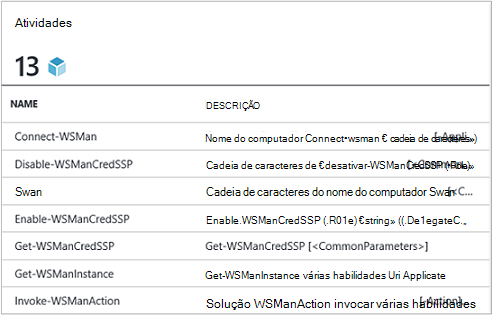
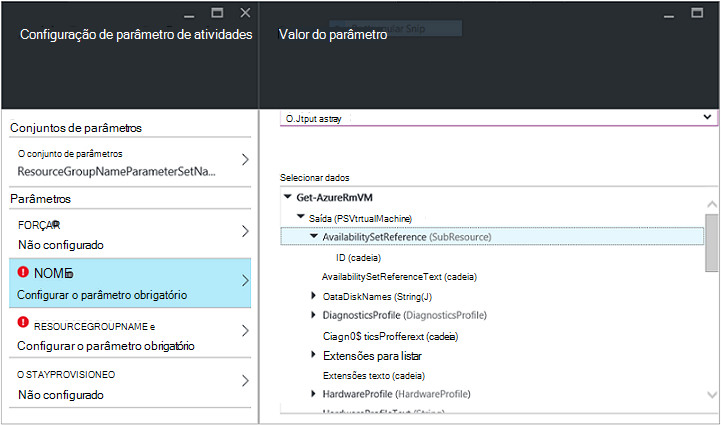
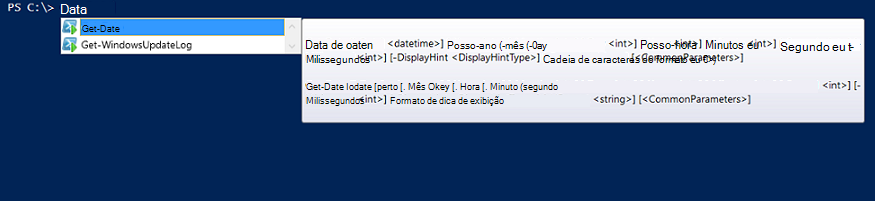

<properties
   pageTitle="Criar um módulo de integração de automação Azure | Microsoft Azure"
   description="Tutorial que orienta o uso de criação, teste e exemplo módulos de integração na automação do Azure."
   services="automation"
   documentationCenter=""
   authors="mgoedtel"
   manager="jwhit"
   editor="" />

<tags
   ms.service="automation"
   ms.workload="tbd"
   ms.tgt_pltfrm="na"
   ms.devlang="na"
   ms.topic="get-started-article"
   ms.date="09/12/2016"
   ms.author="magoedte" />

# <a name="azure-automation-integration-modules"></a>Módulos de integração de automação Azure

PowerShell é a tecnologia fundamental por trás de automação do Azure. Como a automação do Azure é criada no PowerShell, PowerShell módulos são fundamentais para a extensibilidade de automação do Azure. Neste artigo, vamos orientará você as especificações de uso do Azure automação de módulos do PowerShell, chamado de "Módulos de integração" e práticas recomendadas para criar seus próprios módulos do PowerShell para certificar-se de que eles funcionam como módulos de integração dentro de automação do Azure. 

## <a name="what-is-a-powershell-module"></a>O que é um módulo do PowerShell?

Um módulo do PowerShell é um grupo de cmdlets do PowerShell como **Get-Date** ou **Item de cópia**, que pode ser usado do console do PowerShell, scripts, fluxos de trabalho, runbooks e recursos do PowerShell DSC como WindowsFeature ou arquivo, que pode ser usado com configurações de PowerShell DSC. Todas as funcionalidades do PowerShell é exposto cmdlets e recursos de DSC e todos os recursos de cmdlet/DSC é feito por um módulo do PowerShell, muitos dos que acompanham o próprio PowerShell. Por exemplo, o cmdlet **Get-Date** faz parte do módulo do Microsoft.PowerShell.Utility PowerShell e **Copiar Item** cmdlet é parte do módulo do Microsoft.PowerShell.Management PowerShell e o recurso de pacote DSC faz parte do módulo PSDesiredStateConfiguration PowerShell. Ambos desses módulos acompanham PowerShell. Mas muitos módulos do PowerShell não são fornecidos como parte do PowerShell e em vez disso, são distribuídos com o primeiro ou o terceiro produtos como o Gerenciador de configuração do System Center 2012 ou pela comunidade PowerShell grande em locais como o PowerShell Galeria.  Os módulos são úteis porque eles simplificar tarefas complexas por meio da funcionalidade encapsulada.  Você pode saber mais sobre [módulos do PowerShell no MSDN](https://msdn.microsoft.com/library/dd878324%28v=vs.85%29.aspx). 

## <a name="what-is-an-azure-automation-integration-module"></a>O que é um módulo de integração de automação do Azure?

Um módulo de integração não é muito diferente de um módulo do PowerShell. Seu simplesmente um módulo do PowerShell que opcionalmente contém um arquivo adicional - um arquivo de metadados que especifica um tipo de conexão de automação do Azure para ser usado com os cmdlets do módulo no runbooks. Opcional de arquivo ou não, estas PowerShell módulos podem ser importados em automação do Azure para disponibilizar seus cmdlets disponíveis para uso em runbooks e seus recursos de DSC para uso em configurações de DSC. Nos bastidores, a automação do Azure armazena esses módulos e no trabalho runbook e tempo de execução de trabalho do DSC compiliation carrega-los para as caixas de proteção de automação do Azure onde runbooks são executadas e configurações de DSC são compiladas.  Quaisquer recursos DSC módulos são colocados também automaticamente no servidor pegar DSC de automação, para que eles podem ser inseridos por máquinas tentando aplicar configurações de DSC.  Fornecemos um número de módulos do PowerShell do Azure prontos para uso na automação do Azure para ser usado para que você possa começar automatizar o gerenciamento de Azure imediatamente, mas você pode importar facilmente módulos do PowerShell para qualquer sistema, serviço ou ferramenta que você deseja integrar. 

>[AZURE.NOTE] Determinados módulos são fornecidos como "módulos globais" no serviço de automação. Esses módulos globais estão disponíveis para você prontos para uso quando você criar uma conta de automação e podemos atualizá-los às vezes que envia-los automaticamente check-out para sua conta de automação. Se não desejar que eles sejam atualizado automaticamente, você pode sempre importar o mesmo módulo de si mesmo e que terá precedência sobre a versão de módulo global do módulo que que enviamos no serviço. 

O formato que você importa um pacote de módulo de integração é um arquivo compactado com o mesmo nome que o módulo e uma extensão. zip. Ele contém o módulo Windows PowerShell e quaisquer arquivos de suporte, incluindo um arquivo de manifesto (.psd1) se o módulo tem uma.

Se o módulo deve conter um tipo de conexão de automação do Azure, ele também deve conter um arquivo com o nome *<ModuleName>*-Automation.json que especifica as propriedades de tipo de conexão. Este é um arquivo de json colocado dentro da pasta de módulo do arquivo compactado. zip e contém os campos de uma "conexão" que é necessária para conectar-se ao sistema ou serviço que representa o módulo. Isso terminarão criando um tipo de conexão na automação do Azure. Usando o arquivo que você pode definir os nomes de campo, tipos, e se os campos devem ser criptografadas e / ou opcional, para o tipo de conexão do módulo. Um modelo no formato de arquivo json é o seguinte:

```
{ 
   "ConnectionFields": [
   {
      "IsEncrypted":  false,
      "IsOptional":  false,
      "Name":  "ComputerName",
      "TypeName":  "System.String"
   },
   {
      "IsEncrypted":  false,
      "IsOptional":  true,
      "Name":  "Username",
      "TypeName":  "System.String"
   },
   {
      "IsEncrypted":  true,
      "IsOptional":  false,
      "Name":  "Password",
   "TypeName":  "System.String"
   }],
   "ConnectionTypeName":  "DataProtectionManager",
   "IntegrationModuleName":  "DataProtectionManager"
}
```

Se você tiver implantado automação do gerenciamento de serviço e criada pacotes de módulos de integração para seus runbooks de automação, isso deve parecer muito familiar para você. 


## <a name="authoring-best-practices"></a>Práticas recomendadas de criação

Só porque módulos de integração são essencialmente módulos do PowerShell, que não significa que não temos um conjunto de práticas em torno de criação. Ainda há algumas coisas que recomendamos que você considere durante a criação de um módulo do PowerShell, para torná-lo mais úteis na automação do Azure. Alguns desses estão Azure automação específico e algumas delas são úteis apenas para fazer seus módulos funcionam bem no fluxo de trabalho do PowerShell, independentemente se você estiver usando automação. 

1. Incluir um resumo, descrição e a Ajuda de URI para cada cmdlet no módulo. No PowerShell, você pode definir determinadas informações de ajuda para os cmdlets permitir que o usuário receba ajuda sobre como usá-los com o cmdlet **Get-Help** . Por exemplo, aqui está como você pode definir um resumo e a Ajuda de URI para um módulo do PowerShell escrito em um arquivo de .psm1.<br>  

    ```
    <#
        .SYNOPSIS
         Gets all outgoing phone numbers for this Twilio account 
    #>
    function Get-TwilioPhoneNumbers {
    [CmdletBinding(DefaultParameterSetName='SpecifyConnectionFields', `
    HelpUri='http://www.twilio.com/docs/api/rest/outgoing-caller-ids')]
    param(
       [Parameter(ParameterSetName='SpecifyConnectionFields', Mandatory=$true)]
       [ValidateNotNullOrEmpty()]
       [string]
       $AccountSid,

       [Parameter(ParameterSetName='SpecifyConnectionFields', Mandatory=$true)]
       [ValidateNotNullOrEmpty()]
       [string]
       $AuthToken,

       [Parameter(ParameterSetName='UseConnectionObject', Mandatory=$true)]
       [ValidateNotNullOrEmpty()]
       [Hashtable]
       $Connection
    )

    $cred = CreateTwilioCredential -Connection $Connection -AccountSid $AccountSid -AuthToken $AuthToken

    $uri = "$TWILIO_BASE_URL/Accounts/" + $cred.UserName + "/IncomingPhoneNumbers"
    
    $response = Invoke-RestMethod -Method Get -Uri $uri -Credential $cred

    $response.TwilioResponse.IncomingPhoneNumbers.IncomingPhoneNumber
    }
    ```
<br> 
Fornecendo essas informações não mostrará somente este ajuda ao usar o cmdlet **Get-Help** no console do PowerShell, ele também irá expor essa funcionalidade de Ajuda em automação do Azure, por exemplo, ao inserir atividades durante a criação de runbook. Clicando em "Exibir a ajuda detalhada" abrirá a Ajuda URI em outra guia do navegador da web que você está usando para acessar a automação do Azure.<br>
2. Se o módulo é executado em relação a um sistema remoto, uma. Ele deve conter um arquivo de metadados de módulo de integração que define as informações necessárias para se conectar ao sistema remoto, indicando o tipo de conexão. b. Cada cmdlet no módulo deve ser capaz de fazer em um objeto de conexão (uma instância desse tipo de conexão) como um parâmetro.  
    Cmdlets no módulo se tornam mais fácil de usar na automação do Azure se você permitir passando um objeto com os campos do tipo de conexão como um parâmetro para o cmdlet. Essa maneira como os usuários não tem mapear parâmetros do ativo conexão parâmetros correspondentes do cmdlet cada vez que eles chamam um cmdlet. Com base no exemplo runbook acima, ele usa um ativo de conexão Twilio chamado CorpTwilio para acessar Twilio e retornar todos os números de telefone na conta.  Observe como ele é mapear os campos da conexão para os parâmetros do cmdlet?<br>

    ```
    workflow Get-CorpTwilioPhones
    {
      $CorpTwilio = Get-AutomationConnection -Name 'CorpTwilio'
    
      Get-TwilioPhoneNumbers 
        -AccountSid $CorpTwilio.AccountSid  
        -AuthToken $CorptTwilio.AuthToken
    }
    ```
<br>
Uma maneira mais fácil e melhor abordar isso diretamente está passando o objeto de conexão para o cmdlet-

    ```
    workflow Get-CorpTwilioPhones
    {
      $CorpTwilio = Get-AutomationConnection -Name 'CorpTwilio'

      Get-TwilioPhoneNumbers -Connection $CorpTwilio
    }
    ```
<br>
Você pode habilitar o comportamento assim para seus cmdlets, permitindo que eles aceitem um objeto de conexão diretamente como um parâmetro, em vez de apenas os campos de conexão para parâmetros. Geralmente, você desejará um parâmetro definido para cada um, para que um usuário que não usam o Azure automação pode chamar seus cmdlets sem construir uma tabela de hash para agir como o objeto de conexão. Conjunto de parâmetro **SpecifyConnectionFields** abaixo é usado para passar a conexão propriedades do campo um por vez. **UseConnectionObject** permite que você passar a conexão normais por meio. Como você pode ver, o cmdlet Send-TwilioSMS no [módulo do Twilio PowerShell](https://gallery.technet.microsoft.com/scriptcenter/Twilio-PowerShell-Module-8a8bfef8) permite passando qualquer uma dessas formas: 

    ```
    function Send-TwilioSMS {
      [CmdletBinding(DefaultParameterSetName='SpecifyConnectionFields', `
      HelpUri='http://www.twilio.com/docs/api/rest/sending-sms')]
      param(
         [Parameter(ParameterSetName='SpecifyConnectionFields', Mandatory=$true)]
         [ValidateNotNullOrEmpty()]
         [string]
         $AccountSid,

         [Parameter(ParameterSetName='SpecifyConnectionFields', Mandatory=$true)]
         [ValidateNotNullOrEmpty()]
         [string]
         $AuthToken,

         [Parameter(ParameterSetName='UseConnectionObject', Mandatory=$true)]
         [ValidateNotNullOrEmpty()]
         [Hashtable]
         $Connection

       )
    }
    ```
<br>
3. Defina o tipo de saída para todos os cmdlets no módulo. Definir um tipo de saída para um cmdlet permite que o IntelliSense para ajudá-lo a determinar as propriedades de saída do cmdlet, para uso durante a criação de tempo de design. Ele é especialmente útil durante a automação runbook gráficas criação, onde o conhecimento de tempo de design é fundamental para uma experiência de usuário fácil com o módulo.<br> <br> Isso é semelhante a funcionalidade "digite ahead" de saída de um cmdlet do PowerShell ISE sem precisar executá-lo.<br> <br>
4. Cmdlets no módulo não devem ter tipos de objeto complexo para parâmetros. Fluxo de trabalho do PowerShell é diferente do PowerShell, que armazena tipos complexos no formulário desserializado. Tipos primitivos permanecerá como primitivos, mas tipos complexos são convertidos em suas versões desserializados, que são essencialmente os pacotes de propriedade. Por exemplo, se você usou o cmdlet **Get-Process** em um runbook (ou um fluxo de trabalho do PowerShell para essa questão), ela retorna um objeto do tipo [Deserialized.System.Diagnostic.Process], não o tipo de [System.Diagnostic.Process] esperado. Esse tipo tem os mesmos propriedades conforme o tipo não desserializado, mas nenhum dos métodos. E se você tentar passar esse valor como um parâmetro para um cmdlet, onde o cmdlet espera um valor [System.Diagnostic.Process] para esse parâmetro, você receberá o seguinte erro: *não é possível processar a transformação de argumento no parâmetro 'processo'. Erro: "não é possível converter o valor de"System.Diagnostics.Process (CcmExec)"tipo"Deserialized.System.Diagnostics.Process"digitar"System.Diagnostics.Process".*   Isso ocorre porque não há uma incompatibilidade entre o tipo de [System.Diagnostic.Process] esperado e o determinado tipo de [Deserialized.System.Diagnostic.Process]. A maneira alternativa para esse problema é garantir que os cmdlets do módulo não terão tipos complexos para parâmetros. Esta é a maneira errada fazê-lo.

    ```
    function Get-ProcessDescription {
      param (
            [System.Diagnostic.Process] $process
      )
      $process.Description
    }
    ``` 
<br>
E aqui é a maneira correta, levando em um primitivo que pode ser usado internamente pelo cmdlet pegue o objeto complexo e usá-lo. Como executar cmdlets no contexto do PowerShell, não PowerShell fluxo de trabalho, dentro o cmdlet $process torna-se o tipo correto de [System.Diagnostic.Process].  

    ```
    function Get-ProcessDescription {
      param (
            [String] $processName
      )
      $process = Get-Process -Name $processName

      $process.Description
    }
    ```
<br>
Ativos de Conexão no runbooks são tabelas de hash, que são um tipo complexo, e ainda essas tabelas de hash parecem possam ser transferidos para cmdlets para seus – parâmetro de Conexão perfeitamente, com nenhuma exceção cast. Tecnicamente, alguns tipos de PowerShell são capazes de converter corretamente do seu formulário serializado para seus formulários desserializado e, portanto, podem ser passados a cmdlets para aceitar o não desserializado tipo de parâmetros. Tabela de hash é um deles. É possível que tipos de definidos do autor um módulo sejam implementadas de forma que eles corretamente podem desserializar também, mas há algumas compensações para fazer. O tipo deve ter um construtor padrão, têm todas as suas propriedades públicas e tem uma PSTypeConverter. No entanto, para tipos já definido que não possui o autor do módulo, há nenhuma maneira "corrigir"-las, portanto, a recomendação para evitar tipos complexos para parâmetros todos juntos. Criação de runbook Dica: se por algum motivo sua necessidade de cmdlets para tirar um parâmetro de tipo complexo, ou você estiver usando outra pessoa módulo que requer um parâmetro de tipo complexo, a solução alternativa no fluxo de trabalho do PowerShell runbooks e fluxos de trabalho de PowerShel no local PowerShell, é quebrar o cmdlet que gera o tipo complexo e o cmdlet que consome o tipo complexo a mesma atividade de InlineScript. Como InlineScript executado seu conteúdo como PowerShell em vez de fluxo de trabalho do PowerShell, o cmdlet gerando o tipo complexo produza desse tipo correto, não o tipo complexo desserializado.
5. Faça com que todos os cmdlets no módulo sem estado. Fluxo de trabalho do PowerShell executa cada cmdlet chamado no fluxo de trabalho em uma sessão diferente. Isso significa que qualquer cmdlets que dependem de estado de sessão criou / modificado por outros cmdlets no mesmo módulo não funcionará no fluxo de trabalho do PowerShell runbooks.  Aqui está um exemplo do que não fazer.

    ```
    $globalNum = 0
    function Set-GlobalNum {
       param(
           [int] $num
       )
      
       $globalNum = $num
    }
    function Get-GlobalNumTimesTwo {
       $output = $globalNum * 2
     
       $output
    }
    ```
<br>
6. O módulo deve estar totalmente contido em um pacote capaz de Xcopy. Como módulos de automação do Azure são distribuídos para as caixas de proteção de automação quando runbooks precisa executar, eles precisam trabalhar independentemente dos host em que estão sendo executados. Isso significa que você deve conseguir Zip o pacote do módulo, movê-la para qualquer outro host com a versão do PowerShell mesmo ou mais recente e fazer com que ele funcione como normal quando importados para o ambiente do PowerShell do host. Em ordem para que isso aconteça, o módulo não deve depender em quaisquer arquivos de fora da pasta de módulo (a pasta que obtém zipada backup ao importar para a automação do Azure) ou em quaisquer configurações de registro exclusivo em um host, como aqueles definido pela instalação de um produto. Se esta prática recomendada não é seguida, o módulo não poderá ser usado na automação do Azure.  

## <a name="next-steps"></a>Próximas etapas

- Para começar a usar runbooks de fluxo de trabalho do PowerShell, consulte [Minha primeira runbook de fluxo de trabalho do PowerShell](automation-first-runbook-textual.md)
- Para saber mais sobre a criação de módulos do PowerShell, consulte [escrevendo um módulo do Windows PowerShell](https://msdn.microsoft.com/library/dd878310%28v=vs.85%29.aspx)