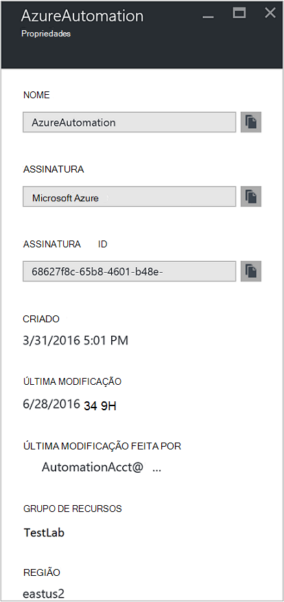
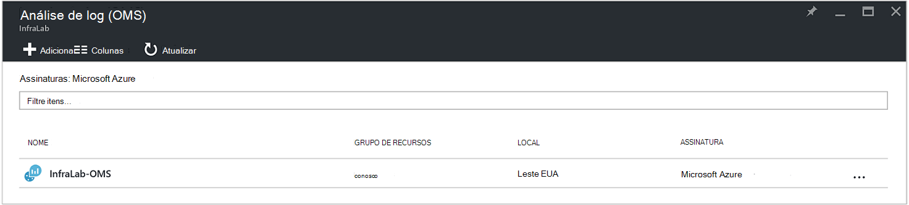
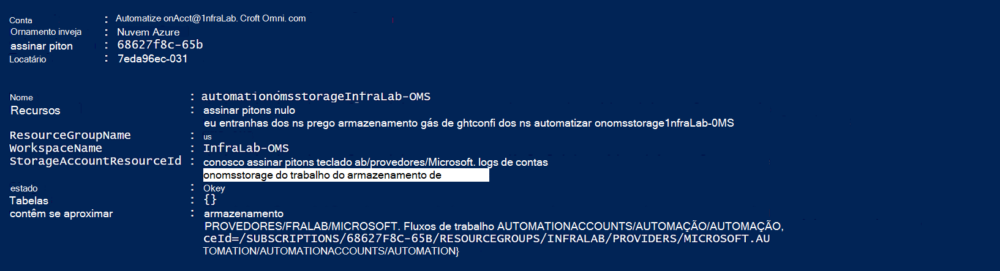
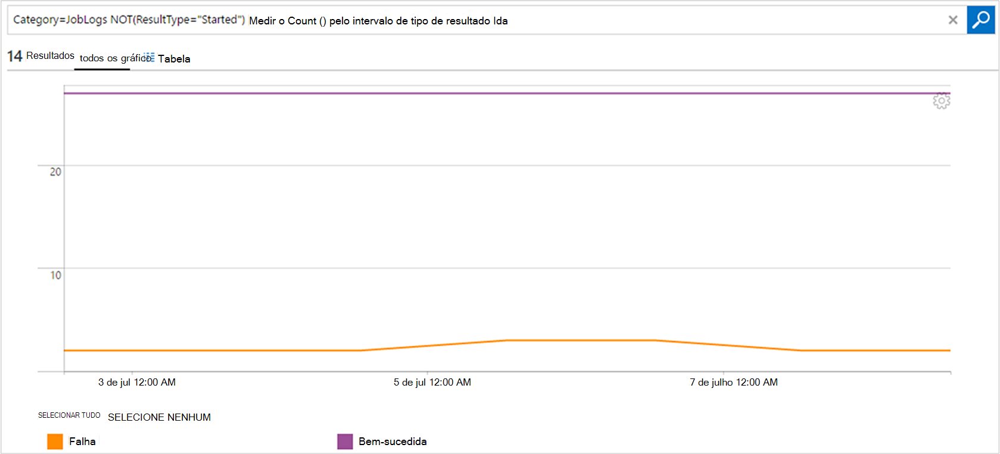

<properties
    pageTitle="Encaminhar fluxos de trabalho e status do trabalho de automação para a análise de Log (OMS) | Microsoft Azure"
    description="Este artigo demonstra como enviar runbook e status do trabalho fluxos de trabalho para gerenciamento e análise de Log de pacote Microsoft operações gerenciamento para oferecer compreensão adicional."
    services="automation"
    documentationCenter=""
    authors="MGoedtel"
    manager="jwhit"
    editor="tysonn" />
<tags
    ms.service="automation"
    ms.devlang="na"
    ms.topic="article"
    ms.tgt_pltfrm="na"
    ms.workload="infrastructure-services"
    ms.date="09/22/2016"
    ms.author="magoedte" />

# Encaminhar fluxos de trabalho e status do trabalho de automação para a análise de Log (OMS)

Automação pode enviar runbook fluxos de trabalho e status do trabalho para seu espaço de trabalho de análise de Log de pacote de gerenciamento de operações da Microsoft (OMS).  Embora seja possível exibir essas informações no portal do Azure ou com o PowerShell por status de trabalho individual ou todos os trabalhos de uma determinada conta de automação, nada avançadas para oferecer suporte a seus requisitos operacionais requer que você criar scripts do PowerShell personalizados.  Agora com Log Analytics você pode:

- Conheça os trabalhos de automação 
- Acionar um email ou um alerta com base em seu status de trabalho runbook (por exemplo, falha ou suspenso) 
- Escrever consultas avançadas em seus fluxos de trabalho 
- Correlação trabalhos em contas de automação 
- Visualizar seu histórico de trabalho ao longo do tempo     

## Pré-requisitos e considerações de implantação

Para começar a enviar os logs de automação para a análise de Log, você deve ter o seguinte:

1. Uma assinatura do OMS. Para obter informações adicionais, consulte [começar a usar a análise de Log](../log-analytics/log-analytics-get-started.md).  

    >[AZURE.NOTE]O espaço de trabalho do OMS e a conta de automação precisam estar na mesma assinatura do Azure para que essa configuração funcione corretamente. 
  
2. Uma [conta de armazenamento do Azure](../storage/storage-create-storage-account.md).  
   
    >[AZURE.NOTE]A conta de armazenamento *deve* ser na mesma região como a conta de automação. 
 
3. PowerShell Azure com versão 1.0.8 ou mais recente dos cmdlets ideias operacionais. Para obter informações sobre esta versão e como instalá-lo, veja [como instalar e configurar o Azure PowerShell](../powershell-install-configure.md).
4. Diagnóstico do Azure e PowerShell de análise de Log.  Para obter mais informações sobre esta versão e como instalá-lo, consulte [Diagnóstico do Azure e a análise de Log](https://www.powershellgallery.com/packages/AzureDiagnosticsAndLogAnalytics/0.1).  
5. Baixe o script do PowerShell **Enable-AzureDiagnostics.ps1** da [Galeria do PowerShell](https://www.powershellgallery.com/packages/Enable-AzureDiagnostics/1.0/DisplayScript). Este script irá configurar o seguinte:
 - Uma conta de armazenamento para manter os dados runbook de status e fluxo de trabalho para uma conta de automação que você especificar.
 - Habilite a coleta de dados da sua conta de automação armazená-lo em uma conta de armazenamento de Blob do Azure no formato JSON.
 - Configure a coleta de dados da sua conta de armazenamento de Blob a análise de Log de OMS.
 - Habilite a solução de análise de Log de automação seu espaço de trabalho do OMS.   

O script **Enable-AzureDiagnostics.ps1** requer os seguintes parâmetros durante a execução:

- *AutomationAccountName* - o nome da sua conta de automação
- *LogAnalyticsWorkspaceName* - o nome do seu espaço de trabalho do OMS

Para localizar os valores para *AutomationAccountName*, no portal do Azure, selecione sua conta de automação da **conta de automação** lâmina e selecione **todas as configurações**.  Da lâmina **todas as configurações** , em **Configurações de conta** , selecione **Propriedades**.  Na lâmina **Propriedades** , você pode observar esses valores.  .

## Integração com a análise de Log de instalação

1. Em seu computador, inicie **O Windows PowerShell** da tela **Iniciar** .  
2. Do shell de linha de comando do PowerShell, vá para a pasta que contém o script que você baixou e executá-lo alterando os valores para parâmetros *AutomationAccountName -* e *- LogAnalyticsWorkspaceName*.

    >[AZURE.NOTE] Você será solicitado para autenticar com o Azure após executar o script.  Você **deve** fazer logon com uma conta que seja um membro da função administradores de assinatura e colegas administrador da assinatura.   
    
        .\Enable-AzureDiagnostics -AutomationAccountName <NameofAutomationAccount> `
        -LogAnalyticsWorkspaceName <NameofOMSWorkspace> `

3. Depois de executar este script você deve ver registros em Log Analytics cerca de 30 minutos depois de novos dados de diagnósticos são gravados ao armazenamento.  Se os registros não estão disponíveis depois desta vez consulte a seção solução de problemas em [arquivos JSON no armazenamento de blob](../log-analytics/log-analytics-azure-storage-json.md#troubleshooting-configuration-for-azure-diagnostics-written-to-blob-in-json).

### Verificar a configuração

Para confirmar que o script configurou sua conta de automação e OMS wokspace com êxito, você pode executar as seguintes etapas no PowerShell.  Antes de fazer isso, para localizar que os valores para o seu nome de espaço de trabalho OMS e o nome do grupo de recursos, no portal de Azure, navegue para a análise de Log (OMS) e na lâmina a análise de Log (OMS), observe o valor para o **nome** e o **Grupo de recursos**.   usaremos esses dois valores quando podemos verificar a configuração no seu espaço de trabalho OMS usando o cmdlet [Get-AzureRmOperationalInsightsStorageInsight](https://msdn.microsoft.com/library/mt603567.aspx)do PowerShell.

1.  Do portal do Azure, vá para contas de armazenamento e procure a seguinte conta de armazenamento, que usa a convenção de nomenclatura - *AutomationAccountNameomsstorage*.  Após um runbook trabalho for concluído, logo depois que você verá dois Blob contêineres criados - **ideias de logs de joblogs** e **ideias de logs de jobstreams**.  

2.  A partir do PowerShell, execute o seguinte código do PowerShell, alterando os valores para os parâmetros **ResourceGroupName** e o **nome** que você copiou ou observado anteriormente.  

    AzureRmAccount de login Get-AzureRmSubscription - nome de inscrição 'Nome de inscrição' | Definir AzureRmContext Get-AzureRmOperationalInsightsStorageInsight - ResourceGroupName "OMSResourceGroupName" '-espaço de trabalho "OMSWorkspaceName" 

    Isso retornará a visão de armazenamento para o espaço de trabalho do OMS especificado.  Queremos confirme a visão de armazenamento para a conta de automação que nós especificados anteriormente existe e o objeto de **estado** mostra um valor de **Okey**.  .

## Registros de log de análise

Automação cria dois tipos de registros no repositório OMS.

### Logs de trabalho

Propriedade | Descrição|
----------|----------|
Tempo | Data e hora quando o trabalho de runbook executado.|
identificação de recurso | Especifica o tipo de recurso no Azure.  Para automação, o valor é a conta de automação associada runbook.|
operationName | Especifica o tipo de operação executado no Azure.  Para automação, o valor será trabalho.|
resultType | O status do trabalho runbook.  Valores possíveis são: -Introdução -Interrompido -Suspenso -Falha -Bem-sucedida|
resultDescription | Descreve o estado de resultado de trabalho runbook.  Valores possíveis são: -Trabalho é iniciado -Falha no trabalho -Trabalho concluído|
CorrelationId | GUID que é a Id de correlação do trabalho runbook.|
Categoria | Classificação do tipo de dados.  Para automação, o valor é JobLogs.|
RunbookName | O nome do runbook.|
JobId | GUID que é a Id do trabalho runbook.|
Chamador |  Quem iniciou a operação.  Valores possíveis são um sistema para as tarefas agendadas ou endereço de email.|

### Fluxos de trabalho
Propriedade | Descrição|
----------|----------|
Tempo | Data e hora quando o trabalho de runbook executado.|
identificação de recurso | Especifica o tipo de recurso no Azure.  Para automação, o valor é a conta de automação associada runbook.|
operationName | Especifica o tipo de operação executado no Azure.  Para automação, o valor será trabalho.|
resultType | O status do trabalho runbook.  Valores possíveis são: -InProgress|
resultDescription | Inclui o fluxo de saída do runbook.|
CorrelationId | GUID que é a Id de correlação do trabalho runbook.|
Categoria | Classificação do tipo de dados.  Para automação, o valor é JobStreams.|
RunbookName | O nome do runbook.|
JobId | GUID que é a Id do trabalho runbook.|
Chamador | Quem iniciou a operação.  Valores possíveis são um sistema para as tarefas agendadas ou endereço de email.| 
StreamType | O tipo de fluxo de trabalho. Valores possíveis são: -Andamento -Saída -Aviso -Erro -Depurar -Detalhado|

## Exibir automação Logs na análise de Log 

Agora que você iniciou enviando seus logs de automação do trabalho para a análise de Log, vamos ver o que você pode fazer com esses logs dentro OMS.   

### Enviar um email quando um trabalho de runbook falha ou suspende 

Um dos nossos clientes superior pergunta é para a capacidade de enviar um email ou um texto quando algo errado com um trabalho runbook.   

Para criar uma regra de alerta, você começar pela criação de uma pesquisa de log para os registros de trabalho runbook que deve chamar o alerta.  O botão de **alerta** , em seguida, estará disponível para que você pode criar e configurar a regra de alerta.

1.  Na página Visão geral do OMS, clique em **Pesquisa de Log**.
2.  Criar uma consulta de pesquisa de log para o alerta digitando o seguinte no campo de consulta: `Category=JobLogs (ResultType=Failed || ResultType=Suspended)`.  Você também pode agrupar pela RunbookName usando: `Category=JobLogs (ResultType=Failed || ResultType=Suspended) | measure Count() by RunbookName_s`.   
  
    Se você tiver configurado logs de mais de uma conta de automação ou assinatura do seu espaço de trabalho, você também pode estar interessado em seus alertas pela assinatura ou a conta de automação de agrupamento.  Nome da conta de automação pode ser derivado de campo de recurso na pesquisa de JobLogs.  

3.  Clique em **alerta** na parte superior da página para abrir a tela de **Adicionar regra de alerta** .  Para obter mais detalhes sobre as opções para configurar o alerta, consulte [alertas no Log de análise](../log-analytics/log-analytics-alerts.md#creating-an-alert-rule).

### Encontrar todos os trabalhos que tem concluído com erros 

Além de alerta basear falhas, você provavelmente gostaria de saber quando um trabalho de runbook teve um erro não encerrando (PowerShell produz um fluxo de erro, mas não encerrando erros não causam seu trabalho Suspender ou falhar).    

1. No portal do OMS, clique em **Pesquisa de Log**.
2. No campo de consulta, digite `Category=JobStreams StreamType_s=Error | measure count() by JobId_g` e, em seguida, clique em **Pesquisar**.

### Fluxos de trabalho do modo de exibição para um trabalho  

Ao depurar um trabalho, você também pode querer verificar os fluxos de trabalho.  A consulta abaixo mostra todos os fluxos para um único trabalho com GUID 2ebd22ea-e05e-4eb9 - 9d 76-d73cbd4356e0:   

`Category=JobStreams JobId_g="2ebd22ea-e05e-4eb9-9d76-d73cbd4356e0" | sort TimeGenerated | select ResultDescription` 

### Exibir o status de trabalho históricos 

Por fim, talvez você queira visualizar seu histórico de trabalho ao longo do tempo.  Você pode usar essa consulta para procurar o status dos seus trabalhos ao longo do tempo. 

`Category=JobLogs NOT(ResultType="started") | measure Count() by ResultType interval 1day`  
   

## Resumo

Enviando seus dados de status e fluxo de trabalho automação a análise de Log, você pode obter melhor perspectiva o status dos seus trabalhos de automação, Configurando alertas para notificá-lo quando há um problema e painéis personalizados usando consultas avançadas para visualizar os resultados de runbook, status do trabalho de runbook e outros indicadores chaves relacionados ou métricas.  Isso ajudará a fornecer maior visibilidade operacional e ocorrências de endereço rapidamente.  

## Próximas etapas

- Para saber mais sobre como construir consultas de pesquisa diferentes e examine os logs de trabalho de automação com a análise de Log, consulte [pesquisas de Log no Log de análise](../log-analytics/log-analytics-log-searches.md)
- Para compreender como criar e recuperar mensagens de saída e de erro de runbooks, consulte [mensagens e Runbook saída](automation-runbook-output-and-messages.md) 
- Para saber mais sobre a execução de runbook, como monitorar runbook trabalhos e outros detalhes técnicos, consulte [controlar um trabalho runbook](automation-runbook-execution.md)
- Para saber mais sobre a análise de Log OMS e fontes de conjunto de dados, consulte [dados de armazenamento do Azure coletando em Visão geral de análise de Log](../log-analytics/log-analytics-azure-storage.md)