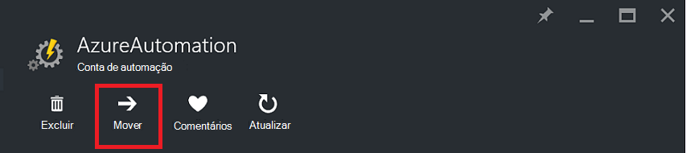
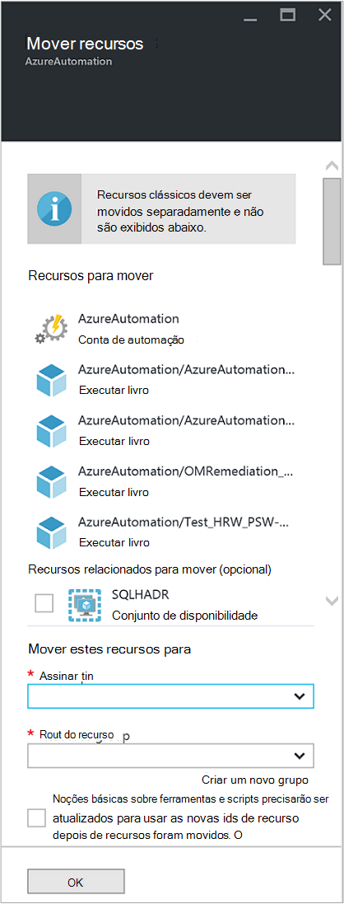

<properties
   pageTitle="Migrar conta de automação e recursos | Microsoft Azure"
   description="Este artigo descreve como mover uma conta de automação na automação do Azure e recursos associados de uma assinatura para outra."
   services="automation"
   documentationCenter=""
   authors="MGoedtel"
   manager="jwhit"
   editor="tysonn" />
<tags
   ms.service="automation"
   ms.devlang="na"
   ms.topic="article"
   ms.tgt_pltfrm="na"
   ms.workload="infrastructure-services"
   ms.date="07/07/2016"
   ms.author="magoedte" />

# <a name="migrate-automation-account-and-resources"></a>Migrar conta de automação e recursos

Para contas de automação e seus recursos associados (isto é, ativos runbooks, módulos, etc.) que você criou no portal do Azure e deseja migrar de um grupo de recursos para outro ou de uma assinatura para outra, você pode fazer isso facilmente com o recurso de [mover os recursos](../resource-group-move-resources.md) disponível no portal do Azure. No entanto, antes de prosseguir com essa ação, você primeiro deve examinar a seguinte [lista de verificação antes de mover os recursos](../resource-group-move-resources.md#Checklist-before-moving-resources) e Além disso, a lista abaixo de acordo com a automação.   

1.  O grupo de assinatura/recursos de destino deve estar na mesma região como fonte.  Ou seja, contas de automação não podem ser movidas entre regiões.
2.  Ao mover recursos (por exemplo, runbooks trabalhos, etc.), o grupo de origem e o grupo de destino estão bloqueadas para a duração da operação. Gravar e excluir operações são bloqueados nos grupos de até que a mudança é concluída.  
3.  Quaisquer runbooks ou variáveis que fazem referência a uma ID de assinatura ou recurso da assinatura existente precisa ser atualizado após a migração é concluída.   


>[AZURE.NOTE] Este recurso não dá suporte a recursos de automação movendo clássico.

## <a name="to-move-the-automation-account-using-the-portal"></a>Mova a conta de automação usando o portal

1. Na sua conta de automação, clique em **Mover** na parte superior da lâmina.<br> <br> 
2. Na lâmina **Mover recursos** , observe que ele apresenta recursos relacionados à sua conta de automação e seus grupos de recursos.  Selecione a **assinatura** e o **grupo de recursos** de listas suspensas, ou selecione a opção **criar um novo grupo de recursos** e insira um novo nome de grupo de recursos no campo fornecido.  
3. Revisar e marque a caixa de seleção para confirmar que você *entender ferramentas e scripts precisarão ser atualizados para usar o novo recurso IDs depois de recursos foram movidos* e clique em **Okey**.<br> <br>   

Esta ação levará vários minutos para ser concluída.  Em **notificações**, será apresentada com um status de cada ação que ocorrerá - validação, migração e finalmente quando ela é concluída.     

## <a name="to-move-the-automation-account-using-powershell"></a>Mova a conta de automação usando o PowerShell

Para mover os recursos de automação existentes para outra assinatura ou grupo de recursos, use o cmdlet **Get-AzureRmResource** para obter a conta específica de automação e, em seguida, **Mover-AzureRmResource** cmdlet para realizar a mudança.

O primeiro exemplo mostra como mover uma conta de automação para um novo grupo de recursos.

   ```
    $resource = Get-AzureRmResource -ResourceName "TestAutomationAccount" -ResourceGroupName "ResourceGroup01"
    Move-AzureRmResource -ResourceId $resource.ResourceId -DestinationResourceGroupName "NewResourceGroup"
   ``` 

Depois de executar o exemplo de código acima, você será solicitado a confirmar que você deseja realizar esta ação.  Depois que você clique em **Sim** e permitir que o script continuar, você não receberá notificações enquanto ele está executando a migração.  

Para mover para uma nova assinatura, inclua um valor para o parâmetro *DestinationSubscriptionId* .

   ```
    $resource = Get-AzureRmResource -ResourceName "TestAutomationAccount" -ResourceGroupName "ResourceGroup01"
    Move-AzureRmResource -ResourceId $resource.ResourceId -DestinationResourceGroupName "NewResourceGroup" -DestinationSubscriptionId "SubscriptionId"
   ``` 

Como no exemplo anterior, você será solicitado a confirmar a movimentação.  

## <a name="next-steps"></a>Próximas etapas

- Para obter mais informações sobre como mover recursos para o novo grupo de recursos ou assinatura, consulte [Mover recursos para novo grupo de recursos ou assinatura](../resource-group-move-resources.md)
- Para obter mais informações sobre controle de acesso baseado em função no Azure automação, consulte [controle de acesso baseado em função em automação do Azure](../automation/automation-role-based-access-control.md).
- Para saber mais sobre cmdlets do PowerShell para gerenciar sua assinatura, consulte [Usando o PowerShell Azure com o Gerenciador de recursos](../powershell-azure-resource-manager.md)
- Para saber sobre os recursos do portal de gerenciamento de sua assinatura, consulte [usando o Portal do Azure para gerenciar recursos](../azure-portal/resource-group-portal.md). 
