<properties 
   pageTitle="Controle de acesso baseado em função no Azure automação | Microsoft Azure"
   description="Controle de acesso baseado em função (RBAC) permite o gerenciamento de acesso para recursos Azure. Este artigo descreve como configurar RBAC no Azure automação."
   services="automation"
   documentationCenter=""
   authors="mgoedtel"
   manager="jwhit"
   editor="tysonn"
   keywords="automação rbac, controle de acesso, rbac azure baseado em função" />
<tags 
   ms.service="automation"
   ms.devlang="na"
   ms.topic="get-started-article"
   ms.tgt_pltfrm="na"
   ms.workload="infrastructure-services"
   ms.date="09/12/2016"
   ms.author="magoedte;sngun"/>

# Controle de acesso baseado em função em automação do Azure

## Controle de acesso baseado em função

Controle de acesso baseado em função (RBAC) permite o gerenciamento de acesso para recursos Azure. Usando [RBAC](../active-directory/role-based-access-control-configure.md), você pode separar os deveres dentro de sua equipe e conceder somente a quantidade de acesso a usuários, grupos e aplicativos que eles precisam para realizar seus trabalhos. Acesso baseado em função pode ser concedido aos usuários usando o portal do Azure, ferramentas de linha de comando Azure ou APIs de gerenciamento do Azure.

## RBAC em contas de automação

No Azure automação, o acesso é concedido atribuindo a função RBAC adequada para usuários, grupos e aplicativos no escopo automação conta. A seguir estão as funções internas compatíveis com uma conta de automação:  

|**Função** | **Descrição** |
|:--- |:---|
| Proprietário | A função de proprietário permite acesso a todos os recursos e ações dentro de uma conta de automação incluindo fornecendo acesso aos outros usuários, grupos e aplicativos para gerenciar a conta de automação. |
| Colaborador | A função Colaborador permite que você gerencie tudo, exceto modificando as permissões de acesso de outro usuário a uma conta de automação. |
| Leitor | Função Leitor permite exibir todos os recursos em uma conta de automação, mas não pode fazer qualquer alteração.|
| Operador de automação | A função de operador de automação permite executar tarefas operacionais como iniciar, parar, suspender, continuar e agendar trabalhos. Esta função é útil se você quiser proteger os recursos da sua conta de automação como ativos de credenciais e runbooks sejam exibidos ou modificados, mas ainda permitir que os membros da sua organização execute estas runbooks. |
| Administrador de acesso do usuário | A função de administrador de acesso de usuário permite que você gerencie o acesso de usuário a contas de automação do Azure. |

>[AZURE.NOTE] Você não pode conceder direitos de acesso para um runbook específico ou runbooks, somente para os recursos e ações dentro da conta de automação.  

Neste artigo podemos guiará você como configurar RBAC no Azure automação. Mas primeiro, vamos dar uma olhada mais atenta as permissões individuais concedido para o colaborador, o leitor, o operador de automação e o administrador de acesso do usuário, de forma que podemos obter uma boa compreensão antes de conceder a alguém direitos para a conta de automação.  Caso contrário, ele pode resultar em consequências não intencionais ou indesejáveis.     

## Permissões de função de Colaborador

A tabela a seguir apresenta as ações específicas que podem ser executadas pela função Colaborador em automação.

| **Tipo de recurso** | **Leitura** | **Gravação** | **Excluir** | **Outras ações** |
|:--- |:---|:--- |:---|:--- |
| Conta de automação Azure |  |  |  | | 
| Ativos de certificado de automação |  |  |  | |
| Ativos de Conexão de automação |  |  |  | | 
| Ativos de tipo de Conexão de automação |  |  |  | | 
| Ativos de credencial de automação |  |  |  | |
| Ativos de cronograma de automação |  |  |  | |
| Ativos de variável de automação |  |  |  | |
| Configuração de estado de desejado de automação | | | |  |
| Tipo de recurso de trabalho Runbook híbrido |  | |  | | 
| Trabalho de automação Azure |  |  | |  | 
| Fluxo de trabalho de automação |  | | | | 
| Cronograma de trabalho de automação |  |  |  | |
| Módulo de automação |  |  |  | |
| Automação Azure Runbook |  |  |  |  |
| Automação Runbook rascunho |  | | |  |
| Trabalho de teste de Runbook rascunho de automação |  |  | |  | 
| Webhook de automação |  |  |  |  |

## Permissões de função de leitor

A tabela a seguir apresenta as ações específicas que podem ser executadas pela função Leitor na automação.

| **Tipo de recurso** | **Leitura** | **Gravação** | **Excluir** | **Outras ações** |
|:--- |:---|:--- |:---|:--- |
| Administrador de assinatura clássico |  | | | 
| Bloqueio de gerenciamento |  | | | 
| Permissão |  | | |
| Operações de provedor |  | | | 
| Atribuição de função |  | | | 
| Definição de função |  | | | 

## Permissões de função de operador de automação

A tabela a seguir apresenta as ações específicas que podem ser executadas pela função de operador de automação na automação.

| **Tipo de recurso** | **Leitura** | **Gravação** | **Excluir** | **Outras ações** |
|:--- |:---|:--- |:---|:--- |
| Conta de automação Azure |  | | | 
| Ativos de certificado de automação | | | |
| Ativos de Conexão de automação | | | |
| Ativos de tipo de Conexão de automação | | | |
| Ativos de credencial de automação | | | |
| Ativos de cronograma de automação |  |  | | |
| Ativos de variável de automação | | | |
| Configuração de estado de desejado de automação | | | | |
| Tipo de recurso de trabalho Runbook híbrido | | | | | 
| Trabalho de automação Azure |  |  | |  | 
| Fluxo de trabalho de automação |  | | |  
| Cronograma de trabalho de automação |  |  | | |
| Módulo de automação | | | |
| Automação Azure Runbook |  | | | |
| Automação Runbook rascunho | | | |
| Trabalho de teste de Runbook rascunho de automação | | | |  
| Webhook de automação | | | |

Para obter mais detalhes, as [ações de operador de automação](../active-directory/role-based-access-built-in-roles.md#automation-operator) lista as ações compatíveis com a função de operador de automação na conta de automação e seus recursos.

## Permissões de função de administrador de acesso do usuário

A tabela a seguir apresenta as ações específicas que podem ser executadas pela função de administrador de acesso de usuários na automação.

| **Tipo de recurso** | **Leitura** | **Gravação** | **Excluir** | **Outras ações** |
|:--- |:---|:--- |:---|:--- |
| Conta de automação Azure |  | | | |
| Ativos de certificado de automação |  | | | |
| Ativos de Conexão de automação |  | | | |
| Ativos de tipo de Conexão de automação |  | | | |
| Ativos de credencial de automação |  | | | |
| Ativos de cronograma de automação |  | | | |
| Ativos de variável de automação |  | | | |
| Configuração de estado de desejado de automação | | | | |
| Tipo de recurso de trabalho Runbook híbrido |  | | | | 
| Trabalho de automação Azure |  | | | | 
| Fluxo de trabalho de automação |  | | | | 
| Cronograma de trabalho de automação |  | | | |
| Módulo de automação |  | | | |
| Automação Azure Runbook |  | | | |
| Automação Runbook rascunho |  | | | |
| Trabalho de teste de Runbook rascunho de automação |  | | | | 
| Webhook de automação |  | | |

## Configurar RBAC para sua conta de automação usando o Portal do Azure

1.  Faça logon [Portal do Azure](https://portal.azure.com/) e abra sua conta de automação da lâmina contas de automação.  

2.  Clique sobre o controle de **acesso** no canto superior direito. Isso abre a lâmina de **usuários** onde você pode adicionar novos usuários, grupos e aplicativos para gerenciar sua conta de automação e exibir as funções existentes que podem ser configuradas para a conta de automação.  

      

>[AZURE.NOTE] **Os administradores de assinatura** já existe como o usuário padrão. Grupo do active directory de administradores de assinatura inclui o administrador (es) de serviço e co-administrator(s) para sua assinatura do Azure. O administrador do serviço é o proprietário da sua assinatura do Azure e seus recursos e serão tem a função de proprietário herdadas para as contas de automação muito. Isso significa que o acesso **herdadas** para **administradores de serviços e administradores co** de uma assinatura e é **atribuído** para todos os outros usuários. Clique em **administradores de assinatura** para exibir mais detalhes sobre suas permissões.  

### Adicionar um novo usuário e atribuir uma função

1.  Da lâmina usuários, clique em **Adicionar** para abrir a **Adicionar blade de acesso** onde você pode adicionar um usuário, grupo ou aplicativo e atribuir uma função a eles.  

    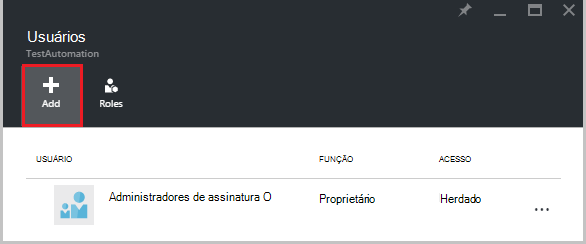  

2.  Selecione uma função na lista de funções disponíveis. Podemos irá escolher a função de **leitor** , mas você pode escolher qualquer uma das funções internas disponíveis que dá suporte a uma conta de automação ou qualquer função personalizada que você tenha definido.  

    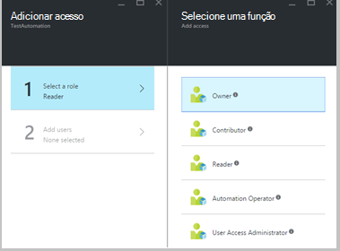  

3.  Clique em **Adicionar usuários** para abrir a lâmina de **Adicionar usuários** . Se você tiver adicionado todos os usuários, grupos ou aplicativos para gerenciar sua assinatura e em seguida, esses usuários são listados e você poderá selecioná-las para adicionar acesso. Se não existem quaisquer usuários listados, ou se o usuário que você estiver interessado em adicionando não estiver listado, clique em **Convidar** para abrir a lâmina **Convidar um convidado** , onde você pode convidar um usuário com um endereço de email de conta Microsoft válido como Outlook.com, OneDrive ou Xbox Live Ids. Depois que você inseriu o endereço de email do usuário, clique em **Selecionar** para adicionar o usuário e, em seguida, clique **Okey**. 

    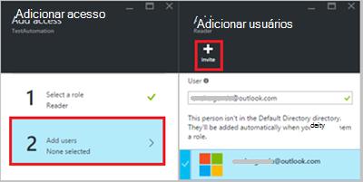  
 
    Agora você deve ver o usuário adicionado lâmina **usuários** com a função de **leitor** atribuída.  

      

    Você também pode atribuir uma função para o usuário da lâmina **funções** . 

1. Clique em **funções** da lâmina usuários para abrir a **lâmina de funções**. Neste blade, você pode exibir o nome da função, o número de usuários e grupos atribuídos a essa função.

    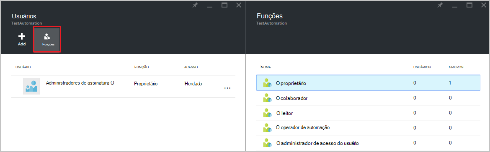  
   
    >[AZURE.NOTE] Controle de acesso baseado em função só pode ser definido no nível da conta de automação e não em qualquer recurso abaixo a conta de automação.

    Você pode atribuir mais de uma função a um usuário, grupo ou aplicativo. Por exemplo, se adicionar a função de **Operador de automação** junto com a **função de leitor** ao usuário, em seguida, eles podem exibir todos os recursos de automação, além executar os trabalhos de runbook. Você pode expandir a lista suspensa para exibir uma lista das funções atribuídas ao usuário.  

    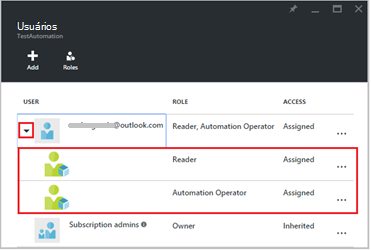  
 
### Remover um usuário

Você pode remover a permissão de acesso para um usuário que não está gerenciando a conta de automação ou que não funciona mais para a organização. A seguir estão as etapas para remover um usuário: 

1.  Selecione a lâmina de **usuários** , a atribuição de função que você deseja remover.

2.  Clique no botão **Remover** na lâmina atribuição detalhes.

3.  Clique em **Sim** para confirmar a remoção. 

    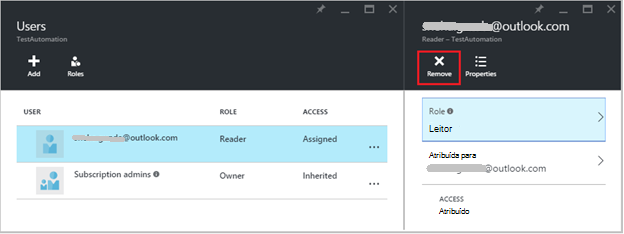  

## Usuário atribuído de função

Quando um usuário atribuído a uma função faz logon em sua conta de automação, eles agora podem ver a conta do proprietário listada na lista de **Pastas padrão**. Para exibir a conta de automação que eles foram adicionados ao, eles devem alternar o diretório padrão para diretório de padrão do proprietário.  

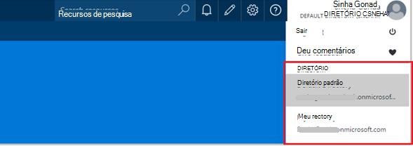  

### Experiência do usuário para função de operador de automação

Quando um usuário, que está atribuído para os modos de exibição de função de operador de automação a conta de automação que eles estão atribuídos, eles só podem exibir a lista de runbooks, trabalhos de runbook e agendas criadas na conta de automação, mas não é possível visualizar a sua definição. Eles podem iniciar, parar, suspender, retomar ou agendar o trabalho de runbook. O usuário não terá acesso a outros recursos de automação como configurações, grupos de trabalhadores híbrido ou nós de DSC.  

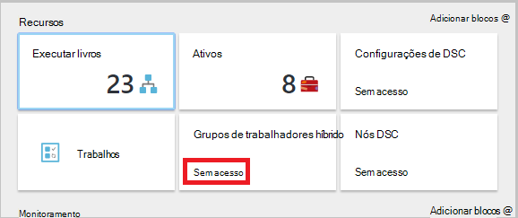  

Quando o usuário clica em runbook, os comandos para exibir a origem ou editar runbook não são fornecidos como a função de operador de automação não permite o acesso a eles.  

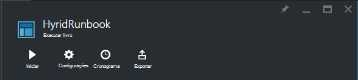  

O usuário terá acesso para exibir e criar agendas, mas não terão acesso a qualquer outro tipo de ativo.  

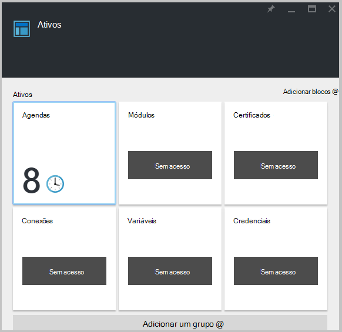  

Esse usuário também não tem acesso para exibir o webhooks associado a um runbook

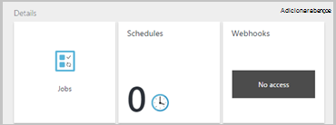  

## Configurar RBAC para sua conta de automação usando o PowerShell do Azure

Acesso baseado em função também pode ser configurado para uma conta de automação usando os seguintes [cmdlets do PowerShell do Azure](../active-directory/role-based-access-control-manage-access-powershell.md).

• [Get-AzureRmRoleDefinition](https://msdn.microsoft.com/library/mt603792.aspx) lista todas as funções RBAC que estão disponíveis no Active Directory do Azure. Você pode usar este comando junto com a propriedade **Name** para listar todas as ações que podem ser realizadas por uma função específica.  
    **Exemplo:**  
    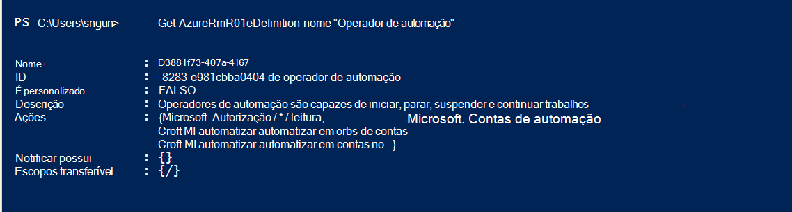  

• [Get-AzureRmRoleAssignment](https://msdn.microsoft.com/library/mt619413.aspx) lista atribuições de função do Azure AD RBAC no escopo especificado. Sem parâmetros, este comando retorna todas as atribuições de função feitas sob a assinatura. Use o parâmetro **ExpandPrincipalGroups** às atribuições de acesso de lista para o usuário especificado, bem como os grupos que o usuário é membro.  
    **Exemplo:** Use o seguinte comando para listar todos os usuários e suas funções dentro de uma conta de automação.

    Get-AzureRMRoleAssignment -scope “/subscriptions/<SubscriptionID>/resourcegroups/<Resource Group Name>/Providers/Microsoft.Automation/automationAccounts/<Automation Account Name>” 

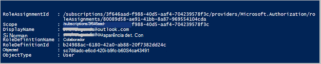

• [New-AzureRmRoleAssignment](https://msdn.microsoft.com/library/mt603580.aspx) para atribuir acesso a usuários, grupos e aplicativos para um escopo específico.  
    **Exemplo:** Use o seguinte comando para atribuir a função de "Automação operador" para um usuário no escopo conta de automação.

    New-AzureRmRoleAssignment -SignInName <sign-in Id of a user you wish to grant access> -RoleDefinitionName "Automation operator" -Scope “/subscriptions/<SubscriptionID>/resourcegroups/<Resource Group Name>/Providers/Microsoft.Automation/automationAccounts/<Automation Account Name>”  

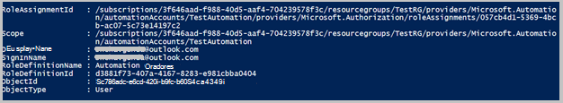

• Use [AzureRmRoleAssignment remover](https://msdn.microsoft.com/library/mt603781.aspx) para remover o acesso de um usuário especificado, o grupo ou o aplicativo de um escopo específico.  
    **Exemplo:** Use o comando a seguir para remover o usuário da função "Operador de automação" no escopo conta de automação.

    Remove-AzureRmRoleAssignment -SignInName <sign-in Id of a user you wish to remove> -RoleDefinitionName "Automation Operator" -Scope “/subscriptions/<SubscriptionID>/resourcegroups/<Resource Group Name>/Providers/Microsoft.Automation/automationAccounts/<Automation Account Name>”

Nos exemplos acima, substitua **entrar Id**, **Id da assinatura**, **nome do grupo de recursos** e **nome da conta de automação** detalhes da sua conta. Escolha **Sim** quando solicitado a confirmar antes de continuar remover a atribuição de função de usuário.   

## Próximas etapas
-  Para obter informações sobre maneiras diferentes para configurar RBAC para automação do Azure, consulte [Gerenciar RBAC com PowerShell do Azure](../active-directory/role-based-access-control-manage-access-powershell.md).
- Para obter detalhes sobre diferentes maneiras de iniciar um runbook, consulte [Iniciando um runbook](automation-starting-a-runbook.md)
- Para obter informações sobre tipos de runbook diferentes, consulte [tipos de runbook de automação do Azure](automation-runbook-types.md)

