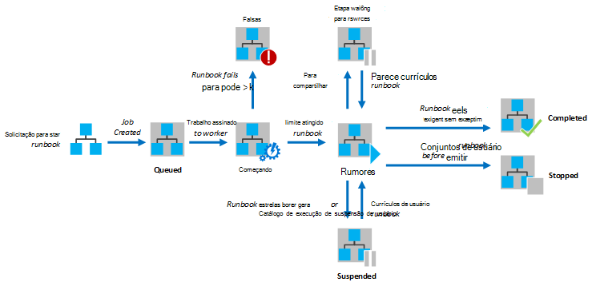
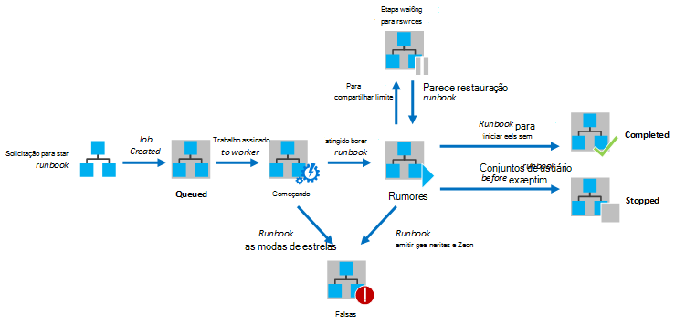

<properties
   pageTitle="Execução de runbook em automação do Azure"
   description="Descreve os detalhes de como um runbook no Azure automação é processada."
   services="automation"
   documentationCenter=""
   authors="mgoedtel"
   manager="stevenka"
   editor="tysonn" />
<tags
   ms.service="automation"
   ms.devlang="na"
   ms.topic="article"
   ms.tgt_pltfrm="na"
   ms.workload="infrastructure-services"
   ms.date="03/21/2016"
   ms.author="bwren" />

# Execução de runbook em automação do Azure

Quando você inicia um runbook no Azure automação, um trabalho é criado. Um trabalho é uma instância de um runbook execução única. Um operador de automação do Azure é atribuído para executar cada tarefa. Enquanto trabalhadores são compartilhados por várias contas do Azure, trabalhos de diferentes contas de automação são isolados uns dos outros. Você não tem controle sobre quais trabalhador será serviço a solicitação para o seu trabalho.  Um único runbook pode ter vários trabalhos em execução ao mesmo tempo. Quando você vê na lista de runbooks no portal do Azure, ele listará o status do trabalho último iniciada para cada runbook. Você pode exibir a lista de trabalhos para cada runbook para acompanhar o status de cada um. Para obter uma descrição das opções de status de trabalho diferente, consulte o [Status de trabalho](#job-statuses).

O diagrama a seguir mostra o ciclo de vida de um trabalho de runbook para [runbooks gráficas](automation-runbook-types.md#graphical-runbooks) e [runbooks de fluxo de trabalho do PowerShell](automation-runbook-types.md#powershell-workflow-runbooks).

O diagrama a seguir mostra o ciclo de vida de um trabalho de runbook do [PowerShell runbooks](automation-runbook-types.md#powershell-runbooks).

Seus trabalhos terá acesso aos seus recursos Azure fazendo uma conexão à sua assinatura do Azure. Eles só terá acesso aos recursos em seu data center se esses recursos estão acessíveis da nuvem pública.

## Status de trabalho

A tabela a seguir descreve os status diferentes possíveis para um trabalho.

| Status| Descrição|
|:---|:---|
|Concluída|O trabalho foi concluído com êxito.|
|Falha| Para [runbooks Graphical e fluxo de trabalho do PowerShell](automation-runbook-types.md), runbook falhou ao compilar.  Para [runbooks de Script do PowerShell](automation-runbook-types.md), runbook Falha ao iniciar ou o trabalho encontrou uma exceção. |
|Falha, aguardando recursos|O trabalho falhou porque ele atingiu o limite de [compartilhamento feira](#fairshare) três vezes e de Introdução do mesmo ponto de verificação ou desde o início do runbook cada vez.|
|Na fila|O trabalho está aguardando recursos em um operador de automação vir disponível para que ele pode ser iniciado.|
|Iniciando|O trabalho foi atribuído a um funcionário e o sistema está em processo de iniciá-lo.|
|Reiniciando|O sistema está reiniciando o trabalho depois que ele foi suspenso.|
|Em execução|O trabalho está sendo executado.|
|Executando, aguardando recursos|O trabalho foi descarregado porque atingiu o limite de [compartilhamento justo](#fairshare) . Ele continuará em breve do seu último ponto de verificação.|
|Interrompido|O trabalho foi interrompido pelo usuário antes que ela foi concluída.|
|Interrompendo|O sistema está em processo de interromper o trabalho.|
|Suspenso|O trabalho foi suspenso pelo usuário, pelo sistema ou por um comando no runbook. Um trabalho que está suspenso pode ser iniciado novamente e continuará a partir de seu último ponto de verificação ou o início do runbook se ele tiver sem pontos de verificação. Runbook só será suspenso pelo sistema no caso de uma exceção. Por padrão, ErrorActionPreference está definido para **continuar** significando que o trabalho continuarão a ser executados em um erro. Se essa variável de preferência é definida para **Interromper** o trabalho será suspender em um erro.  Aplica-se ao [fluxo de trabalho do PowerShell e Graphical runbooks](automation-runbook-types.md) somente.|
|Suspensão|O sistema está tentando suspender o trabalho por solicitação do usuário. Runbook deve atingir seu próximo ponto de verificação antes que ela pode ser suspenso. Se ele já passou seu último ponto de verificação, ele será concluída antes que ela pode ser suspenso.  Aplica-se ao [fluxo de trabalho do PowerShell e Graphical runbooks](automation-runbook-types.md) somente.|

## Exibindo o status de trabalho usando o Portal de gerenciamento do Azure

### Painel de automação

No painel de automação mostra um resumo de todos os runbooks para uma conta de automação específico. Ele também inclui uma visão geral sobre o uso da conta. O gráfico de resumo mostra o número de trabalhos totais para todas as runbooks que digitado cada status por meio de um determinado número de dias ou horas. Você pode selecionar o intervalo de tempo no canto superior direito do gráfico. No eixo de tempo do gráfico serão alterados de acordo com o tipo de intervalo de tempo que você selecionar. Você pode optar por exibir a linha para um determinado status clicando na parte superior da tela.

Você pode usar as etapas a seguir para exibir o painel de automação.

1. No Portal de gerenciamento do Azure, selecione **automação** e, em seguida, clique no nome de uma conta de automação.
1. Selecione a guia **painel** .

### Painel de runbook

No painel de Runbook mostra um resumo para um único runbook. O gráfico de resumo mostra o número de trabalhos totais para runbook que digitou cada status sobre um determinado número de dias ou horas. Você pode selecionar o intervalo de tempo no canto superior direito do gráfico. O eixo de tempo do gráfico serão alterados de acordo com o tipo de intervalo de tempo que você selecionar. Você pode optar por exibir a linha para um determinado status clicando na parte superior da tela.

Você pode usar as etapas a seguir para exibir o painel de Runbook.

1. No Portal de gerenciamento do Azure, selecione **automação** e, em seguida, clique no nome de uma conta de automação.
1. Clique no nome de um runbook.
1. Selecione a guia **painel** .

### Resumo da tarefa

Você pode exibir uma lista de todos os trabalhos que foram criados para um determinado runbook e seus status mais recente. Você pode filtrar essa lista por status de trabalho e o intervalo de datas para a última alteração ao trabalho. Clique no nome de um trabalho para exibir as informações detalhadas e seu resultado. A exibição detalhada do trabalho inclui os valores para os parâmetros de runbook que foram fornecidos ao trabalho.

Você pode usar as etapas a seguir para exibir os trabalhos de um runbook.

1. No Portal de gerenciamento do Azure, selecione **automação** e, em seguida, clique no nome de uma conta de automação.
1. Clique no nome de um runbook.
1. Selecione a guia de **trabalhos** .
1. Clique na coluna **Trabalho criado** para um trabalho para exibir seus detalhes e saída.

## Recuperando status de trabalho usando o Windows PowerShell

Você pode usar o [Get-AzureAutomationJob](http://msdn.microsoft.com/library/azure/dn690263.aspx) para recuperar os trabalhos criados para uma runbook e os detalhes de um determinado trabalho. Se você iniciar um runbook com o Windows PowerShell usando [AzureAutomationRunbook de início](http://msdn.microsoft.com/library/azure/dn690259.aspx), ela retornará o trabalho resultante. Use a saída de [Get-AzureAutomationJob](http://msdn.microsoft.com/library/azure/dn690263.aspx)para obter a saída de um trabalho.

Os comandos de exemplo a seguir recupera o último trabalho para um exemplo de runbook e exibe o status de TI, fornecem os valores para os parâmetros de runbook e a saída do trabalho.

    $job = (Get-AzureAutomationJob –AutomationAccountName "MyAutomationAccount" –Name "Test-Runbook" | sort LastModifiedDate –desc)[0]
    $job.Status
    $job.JobParameters
    Get-AzureAutomationJobOutput –AutomationAccountName "MyAutomationAccount" -Id $job.Id –Stream Output

## Compartilhar justo

Para compartilhar recursos entre todos os runbooks na nuvem, o Azure automação temporariamente descarregar qualquer trabalho após execução-lo para 3 horas.    [Fluxo de trabalho do PowerShell](automation-runbook-types.md#powershell-workflow-runbooks) e [Graphical](automation-runbook-types.md#graphical-runbooks) runbooks será retomado de seus último [ponto de verificação](http://technet.microsoft.com/library/dn469257.aspx#bk_Checkpoints). Durante esse tempo, o trabalho mostrará um status de execução, aguardando recursos. Se runbook tem sem pontos de verificação ou o trabalho não atingiu o ponto de verificação primeiro antes está sendo carregado, ele será reiniciado desde o começo.  [PowerShell](automation-runbook-types.md#powershell-runbooks) runbooks são sempre reiniciados desde o começo, desde que eles não há suporte para pontos de verificação.

>[AZURE.NOTE] O limite de compartilhamento feira não é aplicável para trabalhos em runbook execução híbrido Runbook trabalhadores.

Se runbook reiniciar a partir do mesmo ponto de verificação ou desde o começo do runbook três vezes consecutivas, ele será encerrado com um status de falha, aguardando recursos. Este é proteger runbooks executando indefinidamente sem concluir, como elas não são capazes de torná-lo para o próximo ponto de verificação sem está sendo carregado novamente. Nesse caso, você receberá a seguinte exceção com a falha.

*O trabalho não pode continuar a execução porque ele repetidamente foi removido do mesmo ponto de verificação. Verifique se que seu Runbook não executará operações prolongadas sem manter seu estado.*

Quando você cria um runbook, você deve garantir que o tempo para executar qualquer atividades entre dois pontos de verificação não excederá 3 horas. Talvez você precise adicionar pontos de verificação ao seu runbook para garantir que ele não atingir esse limite de 3 horas ou divida longa executando operações. Por exemplo, seu runbook pode realizar uma reindexar um grande banco de dados do SQL. Se essa operação única não for concluída dentro do limite de compartilhamento feira, o trabalho será ser descarregado e reiniciado desde o começo. Nesse caso, você deve dividir a operação de reindexar em várias etapas, como a reindexação de uma tabela ao mesmo tempo e insira um ponto de verificação após cada operação para que o trabalho poderia continuar após a última operação seja concluída.

## Próximas etapas

- [Iniciando um runbook no Azure automação](automation-starting-a-runbook.md)
