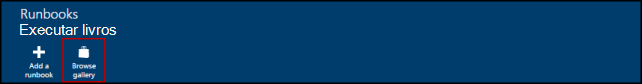

<properties
    pageTitle="Galerias de runbook e módulo de automação do Azure | Microsoft Azure"
    description="Módulos da Microsoft e da comunidade e runbooks estão disponíveis para a instalação e uso em seu ambiente de automação do Azure.  Este artigo descreve como você pode acessar esses recursos e contribuam seus runbooks na Galeria."
    services="automation"
    documentationCenter=""
    authors="mgoedtel"
    manager="jwhit"
    editor="tysonn" />
<tags
    ms.service="automation"
    ms.devlang="na"
    ms.topic="article"
    ms.tgt_pltfrm="na"
    ms.workload="infrastructure-services"
    ms.date="09/18/2016"
    ms.author="magoedte;bwren" />

# Galerias de runbook e módulo de automação do Azure

Em vez de criar seu próprio runbooks e módulos no Azure automação, você pode acessar uma variedade de cenários que já foram criados pela Microsoft e da comunidade.  Você pode usar esses cenários sem modificação ou você pode usá-los como ponto de partida e editá-los para suas necessidades específicas.

Você pode obter runbooks da [Galeria de Runbook](#runbooks-in-runbook-gallery) e módulos da [Galeria do PowerShell](#modules-in-powerShell-gallery).  Você também pode contribuir para a comunidade compartilhando cenários que você desenvolver.

## Runbooks na Galeria de Runbook

A [Galeria de Runbook](http://gallery.technet.microsoft.com/scriptcenter/site/search?f[0].Type=RootCategory&f[0].Value=WindowsAzure&f[1].Type=SubCategory&f[1].Value=WindowsAzure_automation&f[1].Text=Automation) fornece uma variedade de runbooks da Microsoft e da comunidade que você pode importar para automação do Azure. Você pode baixar uma runbook da Galeria que está hospedada no [TechNet Script Center](http://gallery.technet.microsoft.com/), ou você pode importar diretamente runbooks da Galeria do Azure portal clássico ou portal Azure.

Você só pode importar diretamente da Galeria de Runbook usando o Azure portal clássico ou o portal do Azure. Você não pode executar esta função usando o Windows PowerShell.

>[AZURE.NOTE] Você deve validar o conteúdo de qualquer runbooks que você obtenha da Galeria Runbook e muito cuidado na instalação e executá-los em um ambiente de produção. |

### Importar um runbook da Galeria Runbook com o Azure portal clássico

1. No Portal do Azure, clique em, **New**, **Serviços de aplicativo**, **automação**, **Runbook**, **Da Galeria**.
2. Selecione uma categoria para exibir runbooks relacionados e selecione um runbook para exibir seus detalhes. Quando você seleciona runbook desejado, clique no botão de seta para a direita.

    

3. Revise o conteúdo do runbook e anote qualquer requisitos da descrição. Clique no botão de seta para a direita quando terminar.
4. Insira os detalhes de runbook e clique no botão de marca de seleção. O nome de runbook já será preenchido.
5. Runbook aparecerão na guia **Runbooks** para a conta de automação.

### Importar um runbook de galeria Runbook com o portal do Azure

1. No Portal do Azure, abra sua conta de automação.
2. Clique no bloco **Runbooks** para abrir a lista de runbooks.
3. Clique em botão **Procurar Galeria** .

    

4. Localize o item de galeria desejado e selecione-o para exibir seus detalhes.

    

4. Clique em **projeto de origem do modo de exibição** para exibir o item no [TechNet Script Center](http://gallery.technet.microsoft.com/).
5. Para importar um item, clique nele para exibir seus detalhes e clique no botão **Importar** .

    

6. Opcionalmente, altere o nome do runbook e clique em **Okey** para importar runbook.
5. Runbook aparecerão na guia **Runbooks** para a conta de automação.

### Adicionando um runbook na Galeria de runbook

A Microsoft incentiva adicionar runbooks na Galeria de Runbook que você acha que serão úteis para outros clientes.  Você pode adicionar um runbook [carregá-la para o Centro de Script](http://gallery.technet.microsoft.com/site/upload) levar em consideração os seguintes detalhes.

- Você deve especificar *Do Windows Azure* para a **categoria** e *automação* para a **subcategoria** para runbook seja exibida no assistente.  

- O carregamento deve ser um único arquivo. ps1 ou .graphrunbook.  Se runbook exigir qualquer módulos, filho runbooks ou ativos, você deve listar aqueles na descrição do envio e na seção comentários do runbook.  Se você tiver um cenário que exigem vários runbooks, carregue cada separadamente e lista os nomes do runbooks relacionadas em cada uma das suas descrições. Certifique-se de que você use as mesmas marcas para que eles aparecerão na mesma categoria. Um usuário terá que ler a descrição para saber que outros runbooks são necessários o cenário de trabalhar.

- Adicione a marca "GraphicalPS" Se você estiver publicando um **runbook gráfica** (não um gráficas fluxo de trabalho). 

- Insira um PowerShell ou fluxo de trabalho do PowerShell trecho de código a descrição usando o ícone **Inserir seção de código** .

- Resumo para o carregamento será exibido nos resultados da Galeria de Runbook para que você deve fornecer informações detalhadas que ajudarão um usuário a identificar a funcionalidade do runbook.

- Você deve atribuir um a três das seguintes marcas para o carregamento.  Runbook será listado no Assistente de em categorias que correspondem às suas marcas.  Quaisquer marcas não incluídos nesta lista serão ignoradas pelo assistente. Se você não especificar nenhuma marca correspondente, runbook será listado sob a categoria de outra.

 - Backup
 - Gerenciamento de capacidade
 - Controle de alterações
 - Conformidade
 - Desenvolvimento / ambientes de teste
 - Recuperação de dados
 - Monitoramento
 - Patches
 - Provisionamento
 - Correção
 - Gerenciamento do ciclo de máquina virtual

- Automação atualiza a Galeria de uma vez por hora, para que você não ver suas contribuições imediatamente.

## Módulos na Galeria do PowerShell

Módulos do PowerShell contêm cmdlets que você pode usar em seus runbooks e módulos existentes que você pode instalar no Azure automação estarão disponíveis na [Galeria do PowerShell](http://www.powershellgallery.com).  Você pode iniciar esta galeria do portal do Azure e instalá-las diretamente em automação Azure ou você pode baixá-los e instalá-los manualmente.  Não é possível instalar os módulos diretamente do Azure clássico portal, mas você pode baixá-los instalá-los como faria com qualquer outro módulo.

### Importar um módulo de galeria de módulo de automação com o portal do Azure

1. No Portal do Azure, abra sua conta de automação.
2. Clique no bloco **ativos** para abrir a lista de ativos.
3. Clique no bloco **módulos** para abrir a lista de módulos.
4. Clique no botão **Procurar Galeria** e a lâmina de galeria procurar é iniciada.

      
5. Depois que você iniciou a lâmina de galeria procurar, você pode pesquisar por campos a seguir:

   - Nome do módulo
   - Marcas
   - Autor
   - Nome do recurso de cmdlet/DSC

6. Localize um módulo que você está interessado e selecioná-lo para exibir seus detalhes.  
Quando você analisar um módulo específico, você pode exibir mais informações sobre o módulo, incluindo um link para a Galeria do PowerShell, qualquer necessário dependências e todos os cmdlets e/ou recursos DSC que contém o módulo.

      

7. Para instalar o módulo diretamente na automação do Azure, clique no botão **Importar** .

    

8. Quando você clica no botão Importar, você verá o nome do módulo que você está prestes a importar. Se todas as dependências estiverem instaladas, o botão **Okey** estará ativo. Se você não tiver dependências, você precisa importar aqueles antes de poder importar este módulo.
9. Clique em **Okey** para importar o módulo, e a lâmina de módulo iniciará. Quando o Azure automação importa um módulo à sua conta, ele extrai metadados sobre o módulo e os cmdlets.

    

    Isso pode levar alguns minutos, desde que cada atividade precisa ser extraído.
10. Você receberá uma notificação de que o módulo está sendo implantado e uma notificação quando ela for concluída.
11. Depois que o módulo é importado, você verá as atividades disponíveis, e você pode usar seus recursos em seus runbooks e configuração de estado desejado.

## Solicitando um módulo ou runbook

Você pode enviar solicitações de voz do [Usuário](https://feedback.azure.com/forums/246290-azure-automation/).  Se você precisa de ajuda para a escrita um runbook ou tiver dúvidas sobre o PowerShell, poste uma pergunta ao nosso [Fórum](http://social.msdn.microsoft.com/Forums/windowsazure/en-US/home?forum=azureautomation&filter=alltypes&sort=lastpostdesc).

## Próximas etapas

- Para começar a usar runbooks, consulte [Criando ou importando um runbook na automação do Azure](automation-creating-importing-runbook.md)
- Para compreender as diferenças entre o PowerShell e ao fluxo de trabalho do PowerShell com runbooks, consulte [fluxo de trabalho do PowerShell de aprendizagem](automation-powershell-workflow.md)
