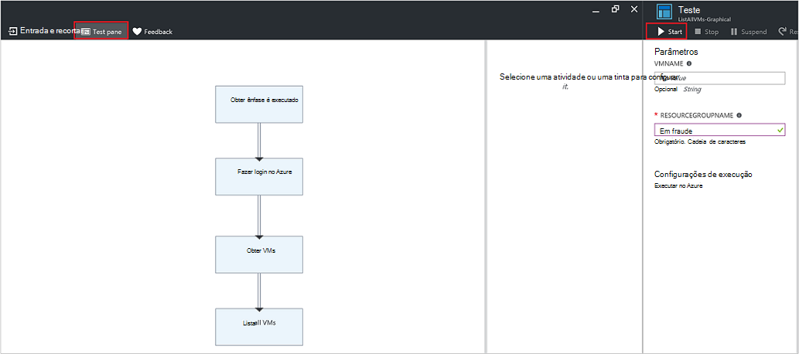

<properties
   pageTitle="Parâmetros de entrada do runbook | Microsoft Azure"
   description="Parâmetros de entrada do runbook aumentam a flexibilidade de runbooks, permitindo que você passar dados para um runbook quando ele é iniciado. Este artigo descreve onde os parâmetros de entrada são usados em runbooks de cenários diferentes."
   services="automation"
   documentationCenter=""
   authors="MGoedtel"
   manager="jwhit"
   editor="tysonn" />
<tags
   ms.service="automation"
   ms.devlang="na"
   ms.topic="article"
   ms.tgt_pltfrm="na"
   ms.workload="infrastructure-services"
   ms.date="10/11/2016"
   ms.author="sngun"/>

# <a name="runbook-input-parameters"></a>Parâmetros de entrada do runbook

Parâmetros de entrada do runbook aumentam a flexibilidade de runbooks, permitindo que você passar dados para ele quando ele é iniciado. Os parâmetros permitem ações runbook para direcionadas para ambientes e cenários específicos. Neste artigo, vamos guiará cenários diferentes onde os parâmetros de entrada são usados em runbooks.

## <a name="configure-input-parameters"></a>Configurar parâmetros de entrada

Parâmetros de entrada podem ser configurados no PowerShell, fluxo de trabalho do PowerShell e runbooks gráficas. Um runbook pode ter vários parâmetros com tipos de dados diferentes, ou sem parâmetros em todos os. Parâmetros de entrada podem ser obrigatórios e opcionais, e você pode atribuir um valor padrão para parâmetros opcionais. Você pode atribuir valores para os parâmetros de entrada para uma runbook quando você iniciá-lo através de um dos métodos disponíveis. Esses métodos incluem iniciando um runbook de portal ou um serviço da web. Você também pode iniciar um como um filho runbook chamado embutido em outro runbook.

## <a name="configure-input-parameters-in-powershell-and-powershell-workflow-runbooks"></a>Configurar parâmetros de entrada no runbooks PowerShell e ao fluxo de trabalho do PowerShell

[Fluxo de trabalho do PowerShell runbooks](automation-first-runbook-textual.md) na automação do Azure e PowerShell suportam parâmetros de entrada que são definidos por meio dos atributos a seguir.  

| **Propriedade** | **Descrição** |
|:--- |:---|
| Tipo | Necessário. O tipo de dados esperado para o valor do parâmetro. Qualquer tipo .NET é válido. |
| Nome | Necessário. O nome do parâmetro. Isso deve ser exclusivo runbook e podem conter apenas letras, números ou caracteres sublinhados. Ele deve começar com uma letra. |
| Obrigatório | Opcional. Especifica se deve ser fornecido um valor para o parâmetro. Se você definir a **$true**, em seguida, um valor deve ser fornecido quando runbook é iniciado. Se você definir a **$false**, um valor é opcional. |
| Valor padrão | Opcional.  Especifica um valor que será usado para o parâmetro se um valor não for passado quando runbook é iniciado. Um valor padrão pode ser definido para qualquer parâmetro e automaticamente tornará o parâmetro opcional, independentemente da configuração obrigatória. |

O Windows PowerShell oferece suporte a mais atributos de parâmetros de entrada que aqueles listados aqui, como validação, aliases, e conjuntos de parâmetro. No entanto, o Azure automação atualmente oferece suporte apenas os parâmetros de entrada listados acima.

Uma definição de parâmetro no fluxo de trabalho do PowerShell runbooks tem a seguinte forma geral, onde vários parâmetros são separados por vírgulas.

   ```
     Param
     (
         [Parameter (Mandatory= $true/$false)]
         [Type] Name1 = <Default value>,

         [Parameter (Mandatory= $true/$false)]
         [Type] Name2 = <Default value>
     )
   ```

>[AZURE.NOTE] Quando você estiver definindo parâmetros, se você não especificar o atributo **obrigatório** , em seguida, por padrão, o parâmetro é considerado opcional. Além disso, se você definir um valor padrão para um parâmetro no fluxo de trabalho do PowerShell runbooks, ele será tratado pelo PowerShell como um parâmetro opcional, independentemente do valor de atributo **obrigatório** .

Como exemplo, vamos configurar os parâmetros de entrada para um fluxo de trabalho do PowerShell runbook que produz detalhes sobre máquinas virtuais, em uma única VM ou todas as VMs dentro de um grupo de recursos. Este runbook tem dois parâmetros, conforme mostrado na seguinte captura de tela: o nome da máquina virtual e o nome do grupo de recursos.


Neste parâmetro definição, os parâmetros **$VMName** e **$resourceGroupName** são parâmetros simples do tipo cadeia de caracteres. No entanto, runbooks PowerShell e ao fluxo de trabalho do PowerShell oferecem suporte a todos os tipos simples e complexos, como o **objeto** ou **PSCredential** para parâmetros de entrada.

Se seu runbook tem um parâmetro de entrada de tipo de objeto, em seguida, use uma tabela de hash do PowerShell com (nome, valor) pares para passar um valor. Por exemplo, se você tem o seguinte parâmetro em um runbook:

     [Parameter (Mandatory = $true)]
     [object] $FullName

Em seguida, você pode passar o seguinte valor para o parâmetro:

    @{"FirstName"="Joe";"MiddleName"="Bob";"LastName"="Smith"}


## <a name="configure-input-parameters-in-graphical-runbooks"></a>Configurar parâmetros de entrada no runbooks gráfica

Para [Configurar um runbook gráfica](automation-first-runbook-graphical.md) com parâmetros de entrada, vamos criar um runbook gráfica que produz detalhes sobre máquinas virtuais, em uma única VM ou todas as VMs dentro de um grupo de recursos. Configurar um runbook consiste em duas atividades principais, conforme descrito abaixo.

[**Autenticar Runbooks com Azure executar como conta**](automation-sec-configure-azure-runas-account.md) para autenticar com o Azure.

[**Get-AzureRmVm**](https://msdn.microsoft.com/library/mt603718.aspx) obter as propriedades de um máquinas virtuais.

Você pode usar a atividade de [**Write-Output**](https://technet.microsoft.com/library/hh849921.aspx) para os nomes das máquinas virtuais de saída. A atividade **Get-AzureRmVm** aceita dois parâmetros, o **nome da máquina virtual** e o **nome do grupo de recursos**. Como esses parâmetros podem exigir diferentes valores toda vez que iniciar o runbook, você pode adicionar parâmetros de entrada para seu runbook. Aqui estão as etapas para adicionar parâmetros de entrada:

1. Selecione runbook gráfica da lâmina **Runbooks** e clique em [**editá**](automation-graphical-authoring-intro.md) -lo.

2. No editor do runbook, clique em **entrada e saída** para abrir a lâmina de **entrada e saída** .

    

3. A lâmina de **entrada e saída** exibe uma lista de parâmetros de entrada que são definidas para runbook. Neste blade, você pode adicionar um novo parâmetro de entrada ou editar a configuração de um parâmetro de entrada existente. Para adicionar um novo parâmetro para runbook, clique em **Adicionar entrada** para abrir o blade **Runbook parâmetro de entrada** . Lá, você pode configurar os parâmetros a seguir:

  	| **Propriedade** | **Descrição** |
  	|:--- |:---|
  	| Nome | Necessário.  O nome do parâmetro. Isso deve ser exclusivo runbook e podem conter apenas letras, números ou caracteres sublinhados. Ele deve começar com uma letra. |
  	| Descrição | Opcional. Descrição sobre a finalidade do parâmetro de entrada. |
  	| Tipo | Opcional. O tipo de dados esperado para o valor do parâmetro. Tipos de parâmetro com suporte são **String**, **Int32**, **Int64**, **Decimal**, **booliano**, **DateTime**e **objeto**. Se um tipo de dados não estiver selecionado, o padrão será a **cadeia de caracteres**. |
  	| Obrigatório | Opcional. Especifica se deve ser fornecido um valor para o parâmetro. Se você escolher **Sim**, em seguida, um valor deve ser fornecido quando runbook é iniciado. Se você escolher **Nenhum**, em seguida, um valor não é necessário quando runbook for iniciado, e um valor padrão pode ser definido. |
  	| Valor padrão | Opcional. Especifica um valor que será usado para o parâmetro se um valor não for passado quando runbook é iniciado. Um valor padrão pode ser definido para um parâmetro que não seja obrigatório. Para definir um valor padrão, escolha **personalizado**. Esse valor é usado, a menos que outro valor é fornecido quando runbook é iniciado. Escolha **Nenhum** se você não quiser fornecer nenhum valor padrão. |  

    

4. Crie dois parâmetros com as seguintes propriedades que serão usadas pela atividade **Get-AzureRmVm** :

    - **Parâmetro1:**
      - Name - VMName
      - Tipo - cadeia de caracteres
      - Obrigatório - não

    - **Parâmetro2:**
      - Name - resourceGroupName
      - Tipo - cadeia de caracteres
      - Obrigatório - não
      - Valor padrão - personalizado
      - Valor padrão personalizado - \<nome do grupo de recursos que contém as máquinas virtuais >

5. Depois de adicionar os parâmetros, clique em **Okey**.  Agora você pode exibi-los no **entrada e saída**. Clique **Okey** novamente e clique em **Salvar** e **Publicar** seu runbook.

## <a name="assign-values-to-input-parameters-in-runbooks"></a>Atribuir valores de parâmetros no runbooks de entrada

Você pode passar valores para parâmetros de runbooks nos seguintes cenários de entrada.

### <a name="start-a-runbook-and-assign-parameters"></a>Iniciar um runbook e atribuir parâmetros

Um runbook pode ser iniciado várias maneiras: por meio do portal do Azure, com um webhook, com os cmdlets do PowerShell, com a API REST ou com o SDK. A seguir, vamos abordar diferentes métodos para iniciar uma runbook e atribuindo parâmetros.

#### <a name="start-a-published-runbook-by-using-the-azure-portal-and-assign-parameters"></a>Inicie uma runbook publicado usando o portal do Azure e atribuir parâmetros

Quando você [Iniciar runbook](automation-starting-a-runbook.md#starting-a-runbook-with-the-azure-portal), a lâmina **Runbook iniciar** é aberto e você pode configurar valores para os parâmetros que você acabou de criar.


Na etiqueta abaixo da caixa de entrada, você pode ver os atributos que foram definidos para o parâmetro. Atributos incluem obrigatório e opcional, tipo e valor padrão. No balão do ajuda ao lado do nome do parâmetro, você pode ver todas as informações importantes que você precisa tomar decisões sobre os valores de entrada de parâmetro. Essas informações incluem se um parâmetro é obrigatório ou opcional. Ele também inclui o tipo e valor padrão (se houver) e outras anotações úteis.


>[AZURE.NOTE] Parâmetros de tipo de cadeia de caracteres suportam a valores de cadeia de caracteres **vazia** .  Inserir **[sequência vazia]** na caixa de parâmetro de entrada passará uma cadeia de caracteres vazia para o parâmetro. Além disso, os parâmetros de tipo de cadeia de caracteres não oferecem suporte a valores **Nulos** estão sendo passados. Se você não passar qualquer valor para o parâmetro de cadeia de caracteres, em seguida, PowerShell interpretará como nulo.

#### <a name="start-a-published-runbook-by-using-powershell-cmdlets-and-assign-parameters"></a>Iniciar um runbook publicado usando cmdlets do PowerShell e atribuir parâmetros

  - **Cmdlets do Gerenciador de recursos do azure:** Você pode iniciar uma runbook de automação que foi criado em um grupo de recursos usando [AzureRmAutomationRunbook iniciar](https://msdn.microsoft.com/library/mt603661.aspx).

    **Exemplo:**

   ```
    $params = @{“VMName”=”WSVMClassic”;”resourceGroupeName”=”WSVMClassicSG”}
 
    Start-AzureRmAutomationRunbook -AutomationAccountName “TestAutomation” -Name “Get-AzureVMGraphical” –ResourceGroupName $resourceGroupName -Parameters $params
   ```

  - **Cmdlets de gerenciamento de serviço do azure:** Você pode iniciar uma runbook de automação que foi criado em um grupo de recursos padrão usando [AzureAutomationRunbook iniciar](https://msdn.microsoft.com/library/dn690259.aspx).

    **Exemplo:**

   ```
    $params = @{“VMName”=”WSVMClassic”; ”ServiceName”=”WSVMClassicSG”}

    Start-AzureAutomationRunbook -AutomationAccountName “TestAutomation” -Name “Get-AzureVMGraphical” -Parameters $params
   ```

>[AZURE.NOTE] Quando você inicia um runbook usando cmdlets do PowerShell, um parâmetro de padrão, **MicrosoftApplicationManagementStartedBy** é criado com o valor **PowerShell**. Você pode exibir esse parâmetro na lâmina **detalhes do trabalho** .  

#### <a name="start-a-runbook-by-using-an-sdk-and-assign-parameters"></a>Inicie uma runbook usando um SDK e atribuir parâmetros

  - **Gerenciador de recursos do azure método:** Você pode iniciar uma runbook usando o SDK de uma linguagem de programação. Abaixo está um trecho de código c# para iniciar uma runbook em sua conta de automação. Você pode exibir todo o código em nosso [repositório GitHub](https://github.com/Azure/azure-sdk-for-net/blob/master/src/ResourceManagement/Automation/Automation.Tests/TestSupport/AutomationTestBase.cs).  

   ```
     public Job StartRunbook(string runbookName, IDictionary<string, string> parameters = null)
        {
          var response = AutomationClient.Jobs.Create(resourceGroupName, automationAccount, new JobCreateParameters
           {
              Properties = new JobCreateProperties
               {
                  Runbook = new RunbookAssociationProperty
                   {
                     Name = runbookName
                   },
                     Parameters = parameters
               }
           });
        return response.Job;
        }
   ```

  - **Método de gerenciamento de serviço do azure:** Você pode iniciar uma runbook usando o SDK de uma linguagem de programação. Abaixo está um trecho de código c# para iniciar uma runbook em sua conta de automação. Você pode exibir todo o código em nosso [repositório GitHub](https://github.com/Azure/azure-sdk-for-net/blob/master/src/ServiceManagement/Automation/Automation.Tests/TestSupport/AutomationTestBase.cs).

   ```      
    public Job StartRunbook(string runbookName, IDictionary<string, string> parameters = null)
      {
        var response = AutomationClient.Jobs.Create(automationAccount, new JobCreateParameters
      {
        Properties = new JobCreateProperties
           {
             Runbook = new RunbookAssociationProperty
           {
             Name = runbookName
                },
                  Parameters = parameters
                }
         });
        return response.Job;
      }
   ```

  Para iniciar este método, crie um dicionário para armazenar os parâmetros de runbook, **VMName** e **resourceGroupName**e seus valores. Inicie o runbook. Abaixo está o trecho de código c# para chamar o método definido acima.

   ```
    IDictionary<string, string> RunbookParameters = new Dictionary<string, string>();

    // Add parameters to the dictionary.
    RunbookParameters.Add("VMName", "WSVMClassic");
    RunbookParameters.Add("resourceGroupName", "WSSC1");

    //Call the StartRunbook method with parameters
    StartRunbook(“Get-AzureVMGraphical”, RunbookParameters);
   ```

#### <a name="start-a-runbook-by-using-the-rest-api-and-assign-parameters"></a>Inicie uma runbook usando a API REST e atribuir parâmetros

Um trabalho de runbook pode ser criado e a trabalhar com a API de REST de automação do Azure usando o método de **colocar** com a seguinte solicitação URI.

    https://management.core.windows.net/<subscription-id>/cloudServices/<cloud-service-name>/resources/automation/~/automationAccounts/<automation-account-name>/jobs/<job-id>?api-version=2014-12-08`

Na solicitação de URI, substitua os parâmetros a seguir:

  - **id da assinatura:** Sua ID do Azure assinatura.  
  - **nome de serviço de nuvem:** O nome do serviço de nuvem para o qual a solicitação deve ser enviada.  
  - **nome da conta de automação:** O nome da sua conta de automação que está hospedado dentro do serviço de nuvem especificada.  
  - **id de trabalho:** O GUID para o trabalho. GUIDs no PowerShell podem ser criados usando o **[GUID]::NewGuid(). ToString ()** comando.

Para passar parâmetros para o trabalho de runbook, use o corpo da solicitação. Leva as seguintes propriedades de dois fornecidas no formato JSON:

  - **Runbook nome:** Necessário. O nome do runbook para o trabalho Iniciar.  
  - **Parâmetros de Runbook:** Opcional. Um dicionário da lista de parâmetro na (nome, valor) Formatar onde nome deve ser do tipo de cadeia de caracteres e valor pode ser qualquer valor JSON válido.

Se você quiser iniciar runbook **Get-AzureVMTextual** criado anteriormente com **VMName** e **resourceGroupName** como parâmetros, use o seguinte formato JSON para o corpo da solicitação.

   ```
    {
      "properties":{
        "runbook":{
        "name":"Get-AzureVMTextual"},
      "parameters":{
         "VMName":"WSVMClassic",
         "resourceGroupName":”WSCS1”}
        }
    }
   ```

Um código de status HTTP 201 será retornado se o trabalho é criado com êxito. Para obter mais informações sobre cabeçalhos de resposta e o corpo de resposta, consulte o artigo sobre como [criar um trabalho de runbook usando a API REST.](https://msdn.microsoft.com/library/azure/mt163849.aspx)

### <a name="test-a-runbook-and-assign-parameters"></a>Testar uma runbook e atribuir parâmetros

Quando você [testar a versão de rascunho do seu runbook](automation-testing-runbook.md) usando a opção de teste, a lâmina **Testar** é aberto e você pode configurar valores para os parâmetros que você acabou de criar.



### <a name="link-a-schedule-to-a-runbook-and-assign-parameters"></a>Vincular um cronograma de um runbook e atribuir parâmetros

Você pode [vincular um cronograma](automation-schedules.md) para seu runbook para que runbook começa em uma hora específica. Você atribuir parâmetros de entrada quando você criar o cronograma e runbook usarão esses valores quando ele for iniciado pelo cronograma. Você não pode salvar o cronograma até que todos os valores de parâmetro obrigatório são fornecidos.


### <a name="create-a-webhook-for-a-runbook-and-assign-parameters"></a>Criar um webhook para um runbook e atribuir parâmetros

Você pode criar um [webhook](automation-webhooks.md) para seu runbook e configurar parâmetros de entrada do runbook. Você não pode salvar o webhook até que todos os valores de parâmetro obrigatório são fornecidos.


Quando você executa um runbook utilizando um webhook, o parâmetro de entrada predefinido **[Webhookdata](automation-webhooks.md#details-of-a-webhook)** é enviada, juntamente com os parâmetros de entrada que você definiu. Você pode clicar para expandir o parâmetro **WebhookData** para obter mais detalhes.


## <a name="next-steps"></a>Próximas etapas

- Para obter mais informações sobre runbook entrada e saída, consulte [Azure automação: runbook entrada, saída e runbooks aninhada](https://azure.microsoft.com/blog/azure-automation-runbook-input-output-and-nested-runbooks/).
- Para obter detalhes sobre as diferentes maneiras de iniciar um runbook, consulte [Iniciando um runbook](automation-starting-a-runbook.md).
- Para editar um runbook textual, consulte [runbooks textuais de edição](automation-edit-textual-runbook.md).
- Para editar um runbook gráfica, consulte [Graphical coautoria na automação do Azure](automation-graphical-authoring-intro.md).
