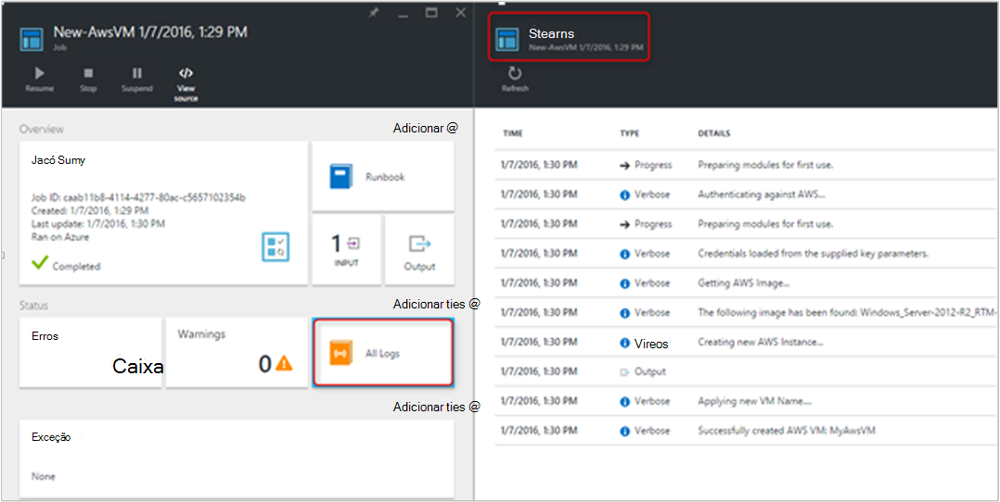

<properties
   pageTitle="Automatizar a implantação de uma máquina virtual no Amazon Web Services | Microsoft Azure"
   description="Este artigo mostra como usar a automação do Azure para automatizar a criação de um serviço de Web de Amazon máquina virtual"
   services="automation"
   documentationCenter=""
   authors="mgoedtel"
   manager="jwhit"
   editor="" />
<tags
   ms.service="automation"
   ms.devlang="na"
   ms.topic="article"
   ms.tgt_pltfrm="na"
   ms.workload="na"
   ms.date="08/17/2016"
   ms.author="tiandert; bwren" />

# <a name="azure-automation-scenario---provision-an-aws-virtual-machine"></a>Cenário de automação do Azure - provisionar uma máquina virtual AWS 

Neste artigo, vamos demonstrar como você pode utilizar automação do Azure para provisionar uma máquina virtual em sua assinatura de serviço de Web da Amazon (AWS) e dê um nome específico – que AWS se refere a como "marcação" a máquina virtual para essa máquina virtual.

## <a name="prerequisites"></a>Pré-requisitos

Para os fins deste artigo, você precisa ter uma conta de automação do Azure e uma assinatura AWS. Para obter mais informações sobre como configurar uma conta de automação do Azure e configurá-lo com as credenciais de assinatura AWS, revise [Configurar autenticação com Amazon Web Services](../automation/automation-sec-configure-aws-account.md).  Essa conta deve ser criada ou atualizada com as credenciais de assinatura AWS antes de prosseguir, como podemos fizer referência a esta conta nas etapas abaixo.


## <a name="deploy-amazon-web-services-powershell-module"></a>Implantar o módulo do PowerShell do Amazon Web Services

Nossa máquina virtual provisionamento runbook utilizará o módulo do PowerShell do AWS para fazer seu trabalho. Execute as seguintes etapas para adicionar o módulo à sua conta de automação que está configurada com as credenciais de assinatura AWS.  

1. Abra seu navegador da web e navegue até a [Galeria do PowerShell](http://www.powershellgallery.com/packages/AWSPowerShell/) e clique em **implantar no botão de automação do Azure**.<br> 

2. Você será direcionado para a página de login Azure e depois de autenticar, você serão roteados para o Portal do Azure e apresentados com a seguinte lâmina.<br> 

3. Selecione o grupo de recursos na lista suspensa de **Grupo de recursos** e na lâmina parâmetros, forneça as seguintes informações:
   * Na lista suspensa **novo ou conta de automação existente (cadeia)** selecione **existente**.  
   * Na caixa **Nome da conta de automação (cadeia)** , digite o nome exato da conta de automação que inclui as credenciais para sua assinatura AWS.  Por exemplo, se você criou uma conta dedicada denominada **AWSAutomation**, em seguida, que é que você digita na caixa.
   * Selecione a região apropriada na lista suspensa de **Automação conta local** .

4. Quando você tiver concluído a inserir as informações necessárias, clique em **criar**.

    >[AZURE.NOTE]Enquanto importando um módulo do PowerShell para automação do Azure, ele é também extrair os cmdlets e essas atividades não aparecerá até que o módulo completamente terminou importando e extrair os cmdlets. Esse processo pode levar alguns minutos.  
<br>
5. No Portal do Azure, abra sua conta de automação mencionada na etapa 3.
6. Clique no bloco **ativos** e na lâmina **ativos** , selecione o bloco de **módulos** .
7. Na lâmina **módulos** , você verá o módulo **AWSPowerShell** na lista.

## <a name="create-aws-deploy-vm-runbook"></a>Criar AWS implantar runbook de máquina virtual

Depois que o módulo do PowerShell AWS tiver sido implantado, podemos agora pode criar um runbook para automatizar uma máquina virtual em AWS usando um script PowerShell de provisionamento. As etapas abaixo demonstraremos como aproveitar o script do PowerShell nativo na automação do Azure.  

>[AZURE.NOTE] Para obter mais opções e informações sobre esse script, visite a [Galeria do PowerShell](https://www.powershellgallery.com/packages/New-AwsVM/DisplayScript).


1. Baixe o script do PowerShell New-AwsVM da Galeria de PowerShell abrindo uma sessão do PowerShell e digitando o seguinte:<br>
   ```
   Save-Script -Name New-AwsVM -Path \<path\>
   ```
<br>
2. No Portal do Azure, abra sua conta de automação e clique no bloco **Runbooks** .  
3. Da lâmina **Runbooks** , selecione **Adicionar um runbook**.
4. Na lâmina **Adicionar um runbook** , selecione **Criar rápida** (criar uma nova runbook).
5. Na lâmina **Runbook** propriedades, digite um nome na caixa nome para seu runbook e do **tipo de Runbook** lista suspensa Selecione **PowerShell**e clique em **criar**.<br> 
6. Quando aparece a lâmina Editar Runbook do PowerShell, copie e cole o script do PowerShell a runbook tela de criação.<br> <br>

    >[AZURE.NOTE] Observe o seguinte ao trabalhar com o exemplo de script do PowerShell:
    >
    > - Runbook contém um número de valores de parâmetro padrão. Visite avaliar todos os valores padrão e atualize onde for necessário.
    > - Se você tiver armazenado suas credenciais AWS como um ativo de credencial denominado diferente **AWScred**, você precisará atualizar o script na linha 57 para corresponder ao acordo.  
    > - Ao trabalhar com os comandos de AWS CLI no PowerShell, especialmente com runbook neste exemplo, você deve especificar a região AWS. Caso contrário, os cmdlets falhará.  Exiba o tópico AWS [Especificar AWS região](http://docs.aws.amazon.com/powershell/latest/userguide/pstools-installing-specifying-region.html) nas ferramentas AWS para documento do PowerShell para obter mais detalhes.  
<br>
7. Para recuperar uma lista de nomes de imagem de sua assinatura AWS, abra o PowerShell ISE e importar o módulo do PowerShell AWS.  Autenticar AWS por meio da substituição **Get-AutomationPSCredential** no seu ambiente ISE com **AWScred = Get-Credential**.  Isso solicitará suas credenciais e você pode fornecer sua **Identificação de tecla de acesso** para o nome de usuário e a **Chave de acesso secreta** para a senha.  Consulte o exemplo abaixo:

        #Sample to get the AWS VM available images
        #Please provide the path where you have downloaded the AWS PowerShell module
        Import-Module AWSPowerShell
        $AwsRegion = "us-west-2"
        $AwsCred = Get-Credential
        $AwsAccessKeyId = $AwsCred.UserName
        $AwsSecretKey = $AwsCred.GetNetworkCredential().Password

        # Set up the environment to access AWS
        Set-AwsCredentials -AccessKey $AwsAccessKeyId -SecretKey $AwsSecretKey -StoreAs AWSProfile
        Set-DefaultAWSRegion -Region $AwsRegion

        Get-EC2ImageByName -ProfileName AWSProfile
   O seguinte resultado será retornado:<br>
     
8. Copie e cole o um dos nomes de imagem em uma variável de automação referenciado no runbook como **$InstanceType**. Como neste exemplo estamos usar o AWS gratuito hierárquico assinatura, usaremos **t2.micro** para o nosso exemplo de runbook.
9. Salvar runbook, clique em **Publicar** para publicar runbook e clique em seguida **Sim** quando solicitado.


### <a name="testing-the-aws-vm-runbook"></a>Teste runbook AWS VM
Antes de continuar com o teste runbook, precisamos verificar algumas coisas. Especificamente:

   -  Um ativo para autenticar contra AWS tiver sido criado chamado **AWScred** ou o script foi atualizado para fazer referência ao nome do seu ativo de credencial.  
   -  O módulo do PowerShell AWS foi importado na automação do Azure
   -  Um novo runbook foi criada e valores de parâmetro foram verificadas e atualizadas quando necessário
   -  **Log detalhados registros** e, opcionalmente, **registros de Log de progresso** em runbook definição de **log e rastreamento** foram definidas como **On**.<br> 

1. Queremos iniciar runbook, então clique em **Iniciar** e clique em **Okey** quando abre o blade Runbook iniciar.
2. Na lâmina Runbook Iniciar, forneça um **VMname**.  Aceite os valores padrão para os outros parâmetros pré-configurado no script anteriormente.  Clique em **Okey** para iniciar o trabalho de runbook.<br> 
3. Um painel de trabalho é aberto para o trabalho de runbook que acabou de criar. Feche esse painel.
4. Pode ver o andamento do trabalho e modo de exibição **fluxos** de saída, selecionando o bloco de **Todos os Logs** da lâmina de trabalho do runbook.<br> 
5. Para confirmar que a máquina virtual está sendo provisionada, efetuar login no Console de gerenciamento de AWS se não estiver conectado no momento.<br> 

## <a name="next-steps"></a>Próximas etapas
-   Para começar a usar runbooks gráficas, consulte [Minha primeira runbook gráfica](automation-first-runbook-graphical.md)
-   Para começar a usar runbooks de fluxo de trabalho do PowerShell, consulte [Minha primeira runbook de fluxo de trabalho do PowerShell](automation-first-runbook-textual.md)
-   Para saber mais sobre limitações, suas vantagens e tipos de runbook, consulte [tipos de runbook de automação do Azure](automation-runbook-types.md)
-   Para obter mais informações sobre script do PowerShell suporta o recurso, consulte [suporte no Azure automação de script do PowerShell nativo](https://azure.microsoft.com/blog/announcing-powershell-script-support-azure-automation-2/)
