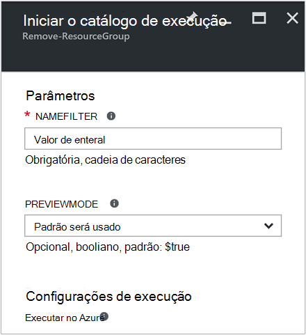
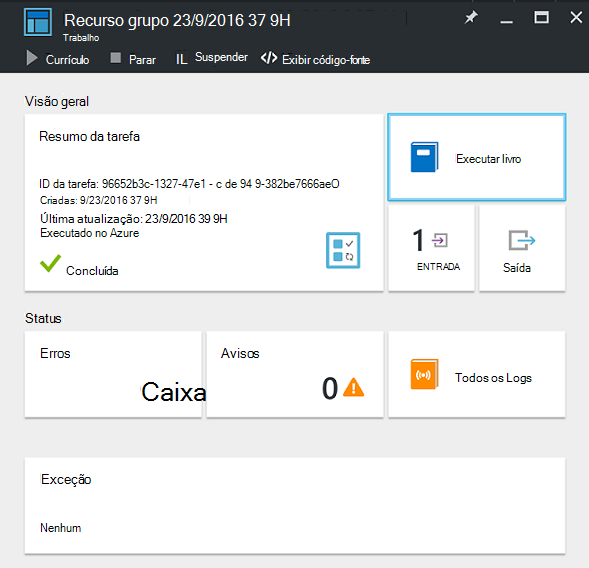
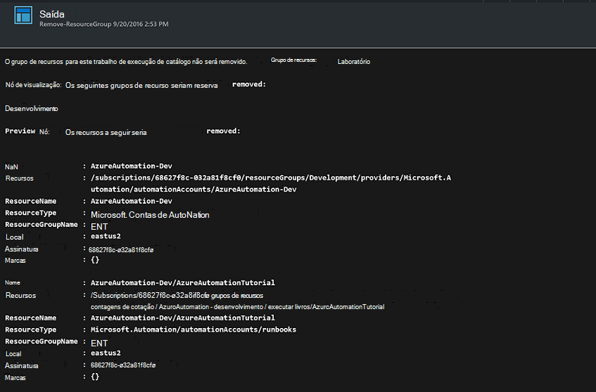

<properties
    pageTitle="Automatizar a remoção de grupos de recursos | Microsoft Azure"
    description="Versão de fluxo de trabalho do PowerShell de um cenário de automação do Azure incluindo runbooks para remover todos os grupos de recursos em sua assinatura."
    services="automation"
    documentationCenter=""
    authors="MGoedtel"
    manager="jwhit"
    editor=""
    />
<tags
    ms.service="automation"
    ms.workload="tbd"
    ms.tgt_pltfrm="na"
    ms.devlang="na"
    ms.topic="get-started-article"
    ms.date="09/26/2016"
    ms.author="magoedte"/>

# Cenário de automação Azure - automatizar a remoção de grupos de recursos

Muitos clientes criar mais de um grupo de recursos. Alguns podem ser usados para gerenciar aplicativos de produção e outras pessoas podem ser usadas como desenvolvimento, teste e transferência ambientes. Automatizar a implantação desses recursos é uma coisa, mas poder encerrar um grupo de recursos com um clique do botão é outra. Você pode simplificar essa tarefa gerenciamento comum usando automação do Azure. Isso é útil se você estiver trabalhando com uma assinatura do Azure que tem um limite de gastos por meio de uma oferta de membro como MSDN ou o programa do Microsoft Partner Network Cloud Essentials.

Esse cenário baseado em um runbook PowerShell e é projetado para remover um ou mais grupos de recursos que você especificar da sua assinatura. A configuração padrão do runbook é testar antes de continuar. Isso garante que você acidentalmente não exclua o grupo de recursos, antes que você está pronto para concluir este procedimento.   

## Obtendo o cenário

Este cenário consiste em um runbook PowerShell que você pode baixar da [Galeria do PowerShell](https://www.powershellgallery.com/packages/Remove-ResourceGroup/1.0/DisplayScript). Você também pode importá-lo diretamente da [Galeria de Runbook](automation-runbook-gallery.md) no portal do Azure.  

Runbook | Descrição|
----------|------------|
Remover ResourceGroup | Remove um ou mais grupos de recursos do Azure e recursos associados da assinatura.  
 
Os seguintes parâmetros de entrada são definidos para este runbook:

Parâmetro | Descrição|
----------|------------|
NameFilter (obrigatório) | Especifica um filtro de nome para limitar os grupos de recursos que você pretende excluir. Você pode passar valores múltiplos usando uma lista separada por vírgulas. O filtro não diferencia maiusculas de minúsculas e corresponderão qualquer grupo de recursos que contém a cadeia de caracteres.|
PreviewMode (opcional) | Executa runbook para ver a quais grupos de recursos seriam excluídos, mas não executará nenhuma ação. O padrão é **verdadeiro** para ajudar a evitar a exclusão acidental de um ou mais grupos de recursos passado para runbook.  

## Instalar e configurar esse cenário

### Pré-requisitos

Este runbook autentica usando a [conta do Azure executar como](automation-sec-configure-azure-runas-account.md).    

### Instalar e publicar o runbooks

Depois de baixar runbook, você poderá importá-lo usando o procedimento em [importando runbook procedimentos](automation-creating-importing-runbook.md#importing-a-runbook-from-a-file-into-Azure-Automation). Publica runbook depois de ter sido importado com êxito para sua conta de automação.

## Usando runbook

As etapas a seguir apresentará a execução deste runbook e ajuda que você se familiarizar com como ele funciona. Você estará apenas testando runbook neste exemplo, não realmente excluir o grupo de recursos.  

1. Azure no portal do, abra sua conta de automação e clique **Runbooks**.
2. Selecione runbook **ResourceGroup remover** e clique em **Iniciar**.
3. Quando você inicia o runbook, a lâmina **Runbook iniciar** é aberto e você pode configurar os parâmetros. Insira os nomes dos grupos de recursos na sua assinatura que você pode usar para testar e não causará nenhum dano se acidentalmente excluído.  

    >[AZURE.NOTE] Certifique-se de **que PreviewMode** é definida como **true** para evitar a exclusão de grupos de recursos selecionado.  **Observação** essa runbook não removerá o grupo de recursos que contém a conta de automação que está executando esse runbook.  

4. Após ter configurado o parâmetro todos os valores, clique em **Okey**e runbook será enfileirado para execução.  

Para exibir os detalhes do trabalho **Remover ResourceGroup** runbook no portal do Azure, selecione **trabalhos** em runbook. O trabalho Resumo exibe os parâmetros de entrada e o fluxo de saída, além de informações gerais sobre o trabalho e as exceções que ocorreram.  .

O **Resumo de trabalho** inclui mensagens da saída, aviso e fluxos de erro. Selecione **saída** para exibir resultados detalhados da execução runbook.  

## Próximas etapas

- Para começar a criar seu próprio runbook, consulte [Criando ou importando um runbook no Azure automação](automation-creating-importing-runbook.md).
- Para começar a usar runbooks de fluxo de trabalho do PowerShell, consulte [Meu runbook de fluxo de trabalho do PowerShell primeiro](automation-first-runbook-textual.md).
