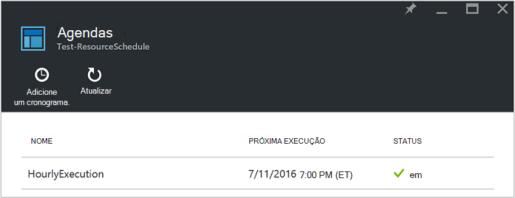
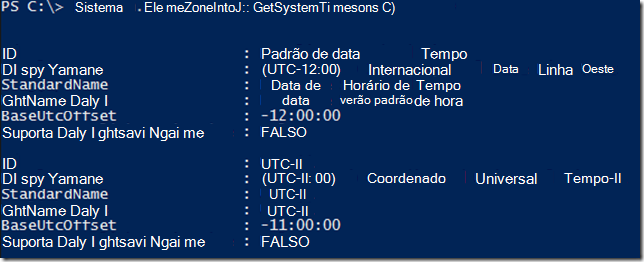
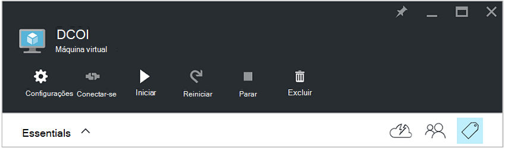
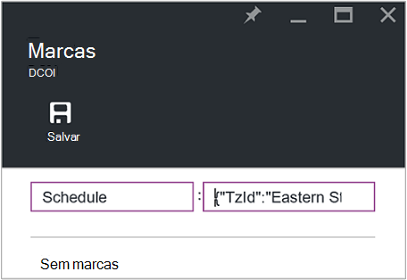
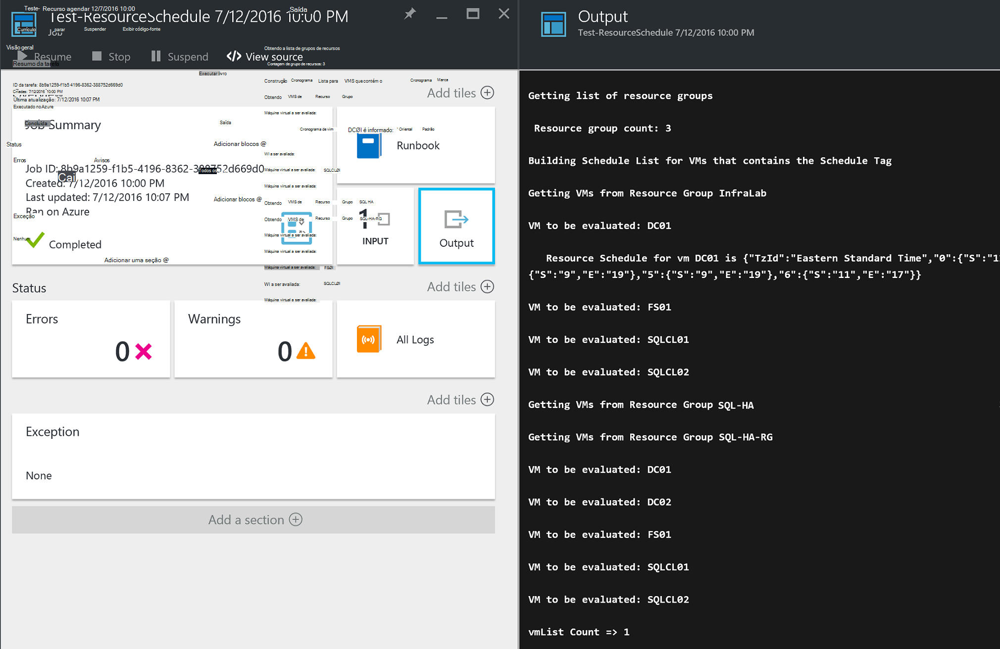

<properties
   pageTitle="Usando marcas formatados JSON para criar um cronograma para inicialização de máquina virtual do Azure e desligamento | Microsoft Azure"
   description="Este artigo mostra como usar cadeias de caracteres JSON em marcas para automatizar o agendamento de desligamento e inicialização de máquina virtual."
   services="automation"
   documentationCenter=""
   authors="MGoedtel"
   manager="jwhit"
   editor="tysonn" />
<tags
   ms.service="automation"
   ms.devlang="na"
   ms.topic="article"
   ms.tgt_pltfrm="na"
   ms.workload="infrastructure-services"
   ms.date="07/18/2016"
   ms.author="magoedte;paulomarquesc" />

# Cenário de automação Azure: usando marcas formatados JSON para criar um cronograma para inicialização de máquina virtual do Azure e desligamento

Os clientes geralmente querem agendar a inicialização e o encerramento de máquinas virtuais para ajudar a reduzir os custos de assinatura ou suporte requisitos técnicos e negócios.  

O cenário a seguir permite que você configurar automatizado de inicialização e desligamento das suas VMs usando uma marca chamada cronograma em um nível de grupo de recursos ou nível de máquina virtual no Azure. Esta agenda pode ser configurada de domingo a sábado com uma hora de inicialização e desligamento.  

Temos algumas opções da caixa. Eles incluem:
-  [Escala de máquina Virtual define](../virtual-machine-scale-sets/virtual-machine-scale-sets-overview.md) com configurações de escala automática que permitem que você expandir ou reduzir.
- Serviço de [DevTest Labs](../devtest-lab/devtest-lab-overview.md) , que tem o recurso interno do agendamento de operações de inicialização e desligamento.

No entanto, essas opções só oferece suporte para cenários específicos e não podem ser aplicados a infraestrutura-como um serviço (IaaS) VMs.   

Quando a marca de cronograma é aplicada a um grupo de recursos, ela também é aplicada a todas as máquinas virtuais dentro desse grupo de recursos. Se um cronograma também diretamente é aplicado a uma máquina virtual, o cronograma último tem precedência na seguinte ordem:

1.  Cronograma aplicada a um grupo de recursos
2.  Cronograma aplicada a um grupo de recursos e máquina virtual no grupo de recursos
3.  Cronograma aplicada a uma máquina virtual

Este cenário essencialmente leva uma cadeia de JSON com um formato especificado e adiciona-lo como o valor de uma marca chamada cronograma. Em seguida, um runbook lista todos os grupos de recursos e máquinas virtuais e identifica os agendamentos para cada máquina virtual baseado nos cenários listados anteriormente. Em seguida ele percorre VMs que possuem agendas anexadas e avalia que ação deve ser realizada. Por exemplo, ele determina quais VMs precisam ser interrompido, desligar ou ignorados.

Esses runbooks autenticar usando a [conta do Azure executar como](../automation/automation-sec-configure-azure-runas-account.md).

## Baixar o runbooks para o cenário

Este cenário consiste em quatro runbooks de fluxo de trabalho do PowerShell que você pode baixar da [Galeria do TechNet](https://gallery.technet.microsoft.com/Azure-Automation-Runbooks-84f0efc7) ou repositório [GitHub](https://github.com/paulomarquesdacosta/azure-automation-scheduled-shutdown-and-startup) para esse projeto.

Runbook | Descrição
----------|----------
Teste-ResourceSchedule | Verifica cada agenda de máquina virtual e executa ou desligamento dependendo do cronograma.
ResourceSchedule adicionar | Adiciona a marca de cronograma para um grupo de máquina virtual ou recurso.
Atualização ResourceSchedule | Modifica a marca de cronograma existente, substituindo-o por um novo.
Remover ResourceSchedule | Remove a marca de cronograma de um grupo de máquina virtual ou recurso.

## Instalar e configurar esse cenário

### Instalar e publicar o runbooks

Depois de baixar o runbooks, você poderá importá-los usando o procedimento em [Criando ou importando um runbook no Azure automação](automation-creating-importing-runbook.md#importing-a-runbook-from-a-file-into-Azure-Automation).  Publica cada runbook depois de ter sido importado com êxito para sua conta de automação.

### Adicionar uma agenda a runbook ResourceSchedule de teste

Siga estas etapas para habilitar o cronograma de runbook ResourceSchedule de teste. Este é o runbook que verifica quais máquinas virtuais deve ser iniciadas, desligar ou deixadas como estão.

1. Azure no portal do, abra sua conta de automação e, em seguida, clique no bloco de **Runbooks** .
2. Na lâmina **ResourceSchedule de teste** , clique no bloco de **agendas** .
3. Na lâmina **agendas** , clique em **Adicionar um cronograma**.
4. Na lâmina **agendas** , selecione **vincular um cronograma para seu runbook**. Em seguida, selecione **criar uma nova agenda**.
5.  Na **nova agenda** lâmina, digite o nome esse cronograma, por exemplo: *HourlyExecution*.
6. Para a agenda de **início**, defina a hora de início para um incremento de hora.
7. Selecione **Recorrência**e for **recorrente cada intervalo**, selecione **1 hora**.
8. Verifique se a **validade definida** está definida como **não**e clique em **criar** para salvar sua nova agenda.
9. Na lâmina **Cronograma Runbook** opções, selecione **configurações de execução e parâmetros**. Na lâmina de teste ResourceSchedule **parâmetros** , insira o nome da sua assinatura no campo **nome de inscrição** .  Este é o único parâmetro necessário para o runbook.  Quando tiver terminado, clique em **Okey**.  

O cronograma de runbook deve parecer com o seguinte quando ela estiver concluída:

 

## Formatar a cadeia de caracteres JSON

Esta solução basicamente leva uma JSON de cadeia de caracteres com um formato especificado e adiciona-lo como o valor de uma marca chamada cronograma. Em seguida, um runbook lista todos os grupos de recursos e máquinas virtuais e identifica os agendamentos para cada máquina virtual.

Runbook circula pelas máquinas virtuais que possuem agendas anexadas e verifica quais ações devem ser executadas. Este é um exemplo de como as soluções devem ser formatadas:

    {
       "TzId": "Eastern Standard Time",
        "0": {  
           "S": "11",
           "E": "17"
        },
        "1": {
           "S": "9",
           "E": "19"
        },
        "2": {
           "S": "9",
           "E": "19"
        },
    }

Aqui estão algumas informações detalhadas sobre essa estrutura:

1. O formato dessa estrutura JSON é otimizado para contornar a limitação de 256 caracteres de um valor de única marca no Azure.

2. *TzId* representa o fuso horário da máquina virtual. Essa identificação pode ser obtida usando a classe TimeZoneInfo .NET em uma sessão do PowerShell –**[System.TimeZoneInfo]: GetSystemTimeZones()**.

    

    - Dias da semana são representados com um valor numérico de zero até seis. O valor zero é igual a domingo.
    - A hora de início é representada com o atributo **S** e seu valor está em um formato de 24 horas.
    - A hora de término ou desligamento é representada com o atributo **E** e seu valor está em um formato de 24 horas.

    Se os atributos **S** e **E** cada tem um valor zero (0), a máquina virtual ficará em seu estado atual no momento da avaliação.   

3. Se você quiser ignorar a avaliação de um determinado dia da semana, não adicione uma seção do dia da semana. No exemplo a seguir, apenas segunda-feira é avaliada e os outros dias da semana são ignorados:

        {
          "TzId": "Eastern Standard Time",
           "1": {
             "S": "11",
             "E": "17"
           }
        }

## Grupos de recursos de marca ou VMs

Para desligar VMs, você precisa marcar as VMs ou os grupos de recursos em que estão localizados. Máquinas virtuais que não têm uma marca de agenda não são avaliadas. Portanto, elas não iniciadas ou desligadas.

Há duas maneiras de grupos de recursos de marca ou VMs com esta solução. Você pode fazer isso diretamente do portal. Ou você pode usar o Add-ResourceSchedule, ResourceSchedule de atualização e remover ResourceSchedule runbooks.

### Marcar por meio do portal

Siga estas etapas para marcar uma máquina virtual ou grupo de recursos no portal:

1. Nivelar a cadeia de caracteres JSON e verifique se que não existem espaços.  A cadeia de caracteres JSON deve ter esta aparência:

        {"TzId":"Eastern Standard Time","0":{"S":"11","E":"17"},"1":{"S":"9","E":"19"},"2": {"S":"9","E":"19"},"3":{"S":"9","E":"19"},"4":{"S":"9","E":"19"},"5":{"S":"9","E":"19"},"6":{"S":"11","E":"17"}}

2. Selecione o ícone de **marca** para um grupo de máquina virtual ou recurso aplicar esta agenda.

    
3. Marcas são definidas seguindo um par chave/valor. Digite o **cronograma** no campo **chave** e, em seguida, cole a cadeia de caracteres JSON no campo de **valor** . Clique em **Salvar**. Sua nova marca agora deve aparecer na lista de marcas para o recurso.

### Marca do PowerShell

Todos os runbooks importados contêm informações de Ajuda no início do script que descreve como executar o runbooks diretamente do PowerShell. Você pode chamar a runbooks ScheduleResource adicionar e atualizar-ScheduleResource do PowerShell. Você pode fazer isso passando parâmetros necessários que permitem que você criar ou atualizar a marca de cronograma em um grupo de máquina virtual ou recurso fora do portal.  

Para criar, adicionar e excluir marcas através do PowerShell, será necessário [configurar seu ambiente do PowerShell do Azure](../powershell-install-configure.md). Depois de concluir a instalação, você pode prosseguir com as etapas a seguir.

### Criar uma marca de agenda com o PowerShell

1. Abra uma sessão do PowerShell. Use o exemplo a seguir para autenticar com sua conta executar como e especifique uma assinatura:   

        Conn = Get-AutomationConnection -Name AzureRunAsConnection
        Add-AzureRMAccount -ServicePrincipal -Tenant $Conn.TenantID `
        -ApplicationId $Conn.ApplicationID -CertificateThumbprint $Conn.CertificateThumbprint
        Select-AzureRmSubscription -SubscriptionName "MySubscription"

2. Defina uma tabela de hash do cronograma. Aqui está um exemplo de como ele deve ser construído:

        $schedule= @{ "TzId"="Eastern Standard Time"; "0"= @{"S"="11";"E"="17"};"1"= @{"S"="9";"E"="19"};"2"= @{"S"="9";"E"="19"};"3"= @{"S"="9";"E"="19"};"4"= @{"S"="9";"E"="19"};"5"= @{"S"="9";"E"="19"};"6"= @{"S"="11";"E"="17"}}

3. Defina os parâmetros que são exigidos pelo runbook. No exemplo a seguir, pretendemos uma máquina virtual:

        $params = @{"SubscriptionName"="MySubscription";"ResourceGroupName"="ResourceGroup01"; `
        "VmName"="VM01";"Schedule"=$schedule}

    Se você estiver marcando um grupo de recursos, remova o parâmetro *VMName* da tabela de hash $params da seguinte maneira:

        $params = @{"SubscriptionName"="MySubscription";"ResourceGroupName"="ResourceGroup01"; `
        "Schedule"=$schedule}

4. Execute runbook adicionar ResourceSchedule com os seguintes parâmetros para criar a marca de cronograma:

        Start-AzureRmAutomationRunbook -Name "Add-ResourceSchedule" -Parameters $params `
        -AutomationAccountName "AutomationAccount" -ResourceGroupName "ResourceGroup01"

5. Para atualizar um grupo de recursos ou marca de máquina virtual, execute runbook **ResourceSchedule de atualização** com os seguintes parâmetros:

        Start-AzureRmAutomationRunbook -Name "Update-ResourceSchedule" -Parameters $params `
        -AutomationAccountName "AutomationAccount" -ResourceGroupName "ResourceGroup01"

### Remover uma marca de agenda com o PowerShell

1. Abra uma sessão do PowerShell e execute o seguinte para autenticar com sua conta executar como e para selecionar e especifique uma assinatura:

        Conn = Get-AutomationConnection -Name AzureRunAsConnection
        Add-AzureRMAccount -ServicePrincipal -Tenant $Conn.TenantID `
        -ApplicationId $Conn.ApplicationID -CertificateThumbprint $Conn.CertificateThumbprint
        Select-AzureRmSubscription -SubscriptionName "MySubscription"

2. Defina os parâmetros que são exigidos pelo runbook. No exemplo a seguir, pretendemos uma máquina virtual:

        $params = @{"SubscriptionName"="MySubscription";"ResourceGroupName"="ResourceGroup01" `
        ;"VmName"="VM01"}

    Se você estiver removendo uma marca de um grupo de recursos, remova o parâmetro *VMName* da tabela de hash $params da seguinte maneira:

        $params = @{"SubscriptionName"="MySubscription";"ResourceGroupName"="ResourceGroup01"}

3. Execute runbook ResourceSchedule remover para remover a marca de cronograma:

        Start-AzureRmAutomationRunbook -Name "Remove-ResourceSchedule" -Parameters $params `
        -AutomationAccountName "AutomationAccount" -ResourceGroupName "ResourceGroup01"

4. Para atualizar um grupo de recursos ou marca de máquina virtual, execute runbook remover ResourceSchedule com os seguintes parâmetros:

        Start-AzureRmAutomationRunbook -Name "Remove-ResourceSchedule" -Parameters $params `
        -AutomationAccountName "AutomationAccount" -ResourceGroupName "ResourceGroup01"

>[AZURE.NOTE] Recomendamos que você monitorar proativamente Esses runbooks (e os estados de máquina virtual) para confirmar que suas máquinas virtuais estão sendo desligar para baixo e iniciado adequadamente.  

Para exibir os detalhes do trabalho runbook teste-ResourceSchedule no portal do Azure, selecione o bloco de **trabalhos** do runbook. O trabalho Resumo exibe os parâmetros de entrada e o fluxo de saída, além de informações gerais sobre o trabalho e as exceções se eles ocorreram.  

O **Resumo de trabalho** inclui mensagens da saída, aviso e fluxos de erro. Selecione o bloco de **saída** para exibir resultados detalhados da execução runbook.

  

## Próximas etapas

-  Para começar a usar runbooks de fluxo de trabalho do PowerShell, consulte [Meu runbook de fluxo de trabalho do PowerShell primeiro](automation-first-runbook-textual.md).
-  Para saber mais sobre tipos de runbook e suas vantagens e limitações, consulte [tipos de runbook de automação do Azure](automation-runbook-types.md).
-  Para obter mais informações sobre o script do PowerShell recursos de suporte, consulte [suporte no Azure automação de script do PowerShell nativo](https://azure.microsoft.com/blog/announcing-powershell-script-support-azure-automation-2/).
-  Para saber mais sobre o log de runbook e de saída, consulte [Runbook saída e mensagens em automação do Azure](automation-runbook-output-and-messages.md).
-  Para saber mais sobre uma conta executar como do Azure e como autenticar seus runbooks usando-lo, consulte [runbooks autenticar com Azure executar como conta](../automation/automation-sec-configure-azure-runas-account.md).
