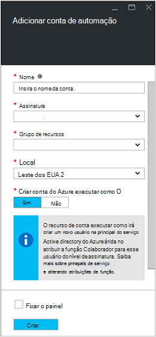
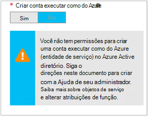

<properties
   pageTitle="Configurar conta de usuário do Azure AD | Microsoft Azure"
   description="Este artigo descreve como configurar credenciais de conta de usuário do Azure AD para runbooks na automação do Azure para autenticar BRAÇO e ASM."
   services="automation"
   documentationCenter=""
   authors="MGoedtel"
   manager="jwhit"
   editor="tysonn"
   keywords="conta de usuário do active directory do Azure usuário, azure serviço gerenciamento, azure ad" />
<tags
   ms.service="automation"
   ms.devlang="na"
   ms.topic="get-started-article"
   ms.tgt_pltfrm="na"
   ms.workload="infrastructure-services"
   ms.date="09/12/2016"
   ms.author="magoedte" />

# Autenticar Runbooks com gerenciamento de serviço Azure e Gerenciador de recursos

Este artigo descreve as etapas que você deve executar para configurar uma conta de usuário do Azure AD para runbooks de automação do Azure em execução em relação a recursos de gerenciamento de serviço do Azure (ASM) ou Azure Resource Manager (ARM).  Enquanto isso continua a ser que uma identidade de autenticação compatíveis para seu BRAÇO com base runbooks, o método recomendado está usando a nova conta do Azure executar como.       

## Criar um novo usuário do Active Directory do Azure

1. Faça logon Portal de clássico do Azure como um administrador de serviço para o Azure assinatura que você deseja gerenciar.
2. Selecione o **Active Directory**e, em seguida, selecione o nome do seu diretório da organização.
3. Selecione a guia de **usuários** e, em seguida, na área de comando, selecione **Adicionar usuário**.
4. Na página **Conte-nos sobre este usuário** , em **tipo de usuário**, selecione **novo usuário na sua organização**.
5. Insira um nome de usuário.  
6. Selecione o nome de diretório que está associado a sua assinatura na página do Active Directory do Azure.
7. Na página de **perfil de usuário** , forneça primeiro e último nome, um nome amigável e usuário na lista de **funções** .  Faça não **Habilitar a autenticação multifator**.
8. Observe o nome completo do usuário e a senha temporária.
9. Selecione **Configurações > administradores > Adicionar**.
10. Digite o nome de usuário completo do usuário que você criou.
11. Selecione a assinatura que deseja que o usuário gerencie.
12. Faça logout do Azure e faça logon novamente com a conta que você acabou de criar. Você será solicitado a alterar a senha do usuário.

## Criar uma conta de automação no Portal de clássico do Azure
Nesta seção, você executará as seguintes etapas para criar uma nova conta de automação do Azure no Portal do Azure que serão usadas com seus runbooks gerenciar recursos no modo de ASM e ARM.  

>[AZURE.NOTE] Contas de automação criadas com o Portal de clássico do Azure podem ser gerenciadas pelo clássico do Azure e Portal do Azure e um conjunto de cmdlets. Depois que a conta for criada, ela não faz diferença como criar e gerenciar recursos dentro da conta. Se você estiver planejando continuar a usar o Portal de clássico do Azure, em seguida, você deve usá-lo em vez de Portal do Azure criar qualquer contas de automação.

1. Faça logon Portal de clássico do Azure como um administrador de serviço para o Azure assinatura que você deseja gerenciar.
2. Selecione **automação**.
3. Na página de **automação** , selecione **criar uma conta de automação**.
4. Na caixa **criar uma conta de automação** , digite um nome para sua nova conta de automação e selecione uma **região** na lista suspensa.  
5. Clique em **Okey** para aceitar as configurações e criar a conta.
6. Após sua criação ele será listado na página de **automação** .
7. Clique na conta e ele levará para a página de painel.  
8. Na página do painel de automação, selecione **ativos**.
9. Na página de **ativos** , selecione **Adicionar configurações** localizado na parte inferior da página.
10. Na página **Adicionar configurações** , selecione **Adicionar credenciais**.
11. Na página **Definir credenciais** , selecione **Credencial do Windows PowerShell** na lista suspensa **Tipo de credencial** e forneça um nome para a credencial.
12. No seguinte tipo de página de **Definir credenciais** no nome do usuário da conta de usuário AD criado anteriormente no campo **Nome de usuário** e a senha nos campos **senha** e **Confirmar senha** . Clique em **Okey** para salvar suas alterações.

## Criar uma conta de automação no Portal do Azure

Nesta seção, você executará as seguintes etapas para criar uma nova conta de automação do Azure no Portal do Azure que serão usadas com os recursos de gerenciamento de runbooks no modo de BRAÇO.  

1. Faça logon portal do Azure como um administrador de serviço para o Azure assinatura que você deseja gerenciar.
2. Selecione **contas de automação**.
3. Na lâmina automação contas, clique em **Adicionar**. 
2. Na lâmina **Adicionar conta de automação** , na caixa **nome** , digite um nome para sua nova conta de automação.
5. Se você tiver mais de uma assinatura, especifique a para a nova conta, bem como um **grupo de recursos** novos ou existentes e uma análise Azure **local**.
3. Selecione o valor **não** para a opção **criar Azure executar como conta** e clique no botão **criar** .  

    >[AZURE.NOTE] Se você optar por não criar a conta executar como selecionando a opção **não**, você receberá uma mensagem de aviso na lâmina **Adicionar conta de automação** .  Enquanto a conta é criada e atribuída à função de **Colaborador** na assinatura, ele não terá uma identidade de autenticação correspondente dentro de seu serviço de diretório de assinaturas e, portanto, não há recursos de acesso em sua assinatura.  Isso impedirá qualquer runbooks fazendo referência a esta conta sejam capazes de autenticar e realizar tarefas com recursos ARM.

    

4. Enquanto o Azure cria a conta de automação, você pode controlar o progresso em **notificações por** no menu.

Quando a criação da credencial for concluída, em seguida, você precisará criar um ativo de credencial para associar a conta de automação com a conta de usuário do AD criada anteriormente.  Lembre-se de que criamos apenas a conta de automação e ele não está associado uma identidade de autenticação.  Execute as etapas descritas os [ativos de credencial no artigo de automação do Azure](../automation/automation-credentials.md#creating-a-new-credential) e insira o valor de **nome de usuário** no formato **domínio \ usuário**.

## Usar a credencial em uma runbook

Você pode recuperar a credencial em uma runbook usando a atividade de [Get-AutomationPSCredential](http://msdn.microsoft.com/library/dn940015.aspx) e usá-lo com [Add-AzureAccount](http://msdn.microsoft.com/library/azure/dn722528.aspx) para se conectar à sua assinatura do Azure. Se a credencial é um administrador de várias assinaturas Azure, então você também deve usar [AzureSubscription selecione](http://msdn.microsoft.com/library/dn495203.aspx) especificar correto. Isso é mostrado na amostra do Windows PowerShell abaixo que normalmente aparecem na parte superior da maioria das runbooks de automação do Azure.

    $cred = Get-AutomationPSCredential –Name "myuseraccount.onmicrosoft.com"
    Add-AzureAccount –Credential $cred
    Select-AzureSubscription –SubscriptionName "My Subscription"

Você deve repetir essas linhas após quaisquer [pontos de verificação](http://technet.microsoft.com/library/dn469257.aspx#bk_Checkpoints) no seu runbook. Se runbook está suspenso e, em seguida, currículos em outro trabalhador, será necessário realizar a autenticação novamente.

## Próximas etapas
* Examine os tipos de runbook diferentes e etapas para criar seu próprio runbooks do artigo seguinte [tipos de runbook de automação do Azure](../automation/automation-runbook-types.md)
