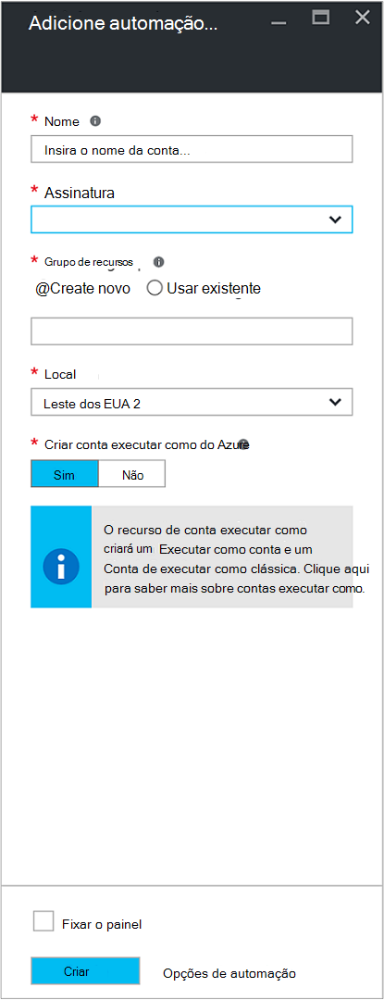
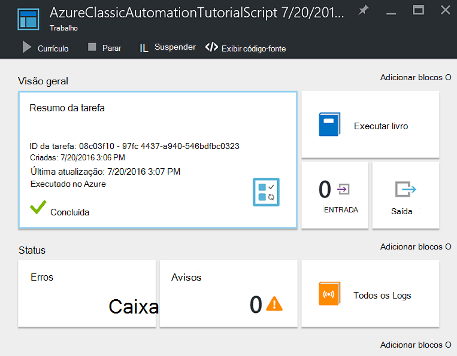

<properties
    pageTitle="Configurar o Azure executar como conta | Microsoft Azure"
    description="Tutorial que orienta o uso de criação, teste e exemplo de autenticação de entidade de segurança na automação do Azure."
    services="automation"
    documentationCenter=""
    authors="mgoedtel"
    manager="jwhit"
    editor=""
    keywords="nome principal de serviço, setspn, autenticação azure"/>
<tags
    ms.service="automation"
    ms.workload="tbd"
    ms.tgt_pltfrm="na"
    ms.devlang="na"
    ms.topic="get-started-article"
    ms.date="08/17/2016"
    ms.author="magoedte"/>

# Autenticar Runbooks com conta executar como do Azure

Este tópico mostrará como configurar uma conta de automação do portal do Azure usando o recurso de conta executar como para autenticar runbooks gerenciar os recursos no Gerenciador de recursos do Azure ou gerenciamento de serviço do Azure.

Quando você cria uma nova conta de automação no portal do Azure, ele cria automaticamente:

- Executar como conta que cria um novo objeto de serviço do Azure Active Directory, um certificado e atribui o controle de acesso baseado em função de Colaborador (RBAC), que será usado para gerenciar recursos do Gerenciador de recursos usando runbooks.   
- Executar como conta clássica carregando um certificado de gerenciamento, que será usado para gerenciar gerenciamento de serviço do Azure ou recursos clássicos usando runbooks.  

Isso simplifica o processo para você e ajuda a iniciar rapidamente criando e implantando runbooks para oferecer suporte a suas necessidades de automação.      

Usando uma conta executar como e clássico executar, você pode:

- Oferece uma maneira padronizada para autenticar com o Azure ao gerenciar recursos do Gerenciador de recursos do Azure ou gerenciamento de serviço do Azure de runbooks no portal do Azure.  
- Automatize o uso do global runbooks configurado no Azure alertas.

>[AZURE.NOTE] O Azure [recurso alerta integração](../monitoring-and-diagnostics/insights-receive-alert-notifications.md) com a automação Global Runbooks requer uma conta de automação que é configurada com uma opção Executar como e clássico executar como conta. Você pode selecionar uma conta de automação que já tem uma conta executar como e clássico executar como definida ou escolha para criar um novo.

Abordaremos mostram como criar a conta de automação do portal do Azure, atualizar uma conta de automação usando o PowerShell e demonstram como autenticar em seus runbooks.

Antes de fazer isso, há algumas coisas que você deve compreender e considerar antes de continuar.

1. Isso não afeta as contas de automação existentes já criadas no clássico ou modelo de implantação do Gerenciador de recursos.  
2. Isso funcionará somente para contas de automação criadas por meio do portal Azure.  Tentar criar uma conta a partir do portal clássico não será duplicar a configuração de conta executar como.
3. Se você tem atualmente runbooks e ativos (ou seja, cronogramas, variáveis, etc) criados anteriormente para gerenciar recursos clássicos e deseja que esses runbooks para autenticar com a nova conta clássico executar como, você precisará migrá-las para a nova conta de automação ou atualizar sua conta existente usando o script do PowerShell abaixo.  
4. Para autenticar usando as novas contas executar como e clássico executar como automação, você precisará modificar seus runbooks existente com o código de exemplo abaixo.  **Observação** que a conta executar como é para autenticação contra recursos do Gerenciador de recursos usando o serviço baseado em certificado principal e a conta clássico executar como é para autenticar em recursos de gerenciamento de serviço com o certificado de gerenciamento.     

## Criar uma nova conta de automação do Portal do Azure

Nesta seção, você irá executar as seguintes etapas para criar uma nova conta de automação do Azure do portal do Azure.  Isso cria a executar como e a conta de executar como clássica.  

>[AZURE.NOTE] O usuário realizar essas etapas *devem* ser um membro da função administradores de assinatura e colegas administrador da assinatura que está concedendo acesso à assinatura do usuário.  O usuário também deve ser adicionado como um usuário que assinaturas padrão do Active Directory; a conta não precisa ser atribuído a uma função privilegiada.

1. Faça logon no portal do Azure com uma conta que seja um membro da função administradores de assinatura e colegas administrador da assinatura.
2. Selecione **contas de automação**.
3. Na lâmina automação contas, clique em **Adicionar**. 

    >[AZURE.NOTE]Se você vir o seguinte aviso na lâmina **Adicionar conta de automação** , isso ocorre porque sua conta não é um membro da função administradores de assinatura e co-administração da assinatura. 

4. Na lâmina **Adicionar conta de automação** , na caixa **nome** , digite um nome para sua nova conta de automação.
5. Se você tiver mais de uma assinatura, especifique uma para a nova conta, bem como um **grupo de recursos** novos ou existentes e uma análise Azure **local**.
6. Verifique se o valor de **que Sim** está selecionada para a opção de **criar Azure executar como conta** e clique no botão **criar** .  

    >[AZURE.NOTE] Se você optar por não criar a conta executar como selecionando a opção **não**, você receberá uma mensagem de aviso na lâmina **Adicionar conta de automação** .  Enquanto a conta é criada no portal do Azure, ele não terá uma identidade de autenticação correspondente dentro de sua clássico ou serviço de diretório de assinatura do Gerenciador de recursos e, portanto, sem acesso aos recursos em sua assinatura.  Isso impedirá qualquer runbooks fazendo referência a esta conta sejam capazes de se autenticar e realizar tarefas com recursos nesses modelos de implantação.

    > 
Quando a entidade de serviço não é criada a função Colaborador não será atribuída.

7. Enquanto o Azure cria a conta de automação, você pode controlar o progresso em **notificações por** no menu.

### Recursos incluídos

Quando a conta de automação é criada com êxito, vários recursos são criados automaticamente para você.  A tabela a seguir resume os recursos da conta executar como. 

Recurso|Descrição
--------|-----------
AzureAutomationTutorial Runbook|Um runbook do PowerShell de exemplo que demonstra como autenticar usando a conta executar como e obtém todos os recursos do Gerenciador de recursos.
AzureAutomationTutorialScript Runbook|Um runbook do PowerShell de exemplo que demonstra como autenticar usando a conta executar como e obtém todos os recursos do Gerenciador de recursos.
AzureRunAsCertificate|Ativo de certificado automaticamente criado durante a criação de conta de automação ou usando o script PowerShell abaixo para uma conta existente.  Ele permite que você autenticar com o Azure para que você possa gerenciar recursos do Gerenciador de recursos do Azure de runbooks.  Este certificado tem um tempo de vida de um ano.
AzureRunAsConnection|Ativo de Conexão automaticamente criada durante a criação de contas de automação ou usando o script PowerShell abaixo para uma conta existente.

A tabela a seguir resume os recursos da conta clássico executar como. 

Recurso|Descrição
--------|-----------
AzureClassicAutomationTutorial Runbook|Um runbook de exemplo que obtém todas as VMs clássico em uma assinatura usando a executar como conta clássica (certificado) e então apresenta o nome da máquina virtual e status.
Script de AzureClassicAutomationTutorial Runbook|Um runbook de exemplo que obtém todas as VMs clássico em uma assinatura usando a executar como conta clássica (certificado) e então apresenta o nome da máquina virtual e status.
AzureClassicRunAsCertificate|Certificado ativo criado automaticamente que é usado para autenticar com o Azure para que você possa gerenciar Azure recursos clássicos de runbooks.  Este certificado tem um tempo de vida de um ano.
AzureClassicRunAsConnection|Conexão ativo criado automaticamente que é usado para autenticar com o Azure para que você possa gerenciar Azure recursos clássicos de runbooks.  

## Verificar a autenticação executar como

Em seguida, podemos executará uma pequena de teste para confirmar que você é capaz de autenticar com êxito usando a nova conta executar como.     

1. No Portal do Azure, abra a conta de automação criada anteriormente.  
2. Clique no bloco **Runbooks** para abrir a lista de runbooks.
3. Selecione runbook **AzureAutomationTutorialScript** e clique em **Iniciar** para iniciar o runbook.  Você receberá um aviso verificando que deseja iniciar runbook.
4. Um [trabalho de runbook](automation-runbook-execution.md) é criada, o trabalho blade é exibido e o status do trabalho exibida no bloco **Resumo da tarefa** .  
5. O status do trabalho será iniciado como *enfileirados* indicando que ele está aguardando um trabalhador runbook na nuvem fique disponível. Ele será movido para *Iniciar* quando um trabalhador declarações o trabalho e, em seguida, *em execução* quando runbook realmente começa a ser executado.  
6. Quando o trabalho de runbook for concluído, podemos deverá ver um status de **concluído**.   
7. Para ver os resultados detalhados do runbook, clique no bloco **saída** .
8. A lâmina de **saída** , você verá com êxito, ela tem autenticada e retornada uma lista de todos os recursos disponíveis no grupo de recursos.
9. Feche a lâmina de **saída** para retornar para a lâmina de **Resumo da tarefa** .
13. Feche o **Resumo da tarefa** e a lâmina de runbook **AzureAutomationTutorialScript** correspondente.

## Verificar a autenticação clássico executar como

Em seguida, podemos executará uma pequena de teste para confirmar que você é capaz de autenticar com êxito usando a nova conta clássico executar como.     

1. No Portal do Azure, abra a conta de automação criada anteriormente.  
2. Clique no bloco **Runbooks** para abrir a lista de runbooks.
3. Selecione runbook **AzureClassicAutomationTutorialScript** e clique em **Iniciar** para iniciar o runbook.  Você receberá um aviso verificando que deseja iniciar runbook.
4. Um [trabalho de runbook](automation-runbook-execution.md) é criada, o trabalho blade é exibido e o status do trabalho exibida no bloco **Resumo da tarefa** .  
5. O status do trabalho será iniciado como *enfileirados* indicando que ele está aguardando um trabalhador runbook na nuvem fique disponível. Ele será movido para *Iniciar* quando um trabalhador declarações o trabalho e, em seguida, *em execução* quando runbook realmente começa a ser executado.  
6. Quando o trabalho de runbook for concluído, podemos deverá ver um status de **concluído**.   
7. Para ver os resultados detalhados do runbook, clique no bloco **saída** .
8. A lâmina de **saída** , você verá com êxito, ela tem autenticada e retornada uma lista de todos os máquina virtual clássico fica na assinatura.
9. Feche a lâmina de **saída** para retornar para a lâmina de **Resumo da tarefa** .
13. Feche o **Resumo da tarefa** e a lâmina de runbook **AzureClassicAutomationTutorialScript** correspondente.

## Atualizar uma conta de automação usando o PowerShell

Aqui podemos oferecer a opção para usar o PowerShell para atualizar sua conta de automação existente se:

1. Você criou uma conta de automação, mas recusado criar a conta executar como
2. Você já tiver uma conta de automação para gerenciar recursos do Gerenciador de recursos e você quiser atualizá-lo para incluir a conta executar como para autenticação de runbook
2. Você já tiver uma conta de automação para gerenciar recursos clássicos e você quiser atualizá-lo para usar o clássico executar como em vez de criar uma nova conta e migrando seus ativos e runbooks-lo   

Antes de prosseguir, verifique o seguinte:

1. Você tiver baixou e instalou o [Windows Management Framework (WMF) 4.0](https://www.microsoft.com/download/details.aspx?id=40855) se você estiver executando o Windows 7.   
    Se você estiver executando o Windows Server 2012 R2, Windows Server 2012, Windows 2008 R2, Windows 8.1 e Windows 7 SP1, [Windows Management Framework 5.0](https://www.microsoft.com/download/details.aspx?id=50395) está disponível para instalação.
2. Azure PowerShell 1.0. Para obter informações sobre esta versão e como instalá-lo, veja [como instalar e configurar o Azure PowerShell](../powershell-install-configure.md).
3. Você criou uma conta de automação.  Essa conta será referenciada como o valor para parâmetros – AutomationAccountName e - ApplicationDisplayName em ambos os scripts abaixo.

Para obter os valores de *SubscriptionID*, *ResourceGroup*e *AutomationAccountName*, que são parâmetros necessários para os scripts, no portal do Azure selecione sua conta de automação da **conta de automação** lâmina e selecione **todas as configurações**.  Da lâmina **todas as configurações** , em **Configurações de conta** , selecione **Propriedades**.  Na lâmina **Propriedades** , você pode observar esses valores.    

### Criar executar como conta script do PowerShell

O script do PowerShell abaixo configurará o seguinte:

- Um aplicativo do Azure AD que será autenticado com o certificado auto-assinado, crie uma conta de serviço principal para este aplicativo no Azure AD e a função Colaborador (você pode alterar isso para proprietário ou qualquer outra função) para a conta na sua assinatura atual.  Para obter mais informações, consulte o artigo de [controle de acesso baseado em função em automação do Azure](../automation/automation-role-based-access-control.md) .
- Um ativo de certificado de automação na conta de automação especificado denominado **AzureRunAsCertificate**, que contém o certificado usado pelo serviço principal.
- Um ativo de conexão de automação na conta de automação especificado denominado **AzureRunAsConnection**, que contém o applicationId, tenantId, subscriptionId e impressão digital do certificado.    

As etapas a seguir o orientará durante o processo de executar o script.

1. Salve o script a seguir em seu computador.  Neste exemplo, salve-o com o nome **AzureServicePrincipal.ps1 de novo**.  

        #Requires -RunAsAdministrator
        Param (
        [Parameter(Mandatory=$true)]
        [String] $ResourceGroup,

        [Parameter(Mandatory=$true)]
        [String] $AutomationAccountName,

        [Parameter(Mandatory=$true)]
        [String] $ApplicationDisplayName,

        [Parameter(Mandatory=$true)]
        [String] $SubscriptionId,

        [Parameter(Mandatory=$true)]
        [String] $CertPlainPassword,

        [Parameter(Mandatory=$false)]
        [int] $NoOfMonthsUntilExpired = 12
        )

        Login-AzureRmAccount
        Import-Module AzureRM.Resources
        Select-AzureRmSubscription -SubscriptionId $SubscriptionId

        $CurrentDate = Get-Date
        $EndDate = $CurrentDate.AddMonths($NoOfMonthsUntilExpired)
        $KeyId = (New-Guid).Guid
        $CertPath = Join-Path $env:TEMP ($ApplicationDisplayName + ".pfx")

        $Cert = New-SelfSignedCertificate -DnsName $ApplicationDisplayName -CertStoreLocation cert:\LocalMachine\My -KeyExportPolicy Exportable -Provider "Microsoft Enhanced RSA and AES Cryptographic Provider"

        $CertPassword = ConvertTo-SecureString $CertPlainPassword -AsPlainText -Force
        Export-PfxCertificate -Cert ("Cert:\localmachine\my\" + $Cert.Thumbprint) -FilePath $CertPath -Password $CertPassword -Force | Write-Verbose

        $PFXCert = New-Object -TypeName System.Security.Cryptography.X509Certificates.X509Certificate -ArgumentList @($CertPath, $CertPlainPassword)
        $KeyValue = [System.Convert]::ToBase64String($PFXCert.GetRawCertData())

        $KeyCredential = New-Object  Microsoft.Azure.Commands.Resources.Models.ActiveDirectory.PSADKeyCredential
        $KeyCredential.StartDate = $CurrentDate
        $KeyCredential.EndDate= $EndDate
        $KeyCredential.KeyId = $KeyId
        $KeyCredential.Type = "AsymmetricX509Cert"
        $KeyCredential.Usage = "Verify"
        $KeyCredential.Value = $KeyValue

        # Use Key credentials
        $Application = New-AzureRmADApplication -DisplayName $ApplicationDisplayName -HomePage ("http://" + $ApplicationDisplayName) -IdentifierUris ("http://" + $KeyId) -KeyCredentials $keyCredential

        New-AzureRMADServicePrincipal -ApplicationId $Application.ApplicationId | Write-Verbose
        Get-AzureRmADServicePrincipal | Where {$_.ApplicationId -eq $Application.ApplicationId} | Write-Verbose

        $NewRole = $null
        $Retries = 0;
        While ($NewRole -eq $null -and $Retries -le 6)
        {
           # Sleep here for a few seconds to allow the service principal application to become active (should only take a couple of seconds normally)
           Sleep 5
           New-AzureRMRoleAssignment -RoleDefinitionName Contributor -ServicePrincipalName $Application.ApplicationId | Write-Verbose -ErrorAction SilentlyContinue
           Sleep 10
           $NewRole = Get-AzureRMRoleAssignment -ServicePrincipalName $Application.ApplicationId -ErrorAction SilentlyContinue
           $Retries++;
        }

        # Get the tenant id for this subscription
        $SubscriptionInfo = Get-AzureRmSubscription -SubscriptionId $SubscriptionId
        $TenantID = $SubscriptionInfo | Select TenantId -First 1

        # Create the automation resources
        New-AzureRmAutomationCertificate -ResourceGroupName $ResourceGroup -AutomationAccountName $AutomationAccountName -Path $CertPath -Name AzureRunAsCertificate -Password $CertPassword -Exportable | write-verbose

        # Create a Automation connection asset named AzureRunAsConnection in the Automation account. This connection uses the service principal.
        $ConnectionAssetName = "AzureRunAsConnection"
        Remove-AzureRmAutomationConnection -ResourceGroupName $ResourceGroup -AutomationAccountName $AutomationAccountName -Name $ConnectionAssetName -Force -ErrorAction SilentlyContinue
        $ConnectionFieldValues = @{"ApplicationId" = $Application.ApplicationId; "TenantId" = $TenantID.TenantId; "CertificateThumbprint" = $Cert.Thumbprint; "SubscriptionId" = $SubscriptionId}
        New-AzureRmAutomationConnection -ResourceGroupName $ResourceGroup -AutomationAccountName $AutomationAccountName -Name $ConnectionAssetName -ConnectionTypeName AzureServicePrincipal -ConnectionFieldValues $ConnectionFieldValues

2. Em seu computador, inicie o **Windows PowerShell** na tela **Iniciar** com direitos privilegiados de usuário.
3. Do shell de linha de comando do PowerShell elevado, navegue até a pasta que contém o script criado na etapa 1 e execute o script alterando os valores para parâmetros *– ResourceGroup*, *- AutomationAccountName*, *- ApplicationDisplayName*, *SubscriptionId -*e *- CertPlainPassword*. 

    >[AZURE.NOTE] Você será solicitado para autenticar com o Azure após executar o script. Você deve fazer logon com uma conta que seja um membro da função administradores de assinatura e co-administração da assinatura.

        .\New-AzureServicePrincipal.ps1 -ResourceGroup <ResourceGroupName>
        -AutomationAccountName <NameofAutomationAccount> `
        -ApplicationDisplayName <DisplayNameofAutomationAccount> `
        -SubscriptionId <SubscriptionId> `
        -CertPlainPassword "<StrongPassword>"  
 

Após o script for concluído com êxito, consulte o [código de exemplo](#sample-code-to-authenticate-with-resource-manager-resources) abaixo para autenticar com os recursos do Gerenciador de recursos e validar a configuração de credencial.

### Criar conta clássico executar como script do PowerShell

O script do PowerShell abaixo configurará o seguinte:

- Um ativo de certificado de automação na conta de automação especificado denominado **AzureClassicRunAsCertificate**, que contém o certificado usado para autenticar seus runbooks.
- Um ativo de conexão de automação na conta de automação especificado denominado **AzureClassicRunAsConnection**, que contém o nome da assinatura, o nome de ativos subscriptionId e certificado.

O script irá criar um certificado autoassinado gerenciamento e salvá-lo para a pasta de arquivos temporários no computador em que o perfil de usuário usado para executar a sessão do PowerShell - *%USERPROFILE%\AppData\Local\Temp*.  Após a execução de scripts, você precisará carregar o certificado de gerenciamento Azure na loja de gerenciamento da assinatura em que na conta de automação foi criada.  As etapas a seguir o orientará durante o processo de executar o script e carregar o certificado.  

1. Salve o script a seguir em seu computador.  Neste exemplo, salve-o com o nome **AzureClassicRunAsAccount.ps1 de novo**.

        #Requires -RunAsAdministrator
        Param (
        [Parameter(Mandatory=$true)]
        [String] $ResourceGroup,

        [Parameter(Mandatory=$true)]
        [String] $AutomationAccountName,

        [Parameter(Mandatory=$true)]
        [String] $ApplicationDisplayName,

        [Parameter(Mandatory=$true)]
        [String] $SubscriptionId,

        [Parameter(Mandatory=$true)]
        [String] $CertPlainPassword,

        [Parameter(Mandatory=$false)]
        [int] $NoOfMonthsUntilExpired = 12
        )

        Login-AzureRmAccount
        Import-Module AzureRM.Resources
        $Subscription = Select-AzureRmSubscription -SubscriptionId $SubscriptionId
        $SubscriptionName = $subscription.Subscription.SubscriptionName

        $CurrentDate = Get-Date
        $EndDate = $CurrentDate.AddMonths($NoOfMonthsUntilExpired)
        $KeyId = (New-Guid).Guid
        $CertPath = Join-Path $env:TEMP ($ApplicationDisplayName + ".pfx")
        $CertPathCer = Join-Path $env:TEMP ($ApplicationDisplayName + ".cer")

        $Cert = New-SelfSignedCertificate -DnsName $ApplicationDisplayName -CertStoreLocation cert:\LocalMachine\My -KeyExportPolicy Exportable -Provider "Microsoft Enhanced RSA and AES Cryptographic Provider"

        $CertPassword = ConvertTo-SecureString $CertPlainPassword -AsPlainText -Force
        Export-PfxCertificate -Cert ("Cert:\localmachine\my\" + $Cert.Thumbprint) -FilePath $CertPath -Password $CertPassword -Force | Write-Verbose
        Export-Certificate -Cert ("Cert:\localmachine\my\" + $Cert.Thumbprint) -FilePath $CertPathCer -Type CERT | Write-Verbose

        # Create the automation resources
        $ClassicCertificateAssetName = "AzureClassicRunAsCertificate"
        New-AzureRmAutomationCertificate -ResourceGroupName $ResourceGroup -AutomationAccountName $AutomationAccountName -Path $CertPath -Name $ClassicCertificateAssetName  -Password $CertPassword -Exportable | write-verbose

        # Create a Automation connection asset named AzureClassicRunAsConnection in the Automation account. This connection uses the ClassicCertificateAssetName.
        $ConnectionAssetName = "AzureClassicRunAsConnection"
        Remove-AzureRmAutomationConnection -ResourceGroupName $ResourceGroup -AutomationAccountName $AutomationAccountName -Name $ConnectionAssetName -Force -ErrorAction SilentlyContinue
        $ConnectionFieldValues = @{"SubscriptionName" = $SubscriptionName; "SubscriptionId" = $SubscriptionId; "CertificateAssetName" = $ClassicCertificateAssetName}
        New-AzureRmAutomationConnection -ResourceGroupName $ResourceGroup -AutomationAccountName $AutomationAccountName -Name $ConnectionAssetName -ConnectionTypeName AzureClassicCertificate -ConnectionFieldValues $ConnectionFieldValues

        Write-Host -ForegroundColor red "Please upload the cert $CertPathCer to the Management store by following the steps below."
        Write-Host -ForegroundColor red "Log in to the Microsoft Azure Management portal (https://manage.windowsazure.com) and select Settings -> Management Certificates."
        Write-Host -ForegroundColor red "Then click Upload and upload the certificate $CertPathCer"

2. Em seu computador, inicie o **Windows PowerShell** na tela **Iniciar** com direitos privilegiados de usuário.  
3. Do shell de linha de comando do PowerShell elevado, navegue até a pasta que contém o script criado na etapa 1 e execute o script alterando os valores para parâmetros *– ResourceGroup*, *- AutomationAccountName*, *- ApplicationDisplayName*, *SubscriptionId -*e *- CertPlainPassword*. 

    >[AZURE.NOTE] Você será solicitado para autenticar com o Azure após executar o script. Você deve fazer logon com uma conta que seja um membro da função administradores de assinatura e co-administração da assinatura.

        .\New-AzureClassicRunAsAccount.ps1 -ResourceGroup <ResourceGroupName>
        -AutomationAccountName <NameofAutomationAccount> `
        -ApplicationDisplayName <DisplayNameofAutomationAccount> `
        -SubscriptionId <SubscriptionId> `
        -CertPlainPassword "<StrongPassword>"

Após o script for concluído com êxito, você precisará copiar o certificado criado na pasta **Temp** de perfil do usuário.  Siga as etapas para [carregar um certificado de gerenciamento de API](../azure-api-management-certs.md) portal do Azure clássico e, em seguida, consulte o [código de amostra](#sample-code-to-authenticate-with-service-management-resources) para validar a configuração de credenciais com os recursos de gerenciamento de serviço.

## Código de amostra para autenticar com os recursos do Gerenciador de recursos

Você pode usar o código de exemplo atualizado abaixo, tirado de runbook **AzureAutomationTutorialScript** exemplo, para autenticar usando a conta executar como para gerenciar recursos do Gerenciador de recursos com seus runbooks.   

    $connectionName = "AzureRunAsConnection"
    $SubId = Get-AutomationVariable -Name 'SubscriptionId'
    try
    {
       # Get the connection "AzureRunAsConnection "
       $servicePrincipalConnection=Get-AutomationConnection -Name $connectionName         

       "Logging in to Azure..."
       Add-AzureRmAccount `
         -ServicePrincipal `
         -TenantId $servicePrincipalConnection.TenantId `
         -ApplicationId $servicePrincipalConnection.ApplicationId `
         -CertificateThumbprint $servicePrincipalConnection.CertificateThumbprint
       "Setting context to a specific subscription"  
       Set-AzureRmContext -SubscriptionId $SubId             
    }
    catch {
        if (!$servicePrincipalConnection)
        {
           $ErrorMessage = "Connection $connectionName not found."
           throw $ErrorMessage
         } else{
            Write-Error -Message $_.Exception
            throw $_.Exception
         }
    }

O script inclui duas linhas de código para fazer referência a um contexto de assinatura para que você possa trabalhar facilmente entre várias assinaturas de suporte adicionais. Um ativo variável nomeado SubscriptionId contém a ID da assinatura e após a instrução de cmdlet Add-AzureRmAccount, o [cmdlet Set-AzureRmContext](https://msdn.microsoft.com/library/mt619263.aspx) é declarado com o parâmetro definido *- SubscriptionId*. Se o nome da variável é muito genérico, você pode revisar o nome da variável para incluir um prefixo ou outra convenção de nomenclatura para tornar mais fácil identificar para os seus objetivos. Como alternativa, você pode usar o parâmetro definido - nome de inscrição em vez de-SubscriptionId com um ativo de variável correspondente.  

Observe que o cmdlet usado para autenticar no runbook - **Adicionar AzureRmAccount**, usa o conjunto de parâmetro *ServicePrincipalCertificate* .  Ele autentica usando o certificado principal do serviço, não credenciais.  

## Código de amostra para autenticar com os recursos de gerenciamento de serviço

Você pode usar o código de exemplo atualizado abaixo, tirado de runbook **AzureClassicAutomationTutorialScript** exemplo, para autenticar usando a conta clássico executar como gerenciar recursos clássicos com seus runbooks.

    $ConnectionAssetName = "AzureClassicRunAsConnection"
    # Get the connection
    $connection = Get-AutomationConnection -Name $connectionAssetName        

    # Authenticate to Azure with certificate
    Write-Verbose "Get connection asset: $ConnectionAssetName" -Verbose
    $Conn = Get-AutomationConnection -Name $ConnectionAssetName
    if ($Conn -eq $null)
    {
       throw "Could not retrieve connection asset: $ConnectionAssetName. Assure that this asset exists in the Automation account."
    }

    $CertificateAssetName = $Conn.CertificateAssetName
    Write-Verbose "Getting the certificate: $CertificateAssetName" -Verbose
    $AzureCert = Get-AutomationCertificate -Name $CertificateAssetName
    if ($AzureCert -eq $null)
    {
       throw "Could not retrieve certificate asset: $CertificateAssetName. Assure that this asset exists in the Automation account."
    }

    Write-Verbose "Authenticating to Azure with certificate." -Verbose
    Set-AzureSubscription -SubscriptionName $Conn.SubscriptionName -SubscriptionId $Conn.SubscriptionID -Certificate $AzureCert
    Select-AzureSubscription -SubscriptionId $Conn.SubscriptionID

## Próximas etapas

- Para obter mais informações sobre entidades de serviço, consulte [objetos de aplicativo e Principal do serviço](../active-directory/active-directory-application-objects.md).
- Para obter mais informações sobre controle de acesso baseado em função no Azure automação, consulte [controle de acesso baseado em função em automação do Azure](../automation/automation-role-based-access-control.md).
- Para saber mais sobre os serviços do Azure e certificados, consulte [Visão geral de certificados para serviços de nuvem do Azure](../cloud-services/cloud-services-certs-create.md)
