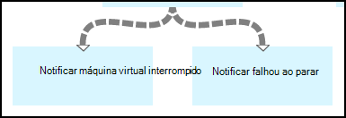

<properties 
    pageTitle="Iniciar e parar máquinas virtuais - gráfico | Microsoft Azure"
    description="Versão de fluxo de trabalho do PowerShell do cenário de automação do Azure incluindo runbooks para iniciar e parar clássicas máquinas virtuais."
    services="automation"
    documentationCenter=""
    authors="mgoedtel"
    manager="jwhit"
    editor="tysonn" />
<tags 
    ms.service="automation"
    ms.devlang="na"
    ms.topic="article"
    ms.tgt_pltfrm="na"
    ms.workload="infrastructure-services"
    ms.date="07/06/2016"
    ms.author="bwren" />

# Cenário de automação Azure - iniciar e parar máquinas virtuais

Este cenário de automação do Azure inclui runbooks para iniciar e parar clássicas máquinas virtuais.  Você pode usar esse cenário para qualquer um destes procedimentos:  

- Use o runbooks sem modificação no seu ambiente. 
- Modificar o runbooks para executar a funcionalidade personalizada.  
- Ligar o runbooks de outro runbook como parte de uma solução geral. 
- Use o runbooks como tutoriais para aprender runbook conceitos de criação. 

> [AZURE.SELECTOR]
- [Gráfica](automation-solution-startstopvm-graphical.md)
- [Fluxo de trabalho do PowerShell](automation-solution-startstopvm-psworkflow.md)

Esta é a versão de runbook gráficas desse cenário. Ele também está disponível usando [runbooks de fluxo de trabalho do PowerShell](automation-solution-startstopvm-psworkflow.md).

## Obtendo o cenário

Este cenário consiste em dois dois runbooks gráficas que você pode baixar do links a seguir.  Ver a [versão de fluxo de trabalho do PowerShell](automation-solution-startstopvm-psworkflow.md) desse cenário para obter links para o fluxo de trabalho do PowerShell runbooks.

| Runbook | Link | Tipo | Descrição |
|:---|:---|:---|:---|
| StartAzureClassicVM | [Iniciar Runbook gráfica Azure máquina virtual clássico](https://gallery.technet.microsoft.com/scriptcenter/Start-Azure-Classic-VM-c6067b3d) | Gráfica | Inicia todas as máquinas virtuais clássicas em uma assinatura do Azure ou todas as máquinas virtuais com um nome de serviço específico. |
| StopAzureClassicVM | [Parar Runbook gráfica Azure máquina virtual clássico](https://gallery.technet.microsoft.com/scriptcenter/Stop-Azure-Classic-VM-397819bd) | Gráfica | Interrompe todas as máquinas virtuais em uma conta de automação ou todas as máquinas virtuais com um nome de serviço específico.  |

## Instalando e configurando o cenário

### 1. Instale o runbooks

Após o download do runbooks, você pode importá-los usando o procedimento em [runbook gráficas procedimentos](automation-graphical-authoring-intro.md#graphical-runbook-procedures).

### 2. Analise a descrição e requisitos
Os runbooks incluir uma atividade chamada **Leia-Me** que inclui uma descrição e ativos necessários.  Você pode exibir essas informações, selecionando a atividade **Leia-Me** e, em seguida, o parâmetro de **Script de fluxo de trabalho** .  Você também pode obter as mesmas informações deste artigo. 

### 3. configurar ativos
Os runbooks exigem os seguintes ativos que você deve criar e preencher com valores apropriados.  Os nomes são padrão.  Você pode usar ativos com nomes diferentes se você especificar os nomes nos [parâmetros de entrada](#using-the-runbooks) quando você inicia o runbook.

| Tipo de ativo | Nome padrão | Descrição |
|:---|:---|:---|:---|
| [Credencial](automation-credentials.md) | AzureCredential | Contém as credenciais para uma conta que tenha autoridade para iniciar e parar máquinas virtuais na assinatura do Azure.  |
| [Variável](automation-variables.md) | AzureSubscriptionId | Contém a ID da assinatura da sua assinatura do Azure. |

## Usando o cenário

### Parâmetros

Os runbooks tem os seguintes [parâmetros de entrada](automation-starting-a-runbook.md#runbook-parameters).  Você deve fornecer valores para todos os parâmetros obrigatórios e, opcionalmente, pode fornecer valores para outros parâmetros, dependendo das suas necessidades.

| Parâmetro | Tipo | Obrigatório | Descrição |
|:---|:---|:---|:---|
| ServiceName | cadeia de caracteres | Não | Se um valor é fornecido, todas as máquinas virtuais com esse nome de serviço são iniciadas ou interrompidas.  Se nenhum valor for fornecido, todas as máquinas virtuais clássicas na assinatura do Azure são iniciadas ou interrompidas. |
| AzureSubscriptionIdAssetName | cadeia de caracteres | Não | Contém o nome da [variável ativos](#installing-and-configuring-the-scenario) que contém a ID da assinatura da sua assinatura do Azure.  Se você não especificar um valor, *AzureSubscriptionId* será usado.  |
| AzureCredentialAssetName | cadeia de caracteres | Não | Contém o nome do [ativo de credencial](#installing-and-configuring-the-scenario) que contém as credenciais para runbook usar.  Se você não especificar um valor, *AzureCredential* será usado.  |

### Iniciando o runbooks

Você pode usar qualquer um dos métodos no [Iniciando um runbook na automação do Azure](automation-starting-a-runbook.md) para iniciar um do runbooks neste artigo.

Os comandos de exemplo a seguir usa o Windows PowerShell para executar **StartAzureClassicVM** para iniciar todas as máquinas virtuais com o nome do serviço *MyVMService*.

    $params = @{"ServiceName"="MyVMService"}
    Start-AzureAutomationRunbook –AutomationAccountName "MyAutomationAccount" –Name "StartAzureClassicVM" –Parameters $params

### Saída

Os runbooks será [uma mensagem de saída](automation-runbook-output-and-messages.md) para cada máquina virtual indicando estando ou não a instrução iniciar ou interromper o foi enviada com êxito.  Você pode procurar por uma cadeia de caracteres específica na saída para determinar o resultado de cada runbook.  As cadeias de caracteres de saída possíveis estão listadas na tabela a seguir.

| Runbook | Condição | Mensagem |
|:---|:---|:---|
| StartAzureClassicVM | Máquina virtual já está em execução  | MyVM já está em execução |
| StartAzureClassicVM | Iniciar solicitação para máquina virtual enviada com êxito | MyVM foi iniciado |
| StartAzureClassicVM | Falha na solicitação de início de máquina virtual  | MyVM Falha ao iniciar |
| StopAzureClassicVM | Máquina virtual já está em execução  | MyVM já for interrompido |
| StopAzureClassicVM | Iniciar solicitação para máquina virtual enviada com êxito | MyVM foi iniciado |
| StopAzureClassicVM | Falha na solicitação de início de máquina virtual  | MyVM Falha ao iniciar |

A seguir é uma imagem de como usar o **StartAzureClassicVM** como um [filho runbook](automation-child-runbooks.md) em um exemplo de runbook gráficas.  Isso utiliza os links condicionais na tabela a seguir.

| Link | Critérios |
|:---|:---|
| Link de sucesso | $ActivityOutput ['StartAzureClassicVM']-como "\* foi iniciado"    |
| Link de erro   | $ActivityOutput ['StartAzureClassicVM']-notlike "\* foi iniciado" |

## Divisão detalhada

A seguir está uma divisão detalhada do runbooks neste cenário.  Você pode usar essas informações para personalizar o runbooks ou apenas para saber para a criação de seus próprios cenários de automação.
 

### Autenticação

Runbook começa com atividades para definir as [credenciais](automation-configuring.md#configuring-authentication-to-azure-resources) e a assinatura do Azure que será usada para o restante do runbook.

As duas primeiras atividades, **Obtenha Id da assinatura** e **Obter Azure credencial**, recuperar os [ativos](#installing-the-runbook) que são usadas pelas próximas duas atividades.  As atividades diretamente podem especificar os ativos, mas precisam os nomes de ativos.  Como estamos permitindo ao usuário para especificar os nomes nos [parâmetros de entrada](#using-the-runbooks), precisamos essas atividades para recuperar os ativos com um nome especificado por um parâmetro de entrada.

**Adicionar AzureAccount** define as credenciais que serão usadas para o restante do runbook.  O ativo de credencial que ele recupera de **Obter Azure credencial** deve ter acesso para iniciar e parar máquinas virtuais na assinatura do Azure.  A assinatura que é usada é selecionada por **Selecione AzureSubscription** que usa a assinatura da Id de **Obter Id da assinatura**.

### Obter máquinas virtuais

Runbook precisa determinar quais máquinas virtuais ele estará trabalhando com e se elas já estão iniciadas ou paradas (dependendo runbook).   Uma das duas atividades recuperará VMs.  **Obter VMs no serviço** serão executadas se o parâmetro de entrada *ServiceName* para runbook contiver um valor.  **Obter todas as VMs** serão executadas se o parâmetro de entrada *ServiceName* para runbook não contiver um valor.  Essa lógica é executada pelos links condicionais precedendo cada atividade.

Ambas as atividades usam o cmdlet **Get-AzureVM** .  **Obter todas as VMs** usa o parâmetro de **ListAllVMs** definido para retornar todas as máquinas virtuais.  **Obter VMs no serviço** usa o conjunto de parâmetros **GetVMByServiceAndVMName** e fornece o parâmetro de entrada **ServiceName** para o parâmetro **ServiceName** .  

### Mesclar VMs

A atividade de **Mesclar VMs** é necessária para fornecer uma entrada **Iniciar AzureVM** que precisa do nome e o nome de serviço do vm(s) para iniciar.  Essa entrada pode vir de **Obter todas as VMs** ou **Obter VMs no serviço**, mas **AzureVM iniciar** só pode especificar uma atividade para sua entrada.   

O cenário é criar **VMs mesclar** que executa o cmdlet **Write-Output** .  O parâmetro **InputObject** para esse cmdlet é uma expressão de PowerShell que combina a entrada de duas atividades anteriores.  Apenas um das atividades serão executadas, apenas um conjunto de saída é esperado.  **Iniciar AzureVM** pode usar essa saída para seus parâmetros de entrada. 

### Iniciar/Parar máquinas virtuais

 

Dependendo do runbook, as próximas atividades tentarem iniciar ou interromper o runbook usando **AzureVM iniciar** ou **Interromper-AzureVM**.  Desde que a atividade é precedida por um link de pipeline, ele será executado uma vez para cada objeto retornado de **Mesclar VMs**.  O link é condicional para que a atividade só será executada se o *RunningState* da máquina virtual é *interrompido* para **Iniciar AzureVM** e *iniciado* para **Parar-AzureVM**. Se essa condição não for atendida, em seguida, **Notificar já iniciou** ou **Já notificar parado** é executado para enviar uma mensagem usando **Write-Output**.

### Enviar a saída

 

A etapa final do runbook é enviar a saída se a solicitação iniciar ou interromper para cada máquina virtual foi enviada com êxito. Não há um separado atividade de **Write-Output** para cada um, e podemos determinar qual deles seja executado com links condicional.  **Notificar iniciado de máquina virtual** ou **Notificar parado de máquina virtual** é executada se *OperationStatus* é *bem-sucedido*.  Se *OperationStatus* for qualquer outro valor, **Notificar Falha ao iniciar** ou **Notificar falhou ao parar** é executada.

## Próximas etapas

- [Gráfica de coautoria na automação do Azure](automation-graphical-authoring-intro.md)
- [Runbooks filho na automação do Azure](automation-child-runbooks.md) 
- [Saída do runbook e mensagens em automação do Azure](automation-runbook-output-and-messages.md)